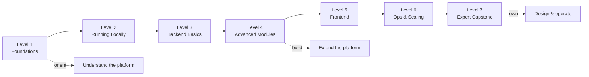

# The Developer Academy

A **seven-level guided track** that turns a competent Django engineer into a confident openIMIS contributor — from a first mental model, through building a backend module and a frontend page, all the way to designing a new business module, hardening it, and shipping it to production.

The rest of this handbook is a *reference course*: read a chapter, learn a concept. The **Academy** is the opposite shape — it is a *practice course*. Each level gives you a small amount of teaching, then makes you **do things**: bring up the stack, write a migration, wire a resolver, publish a component, profile a slow query, review a design. The deep chapters remain your textbook; the Academy is the lab.

!!! quote "The one-sentence version"
    Ten pages of theory teach you *what* openIMIS is; the Academy's seven levels teach you to *build inside it* — and every level ends with a graded challenge and a knowledge check.

---

## How the Academy works

Each level is a self-contained page with the same rhythm, so you always know where you are:

| Section | What it is |
| --- | --- |
| **Level badge** | The difficulty tier — foundational, advanced, or expert. |
| **Learning objectives** | The concrete capabilities you will have when you finish. |
| **Prerequisites** | The prior level plus the deep chapters to read first. |
| **Teaching content** | A concise briefing — it *links* to the deep chapters rather than repeating them. |
| **Hands-on labs** | Step-by-step mini-labs. Type them; do not just read them. |
| **Exercises** | Smaller tasks to cement the ideas. |
| **Challenge project** | One larger, open-ended build that proves you learned the level. |
| **Knowledge check** | A short quiz; answers hidden in collapsibles so you self-test honestly. |

!!! tip "How to actually pass a level"
    A level is "done" when you have (1) completed every hands-on lab on a real local stack, (2) finished the challenge project, and (3) can answer the knowledge-check questions **before** opening the collapsible. Reading alone does not count — openIMIS is learned in the terminal and the editor.

---

## The learning arc

The seven levels are deliberately shaped as a curve: you start by *orienting*, spend the middle levels *building*, and finish by *owning* an entire module and its operations.

Read left to right, the phases are:

- **Orient (Levels 1–2).** Build the mental model, then get a real stack running on your machine and learn to poke it through GraphiQL.
- **Build (Levels 3–5).** Create a backend module — model, migration, service, query, mutation — then extend it with signals, permissions, and configuration, then give it a React frontend.
- **Own (Levels 6–7).** Make it fast, observable, and production-ready; then, as a capstone, design a brand-new business module end to end and defend every architectural decision.

!!! info "Did you know?"
    The Academy's build phase mirrors how real openIMIS modules were born. Modules such as `individual`, `social_protection`, and the `calcrule_*` family were added *without forking core* — exactly the plugin discipline you will practice from Level 3 onward. If you can build a module the Academy way, you can contribute one upstream.

---

## The seven levels

### <a href="level-1.md">Level 1 — Foundations</a>
Level 1 
The platform, the plugin mental model, and the domain vocabulary. No code yet — just the map you will navigate for the next six levels.

### <a href="level-2.md">Level 2 — Running Locally</a>
Level 2 
Bring up the Docker stack, log in, run your first GraphQL query in GraphiQL, and change a module's configuration.

### <a href="level-3.md">Level 3 — Backend Basics</a>
Level 3 
Build a minimal module from scratch: a model, a migration, a service, and a working GraphQL query and mutation.

### <a href="level-4.md">Level 4 — Advanced Modules</a>
Level 4 
Service signals, rights-based permissions, DB-backed configuration, plugin registration, and calculation-rule-style extension.

### <a href="level-5.md">Level 5 — Frontend</a>
Level 5 
Pages, components, forms, GraphQL-in-Redux, and contributing menus and routes via `ModulesManager` and published components.

### <a href="level-6.md">Level 6 — Ops & Scaling</a>
Advanced 
Performance, scaling, caching, observability, and a real production deployment topology.

### <a href="level-7.md">Level 7 — Expert Capstone</a>
Expert 
Design a complete new business module end to end, then review its architecture, performance, security, and deployment.

---

## Before you start

The Academy leans on the deep chapters constantly. You do **not** need to have read them all — each level tells you exactly which ones to open — but keep these three windows ready to switch to:

- The [Architecture overview](../architecture/overview.md) — the shape of the whole system.
- The [Repository Map](../architecture/repository-map.md) — where every module actually lives.
- The [Reference glossary](../reference/glossary.md) — for any term that is new.

!!! warning "This is a community handbook"
    The Academy is an independent educational resource, not official openIMIS documentation. Module counts, file layouts, and configuration keys drift between releases. Where a step is version-dependent, the level says so and points you at the authoritative repository under [github.com/openimis](https://github.com/openimis). Always treat the source code and the [official openIMIS wiki](https://openimis.atlassian.net/wiki/) as the final authority.

Ready? Open **[Level 1 — Foundations](level-1.md)** and build your mental model.

## Further reading

- The full course home page: [Developer Academy handbook](../index.md)
- All source repositories: [github.com/openimis](https://github.com/openimis)
- Official product and functional wiki: [openIMIS on Atlassian](https://openimis.atlassian.net/wiki/)
- GraphQL, from the source: [graphql.org/learn](https://graphql.org/learn/)
