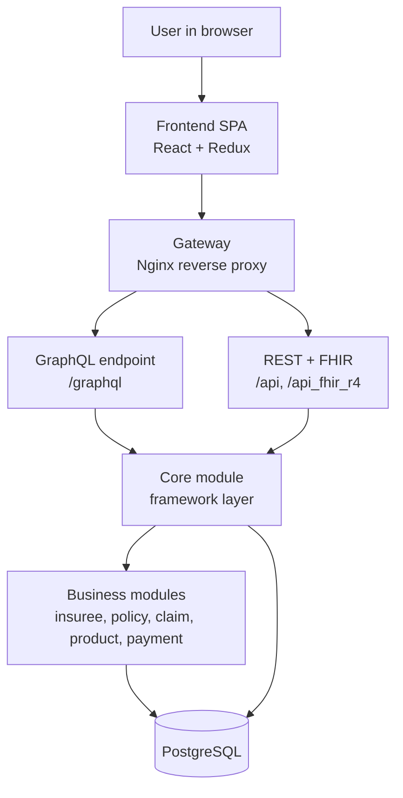
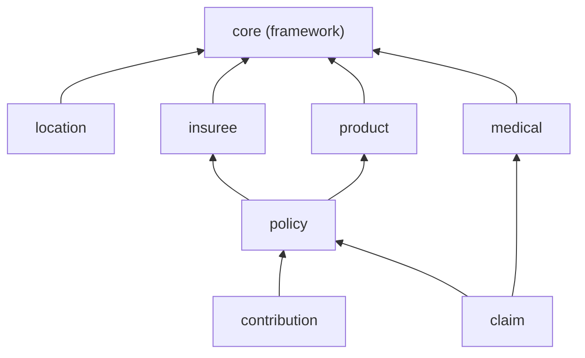

# Level 1 — Foundations

Level 1

The first level builds no code. Its job is to give you the **mental model** you will carry through every later level: what openIMIS is, why it is shaped the way it is, and the vocabulary you must speak to read the source without getting lost.

## Learning objectives

By the end of this level you will be able to:

- Explain in two sentences what openIMIS *does* and who deploys it.
- Draw the high-level architecture from memory: browser → gateway → GraphQL/REST → core → business modules → PostgreSQL.
- Explain the **plugin (module) architecture** and why "there is no single repository".
- Distinguish the two **assembly repos** (`openimis-be_py`, `openimis-fe_js`) from the ~47 **module repos**.
- Use the core domain terms — *insuree, policy, product, contribution, claim* — correctly.

## Prerequisites

This is the entry level, so the only prerequisites are the reading chapters:

- [Getting Started — index](../getting-started/index.md) and [Platform Overview](../getting-started/overview.md)
- [Terminology & Glossary Primer](../getting-started/terminology.md)
- [Architecture Overview](../architecture/overview.md)

You should already know Python, Django, the ORM, and PostgreSQL. You do **not** need to know GraphQL yet — that starts at Level 2.

---

## Briefing: what openIMIS is

openIMIS — **open Insurance Management Information System** — is an open-source platform for running **health insurance and social health protection** schemes: registering beneficiaries, linking them to insurance products, recording contributions, and adjudicating and paying claims from health facilities. It is a recognized **Digital Public Good** and runs national schemes across Africa and Asia.

The "why" behind its shape is historical. openIMIS began as **IMIS**, a monolithic **.NET + Microsoft SQL Server** application. Around 2018–2019 it was re-architected into a **Django + React** system decomposed into independently versioned **modules**. That modularization is the platform's central design idea: countries customize by adding or replacing modules, **never by forking core**.

For the full story, read the [Platform Overview](../getting-started/overview.md). Here we only need the shape.

### The architecture in one diagram

Commit that top-to-bottom flow to memory. Every later level zooms into one band of it. The [Architecture Overview](../architecture/overview.md) explains each band in depth.

### The idea you must internalize: there is no single repository

A normal Django project lives in one repo you can clone and read. openIMIS does not. The running backend is **assembled** at startup from dozens of separate repositories:

| Kind of repo | Example | Role |
| --- | --- | --- |
| Backend **assembly** | `openimis-be_py` | A Django *project* that reads a manifest and wires modules together. Almost no business logic of its own. |
| Frontend **assembly** | `openimis-fe_js` | A React SPA that reads a manifest and imports frontend modules. |
| Backend **module** | `openimis-be-claim_py` | One domain area. Package name `claim`. Has its own `models.py`, `schema.py`, `services.py`. |
| Frontend **module** | `openimis-fe-claim_js` | The React side of the same domain area. |

The backend assembly's `openimis.json` is the **module manifest** — roughly 47 modules, each with a git/pip source. At startup `openimis/settings.py` builds `INSTALLED_APPS` dynamically from that list, and `openimis/schema.py` stitches every module's GraphQL schema into one. The details are in the [Plugin / Module System](../architecture/plugin-system.md) chapter and the [Repository Map](../architecture/repository-map.md); for now, just hold the idea.

!!! danger "Common mistake"
    Do not try to understand openIMIS by opening one repository and reading it like a normal Django app. If a class seems to come from nowhere, it lives in **another module's repo**. The application only exists once the assembly repo has read its manifest and stitched the pieces together.

### The domain vocabulary

You cannot read openIMIS code without the health-financing vocabulary. The minimum set:

| Term | Meaning | Lives in module |
| --- | --- | --- |
| **Insuree** | A person covered by the scheme (a beneficiary). | `insuree` |
| **Individual** | A newer, more general "person" abstraction. | `individual` |
| **Product** | An insurance product: what is covered, ceilings, prices. | `product` |
| **Policy** | A contract linking an insuree (family) to a product — i.e. coverage. | `policy` |
| **Contribution** | A premium paid against a policy. | `contribution` |
| **Claim** | A record of services delivered by a health facility, valued and paid. | `claim` |
| **Location** | Region / district / municipality / village hierarchy. | `location` |
| **Health Facility** | A hospital or clinic that delivers services and files claims. | `location` |
| **Officer** | A staff user (e.g. enrolment officer). | `core` |

The full list is in the [Terminology Primer](../getting-started/terminology.md) and the [Reference glossary](../reference/glossary.md). The dependency intuition — `core` underneath everything, reference data (`location`, `medical`, `product`) next, then `insuree`/`policy`/`contribution`/`claim` on top — is captured here:

!!! info "Did you know?"
    The database still carries the scars of its .NET ancestry: many tables keep `tbl` prefixes and camelCase columns, and rows carry both a legacy integer key and a newer UUID. When you meet this in the [Database chapter](../database/index.md), it will make sense — it is heritage, not chaos.

---

## Hands-on labs

No stack yet — these labs build orientation, not code. Do them with the [Repository Map](../architecture/repository-map.md) and [github.com/openimis](https://github.com/openimis) open.

### Lab 1.1 — Map the repositories

1. Open [github.com/openimis](https://github.com/openimis) and list every repository whose name matches `openimis-be-*_py`.
2. In a scratch file, write the module name (drop the `openimis-be-` prefix and `_py` suffix) for ten of them — e.g. `openimis-be-claim_py` → `claim`.
3. Next to each, guess its domain role in one line. Check yourself against the table in the [Modules index](../modules/index.md).

**Done when:** you can name at least ten backend modules and their jobs without looking.

### Lab 1.2 — Find the two assemblies

1. Open `openimis-be_py` on GitHub and locate `openimis.json`. Skim it — notice each entry names a module and a source.
2. Open `openimis/settings.py` in the same repo and find where `INSTALLED_APPS` is *built from the module list* rather than hard-coded.
3. Open `openimis/schema.py` and find where module `Query` / `Mutation` classes are combined by multiple inheritance.

**Done when:** you can point to the manifest, the dynamic `INSTALLED_APPS`, and the schema stitching. (Details: [Plugin / Module System](../architecture/plugin-system.md).)

### Lab 1.3 — Trace a business flow on paper

Using only the vocabulary table, write the chain of records that must exist for a claim to be paid:

> A **health facility** files a **claim** for an **insuree** whose **policy** (bought against a **product**) is valid because a **contribution** was paid.

Draw it as a small diagram. Compare with the dependency graph above.

**Done when:** your drawing matches the module dependency intuition.

---

## Exercises

1. In two sentences, define openIMIS for a non-technical colleague. No jargon.
2. Explain to a fellow Django dev why they *cannot* just `git clone` one repo and run openIMIS.
3. List the differences between an **assembly repo** and a **module repo**.
4. For each term — *insuree, policy, product, contribution, claim* — give a one-line real-world example (e.g. "a claim is the clinic billing for a malaria consultation").
5. Explain why the database has both integer keys and UUIDs.

---

## Challenge project

**Produce a one-page "openIMIS orientation brief"** you could hand to a new teammate on day one. It must contain:

- A hand-drawn (or diagrammed) architecture sketch: browser → gateway → GraphQL/REST → core → business modules → PostgreSQL.
- A table of at least eight modules with one-line roles.
- The domain vocabulary table in your own words.
- A short paragraph explaining the plugin/assembly idea and why forking core is discouraged.

Keep it to one page. If you cannot fit it, you do not yet understand it well enough — that is the point of the exercise. You will reuse this brief as the cover sheet for your Level 7 capstone.

---

## Knowledge check

??? question "Q1: In one sentence, what problem does openIMIS solve? (click for answer)"
    It manages **health insurance / social health protection** schemes — registering beneficiaries, linking them to insurance products via policies, recording contributions, and adjudicating and paying claims — as an open-source Digital Public Good deployed by countries in Africa and Asia.

??? question "Q2: Why is there 'no single repository' for the backend? (click for answer)"
    The deployable backend is the **assembly repo** `openimis-be_py`, which contains almost no business logic. At startup it reads its **module manifest** (`openimis.json`), builds `INSTALLED_APPS` dynamically, and stitches each module's GraphQL schema together. The real code lives in ~47 separate `openimis-be-<name>_py` module repositories.

??? question "Q3: What is the difference between an assembly repo and a module repo? (click for answer)"
    An **assembly repo** (`openimis-be_py`, `openimis-fe_js`) is wiring: a manifest plus glue that composes many modules into one running app. A **module repo** (`openimis-be-claim_py`, `openimis-fe-claim_js`) owns one domain area's models, schema, services, and UI. Assemblies rarely change; modules are where features live.

??? question "Q4: Put these in dependency order (which depends on which): claim, policy, product, core, contribution. (click for answer)"
    `core` is the base. `product` and `policy` build on core; `policy` links an insuree to a `product`. `contribution` is paid against a `policy`. `claim` is filed against a `policy` (and references medical items). So bottom-up: **core → product → policy → contribution/claim**.

??? question "Q5: Why does the database carry both integer keys and UUIDs, and camelCase `tbl`-prefixed table names? (click for answer)"
    Heritage. openIMIS descends from the .NET/MSSQL application **IMIS**. The legacy schema used integer keys and `tbl`-prefixed camelCase names; the modular rewrite added UUIDs alongside the legacy integer keys and migrated MSSQL → PostgreSQL without discarding the old shape.

---

## Further reading

- [Getting Started](../getting-started/index.md) and [Platform Overview](../getting-started/overview.md)
- [Architecture Overview](../architecture/overview.md) and [Repository Map](../architecture/repository-map.md)
- [Terminology Primer](../getting-started/terminology.md) and [Reference glossary](../reference/glossary.md)
- All source repositories: [github.com/openimis](https://github.com/openimis)

When your orientation brief is done, continue to **[Level 2 — Running Locally](level-2.md)**.
