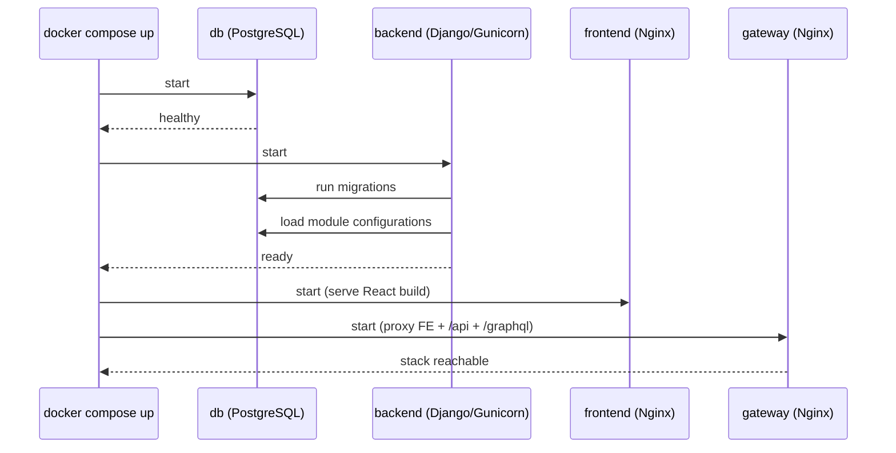

# Level 2 — Running Locally

<span class="oi-badge">Level 2</span>

Theory is over. This level puts a **real openIMIS stack on your machine**, teaches you to log in, run your first GraphQL query in GraphiQL, and change a module's configuration — the loop you will repeat for the rest of the Academy.

## Learning objectives

By the end of this level you will be able to:

- Bring up the full Docker stack (`db`, `backend`, `frontend`, `gateway`) and reach the UI.
- Explain the startup order and why `backend` runs migrations and loads module configs before it is ready.
- Log in and reach the **GraphiQL** explorer.
- Read GraphQL from first principles and run a query and an introspection request.
- Change a **module configuration** value and observe the effect.

## Prerequisites

- Completed **[Level 1 — Foundations](level-1.md)** — you have the mental model.
- Read [Set Up a Dev Environment](../getting-started/setup.md) and the [Docker & Deployment chapter](../docker/index.md).
- Skim the [GraphQL chapter](../graphql/index.md) — this level teaches just enough GraphQL to be dangerous; that chapter is the full treatment.
- You know Docker and `docker compose` already.

---

## Briefing: how the stack comes up

The distribution repo `openimis-dist_dkr` is `docker-compose` based. The typical services and their **startup order** matter:



The key insight: **`backend` is not ready the instant the container starts.** Its entrypoint (`script/` in `openimis-be_py`) runs Django migrations and loads each module's configuration into the DB *before* Gunicorn serves traffic. The gateway ties the frontend, `/api`, and `/graphql` together behind one origin. Full detail: [Docker & Deployment](../docker/index.md).

!!! info "Did you know?"
    A module's `DEFAULT_CFG` dict (in its `apps.py`) is *overlaid at startup* by a per-module JSON row stored in the database (`ModuleConfiguration` in core). That is why the backend touches the DB before it is ready — and why you can reconfigure a deployment without changing code. You will use this in Lab 2.4.

### GraphQL in ninety seconds

You know REST; you may not know GraphQL. The differences that matter today:

| REST | GraphQL |
| --- | --- |
| Many endpoints (`/insurees`, `/claims`). | **One** endpoint: `/graphql`. |
| Server decides the response shape. | **Client** asks for exactly the fields it wants. |
| Read = `GET`, write = `POST`/`PUT`. | Read = **query**, write = **mutation**. |
| Discover via docs. | Discover via **introspection** (the schema describes itself). |

A query looks like the response you want, with the values removed:

```graphql
query {
  insurees(first: 3) {
    edges {
      node { uuid chfId lastName otherNames }
    }
  }
}
```

`edges`/`node` are the **connection** (pagination) pattern — openIMIS uses it everywhere via core's `ExtendedConnection`, which also exposes `totalCount`. The full model — queries, mutations, connections, and openIMIS's asynchronous mutation pattern — is in the [GraphQL chapter](../graphql/index.md).

---

## Hands-on labs

You need Docker and `docker compose`. Exact service names, ports, and env keys are version-dependent — confirm against the `openimis-dist_dkr` repo and the [setup chapter](../getting-started/setup.md).

### Lab 2.1 — Bring up the stack

1. Clone the distribution repo:
   ```bash
   git clone https://github.com/openimis/openimis-dist_dkr.git
   cd openimis-dist_dkr
   ```
2. Copy the sample environment file and review it. It supplies the DB password, Django secret, and admin credentials:
   ```bash
   cp .env.example .env   # exact name may differ; check the repo
   ```
3. Bring the stack up and watch the logs:
   ```bash
   docker compose up -d
   docker compose logs -f backend
   ```
4. Wait until the backend log shows migrations complete and Gunicorn is serving. **Do not** open the UI before this — you will see a gateway error.

**Done when:** `docker compose ps` shows `db`, `backend`, `frontend`, and `gateway` all up, and the backend has finished migrating.

!!! danger "Common mistake"
    Opening the frontend before the backend has finished migrating produces confusing 502/blank-page errors. That is not a bug — it is the startup order in the sequence diagram above. Tail the backend log first.

### Lab 2.2 — Log in

1. Open the gateway URL in your browser (commonly `http://localhost` — check your compose port mapping).
2. Log in with the admin credentials from your `.env`.
3. Click around: find the Insurees, Policies, and Claims areas in the menu. Notice which menu items you can and cannot see — that is **rights-based permissions** at work (Level 4).

**Done when:** you reach the authenticated home screen.

!!! info "Did you know?"
    Your login does not return a token in the response body. openIMIS uses `django-graphql-jwt` and stores the JWT in an **HttpOnly cookie**, so JavaScript can never read it. That is a deliberate security choice — see the [Security chapter](../security/index.md).

### Lab 2.3 — Your first GraphQL query

1. Navigate to the GraphiQL explorer, typically at `/graphql` behind the gateway (e.g. `http://localhost/graphql`). Because you logged in via the UI, the auth cookie travels with your request.
2. Run a simple query:
   ```graphql
   query {
     insurees(first: 3) {
       totalCount
       edges { node { uuid chfId lastName otherNames } }
     }
   }
   ```
3. Change the fields — remove `otherNames`, add `dob` — and re-run. Notice the response shape follows *your* request.
4. Run an **introspection** query to prove the schema is self-describing:
   ```graphql
   query {
     __schema { queryType { name } }
   }
   ```
5. Open GraphiQL's "Docs"/"Schema" panel and browse the `Query` type — every module's queries were stitched into it.

**Done when:** you have run a data query, edited its field set, and browsed the schema in the docs panel.

### Lab 2.4 — Change a module configuration

You will change a configuration value and watch it take effect. Because config lives in the DB (`ModuleConfiguration`), overlaying `DEFAULT_CFG`, you do not edit code.

1. Pick a benign, observable config on a module — for example a claim-module toggle or a display default. Find candidate keys in the module's `apps.py` `DEFAULT_CFG` (e.g. `openimis-be-claim_py/claim/apps.py`).
2. Update the stored configuration. The supported path is version-dependent — the two common routes:
   - Via the admin/config UI if your build exposes one, or
   - By updating the module's `ModuleConfiguration` JSON row (see [Configuration chapter](../configuration/index.md)).
3. Restart the backend so it reloads config at startup:
   ```bash
   docker compose restart backend
   ```
4. Reload the UI / re-run a query and confirm the new behavior.

**Done when:** you changed a value in the DB-backed config (not in code) and saw the effect after a backend restart.

---

## Exercises

1. From memory, list the four core services and the exact order they become ready. Why does `backend` touch the DB before serving?
2. Write a GraphQL query that returns the **first 5 policies** with only their `uuid` and an expiry/validity field. Run it.
3. Explain, to someone who only knows REST, what `edges { node { ... } }` is doing and why `totalCount` is useful.
4. Find where the JWT lives after login and explain why it is in an HttpOnly cookie rather than `localStorage`.
5. Name three things that would break if you deleted a module's `ModuleConfiguration` row and restarted.

---

## Challenge project

**Write a reproducible "local stack runbook"** for a new teammate. It must let someone go from a clean machine to a working, logged-in stack, and prove it works. Include:

- The exact `git clone` / `.env` / `docker compose up` steps for your environment.
- A "how do I know it's ready?" check based on the backend log and `docker compose ps`.
- Three example GraphQL queries (an insuree list, a policy list, and one introspection query) with expected-shape output.
- A "change one config value" walkthrough (from Lab 2.4) with before/after evidence.
- A short troubleshooting section: the top three failures you hit and how you fixed them.

Test it by tearing everything down (`docker compose down -v`) and following your own runbook from scratch. If it does not work verbatim, fix the runbook, not your memory.

---

## Knowledge check

??? question "Q1: Why is the backend container not ready the moment it starts? (click for answer)"
    Its entrypoint runs Django **migrations** and **loads every module's configuration** into the database before Gunicorn begins serving. Until that finishes, the gateway cannot proxy a working backend, which is why the startup order is db → backend → frontend/gateway.

??? question "Q2: What is the single GraphQL endpoint, and how do you discover what it supports? (click for answer)"
    Everything goes through **one** endpoint, `/graphql`. You discover its capabilities through **introspection** — the schema describes itself — which is exactly what GraphiQL's Docs/Schema panel uses. There is no per-resource URL like REST.

??? question "Q3: What do `edges` and `node` mean in an openIMIS query? (click for answer)"
    They are the **connection** (Relay-style pagination) pattern. A connection has `edges`, each `edge` has a `node` (the actual object) and a cursor. openIMIS's `ExtendedConnection` (in core) adds `totalCount` and `edgeCount` so you can paginate and count in one request.

??? question "Q4: Where does openIMIS store the auth token after login, and why there? (click for answer)"
    In an **HttpOnly cookie**, set by `django-graphql-jwt`. HttpOnly means client JavaScript cannot read it, which mitigates token theft via XSS. This is why your GraphiQL queries are authenticated automatically once you have logged in through the UI.

??? question "Q5: You changed a config value in the DB but nothing happened. What did you forget? (click for answer)"
    Module configuration is read at **startup**, when `DEFAULT_CFG` is overlaid by the stored `ModuleConfiguration` JSON. You must **restart the backend** (`docker compose restart backend`) for the new value to be loaded.

---

## Further reading

- [Set Up a Dev Environment](../getting-started/setup.md) and [Docker & Deployment](../docker/index.md)
- [GraphQL chapter](../graphql/index.md) — the full model behind Lab 2.3
- [Configuration chapter](../configuration/index.md) — the DB-backed config used in Lab 2.4
- [Security chapter](../security/index.md) — JWT-in-cookie and OAuth2/OIDC
- Distribution repo: [openimis-dist_dkr](https://github.com/openimis/openimis-dist_dkr)

With a running stack you can now build. Continue to **[Level 3 — Backend Basics](level-3.md)**.
