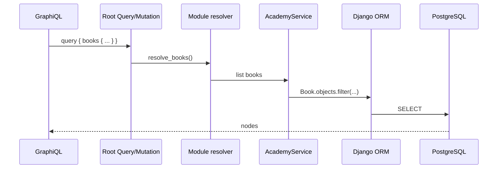

# Level 3 — Backend Basics

<span class="oi-badge">Level 3</span>

Now you build. This level walks you through creating a **minimal openIMIS backend module from scratch** — a model, a migration, a service, and a working GraphQL query and mutation — following openIMIS conventions so the result is a real plugin, not a toy.

## Learning objectives

By the end of this level you will be able to:

- Scaffold a new backend module with the standard layout (`apps.py`, `models.py`, `schema.py`, `services.py`, `migrations/`).
- Register the module in the assembly's manifest so it loads into `INSTALLED_APPS`.
- Model data on openIMIS base classes (`HistoryModel`, `json_ext`) and generate a migration.
- Write a **service** and a GraphQL **query** exposing your model.
- Write a GraphQL **mutation** and understand the asynchronous `OpenIMISMutation` pattern.

## Prerequisites

- Completed **[Level 2 — Running Locally](level-2.md)** — you have a working stack and can run GraphQL.
- Read the [Backend Deep Dive](../architecture/backend.md), the [Core module chapter](../modules/core.md), and the [GraphQL chapter](../graphql/index.md).
- Helpful: the [End-to-End Code Walkthrough](../extending/code-walkthrough.md) and [Extending openIMIS](../extending/index.md), which this level mirrors in miniature.

---

## Briefing: the anatomy of a module

Every backend module follows the same layout. You are about to create each file.

| File | Responsibility |
| --- | --- |
| `apps.py` | An `AppConfig` subclass (e.g. `class AcademyConfig(AppConfig)`) with a `DEFAULT_CFG` dict; the module's identity. |
| `models.py` | Django models, usually on openIMIS base classes from core. |
| `migrations/` | Standard Django migrations. |
| `services.py` | Business logic. Resolvers and mutations call services, not the ORM directly. |
| `schema.py` | The GraphQL `Query` and `Mutation` classes that the assembly stitches in. |
| `gql_queries.py` / `gql_mutations/` | The GraphQL types and mutation classes. |
| `urls.py` | Any REST url patterns (optional). |
| `tests/` | Tests. |

The request path you are building:



### Base models you will use

Core provides base classes so your model gets openIMIS's temporal-versioning and extensibility for free (see [Core module](../modules/core.md)):

- **`HistoryModel`** — history-tracked; carries `validity_from` / `validity_to` and a UUID.
- **`json_ext`** — a `JSONField` present on many models for schema-free extensibility.

You will model a tiny "reading room" domain — a `Book` — precisely because it is *not* a real openIMIS entity, so you can practice the mechanics without domain distraction.

!!! info "Did you know?"
    Because you build on `HistoryModel`, "deleting" a record does not physically remove it — it closes the `validity_to` window. openIMIS keeps history for audit. This temporal model is explained in the [Database chapter](../database/index.md).

---

## Hands-on labs

All code below is **illustrative** — it faithfully reflects openIMIS conventions but is simplified for teaching. Confirm exact base-class names and imports against `openimis-be-core_py`.

### Lab 3.1 — Scaffold the module

1. Create a module repo folder next to your other openIMIS repos, named the openIMIS way:
   ```bash
   mkdir -p openimis-be-academy_py/academy/migrations
   cd openimis-be-academy_py
   ```
2. Make the package importable: add `academy/__init__.py` and `academy/migrations/__init__.py` (empty files).
3. Create `academy/apps.py`:
   ```python
   # illustrative
   from django.apps import AppConfig

   DEFAULT_CFG = {
       "gql_query_books_perms": [],   # tighten in Level 4
       "gql_mutation_books_perms": [],
   }

   class AcademyConfig(AppConfig):
       name = "academy"
       default_auto_field = "django.db.models.BigAutoField"

       gql_query_books_perms = []
       gql_mutation_books_perms = []

       def _configure_permissions(self, cfg):
           AcademyConfig.gql_query_books_perms = cfg["gql_query_books_perms"]
           AcademyConfig.gql_mutation_books_perms = cfg["gql_mutation_books_perms"]

       def ready(self):
           from core.models import ModuleConfiguration
           cfg = ModuleConfiguration.get_or_default("academy", DEFAULT_CFG)
           self._configure_permissions(cfg)
   ```

**Done when:** the `academy` package exists with `apps.py` and empty migration package.

### Lab 3.2 — Register the module in the manifest

1. In the backend assembly `openimis-be_py`, add an entry for `academy` to `openimis.json` (the module manifest), pointing at your local path.
2. For development, install it editable so Django can import it:
   ```bash
   pip install -e ../openimis-be-academy_py/
   ```
3. Confirm `openimis/settings.py` builds `INSTALLED_APPS` from the module list and that `academy` now appears (add a temporary `print` or run `python manage.py shell` and check `django.conf.settings.INSTALLED_APPS`).

**Done when:** `academy` is in `INSTALLED_APPS`. (Mechanism: [Plugin / Module System](../architecture/plugin-system.md).)

!!! danger "Common mistake"
    Forgetting `pip install -e` (or the manifest entry) means Django silently never loads your module — no error, just nothing. If your model/query "doesn't exist", check `INSTALLED_APPS` first.

### Lab 3.3 — Model and migration

1. Create `academy/models.py`:
   ```python
   # illustrative
   from django.db import models
   from core.models import HistoryModel

   class Book(HistoryModel):
       title = models.CharField(max_length=255)
       author = models.CharField(max_length=255, null=True, blank=True)
       copies = models.IntegerField(default=1)

       class Meta:
           managed = True
           db_table = "academy_Book"
   ```
2. Generate and apply the migration:
   ```bash
   python manage.py makemigrations academy
   python manage.py migrate academy
   ```
3. Verify in `psql` that the `academy_Book` table exists with the temporal columns inherited from `HistoryModel`.

**Done when:** the table exists and `makemigrations` produced a file in `academy/migrations/`.

### Lab 3.4 — Service and GraphQL query

1. Create `academy/services.py`:
   ```python
   # illustrative
   from .models import Book

   class BookService:
       def __init__(self, user):
           self.user = user

       def list_books(self):
           return Book.objects.filter(validity_to__isnull=True)

       def create_book(self, data):
           return Book.objects.create(**data)
   ```
2. Create `academy/gql_queries.py`:
   ```python
   # illustrative
   import graphene
   from graphene_django import DjangoObjectType
   from core import ExtendedConnection
   from .models import Book

   class BookGQLType(DjangoObjectType):
       class Meta:
           model = Book
           interfaces = (graphene.relay.Node,)
           connection_class = ExtendedConnection
           filter_fields = {"title": ["exact", "icontains"]}
   ```
3. Create `academy/schema.py`:
   ```python
   # illustrative
   import graphene
   from core.schema import OrderedDjangoFilterConnectionField
   from .gql_queries import BookGQLType
   from .models import Book

   class Query(graphene.ObjectType):
       books = OrderedDjangoFilterConnectionField(
           BookGQLType, orderBy=graphene.List(graphene.String),
       )

       def resolve_books(self, info, **kwargs):
           return Book.objects.filter(validity_to__isnull=True)
   ```
4. Restart the backend and run in GraphiQL:
   ```graphql
   query { books { totalCount edges { node { id title author copies } } } }
   ```
   It returns an empty connection — you have no data yet. That is success.

**Done when:** the `books` query appears in the schema and returns an empty connection without error.

### Lab 3.5 — A mutation

openIMIS mutations follow the asynchronous `OpenIMISMutation` pattern: the mutation records a `MutationLog`, does its work (often in a service), returns a `clientMutationId`, and the client polls for status. Every mutation is audited. Full treatment: [GraphQL chapter](../graphql/index.md).

1. Create `academy/gql_mutations/__init__.py`:
   ```python
   # illustrative
   import graphene
   from core.schema import OpenIMISMutation
   from ..services import BookService

   class CreateBookMutation(OpenIMISMutation):
       _mutation_module = "academy"
       _mutation_class = "CreateBookMutation"

       class Input(OpenIMISMutation.Input):
           title = graphene.String(required=True)
           author = graphene.String(required=False)
           copies = graphene.Int(required=False)

       @classmethod
       def async_mutate(cls, user, **data):
           data.pop("client_mutation_id", None)
           data.pop("client_mutation_label", None)
           BookService(user).create_book(data)
           return None   # None => success; a list of errors => failure
   ```
2. Add a `Mutation` class to `academy/schema.py`:
   ```python
   # illustrative
   import graphene
   from .gql_mutations import CreateBookMutation

   class Mutation(graphene.ObjectType):
       create_book = CreateBookMutation.Field()
   ```
3. Ensure the assembly's `openimis/schema.py` picks up `academy.schema.Query` and `academy.schema.Mutation` (it stitches every module's `Query`/`Mutation` by multiple inheritance).
4. Restart and run:
   ```graphql
   mutation {
     createBook(input: { title: "Django for APIs", author: "W. Vincent", copies: 2 }) {
       clientMutationId
       internalId
     }
   }
   ```
5. Re-run the Lab 3.4 `books` query — your book is there.

**Done when:** the mutation succeeds and the created book appears in the query.

!!! info "Did you know?"
    Returning `None` from `async_mutate` signals success; returning a list of error dicts signals failure and is recorded on the `MutationLog`. The client does not block on the mutation — it polls the log's status. This is why the openIMIS frontend has a "journalize"/polling helper (you will meet it in Level 5).

---

## Exercises

1. Add an `isbn` field to `Book`, migrate, and expose it in the query. What migration did `makemigrations` produce?
2. Add a `resolve_books` filter so a `title_Icontains` argument works from GraphiQL.
3. Write an `UpdateBookMutation` that changes `copies`. Route it through `BookService`.
4. Explain what physically happens to a row when you "delete" a `HistoryModel` book (hint: `validity_to`). Write a `DeleteBookMutation` that closes the validity window instead of hard-deleting.
5. Break your module on purpose: remove it from `openimis.json`, restart, and confirm the `books` query vanishes. Explain why.

---

## Challenge project

**Build a complete `academy` mini-module** with full CRUD over `Book`:

- `Book` model on `HistoryModel` with `title`, `author`, `copies`, and one `json_ext`-stored field of your choice.
- A `BookService` that is the *only* place touching the ORM.
- A filterable, paginated `books` query using `ExtendedConnection`.
- `CreateBookMutation`, `UpdateBookMutation`, and `DeleteBookMutation` (soft delete via validity window), all on `OpenIMISMutation`.
- A short `README` documenting how to install the module into the assembly and the GraphQL calls to exercise each operation.

Prove it end to end: from an empty table, create three books, update one, soft-delete one, and show the final `books` query result. Keep this module — Levels 4 and 5 extend it.

---

## Knowledge check

??? question "Q1: What is the job of a module's `apps.py`? (click for answer)"
    It defines the module's `AppConfig` subclass (its Django identity), holds the `DEFAULT_CFG` dict of configuration defaults, and typically loads the DB-stored `ModuleConfiguration` overlay in `ready()` — including wiring up permission codes via a `_configure_permissions` method. It is how the module announces itself to the assembly.

??? question "Q2: You added a model but the GraphQL query says it doesn't exist. First thing to check? (click for answer)"
    Whether the module is actually loaded: is it in `openimis.json`, was it `pip install -e`'d, and does it appear in `settings.INSTALLED_APPS`? A module that is not in `INSTALLED_APPS` loads nothing, silently. Check that before debugging the schema.

??? question "Q3: Why do resolvers and mutations call a service instead of the ORM directly? (click for answer)"
    To keep business logic in one testable place, reusable by GraphQL, REST/FHIR, signals, and background jobs alike. The `schema.py` layer should stay thin — validation, permissions, and orchestration; the `services.py` layer owns the actual work.

??? question "Q4: Describe the asynchronous `OpenIMISMutation` pattern. (click for answer)"
    A mutation creates a **`MutationLog`**, runs its work (usually in a service) inside `async_mutate`, and returns a `clientMutationId`/`internalId` immediately. Returning `None` marks success; returning error dicts marks failure. The client **polls** the mutation log's status rather than blocking. Every mutation is thereby audited.

??? question "Q5: What does `ExtendedConnection` add over a plain Relay connection? (click for answer)"
    It adds `totalCount` and `edgeCount` to the connection, so a single paginated query can also report how many records exist — used pervasively across openIMIS queries.

---

## Further reading

- [Backend Deep Dive](../architecture/backend.md) and [Core module](../modules/core.md)
- [GraphQL chapter](../graphql/index.md) — connections and the async mutation pattern
- [Plugin / Module System](../architecture/plugin-system.md) — how the manifest becomes `INSTALLED_APPS`
- [End-to-End Code Walkthrough](../extending/code-walkthrough.md) and [Extending openIMIS](../extending/index.md)
- [Database chapter](../database/index.md) — `HistoryModel` and temporal validity

With a real module built, add the advanced seams in **[Level 4 — Advanced Modules](level-4.md)**.
