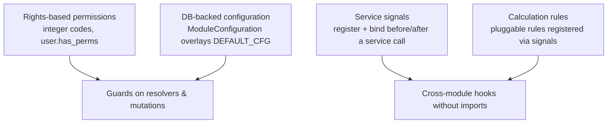
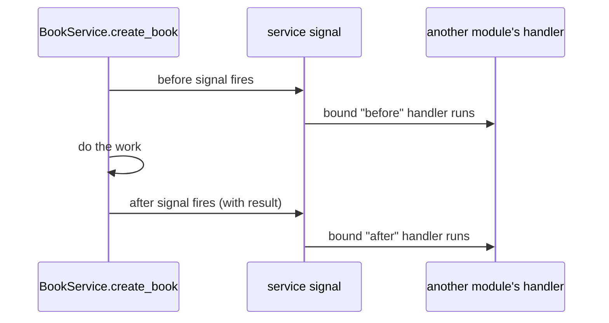

# Level 4 — Advanced Module Development

<span class="oi-badge">Level 4</span>

Your Level 3 module works, but it is naive: no permissions, no configuration discipline, and no way for *other* modules to hook into it. This level adds the real openIMIS extension seams — **service signals**, **rights-based permissions**, **DB-backed configuration**, **plugin registration**, and **calculation-rule-style** extension.

## Learning objectives

By the end of this level you will be able to:

- Enforce **rights-based permissions** (integer permission codes) in resolvers and mutations.
- Define and load module configuration from the DB, overlaying `DEFAULT_CFG`.
- Emit a **service signal** and **bind** a handler in another module without importing it.
- Register a pluggable rule the **calculation-rule** way, discovered via signals.
- Explain when to use a *service signal* versus a plain Django ORM signal.

## Prerequisites

- Completed **[Level 3 — Backend Basics](level-3.md)** — you have the `academy`/`Book` module.
- Read the [Core module chapter](../modules/core.md) (signals, permissions, config), the [Calculation Rules chapter](../modules/calculation.md), and [Extending openIMIS](../extending/index.md).
- Read the [Security chapter](../security/index.md) for the rights model.

---

## Briefing: the four extension seams

openIMIS lets a module be *both* extensible and permissioned without central coordination. Four mechanisms do the heavy lifting.



### 1. Rights-based permissions

openIMIS permissions are **integers** defined in each module's `apps.py` (e.g. `gql_query_claims_perms = [111001]`). A logged-in `User` carries integer **rights** through their roles; a resolver or mutation checks `user.has_perms([<codes>])`. Details and the number ranges: [Security chapter](../security/index.md) and [Core module](../modules/core.md).

### 2. DB-backed configuration

A module's `DEFAULT_CFG` dict is overlaid at startup by a per-module JSON stored in `ModuleConfiguration` (in core). Operators reconfigure deployments without code changes. You wired the skeleton of this in Level 3's `apps.py`; now you will *use* the loaded values.

### 3. Service signals — the core extension seam

`register_service_signal("module.service.method")` plus `bind_service_signal(...)` let a module hook **before or after** another module's service call *without importing it*. This is how modules extend each other safely.



!!! info "Did you know?"
    Service signals are the backend twin of the frontend's `contributions` mechanism (Level 5). Both let one module inject behavior into another by **name**, never by import — that is what keeps ~47 modules from turning into a dependency knot.

### 4. Calculation rules

The `calculation` framework plus `calcrule_*` modules provide **pluggable pricing/valuation rules** registered via signals — used for contributions, capitation, third-party payment, and more. A rule advertises which entities it applies to and gets invoked when core asks "who can calculate this?". You will register a rule the same way. Full treatment: [Calculation Rules chapter](../modules/calculation.md).

---

## Hands-on labs

All code is **illustrative** — confirm exact helper names/imports against `openimis-be-core_py` and `openimis-be-calculation_py`.

### Lab 4.1 — Add permissions to the Book module

1. Assign real integer codes in `academy/apps.py`'s `DEFAULT_CFG` (pick an unused range for your teaching module):
   ```python
   # illustrative
   DEFAULT_CFG = {
       "gql_query_books_perms": [990001],
       "gql_mutation_books_perms": [990002],
   }
   ```
2. Guard the query resolver in `schema.py`:
   ```python
   # illustrative
   from .apps import AcademyConfig

   def resolve_books(self, info, **kwargs):
       user = info.context.user
       if not user.has_perms(AcademyConfig.gql_query_books_perms):
           raise PermissionError("Not allowed to view books")
       return Book.objects.filter(validity_to__isnull=True)
   ```
3. Guard `CreateBookMutation.async_mutate` similarly with `gql_mutation_books_perms`.
4. Log in as a user *without* the right and confirm the query is refused; grant the right to a role and confirm it works.

**Done when:** the same query succeeds or fails purely based on the user's rights.

!!! danger "Common mistake"
    Reading permission codes as *module-level constants captured at import time* can bite you: the authoritative values are set when config loads in `apps.ready()`. Reference them through the `AcademyConfig` class attributes (which `_configure_permissions` updates), not a stale local copy.

### Lab 4.2 — Use DB-backed configuration

1. Add a functional config key to `DEFAULT_CFG`, e.g. `"max_copies_per_book": 100`.
2. In `BookService.create_book`, read it and enforce it:
   ```python
   # illustrative
   from .apps import AcademyConfig
   def create_book(self, data):
       if data.get("copies", 1) > AcademyConfig.max_copies_per_book:
           raise ValueError("Too many copies")
       return Book.objects.create(**data)
   ```
3. Load the key in `_configure_permissions` (or a sibling method) from `cfg`.
4. Change the stored `ModuleConfiguration` value to `5`, restart the backend, and confirm creating a 6-copy book now fails — **without editing code**.

**Done when:** a config change in the DB alters validation behavior after a restart.

### Lab 4.3 — Emit and bind a service signal

1. Register a signal around your service. In `academy/signals.py`:
   ```python
   # illustrative
   from core.signals import register_service_signal
   ```
   and decorate/wrap `BookService.create_book` so a signal fires before and after it (follow the exact `register_service_signal` usage in `openimis-be-core_py`).
2. In a *second* module (or a `signals.py` in `academy` acting as the consumer), **bind** a handler:
   ```python
   # illustrative
   from core.signals import bind_service_signal

   def after_create_book(sender, result, **kwargs):
       # e.g. log, notify, or enrich — no import of BookService needed
       print("A book was created:", result)

   bind_service_signal("academy_service.create_book", after_create_book, ...)
   ```
3. Create a book and confirm the bound handler runs, receiving the result — with no direct call between the two modules.

**Done when:** a handler in a different place reacts to `create_book` purely via the signal, not via an import.

### Lab 4.4 — Register a calculation-rule-style extension

1. Read how a `calcrule_*` module advertises itself in [Calculation Rules](../modules/calculation.md) — a rule exposes metadata (which entity/context it applies to) and is discovered when core broadcasts a "who can calculate?" signal.
2. Create `calcrule_academy_late_fee` (illustrative) that computes a late fee for a book kept too long: it responds to the calculation broadcast, checks it applies to `Book`, and returns a value.
3. Trigger the calculation path and confirm your rule is selected and its value used.

**Done when:** your rule is discovered and invoked through the calculation framework's signal, not called directly.

!!! info "Did you know?"
    A calculation rule and a service-signal handler are the same idea at different altitudes: both are *registered, then discovered by broadcast*. Calculation rules add a standard contract (metadata + `calculate`) so pricing logic is swappable per country without touching the modules that consume it.

---

## Exercises

1. Give `academy` a *third* permission for deletion and guard `DeleteBookMutation`. Verify with two users.
2. Add a config key `default_author` and have `BookService` fill it when the client omits `author`.
3. Write a **before** service-signal handler that rejects creating a book whose title is blacklisted in config — without modifying `BookService`.
4. Explain when you would use a plain Django `post_save` ORM signal versus a `register_service_signal`. Give one example of each.
5. Sketch how the `calculation` framework decides *which* rule applies when several are registered.

---

## Challenge project

**Make `academy` a first-class, extensible module.** Deliver:

- Three integer permissions (view / mutate / delete), all read from config and enforced in the schema layer.
- At least two functional config keys that change behavior at runtime (from the DB, no code edits).
- A `create_book` **service signal** with one bound consumer that reacts after creation (e.g. writes an audit note or fires a notification stub) — living outside `BookService`.
- One **before** handler that can *veto* a creation based on config.
- A `calcrule_academy_*` rule registered via the calculation framework and exercised end to end.
- A `README` "extension points" section documenting every seam you exposed, the way real module READMEs do.

Prove each seam independently: toggle a permission, change a config value, disable the signal consumer, and swap the calculation rule — showing behavior changes each time with the *rest of the module untouched*.

---

## Knowledge check

??? question "Q1: How are openIMIS permissions represented and checked? (click for answer)"
    As **integer codes** defined in each module's `apps.py` (e.g. `gql_query_claims_perms = [111001]`). A `User` carries integer **rights** via their roles; resolvers and mutations enforce access with `user.has_perms([<codes>])`.

??? question "Q2: Where does a module's runtime configuration ultimately come from? (click for answer)"
    From the database. Each module ships a `DEFAULT_CFG` dict in `apps.py`, which is **overlaid at startup** by a per-module JSON row (`ModuleConfiguration` in core). Operators change deployment behavior by editing that row and restarting — no code changes.

??? question "Q3: What problem do service signals solve that a direct function call does not? (click for answer)"
    They let one module hook **before/after** another module's service *without importing it*. That decoupling is what lets ~47 independently versioned modules extend each other without creating hard dependencies or import cycles.

??? question "Q4: When would you use a Django ORM signal (e.g. `post_save`) versus a service signal? (click for answer)"
    Use an **ORM signal** to react to a low-level persistence event on a model regardless of who wrote it. Use a **service signal** to hook a specific business operation at the service boundary (with its validated inputs/result), which is the intended cross-module extension seam. Service signals express intent; ORM signals express persistence.

??? question "Q5: How does a calculation rule get chosen at runtime? (click for answer)"
    Rules are **registered via signals** and advertise metadata about which entity/context they apply to. When core broadcasts a "who can calculate this?" request, matching rules respond and the framework selects the applicable one and invokes its `calculate` — the consuming module never imports the rule directly.

---

## Further reading

- [Core module chapter](../modules/core.md) — signals, permissions, config, `OpenIMISMutation`
- [Calculation Rules chapter](../modules/calculation.md) — the `calcrule_*` pattern
- [Security chapter](../security/index.md) — rights, roles, permission ranges
- [Configuration chapter](../configuration/index.md) — `ModuleConfiguration` in depth
- [Extending openIMIS](../extending/index.md)

Your backend is now a real extensible module. Give it a face in **[Level 5 — Frontend](level-5.md)**.
