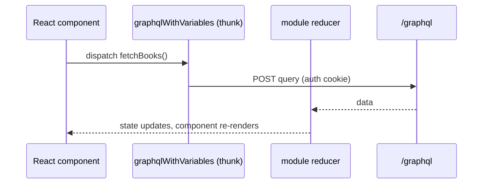

# Level 5 — Frontend Customization

<span class="oi-badge">Level 5</span>

Your `academy` module has a backend and a GraphQL API. Now give it a **React frontend** the openIMIS way — pages, components, forms, GraphQL-through-Redux (not Apollo), and menus and routes contributed through `ModulesManager` and published components.

## Learning objectives

By the end of this level you will be able to:

- Scaffold a frontend module (`openimis-fe-academy_js`) and register it in the FE manifest.
- Explain the module **config object** keys: `translations`, `reducers`, `queries`, `mutations`, `menus`, `routes`, `contributions`, `refs`.
- Fetch data with the core `graphql` / `graphqlWithVariables` Redux actions — and understand why openIMIS is **not** Apollo.
- Handle the asynchronous mutation lifecycle with the "journalize"/polling helper.
- Contribute a menu entry and a route, and reuse another module's **published component** via `ModulesManager`.

## Prerequisites

- Completed **[Level 4 — Advanced Modules](level-4.md)** — you have a permissioned `academy` backend.
- Read the [Frontend Architecture chapter](../architecture/frontend.md).
- You know React and Redux. You do **not** need Apollo — openIMIS does not use it.

---

## Briefing: the frontend is also assembled

The frontend mirrors the backend's plugin design. `openimis-fe_js` is the **assembly** React SPA (recently migrated to **Vite**); `openimis.json` is the FE **module manifest**, and `openimis-config-vite.js` generates the module import file (`src/modules.js`). Each module exports one **config object**.

| Config key | What it contributes |
| --- | --- |
| `translations` | i18n messages (react-intl). |
| `reducers` | Redux reducers for the module's slice of state. |
| `queries` / `mutations` | GraphQL fragment/field lists used by the module's actions. |
| `refs` / `reference` | **Published components/values** other modules can look up by name. |
| `menus` | Menu entries injected into the navigation. |
| `routes` | React Router routes. |
| `contributions` | Named **extension points** — inject a component into e.g. `"insuree.MainMenu"` or `"core.AppBar"`. |

### ModulesManager — the cross-module registry

`ModulesManager` (from core) is how modules find each other's parts by name, never by import:

- `modulesManager.getRef("insuree.InsureePicker")` — fetch a published component.
- `modulesManager.getConf(...)` — read config.
- `modulesManager.getContribs("insuree.MainMenu")` — collect everything contributed to an extension point.

This is the frontend twin of backend **service signals** — extension by name, not by import. See [Frontend Architecture](../architecture/frontend.md).

### Why not Apollo?

openIMIS does GraphQL through a **custom Redux layer** in core, not Apollo:



For mutations, a **"journalize"/polling helper** watches the async `MutationLog` status (the backend pattern from Level 3) and updates Redux when the mutation resolves. So the frontend's async mutation UX is the mirror image of `OpenIMISMutation`.

!!! info "Did you know?"
    Because auth is a **HttpOnly cookie**, the frontend never handles a token. The Redux GraphQL actions just POST to `/graphql` and the cookie rides along — one reason openIMIS could skip Apollo's auth-link machinery.

---

## Hands-on labs

All code is **illustrative** — confirm the exact action names, helper signatures, and config-object shape against `openimis-fe-core_js` and an existing module such as `openimis-fe-insuree_js`.

### Lab 5.1 — Scaffold and register the FE module

1. Create the module folder the openIMIS way:
   ```bash
   mkdir -p openimis-fe-academy_js/src
   cd openimis-fe-academy_js
   ```
2. Create `src/index.js` exporting a config object:
   ```jsx
   // illustrative
   import messages_en from "./translations/en.json";
   import reducer from "./reducer";
   import BooksPage from "./pages/BooksPage";

   const ROUTE_BOOKS = "books";

   const DEFAULT_CONFIG = {
     translations: [{ key: "en", messages: messages_en }],
     reducers: [{ key: "academy", reducer }],
     "core.Router": [{ path: ROUTE_BOOKS, component: BooksPage }],
     "core.MainMenu": [/* menu contribution, see Lab 5.4 */],
   };
   export const AcademyModule = (cfg) => ({ ...DEFAULT_CONFIG, ...cfg });
   ```
3. Register `academy` in the FE assembly `openimis-fe_js`'s `openimis.json`, then let `openimis-config-vite.js` regenerate `src/modules.js`.
4. Start the frontend dev server and confirm the module loads without console errors.

**Done when:** the module is imported into `src/modules.js` and the app boots.

### Lab 5.2 — A Redux reducer and GraphQL fetch

1. Create `src/actions.js` using the core GraphQL Redux helpers:
   ```jsx
   // illustrative
   import { graphqlWithVariables } from "@openimis/fe-core";

   export function fetchBooks(params) {
     const payload = `
       query Books($search: String) {
         books(title_Icontains: $search) {
           totalCount
           edges { node { id title author copies } }
         }
       }`;
     return graphqlWithVariables(payload, { search: params.search },
       "ACADEMY_BOOKS");
   }
   ```
2. Create `src/reducer.js` handling the `ACADEMY_BOOKS_REQ/RESP/ERR` actions the helper dispatches, storing `books`, `fetchingBooks`, and `errorBooks`.
3. Register the reducer in the config object (done in Lab 5.1).

**Done when:** dispatching `fetchBooks` populates your Redux slice with the backend data.

### Lab 5.3 — A page, a list, and a form

1. Create `src/pages/BooksPage.js`: a container that `dispatch`es `fetchBooks` on mount and reads `state.academy.books`.
2. Render the list with MUI components, wiring loading and error states from the reducer.
3. Add a `BookForm` component and a `createBook` action using the core mutation helper; on submit, dispatch the mutation and rely on the **journalize/polling** helper to reflect completion.
   ```jsx
   // illustrative
   import { graphql } from "@openimis/fe-core";
   export function createBook(book, clientMutationLabel) {
     const mutation = `
       mutation { createBook(input: {
         title: "${book.title}", author: "${book.author}", copies: ${book.copies},
         clientMutationLabel: "${clientMutationLabel}"
       }) { clientMutationId internalId } }`;
     return graphql(mutation, "ACADEMY_MUTATION_CREATE_BOOK",
       clientMutationLabel);
   }
   ```
4. Create a book from the form and watch the list refresh once the async mutation resolves.

**Done when:** you can list and create books entirely from the UI.

!!! danger "Common mistake"
    Do not treat a mutation's immediate response as "the write is done". The response only gives you a `clientMutationId`; the write completes asynchronously on the backend. Use the journalize/polling helper (or re-fetch on completion) to know when to refresh — otherwise your list shows stale data.

### Lab 5.4 — Contribute a menu and reuse a published component

1. Contribute a menu entry so `academy` appears in the navigation. Add to your config object a contribution to the main-menu extension point:
   ```jsx
   // illustrative
   import { FormattedMessage } from "@openimis/fe-core";
   "core.MainMenu": [{
     text: <FormattedMessage module="academy" id="menu.books" />,
     icon: "MenuBook",
     route: "/books",
   }],
   ```
2. Guard the menu/route by the user's **rights** so only permitted users see it (mirror the Level 4 backend permissions).
3. Reuse a **published component** from another module via `ModulesManager` — for example, look up a picker or a searcher:
   ```jsx
   // illustrative
   const Picker = props.modulesManager.getRef("core.SomePublishedComponent");
   ```
4. Confirm the menu appears (only for permitted users), the route loads `BooksPage`, and the reused component renders.

**Done when:** `academy` is reachable from the menu, route-guarded by rights, and reuses at least one published component.

---

## Exercises

1. Add a search box to `BooksPage` that re-dispatches `fetchBooks` with `title_Icontains`.
2. Add French translations (`fr.json`) and switch the UI locale to verify react-intl picks them up.
3. Publish one of your own components under a `refs` name and consume it via `modulesManager.getRef("academy.YourComponent")`.
4. Explain, to a React dev used to Apollo, how openIMIS caches/stores query results instead (hint: Redux reducers).
5. Trace the full path of "user clicks Create" → backend row created → list refreshed, naming every layer.

---

## Challenge project

**Ship the `academy` frontend module** so the Book domain is fully usable in the UI:

- A registered FE module with `translations`, `reducers`, `routes`, and a `core.MainMenu` contribution.
- A `BooksPage` with a paginated, searchable list backed by `graphqlWithVariables` and a reducer.
- A `BookForm` for create and update, using the core mutation helper and the journalize/polling helper to refresh on completion.
- Route and menu **guarded by the user's rights**, consistent with the Level 4 backend permissions.
- At least one **published component** you expose via `refs`, plus one you **consume** from another module via `ModulesManager`.
- A `README` documenting the config-object keys you used and the extension points you exposed and consumed.

Prove it: log in as a permitted user and do a full create/search/update loop from the UI; log in as a user lacking the right and show the menu and route are hidden.

---

## Knowledge check

??? question "Q1: openIMIS uses GraphQL but not Apollo. How does the frontend actually run queries? (click for answer)"
    Through a **custom Redux layer** in core: `graphql` / `graphqlWithVariables` action creators (thunks) POST to `/graphql`, and module **reducers** store the results in Redux state. There is no Apollo client or cache — state lives in Redux, and the HttpOnly auth cookie rides along automatically.

??? question "Q2: What does a frontend module's config object contribute, and name four keys. (click for answer)"
    It is how a module plugs into the assembly. Keys include `translations`, `reducers`, `queries`, `mutations`, `menus`, `routes`, `refs`/`reference`, and **`contributions`** (named extension points like `"insuree.MainMenu"` or `"core.AppBar"`).

??? question "Q3: What is `ModulesManager` and how is it like backend service signals? (click for answer)"
    It is core's cross-module registry: `getRef(name)` fetches a published component, `getContribs(point)` collects everything contributed to an extension point, `getConf(...)` reads config. Like backend **service signals**, it lets modules find and extend each other **by name, never by import** — the same decoupling discipline on the frontend.

??? question "Q4: Why can't the UI assume a mutation is finished when the response arrives? (click for answer)"
    Because openIMIS mutations are **asynchronous** (`OpenIMISMutation`): the response only returns a `clientMutationId`/`internalId`; the actual work completes on the backend and is tracked in the `MutationLog`. The frontend uses a **journalize/polling** helper to detect completion before refreshing the view.

??? question "Q5: How do you make a menu item or route visible only to permitted users? (click for answer)"
    Guard it by the logged-in user's integer **rights** — the same permission codes enforced on the backend (Level 4). Route guards and menu contributions check the user's rights, so the UI mirrors what the API would allow anyway.

---

## Further reading

- [Frontend Architecture chapter](../architecture/frontend.md) — Redux GraphQL, `ModulesManager`, contributions, Vite
- [GraphQL chapter](../graphql/index.md) — the query/mutation model the FE consumes
- [Security chapter](../security/index.md) — rights that guard routes and menus
- Reference module: [openimis-fe-insuree_js](https://github.com/openimis/openimis-fe-insuree_js)

Your feature is now full-stack. Make it fast and production-ready in **[Level 6 — Ops & Scaling](level-6.md)**.
