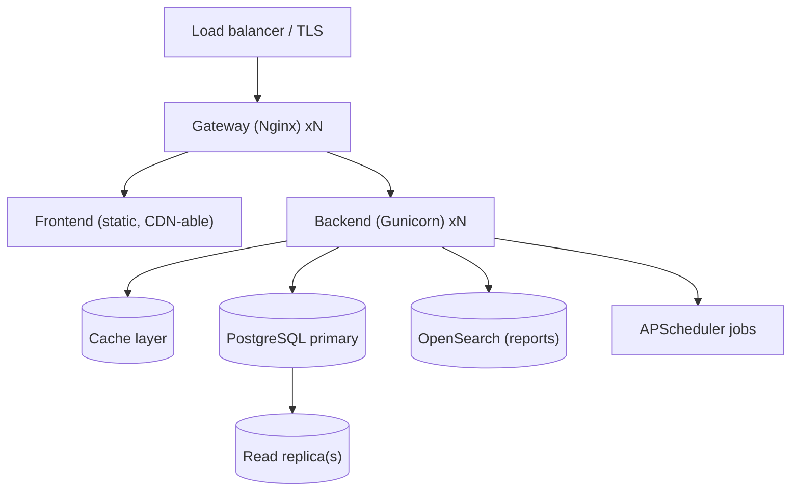

# Level 6 — Ops & Scaling

<span class="oi-badge oi-badge--advanced">Advanced</span>

A module that works on your laptop is not a module that survives a national deployment. This level is about **operating** openIMIS: finding and fixing performance problems, scaling the stack, caching, adding observability, and shipping a real production topology.

## Learning objectives

By the end of this level you will be able to:

- Profile a slow GraphQL request and identify N+1 queries and missing indexes.
- Reason about **scaling** each service (`db`, `backend`, `frontend`, `gateway`) independently.
- Apply caching at the right layer and know what is *not* safe to cache.
- Add **observability**: structured logs, metrics, and request tracing across the gateway → GraphQL → service → DB path.
- Describe a production deployment topology and its failure modes.

## Prerequisites

- Completed **[Level 5 — Frontend](level-5.md)** — you have a full-stack `academy` feature.
- Read the [Docker & Deployment chapter](../docker/index.md) and [Deployment & Operations](../docker/deployment.md).
- Read the [Database chapter](../database/index.md) (indexes, temporal model) and the [Request Lifecycle](../architecture/request-lifecycle.md).

---

## Briefing: where openIMIS spends time and how it grows

A production deployment is the same four services from Level 2, but now each one is a scaling and failure boundary.



Key facts that shape ops decisions:

- The **frontend** is a static React build — cheap to scale, CDN-friendly, effectively stateless.
- The **backend** is Django/Gunicorn — scale horizontally by adding workers/replicas; it is stateless *except* for background jobs.
- **PostgreSQL** is the hard scaling boundary. The legacy-derived schema (temporal `validity_from`/`validity_to`, `tbl`-prefixed tables) means queries filter on validity constantly — index accordingly. See [Database chapter](../database/index.md).
- **APScheduler** runs background tasks in-process; running multiple backend replicas naively can run a job *N times*. This is a classic ops trap.

### The performance villain: N+1 queries

GraphQL makes N+1 easy: a `books` connection that resolves an author per node can fire one query per row. The fix is the same as any Django ORM N+1 — `select_related`/`prefetch_related` in the **service or resolver** — but you have to *see* it first, which is what profiling is for. The [Request Lifecycle](../architecture/request-lifecycle.md) shows where a resolver sits in the request.

!!! info "Did you know?"
    openIMIS's temporal model means almost every query carries a `validity_to IS NULL` predicate to get "current" rows. Without an index that includes the validity columns, those filters table-scan large history tables. Composite indexes that match the common filter + validity pattern are often the single biggest win.

!!! danger "Common mistake"
    Running the APScheduler-backed jobs in every backend replica. If three replicas each start the scheduler, a nightly job runs three times — double-counting contributions, sending duplicate notifications, or corrupting aggregates. Run scheduled jobs in **one** designated instance (or an external scheduler), not in every worker.

---

## Hands-on labs

Use your running stack from Level 2 and the `academy` feature from Levels 3–5. Seed enough data to make problems visible.

### Lab 6.1 — Seed and profile

1. Seed a few thousand `Book` rows (a management command or a shell loop). Realistic volume makes real problems appear.
2. Enable SQL logging or attach Django Debug Toolbar / `django-silk` (dev only) and load `BooksPage` or run the `books` query.
3. Count the SQL queries for one page load. If resolving each node issues extra queries, you have found an **N+1**.

**Done when:** you can state, with a number, how many SQL queries one `books` request costs.

### Lab 6.2 — Kill the N+1 and add an index

1. In `BookService.list_books`, add `select_related`/`prefetch_related` for any related fields the resolver touches; re-profile and confirm the query count drops.
2. Identify the predicate the `books` query filters on most (e.g. `title` + `validity_to IS NULL`). Add a matching migration index:
   ```python
   # illustrative
   class Meta:
       indexes = [models.Index(fields=["title", "validity_to"])]
   ```
3. `makemigrations` / `migrate`, then `EXPLAIN ANALYZE` the underlying query before and after to prove the index is used.

**Done when:** query count is flat regardless of row count, and `EXPLAIN` shows an index scan instead of a sequential scan.

### Lab 6.3 — Add a cache at the right layer

1. Choose a genuinely cacheable read — e.g. rarely-changing reference data (a `location` or `product` list), **not** per-user claim data.
2. Add caching (Django cache framework) around that read in its service, with a sane TTL and an invalidation hook on write.
3. Verify a cache hit avoids the DB, and that a write invalidates the entry.

**Done when:** a cacheable read is served from cache and correctly invalidated on change. Document *why* the data you chose is safe to cache.

!!! danger "Common mistake"
    Caching permissioned or temporal data by a key that ignores the user's rights or the validity window. You will serve one user another user's view, or stale "current" rows. Cache reference data, not authorization-sensitive results — and include validity/permission context in the key when in doubt.

### Lab 6.4 — Add observability

1. Turn backend logs into **structured** logs (JSON) including a request/correlation id, the resolver name, and duration.
2. Propagate a correlation id from the gateway (Nginx) through to the backend so you can trace one request end to end across services.
3. Expose basic metrics — request rate, error rate, p95 latency, DB query counts. Wire them to whatever your environment uses (Prometheus/Grafana, cloud monitoring, etc.).
4. Load-test the `books` query (e.g. with `k6`/`hey`) and read your own dashboard to find the p95 and the bottleneck.

**Done when:** you can point at a single slow request in your logs and follow its correlation id from gateway to DB.

### Lab 6.5 — Scale the backend safely

1. Run the backend with multiple Gunicorn workers/replicas.
2. Ensure scheduled jobs run in **exactly one** place (a dedicated worker/flag, or an external scheduler), not in every replica — verify a job fires once, not N times.
3. Confirm the frontend and gateway scale independently and that a backend restart is a rolling, non-breaking event behind the load balancer.

**Done when:** the backend runs multiple replicas, scheduled jobs run once, and a rolling backend restart does not drop the UI.

---

## Exercises

1. For the `books` query, write the composite index you would add and justify the column order.
2. Explain why the frontend is trivially scalable but PostgreSQL is not.
3. List three reads in openIMIS that are safe to cache and three that are not — with reasons.
4. Describe how you would prevent an APScheduler job from running in every replica.
5. Define p50/p95/p99 latency and explain why p95 matters more than the average for user experience.

---

## Challenge project

**Produce an "operability report" for the `academy` feature** proving it is production-ready:

- **Baseline:** query counts and p95 latency for `BooksPage` at 10, 1k, and 10k rows.
- **Fixes:** the N+1 removal and the index you added, each with before/after `EXPLAIN ANALYZE` and query-count evidence.
- **Caching:** one cacheable read with TTL, invalidation, and a note on why it is safe.
- **Observability:** a sample structured log line with a correlation id traced gateway → resolver → DB, plus a screenshot/description of your latency and error-rate metrics.
- **Scaling plan:** how many backend replicas, how the DB scales (replicas/pooling), how scheduled jobs are isolated, and the rolling-deploy story.
- **Failure modes:** what happens when the DB primary fails, when a backend replica dies mid-request, and when the cache is cold — and how the system degrades.

This report is a direct input to the Level 7 capstone's operations section.

---

## Knowledge check

??? question "Q1: Which service is the real scaling bottleneck, and why? (click for answer)"
    **PostgreSQL.** The frontend is static and CDN-able; the backend (Django/Gunicorn) scales horizontally by adding stateless workers. The database is the shared source of truth — you scale it with indexing, connection pooling, read replicas, and query optimization, not by "adding a worker".

??? question "Q2: Why are N+1 queries especially easy to introduce in GraphQL, and how do you fix them? (click for answer)"
    Because a connection resolves fields per node, a related lookup can fire one query per row. You fix it the standard Django way — `select_related`/`prefetch_related` in the **service/resolver** — after *profiling* to see the extra queries (SQL logging, silk, debug toolbar).

??? question "Q3: Why does openIMIS's temporal model matter for indexing? (click for answer)"
    Almost every query filters `validity_to IS NULL` (plus `validity_from`) to select current rows from history tables. Without composite indexes that include the validity columns alongside the common filter columns, those predicates sequentially scan large tables. Matching indexes are often the biggest single performance win.

??? question "Q4: What goes wrong if you run the APScheduler jobs in every backend replica? (click for answer)"
    Each replica starts its own scheduler, so a job runs **once per replica** — duplicating notifications, double-counting aggregates, or corrupting data. Scheduled jobs must run in exactly one designated instance or via an external scheduler.

??? question "Q5: Give an example of data that is safe to cache and one that is not. (click for answer)"
    **Safe:** slowly-changing reference data like the `location` hierarchy or `product` definitions. **Not safe:** per-user, permissioned, or temporally-current data such as a specific insuree's claims — caching it risks serving stale or cross-user results unless the cache key includes user rights and validity context.

---

## Further reading

- [Docker & Deployment](../docker/index.md) and [Deployment & Operations](../docker/deployment.md)
- [Database chapter](../database/index.md) — indexing and the temporal model
- [Request Lifecycle](../architecture/request-lifecycle.md) — where resolvers and services sit
- OpenSearch reporting: `openimis-be-opensearch_reports_py` on [github.com/openimis](https://github.com/openimis)

You can now operate openIMIS. Prove mastery in **[Level 7 — Expert Capstone](level-7.md)**.
