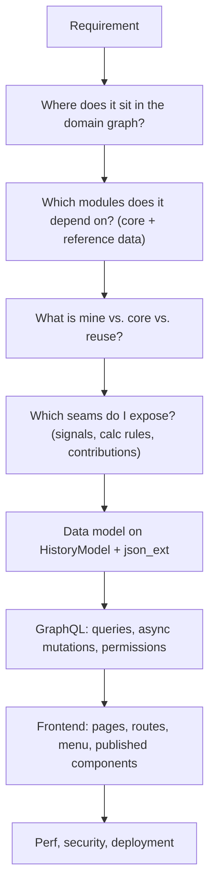

# Level 7 — Expert Capstone

Expert

This is the capstone. You will design a **complete new business module end to end** — not a teaching toy like `Book`, but a plausible openIMIS domain — and then defend it across four axes: **architecture, performance, security, and deployment**. Everything from Levels 1–6 converges here.

## Learning objectives

By the end of this level you will be able to:

- Take a real health-financing requirement and decompose it into an openIMIS module with the right dependencies.
- Make and justify **architecture decisions**: what belongs in your module vs. core, which seams to expose, what to reuse.
- Build the module full-stack: models, services, GraphQL, permissions, signals, calculation rules, and a React frontend.
- Conduct a **performance review**, a **security review**, and design a **deployment strategy** for it.
- Present the whole thing as an Architecture Decision Record a maintainer could approve.

## Prerequisites

- Completed **[Level 6 — Ops & Scaling](level-6.md)** — and, honestly, all prior levels.
- You should be comfortable across the whole handbook. The chapters you will lean on most: [Architecture Overview](../architecture/overview.md), [Plugin / Module System](../architecture/plugin-system.md), [Core module](../modules/core.md), [GraphQL](../graphql/index.md), [Security](../security/index.md), [Database](../database/index.md), [Docker & Deployment](../docker/index.md), and [Extending openIMIS](../extending/index.md).

---

## Briefing: thinking like a module architect

Adding a module is easy; adding a *good* module is a design exercise. The maintainers' implicit checklist:

The design principles that separate a mergeable module from a fork:

| Principle | In practice |
| --- | --- |
| **Depend downward only** | Build on `core` and reference modules; never create a cycle. |
| **Reuse, don't reinvent** | Use `HistoryModel`, `OpenIMISMutation`, `ExtendedConnection`, published FE components. |
| **Extend by name** | Expose service signals and FE contributions; consume others the same way. |
| **Config over code** | Deployment-varying behavior goes in `DEFAULT_CFG` / `ModuleConfiguration`. |
| **Permission everything** | Integer rights on every query and mutation, enforced on both tiers. |
| **Audit everything** | Async mutations + `MutationLog`; temporal history via `validity_*`. |

!!! info "Did you know?"
    This is exactly how modules like `individual`, `social_protection`, and the `calcrule_*` family were added — new domains bolted onto core through its published seams, never by editing core. A capstone that respects these principles is, in principle, upstreamable.

---

## The capstone challenge project

Pick **one** business domain (or propose your own of comparable scope). Each is a genuine gap a country deployment might fill:

=== "Option A — Grievances & Appeals"
    Beneficiaries file grievances about rejected claims or enrolment; officers triage, respond, and resolve them within SLAs. Depends on `insuree`/`individual`, `claim`, `core`. Rich in workflow, permissions, and notifications.

=== "Option B — Provider Contracting"
    Manage contracts between the scheme and health facilities: terms, validity periods, negotiated price lists, and contract-scoped claim rules. Depends on `location`, `product`, `claim`, `core`. Rich in temporal data and calculation rules.

=== "Option C — Voluntary Top-up Products"
    Let insurees buy optional top-up coverage on top of a base policy, priced by a calculation rule and paid via contributions. Depends on `policy`, `product`, `contribution`, `calculation`, `core`. Rich in pricing and money flows.

Whichever you choose, deliver **all** of the following.

### Part 1 — Architecture Decision Record

Write an ADR for the module. It must state:

- The requirement and the domain boundary (what is in scope, what is not).
- Its position in the [module dependency graph](../architecture/overview.md) and every module it depends on, with justification for each.
- What you build vs. what you reuse from `core` and other modules.
- The seams you expose (service signals, calculation rules, FE contributions, published components) and the seams you consume.
- At least three alternatives you rejected and why (e.g. "extend `claim` directly" vs. "new module").

### Part 2 — Backend implementation

- Models on `HistoryModel` (with `json_ext` where extensibility helps), plus migrations and appropriate indexes (Level 6 discipline).
- Services as the sole ORM boundary.
- GraphQL: filterable/paginated queries with `ExtendedConnection`, and asynchronous `OpenIMISMutation`s with a `MutationLog`.
- Integer **permissions** in `apps.py`, enforced in every resolver and mutation.
- At least one **service signal** you emit and one you bind, and — where the domain fits — a `calcrule_*`-style pluggable rule.
- DB-backed configuration for anything a deployment might vary.

### Part 3 — Frontend implementation

- An `openimis-fe-<name>_js` module registered in the FE manifest, exporting a config object.
- A page with a paginated/searchable list and a create/update form, backed by the core `graphql`/`graphqlWithVariables` Redux actions and the journalize/polling helper.
- A menu entry and route, **guarded by rights** consistent with the backend.
- At least one component you publish via `refs` and one you consume via `ModulesManager`.

### Part 4 — Reviews and strategy

- **Performance review:** the Level 6 treatment applied to your module — profiling, N+1 elimination, indexes, a caching decision, and a scaling note. Include before/after evidence.
- **Security review:** see the checklist below.
- **Deployment strategy:** how your module ships (manifest entry, migrations at startup, config seeding), a rollout/rollback plan, and its failure modes.

---

## Hands-on labs

These labs *are* the capstone's spine — do them in order as you build.

### Lab 7.1 — Domain decomposition

1. Write the requirement in three sentences. Circle every noun — those are candidate models. Circle every verb — those are candidate services/mutations.
2. Place your module on the dependency graph. Draw arrows only *downward* to existing modules. If you need an arrow upward or sideways into a peer, your boundary is wrong — redraw.
3. Decide, per noun, whether it is a new model, an extension of an existing one (`json_ext`), or a reference to another module's entity.

**Done when:** you have a one-page domain map with no dependency cycles.

### Lab 7.2 — Build the vertical slice

1. Implement **one** end-to-end path first — one model, one query, one async mutation, one permission, one page — before breadth. Prove it works in GraphiQL and the UI.
2. Only then widen to the full model set. A working thin slice de-risks everything after it.

**Done when:** a single feature works from React form → async mutation → `MutationLog` → DB → refreshed list.

### Lab 7.3 — Security review

Run this checklist against your module (grounded in the [Security chapter](../security/index.md)):

1. **AuthN:** every entry point requires an authenticated user; the JWT stays in the HttpOnly cookie; you never handle raw tokens.
2. **AuthZ:** every query and mutation checks `user.has_perms([...])` with the module's integer codes; the FE route/menu guards mirror them.
3. **Tenancy/scope:** results are scoped to what the user may see (e.g. by `location`/officer), not just "authenticated".
4. **Audit:** every write is an async mutation with a `MutationLog`; deletes are soft (validity window), preserving history.
5. **Input:** service-layer validation; no string-built SQL; GraphQL inputs typed and bounded.
6. **Secrets/config:** nothing sensitive in code or `DEFAULT_CFG`; secrets come from the environment (`.env`), not the repo.
7. **Data exposure:** the GraphQL types expose only intended fields; no accidental leak of internal or cross-user data through a connection.

**Done when:** you can answer every item with a file/line-of-reasoning reference, and you have fixed anything that failed.

### Lab 7.4 — Deployment dry run

1. Register the module in the backend and frontend manifests; confirm it loads into `INSTALLED_APPS` and `src/modules.js`.
2. Confirm migrations run cleanly at container startup and that any required `ModuleConfiguration` is seeded.
3. Do a **rolling** backend restart behind the gateway and confirm no dropped requests; then practice a **rollback** (previous image + reverse migration story).

**Done when:** the module deploys, migrates, and rolls back without manual surgery.

---

## Exercises

1. Justify, in two sentences, why your capstone is a *new module* rather than a patch to an existing one.
2. Name the single most likely place your module introduces an N+1 and how you prevented it.
3. Identify the one piece of behavior most likely to vary by country and show it living in config, not code.
4. Which existing module's published component did you reuse, and what did reusing it save you?
5. Describe the blast radius if your module's calculation rule threw an exception mid-calculation — and how you contained it.

---

## Capstone acceptance criteria

Treat this as the maintainer's merge checklist. Your capstone passes when **all** are true:

- [ ] ADR present, with dependencies justified and rejected alternatives listed.
- [ ] Backend: models on `HistoryModel`, services as ORM boundary, indexed migrations.
- [ ] GraphQL: paginated queries (`ExtendedConnection`) and async `OpenIMISMutation`s, all permissioned.
- [ ] At least one emitted and one bound **service signal**; a calc-rule where the domain fits.
- [ ] Deployment-varying behavior in **DB-backed config**, not code.
- [ ] Frontend: registered module, list + form, menu + route guarded by rights, one published and one consumed component.
- [ ] Performance review with before/after evidence.
- [ ] Security review checklist fully answered and remediated.
- [ ] Deployment strategy with rollout, rollback, and failure modes.
- [ ] No edits to `core` or peer modules — everything through published seams.

---

## Knowledge check

??? question "Q1: When should a new capability be a new module versus an extension of an existing one? (click for answer)"
    New module when it is a distinct domain with its own models, permissions, and lifecycle, and it can depend *downward* on existing modules without editing them. Extend an existing one (often via `json_ext` or a service-signal handler) when the capability is an attribute or side-effect of an existing entity. The deciding test: can you build it without touching core or a peer? If yes, a clean new module is right.

??? question "Q2: What does 'depend downward only' protect you from? (click for answer)"
    Dependency cycles and un-mergeable coupling. If your module only depends on `core` and stable reference/domain modules beneath it — and extends peers via **signals/contributions** rather than imports — it can be versioned, deployed, and even upstreamed independently. Upward or sideways hard-dependencies create cycles and force forks.

??? question "Q3: Name three things a security review must confirm for a new module. (click for answer)"
    Any three of: every entry point is authenticated (JWT in HttpOnly cookie); every query/mutation enforces integer **rights** via `has_perms`; results are **scoped** to what the user may see; every write is audited via an async mutation + `MutationLog`; deletes are soft (validity window); inputs are validated with no string-built SQL; GraphQL types expose only intended fields; secrets come from the environment, not code/config.

??? question "Q4: Where should country-specific pricing logic live, and why? (click for answer)"
    In a **calculation rule** (`calcrule_*`) registered via signals, selected by metadata — plus any thresholds in **DB-backed configuration**. That keeps the consuming module ignorant of the specific formula, so a country can swap the rule or change config **without touching code** in the modules that use it.

??? question "Q5: Your capstone edits a file in `core` to make things work. What does that tell you? (click for answer)"
    That your design is wrong. Needing to edit core means you are missing (or ignoring) an extension seam — a service signal, a calculation-rule contract, a published component, or a config key. Re-derive the design so your module plugs into core's published seams; the whole point of openIMIS's architecture is that countries extend it **without forking core**.

---

## Further reading

- [Architecture Overview](../architecture/overview.md) and [Plugin / Module System](../architecture/plugin-system.md)
- [Extending openIMIS](../extending/index.md) and the [End-to-End Code Walkthrough](../extending/code-walkthrough.md)
- [Core module](../modules/core.md), [GraphQL](../graphql/index.md), [Security](../security/index.md), [Database](../database/index.md)
- [Docker & Deployment](../docker/index.md) and [Deployment & Operations](../docker/deployment.md)
- [Architecture Critique](../critique/index.md) — where the maintainers themselves see room to improve
- All source repositories: [github.com/openimis](https://github.com/openimis)

You have completed the Academy. Return to the [Academy home](index.md) — or, better, take your capstone module and propose it upstream.
