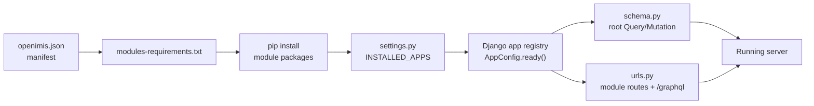
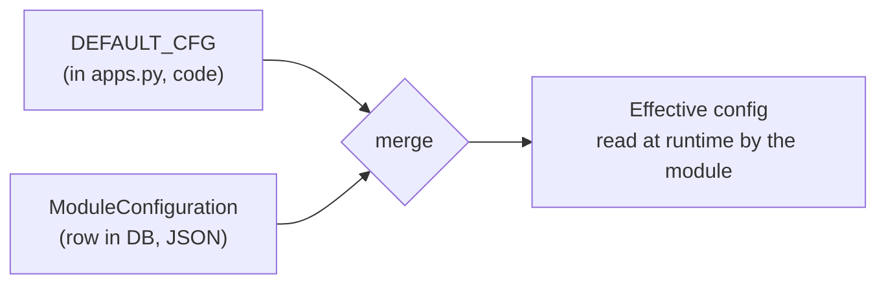
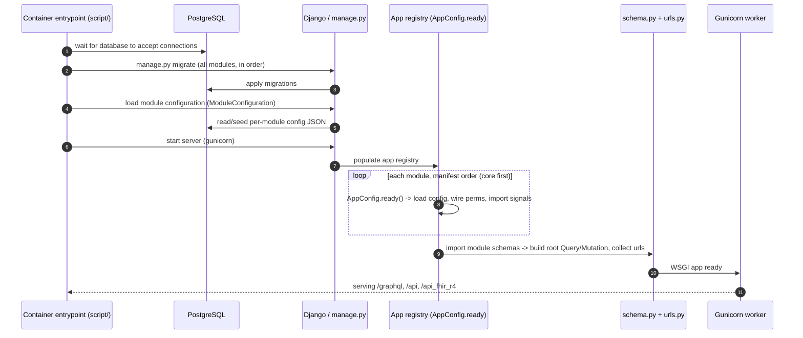

# Backend Deep Dive

You already know Django. This chapter is not about Django — it is about the
**specific, unusual way openIMIS uses Django** to turn a manifest and a pile of
independently versioned packages into one running system. We will open the
`openimis-be_py` project, watch it boot, and follow the machinery that makes 40+
modules behave as a single coherent application: dynamic `INSTALLED_APPS`, the
`AppConfig`/`DEFAULT_CFG` convention, the database-backed configuration overlay,
two distinct signal systems, permissions as integers, and the container startup
lifecycle.

Read [High-Level Architecture](overview.md) first if you have not. This chapter
zooms into the "Core framework" and "Business module" tiers of that map.

## Learning objectives

By the end of this chapter you will be able to:

- Navigate the `openimis-be_py` project layout and explain what each top-level
  file does.
- Explain how `settings.py` builds `INSTALLED_APPS` **dynamically** from
  `openimis.json`, and why that matters.
- Describe the `AppConfig` + `DEFAULT_CFG` convention and how a module reads its
  runtime config.
- Explain the `ModuleConfiguration` DB overlay: how operators reconfigure a
  deployment without changing code.
- Distinguish **Django ORM signals** from openIMIS **service signals**
  (`register_service_signal` / `bind_service_signal`) and know when each is used.
- Understand openIMIS **permissions as integer rights** and `user.has_perms`.
- Trace the container **startup lifecycle** from `script/` entrypoint to a
  request-ready server, including migrations and config loading.
- Know the common management commands and where logging/caching/middleware are
  configured.

## Prerequisites

- [High-Level Architecture](overview.md) — the layer stack and the
  assembly/module distinction.
- [Repository Map](repository-map.md) — which modules exist and how they depend
  on each other.
- Comfort with Django apps, `AppConfig`, migrations, signals, and settings.
- [Security](../security/index.md) is referenced for the authentication details
  that this chapter deliberately keeps at overview level.

---

## 1. Project anatomy of `openimis-be_py`

`openimis-be_py` is the **assembly repository** — the deployable Django project.
It contains almost no domain logic. Its job is to *choose modules, configure
Django, assemble the GraphQL schema and URLs, and bring the system up*.

The important paths (names are real; treat the tree as the canonical layout):

| Path | Role |
|---|---|
| `openimis.json` | The **module manifest**: ~47 modules, each with a pip/git source. |
| `modules-requirements.txt` | Generated from `openimis.json`; what pip actually installs. |
| `openimis/settings.py` | Standard Django settings **plus** dynamic `INSTALLED_APPS`, Graphene, and `graphql_jwt` config. |
| `openimis/schema.py` | Assembles the root GraphQL `Query`/`Mutation` from every module. |
| `openimis/urls.py` | Collects each module's `urls.py` and mounts `/graphql`. |
| `openimisconf/load_openimis_conf.py` | Loads the module configuration (which modules, their options). |
| `script/` | Container **entrypoints**: migrate, load configs, start the server. |
| `manage.py` | The usual Django CLI (now driving an assembled project). |

Mentally, the flow is: **manifest → installed packages → Django apps → schema +
urls → running server.** Everything below expands one arrow of that chain.



!!! info "Did you know?"
    For local development you rarely rely on the generated requirements file.
    Instead you install modules **editable** so your source edits take effect
    live: `pip install -e ../openimis-be-core_py/`. The manifest still governs
    *which* modules load; editable installs just change *where the code comes
    from*.

---

## 2. Dynamic `INSTALLED_APPS`: the heart of the assembler

In an ordinary Django project you hand-write `INSTALLED_APPS`. openIMIS does not.
It **computes** it at startup from the module configuration, so that adding a
module to the manifest is enough to wire it in — no edit to `settings.py`
required.

The logic lives in `openimis/settings.py` together with
`openimisconf/load_openimis_conf.py`. Conceptually (illustrative, simplified):

```python
# illustrative — openimis/settings.py (simplified)
from openimisconf import load_openimis_conf

# The loaded configuration knows which modules are enabled, in order.
OPENIMIS_CONF = load_openimis_conf()
openimis_modules = [m["name"] for m in OPENIMIS_CONF["modules"]]  # e.g. "core", "claim", ...

INSTALLED_APPS = [
    # Django + third-party that must come first
    "django.contrib.admin",
    "django.contrib.auth",
    "django.contrib.contenttypes",
    # ...
    "graphene_django",
    "rest_framework",
    # ... then every openIMIS module, in manifest order:
    *openimis_modules,          # (1)!
]
```

1. Because `core` is listed first in the manifest, it initializes before any
   module that depends on it. **Manifest order is dependency order.** This is why
   the manifest is not just a list — it is a topological load plan.

Two consequences worth internalizing:

- **The manifest is authoritative.** If a module misbehaves, confirm it is
  actually in `openimis.json` and installed — a package can be pip-installed yet
  not enabled, or enabled yet not installed.
- **Order matters.** `core` first; reference-data modules before the modules that
  consume them. The dependency intuition in [Repository Map](repository-map.md)
  is the ordering you will see reflected here.

!!! danger "Common mistake"
    Adding `some_module` to `INSTALLED_APPS` by hand. That fights the assembler:
    on the next config load your edit is ignored or overwritten, and the module's
    position relative to `core` may be wrong. **Add modules to `openimis.json`,
    not to `settings.py`.**

---

## 3. The standard module layout and `AppConfig`

Every backend module follows the same shape. Learn it once and you can read any
of the 47.

```text
openimis-be-<name>_py/
  <name>/
    apps.py            # AppConfig subclass + DEFAULT_CFG (+ permission wiring)
    models.py          # Django models (usually extending core base models)
    schema.py          # GraphQL Query / Mutation for this module
    gql_queries.py     # Graphene ObjectTypes / connections
    gql_mutations/     # one file per mutation (larger modules)
    services.py        # business logic — the real work lives here
    signals.py         # ORM signal handlers and service-signal bindings
    migrations/
    urls.py            # REST/other routes contributed by this module
    tests/
```

The linchpin is **`apps.py`**, which defines an `AppConfig` subclass. This is
where a module declares its identity, its default configuration, and its
permission codes.

```python
# illustrative — core/apps.py (simplified, faithful to conventions)
from django.apps import AppConfig

DEFAULT_CFG = {                          # (1)!
    "default_audit_user_id": 1,
    "gql_query_users_perms": [121701],   # integer rights
    "gql_mutation_create_users_perms": [121702],
    # ... many more keys
}

class CoreConfig(AppConfig):
    name = "core"
    default_cfg = DEFAULT_CFG

    def ready(self):                     # (2)!
        # 1. overlay DEFAULT_CFG with DB-stored ModuleConfiguration
        self._load_config()
        # 2. register permissions, connect signals, etc.
        self._configure_permissions()
        import core.signals             # noqa: ensures signal handlers register
```

1. `DEFAULT_CFG` is the module's **built-in default configuration** — feature
   flags, default IDs, and the integer permission codes each query/mutation
   requires. It is a plain dict, so it is trivial to read and override.
2. `ready()` runs once per process when Django populates its app registry. This
   is the module's constructor: load config, wire permissions, import signal
   handlers so their `@receiver`/`bind_service_signal` decorators execute.

!!! info "Did you know?"
    Importing `core.signals` inside `ready()` is not incidental — it is *how*
    signal handlers get registered. A handler that is never imported is never
    connected. If a signal "isn't firing," the first thing to check is whether
    its module actually imports the file that defines the handler during
    `ready()`.

---

## 4. Configuration: `DEFAULT_CFG` overlaid by `ModuleConfiguration`

Here is one of openIMIS's most important operational ideas, and it directly
serves the "customize a country deployment without changing code" requirement
from [High-Level Architecture](overview.md).

Each module ships a `DEFAULT_CFG` dict in `apps.py`. At startup, core overlays
that dict with a **per-module JSON document stored in the database** — the
`ModuleConfiguration` model (defined in core). The merged result is the module's
**effective runtime configuration**, which the rest of the module reads (often
via a module-level `<Name>Config` object populated in `ready()`).



Why this design?

- **Operators reconfigure without a deploy.** Change a feature flag, a default
  officer, a permission set — edit the DB config, restart, done. No code change,
  no image rebuild.
- **Sensible defaults ship in code.** A fresh deployment works with zero DB
  config because `DEFAULT_CFG` fills every key.
- **Config is auditable and per-environment.** Dev, staging, and prod can carry
  different `ModuleConfiguration` rows against the same code.

```python
# illustrative — reading effective config inside a module
from core.models import ModuleConfiguration

def load_config(app_config):
    cfg = dict(app_config.default_cfg)            # start from defaults
    stored = ModuleConfiguration.get_or_default(app_config.name)  # DB overlay
    cfg.update(stored)                            # DB wins over defaults
    return cfg
```

!!! danger "Common mistake"
    Editing `DEFAULT_CFG` in a module's `apps.py` to change a production setting.
    That is a **code change to a shared module** — it affects everyone and must
    go through release. For deployment-specific settings, write a
    `ModuleConfiguration` DB entry instead. Reserve `DEFAULT_CFG` for genuine
    defaults.

??? note "Deep dive: precedence and timing"
    The overlay happens in `AppConfig.ready()`, i.e. **once at process start**.
    That means changing a `ModuleConfiguration` row does **not** take effect
    until the workers restart — there is no live hot-reload of config by default.
    Precedence is: DB `ModuleConfiguration` **over** `DEFAULT_CFG`. A key absent
    from the DB falls through to the code default; a key present in the DB
    overrides it. When debugging "my config change did nothing," check (a) did
    the workers restart, and (b) is the key spelled exactly as in `DEFAULT_CFG`.

---

## 5. Two signal systems

openIMIS uses **two** distinct signal mechanisms, and conflating them is a
classic source of confusion. One is stock Django; the other is an openIMIS
invention that is the backend's primary extension seam.

### 5.1 Django ORM signals

The familiar ones: `pre_save`, `post_save`, `pre_delete`, `post_delete`, etc.,
connected with `@receiver`. openIMIS uses them for the usual reasons — keeping
denormalized fields in sync, cache invalidation, audit side effects tied to model
persistence.

```python
# illustrative — a stock Django ORM signal
from django.db.models.signals import post_save
from django.dispatch import receiver
from claim.models import Claim

@receiver(post_save, sender=Claim)
def on_claim_saved(sender, instance, created, **kwargs):
    if created:
        ...  # e.g. enqueue a notification
```

These fire on **ORM persistence events**. They know nothing about business
operations — only that a row was saved or deleted.

### 5.2 openIMIS service signals

This is the openIMIS-specific one, and it is the mechanism that lets one module
hook another module's **business logic** without importing it. It operates at the
level of **service method calls**, not ORM events.

- `register_service_signal("module.service.method")` declares a named signal
  around a service method — a *before* and *after* hook point.
- `bind_service_signal("module.service.method", handler, ...)` attaches a
  handler to that hook from **any** module.

```python
# illustrative — declaring a service signal (in the owning module)
from core.service_signals import register_service_signal

class ContributionService:
    @register_service_signal("contribution.service.create")   # (1)!
    def create(self, data):
        ...  # create the contribution
        return contribution
```

```python
# illustrative — binding to it from a DIFFERENT module (e.g. calcrule_*)
from core.service_signals import bind_service_signal

def after_contribution_created(sender, result, **kwargs):
    # run a calculation rule against the new contribution
    ...

bind_service_signal(
    "contribution.service.create",
    after_contribution_created,
    bind_type="after",           # before / after the service call
)
```

1. Wrapping the service method registers a signal that fires *around* the call.
   Subscribers registered via `bind_service_signal` run before and/or after the
   body, receiving the arguments and (for `after`) the result.

**Why this exists — the crucial point:** it inverts the dependency. The
`contribution` module does not know that a calculation rule wants to run after a
contribution is created. The `calcrule_*` module *binds* itself to the
contribution service signal. Contribution has **zero import** of calculation.
That is exactly what makes calculation rules, third-party payment logic, and
country-specific hooks pluggable — the whole [calculation-rule framework](../modules/calculation.md)
is built on this seam. See also [Plugin / Module System](plugin-system.md).

| | **Django ORM signals** | **openIMIS service signals** |
|---|---|---|
| Fires on | Model save/delete (persistence) | Service **method** calls (business operations) |
| API | `@receiver(post_save, ...)` | `register_service_signal` / `bind_service_signal` |
| Granularity | "a Claim row was saved" | "the contribution.create business op ran" |
| Primary use | Denormalization, cache, audit-on-save | Cross-module extension without imports |
| Defined by | Django | openIMIS core |

??? note "Deep dive: before/after semantics and error handling"
    A service signal exposes *before* and *after* bind points. A `before` handler
    can inspect (and by convention influence) the arguments; an `after` handler
    receives the result. Because handlers run in-process around the service call,
    a raising handler can affect the operation — so bindings should be defensive
    and fast. This is a synchronous, in-process extension mechanism, **not** a
    message bus: there is no delivery guarantee across process boundaries, and
    long-running work should be handed to the APScheduler-based background
    tasks rather than blocking the service call. Confirm the exact contract in
    `openimis-be-core_py` (`core/service_signals.py` and the calculation module's
    bindings) before relying on subtle ordering.

!!! danger "Common mistake"
    Reaching for a Django `post_save` signal when you actually want to react to a
    **business operation**. If the logic belongs to "after a contribution is
    created as a business act," bind to the **service signal**. If it truly
    belongs to "any time this row is written, from anywhere including migrations
    and admin," use the ORM signal. Picking wrong leads to handlers firing during
    data loads and migrations when you never intended them to.

---

## 6. Permissions: integer rights and `has_perms`

openIMIS does not use Django's string permission codenames for business
authorization. It uses **integer rights codes**, defined per module in `apps.py`
(often inside `DEFAULT_CFG`), and checks them with `user.has_perms([...])`.

```python
# illustrative — permission codes declared in a module's apps.py
DEFAULT_CFG = {
    "gql_query_claims_perms": [111001],          # view claims
    "gql_mutation_create_claims_perms": [111002],# create claims
    "gql_mutation_update_claims_perms": [111003],
}
```

```python
# illustrative — enforcing them in a resolver / mutation
def resolve_claims(self, info, **kwargs):
    user = info.context.user
    if not user.has_perms(ClaimConfig.gql_query_claims_perms):   # [111001]
        raise PermissionError("Not allowed to view claims")
    return Claim.objects.filter(...)
```

The integers are not arbitrary: they are grouped by module and function, and they
map to **roles** carried by the openIMIS `User`. A user is an `InteractiveUser`
(a human logging into the UI), a `TechnicalUser` (a service account), or is tied
to an `Officer`/`i_user`; roles aggregate the integer rights that
`user.has_perms` checks. The same integer codes also gate routes in the React
frontend, so the permission model is consistent end to end. The full identity and
authentication story — JWT in an HttpOnly cookie, OpenID Connect / OAuth2 for
external IdPs — is covered in [Security](../security/index.md).

!!! info "Did you know?"
    The integer rights scheme is inherited from the IMIS era, where permissions
    were numeric. Keeping the numbers made migrating existing role definitions
    straightforward. It is a small but telling example of the platform's rule:
    *respect the legacy where breaking it buys nothing.*

---

## 7. Middleware, logging, and caching

These are configured in `openimis/settings.py` like any Django project, with a
few openIMIS-specific notes.

- **Middleware.** The stack includes standard Django middleware plus what the
  GraphQL/JWT layer needs. `graphql_jwt` participates in turning the JWT cookie
  into `context.user` for every `/graphql` request. Because the token lives in an
  **HttpOnly cookie**, the authentication middleware reads it server-side; the
  SPA never touches it. See [Request Lifecycle](request-lifecycle.md).
- **Logging.** Standard Django `LOGGING` dict-config. Because openIMIS is
  assembled from many modules, prefer per-module loggers
  (`logging.getLogger(__name__)`) so you can raise or lower verbosity for a
  single module (e.g. turn `claim` to `DEBUG`) without drowning in the rest.
- **Caching.** Django's cache framework is available; modules use it for
  reference data and computed lookups. Remember the config-overlay timing from
  §4: cached config and effective config are both established around startup, so
  cache invalidation strategy matters when data changes at runtime.

!!! tip
    When something behaves differently between two deployments running the *same*
    image, the difference is almost always in one of three places: the
    `openimis.json` module set, the `ModuleConfiguration` DB rows, or environment
    variables consumed by `settings.py`. Diff those three before suspecting the
    code.

---

## 8. The startup lifecycle

Now put it together as it actually happens when a container boots. The reference
`openimis-dist_dkr` deployment starts `db` first, then `backend` (which runs
migrations and loads module configs), then `frontend`/`gateway`. Inside the
backend container, the `script/` entrypoints drive the sequence.



Step by step:

1. **Wait for the database.** The entrypoint blocks until PostgreSQL is
   reachable — the compose start order (`db` → `backend`) plus a wait loop.
2. **Migrate.** `manage.py migrate` applies every module's migrations. Because
   `INSTALLED_APPS` is built in manifest order with `core` first, dependent
   schemas are created after the tables they reference.
3. **Load configuration.** Module configs are read/seeded into
   `ModuleConfiguration` so the overlay of §4 has something to merge.
4. **Start the server.** Gunicorn boots the WSGI app. Django populates the app
   registry, calling each module's `AppConfig.ready()` — which loads effective
   config, wires permissions, and imports signal handlers.
5. **Assemble schema and URLs.** `openimis/schema.py` fuses every module's
   `Query`/`Mutation`; `openimis/urls.py` collects routes and mounts `/graphql`.
6. **Serve.** The worker is now request-ready.

!!! danger "Common mistake"
    Starting the backend before migrations have completed against a fresh
    database, then being surprised by "relation does not exist" errors. Respect
    the lifecycle: `db` healthy → migrate → load config → serve. In Compose this
    is encoded in service start order and wait loops; if you run pieces by hand,
    reproduce that order yourself.

---

## 9. Management commands and the `script/` entrypoints

- **`manage.py`** is the ordinary Django CLI, now operating over the assembled
  project. `migrate`, `makemigrations`, `shell`, `createsuperuser`, and each
  module's custom commands all work as usual.
- **Module management commands.** Several modules ship custom commands (data
  loads, one-off maintenance, index rebuilds for `opensearch_reports`, ETL runs
  for `dhis2_etl`). Discover them with `manage.py help` — they appear grouped by
  their module.
- **`script/` entrypoints** are the container-facing wrappers that sequence
  "wait for DB → migrate → load config → start". They exist so the container has
  a single, deterministic boot procedure. When you need to run a maintenance task
  in a deployed environment, prefer the provided commands/entrypoints over ad-hoc
  `manage.py` invocations, so config loading and ordering stay consistent.

!!! info "Did you know?"
    Because config loading is itself a step in the entrypoint, a brand-new
    deployment can go from empty database to serving with **no manual admin
    steps** — the entrypoint seeds enough to boot. That zero-touch boot is what
    makes the reference Docker stack feel turnkey.

---

## Repository references

| Repository | Directory / File | Why it matters |
|---|---|---|
| `openimis-be_py` | `openimis.json` | Module manifest; the source of `INSTALLED_APPS` order. |
| `openimis-be_py` | `openimis/settings.py` | Builds `INSTALLED_APPS` dynamically; Graphene + `graphql_jwt` config; logging/caching/middleware. |
| `openimis-be_py` | `openimisconf/load_openimis_conf.py` | Loads the module configuration consumed by settings. |
| `openimis-be_py` | `openimis/schema.py`, `openimis/urls.py` | Assemble the root schema and collect module routes. |
| `openimis-be_py` | `script/` | Startup entrypoints: wait-for-db, migrate, load config, serve. |
| `openimis-be-core_py` | `core/apps.py` | `CoreConfig`, `DEFAULT_CFG`, permission wiring — the template every module follows. |
| `openimis-be-core_py` | `core/models.py` | `ModuleConfiguration`, `User`, `HistoryModel`/`VersionedModel` base classes. |
| `openimis-be-core_py` | `core/service_signals.py` | `register_service_signal` / `bind_service_signal` — the service-signal seam. |
| `openimis-be-<name>_py` | `<name>/apps.py`, `<name>/services.py`, `<name>/signals.py` | Per-module config, business logic, and signal bindings. |
| `openimis-be-calculation_py` | `calculation/` | Consumer of service signals; anchors the `calcrule_*` framework. |

---

## Hands-on lab

**Goal:** see dynamic assembly, config overlay, and signals with your own eyes.

1. From a running backend container, open a Django shell: `manage.py shell`.
2. Print the assembled app list: `from django.conf import settings;
   print([a for a in settings.INSTALLED_APPS if not a.startswith("django")])`.
   Confirm the modules match `openimis.json`, with `core` early in the list.
3. Inspect a module's effective config: import its `AppConfig` and print its
   loaded config object. Compare it against the module's `DEFAULT_CFG` in
   `apps.py`. Any differences are coming from a `ModuleConfiguration` DB row.
4. Find one `register_service_signal` usage and one `bind_service_signal` usage
   across two different modules (start in `calculation`/`calcrule_*` binding onto
   `contribution` or `claim`). Draw the arrow: which module *owns* the signal,
   which module *hooks* it, and note that the owner does not import the hooker.
5. Find one integer permission code in a module's `apps.py` and trace it into a
   resolver's `user.has_perms([...])` call.

**Deliverable:** a one-page note answering, for one module of your choice: what
does it install, what is its effective config vs default, which service signals
does it own or bind, and which integer rights guard its main query.

## Exercises

1. Explain why manifest order equals dependency order, and predict what fails if
   `claim` were listed before `core`.
2. You need a country-specific rule to run after every contribution is created.
   Which signal system do you use, and why not the other one? Sketch the
   `bind_service_signal` call.
3. Ops asks you to disable a feature flag in production without a code release.
   Where do you change it, and when does the change take effect?
4. Given the permission code `111002` for "create claims," describe the full path
   by which a logged-in user with the wrong role is stopped from creating a
   claim, from React route guard to resolver check.

## Knowledge check

??? question "Q1: How does openIMIS decide what goes into INSTALLED_APPS? (click for answer)"
    `settings.py` does **not** hard-code it. It reads the loaded module
    configuration (from `openimis.json` via `openimisconf/load_openimis_conf.py`)
    and builds `INSTALLED_APPS` dynamically, appending each enabled module in
    manifest order (with `core` first so dependents initialize after it). Adding
    a module to the manifest is what enables it — you never hand-edit the app
    list.

??? question "Q2: What is the relationship between DEFAULT_CFG and ModuleConfiguration? (click for answer)"
    `DEFAULT_CFG` (a dict in the module's `apps.py`) holds built-in default
    configuration. At startup (in `AppConfig.ready()`), core overlays it with a
    per-module JSON document stored in the DB via the `ModuleConfiguration`
    model. DB values win over defaults; absent keys fall through to the default.
    This lets operators reconfigure a deployment without changing code — the
    change takes effect on the next worker restart.

??? question "Q3: When do you use a service signal instead of a Django ORM signal? (click for answer)"
    Use a **service signal** (`register_service_signal` / `bind_service_signal`)
    to react to a **business operation** — e.g. "after the contribution.create
    service runs" — especially to hook another module without importing it. Use a
    **Django ORM signal** (`post_save`, etc.) to react to raw persistence — "any
    time this row is saved, from anywhere." The service signal is the openIMIS
    cross-module extension seam; the ORM signal is generic and also fires during
    migrations, admin, and data loads.

??? question "Q4: Why are permissions integers, and how are they checked? (click for answer)"
    Permissions are **integer rights codes** (e.g. `111001`) declared per module
    in `apps.py`, inherited from the IMIS legacy where permissions were numeric.
    They are checked with `user.has_perms([codes])` in resolvers and mutations,
    and the same codes gate routes in the React frontend. Users carry rights via
    roles; the user may be an `InteractiveUser`, `TechnicalUser`, or tied to an
    `Officer`.

??? question "Q5: What are the ordered steps of backend startup? (click for answer)"
    (1) Wait for PostgreSQL to be reachable; (2) run `manage.py migrate` across
    all modules in manifest order; (3) load/seed module configuration into
    `ModuleConfiguration`; (4) start Gunicorn, which populates the app registry
    and calls each `AppConfig.ready()` (load effective config, wire permissions,
    import signal handlers); (5) assemble the root schema and collect URLs; (6)
    serve `/graphql`, `/api`, `/api_fhir_r4`. The `script/` entrypoints sequence
    steps 1–4.

## Further reading

- [High-Level Architecture](overview.md) — where this backend sits in the whole
  stack.
- [Plugin / Module System](plugin-system.md) — service signals and the frontend
  contribution seam in depth.
- [Request Lifecycle](request-lifecycle.md) — how a request becomes
  `context.user` and flows through resolvers and the async mutation engine.
- [Repository Map](repository-map.md) — the module dependency ordering reflected
  in the manifest.
- [Security](../security/index.md) — JWT-in-cookie, OpenID Connect/OAuth2, and
  the identity model behind integer rights.
- [Calculation Rules](../modules/calculation.md) — the biggest real-world user of
  service signals.
- The [openIMIS GitHub org](https://github.com/openimis) to read the real
  `core/apps.py` and `settings.py`.
