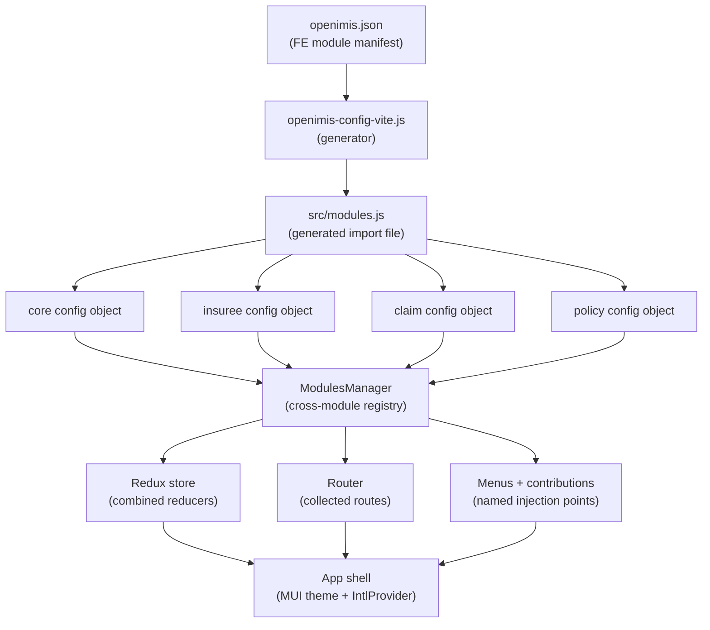
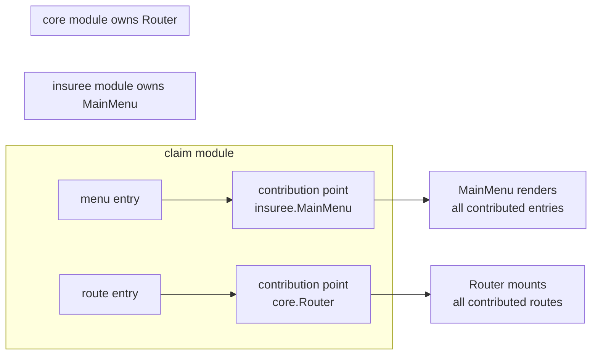
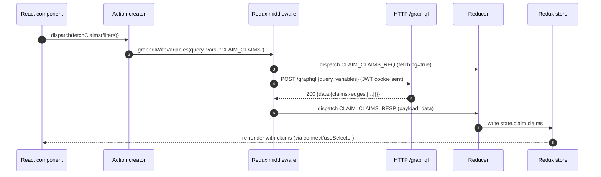
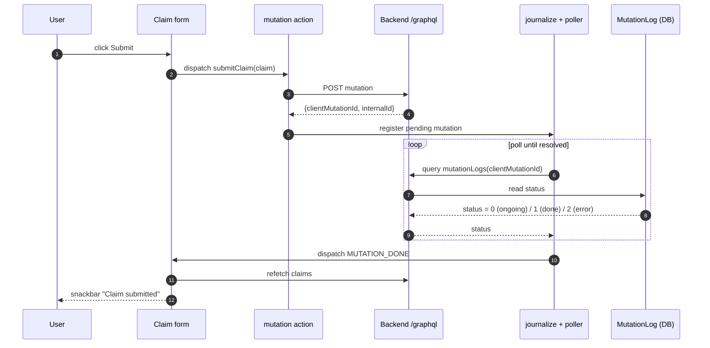
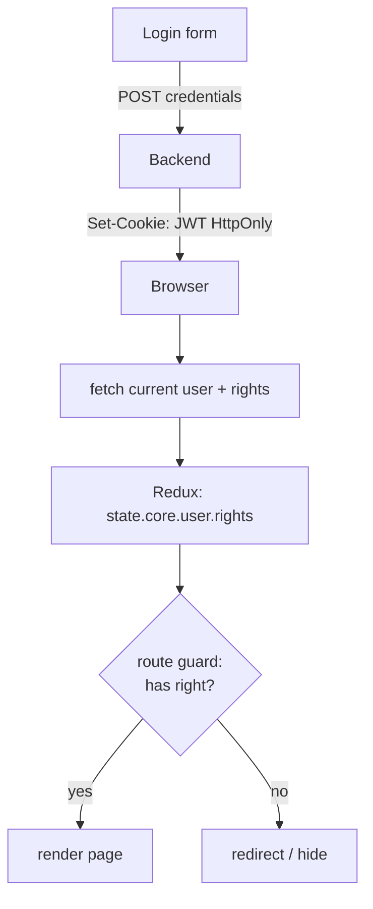
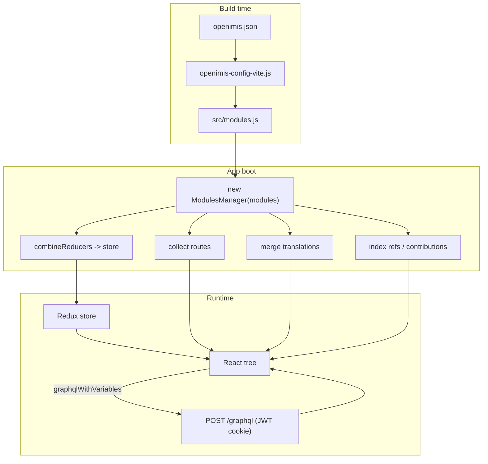

# Frontend Architecture

> **Part 11 — Frontend Architecture**

The openIMIS frontend is a **React single-page application** (SPA) that is assembled from the same modular philosophy as the backend: ~dozens of independently versioned repositories are stitched together at build time into one running app. If you have already read the [Plugin / Module System](../architecture/plugin-system.md) chapter, the shape will feel familiar — but the frontend has its own manifest, its own registry (`ModulesManager`), its own extension seam (`contributions`), and a deliberately **un-Apollo** GraphQL layer built on Redux. This chapter opens all of that up.

## Learning objectives

By the end of this chapter you will be able to:

- Explain how `openimis-fe_js` assembles a single SPA from many `openimis-fe-<name>_js` modules via the `openimis.json` manifest and `openimis-config-vite.js`.
- Describe the **Vite** build (and why the project migrated off Create React App / CRACO).
- Read a module's **config object** and know what each key (`translations`, `reducers`, `refs`, `queries`, `mutations`, `menus`, `routes`, `contributions`) does.
- Trace a GraphQL query and an asynchronous mutation through the **custom Redux GraphQL layer** — `graphql` / `graphqlWithVariables` action creators plus `journalize`/polling — and articulate why openIMIS does **not** use Apollo Client.
- Use the `ModulesManager` registry and `publishedComponents` (`getRef`, `getConf`, `getContribs`) as the frontend extension seam.
- Understand authentication (JWT cookie, integer **rights** in Redux, route guards), theming (MUI), and internationalization (`react-intl`).

## Prerequisites

- [Platform Overview](../getting-started/overview.md) — the monolith-to-modular story.
- [Set Up a Dev Environment](../getting-started/setup.md) — you should be able to boot the frontend locally.
- [Plugin / Module System](../architecture/plugin-system.md) — the backend module pattern this chapter mirrors.
- [The GraphQL Layer](../graphql/index.md) — GraphQL from first principles; this chapter assumes you know what a query and a mutation *are*.
- [Core module](../modules/core.md) — the frontend `ModulesManager` and the Redux GraphQL helpers live in the frontend **core** module.

---

## 1. The mental model: an SPA made of plugins

A conventional React app has one `package.json`, one source tree, one `App.jsx`. openIMIS inverts this. The deployable frontend is the **assembly repo** `openimis-fe_js`; it contains almost no business logic. Instead it contains:

- a **manifest** (`openimis.json`) listing which frontend modules to include and at which version,
- a **generator** (`openimis-config-vite.js`) that reads the manifest and writes a `src/modules.js` file importing every module's config object,
- the **shell**: the root component, the Redux store wiring, the router, the theme provider, and the `<IntlProvider>`.

Each business capability — insurees, policies, claims, locations, products — lives in its own repository named `openimis-fe-<name>_js` and ships a single **config object** as its public contract. The shell never imports a claim component directly; it imports the *claim module's config* and lets the registry do the rest.



!!! info "Did you know?"
    The frontend manifest and the backend manifest share the same filename — `openimis.json` — and the same intent: *declare which modules, at which versions, compose this deployment.* The backend one lives in `openimis-be_py`; the frontend one lives in `openimis-fe_js`. Learning one teaches you the other.

---

## 2. The module manifest and the generated import file

### 2.1 `openimis.json`

The frontend `openimis.json` is a small JSON document that lists the modules to load. Conceptually it looks like this (illustrative):

```json
{
  "modules": [
    { "name": "@openimis/fe-core",    "npm": "@openimis/fe-core@^1.9.0" },
    { "name": "@openimis/fe-insuree",  "npm": "@openimis/fe-insuree@^1.9.0" },
    { "name": "@openimis/fe-policy",   "npm": "@openimis/fe-policy@^1.9.0" },
    { "name": "@openimis/fe-claim",    "npm": "@openimis/fe-claim@^1.9.0" }
  ]
}
```

Each entry names an npm package (published from an `openimis-fe-<name>_js` repository). During local development you replace a published package with a **local, linked** checkout so you can edit a module and see it live (covered in [Developer Workflow](../workflow/index.md)).

### 2.2 `openimis-config-vite.js` → `src/modules.js`

You cannot `import` from a list in a JSON file at runtime — JavaScript bundlers need static `import` statements to tree-shake and resolve dependencies. So openIMIS runs a **code generator** at (pre)build time. `openimis-config-vite.js` reads `openimis.json` and emits a JavaScript module — commonly `src/modules.js` — that imports each module's default config and exports them as an ordered array. Illustrative output:

```javascript
// src/modules.js  — GENERATED, do not edit by hand
import coreModule    from "@openimis/fe-core";
import insureeModule from "@openimis/fe-insuree";
import policyModule  from "@openimis/fe-policy";
import claimModule   from "@openimis/fe-claim";

const modules = [
  coreModule(CFG),
  insureeModule(CFG),
  policyModule(CFG),
  claimModule(CFG),
];

export default modules;
```

The shell imports this generated array once and hands it to the `ModulesManager`.

!!! danger "Common mistake"
    Do not hand-edit `src/modules.js`. It is regenerated from `openimis.json` on every build; your edits will vanish. To add or remove a module, edit `openimis.json` and re-run the generator (it runs automatically as part of the Vite build). If a module you added does not appear, 90% of the time the manifest entry is missing or the package is not installed/linked — not a bug in your component.

---

## 3. The build: Vite (migrated from CRA/CRACO)

Historically the frontend was a **Create React App** (CRA) project, customized with **CRACO** (Create React App Configuration Override) because CRA does not let you touch its webpack config directly — and openIMIS *needs* to, in order to run the module-generation step and alias local module checkouts. That stack was slow to start and heavy to maintain.

The project migrated to **Vite**. The practical differences you will notice:

| Concern | Old (CRA + CRACO) | New (Vite) |
| --- | --- | --- |
| Dev server start | slow (webpack bundles up front) | near-instant (native ESM, on-demand) |
| Hot reload | full webpack HMR | fast HMR |
| Config file | `craco.config.js` | `vite.config.js` |
| Module generation | `openimis-config.js` | `openimis-config-vite.js` |
| Env vars | `REACT_APP_*` (`process.env`) | `VITE_*` (`import.meta.env`) |
| Entry HTML | `public/index.html` | root `index.html` with `<script type=module>` |

!!! warning "Migration footgun"
    When porting an old module or an old how-to, watch for `process.env.REACT_APP_*`. Under Vite those become `import.meta.env.VITE_*`. A module that reads a CRA-style env var will silently get `undefined` and behave as if the value were unset.

??? note "Deep dive: why a generator instead of dynamic import?"
    You *could* imagine loading modules with dynamic `import()` at runtime driven by JSON. openIMIS deliberately does not, for three reasons. First, **static analysis**: a bundler can only tree-shake, code-split, and type-check imports it can see statically. Second, **single bundle determinism**: the set of modules is fixed for a given deployment build, so resolving it at build time yields a reproducible artifact served by Nginx. Third, **shared singletons**: React, MUI, Redux, and the `ModulesManager` must be *one* instance across all modules; a static build with peer dependencies guarantees that, whereas independently loaded runtime bundles risk duplicate React copies (the classic "invalid hook call" disaster).

---

## 4. The module config object

Every frontend module's public API is a single object (often produced by a factory function so it can read global config). Its keys are the extension points the shell knows how to consume. Illustrative, faithful to openIMIS conventions:

```javascript
// openimis-fe-claim_js/src/index.js  (illustrative / simplified)
import messages_en from "./translations/en.json";
import reducer from "./reducer";
import ClaimsPage from "./pages/ClaimsPage";
import ClaimMainMenu from "./menus/ClaimMainMenu";
import { CLAIM_SEARCHER_ROUTE } from "./constants";

const DEFAULT_CONFIG = {
  "translations": [{ key: "en", messages: messages_en }],
  "reducers": [{ key: "claim", reducer }],
  "refs": [
    { key: "claim.ClaimStatusPicker", ref: ClaimStatusPicker },
    { key: "claim.route.claims", ref: CLAIM_SEARCHER_ROUTE },
  ],
  "queries": [{ key: "claim.ClaimsQuery", query: CLAIMS_QUERY }],
  "mutations": [{ key: "claim.submit", mutation: SUBMIT_CLAIM }],
  "menus": [{ key: "insuree.MainMenu", menu: ClaimMainMenu }],
  "core.Router": [
    { path: CLAIM_SEARCHER_ROUTE, component: ClaimsPage },
  ],
  "insuree.MainMenu": [
    { text: "Claims", icon: <ReceiptIcon />, route: "/" + CLAIM_SEARCHER_ROUTE },
  ],
};

export function ClaimModule(cfg) {
  return { ...DEFAULT_CONFIG, ...cfg };
}
```

The keys fall into two families.

**Registry keys** — consumed by `ModulesManager` so *any* module can look them up by name:

| Key | Purpose | Looked up with |
| --- | --- | --- |
| `translations` | `react-intl` message catalogs per locale | (merged into `IntlProvider`) |
| `reducers` | Redux slice reducers, keyed by name | (merged into the store) |
| `refs` | Named, reusable components/values (the FE "published components") | `modulesManager.getRef(key)` |
| `queries` / `mutations` | Reusable GraphQL documents | `modulesManager.getRef(key)` |

**Contribution keys** — *named injection points*. Any string key like `"insuree.MainMenu"`, `"core.Router"`, or `"core.AppBar"` is a **contribution point**. A module *contributes* entries to a point owned by another module (or itself), and the owner renders whatever it collects:

```javascript
// The insuree module owns "insuree.MainMenu"; the claim module contributes to it.
const contribs = modulesManager.getContribs("insuree.MainMenu");
```

This is the frontend analogue of the backend's service signals: a module extends another **without importing it**, purely by agreeing on a string key.



!!! info "Did you know?"
    Because contribution points are just strings, you can add a **new** injection point in your own module simply by calling `modulesManager.getContribs("mymodule.SomePanel")` in a component and documenting the key. Other teams can then extend your UI without you shipping a new release. That is the whole extensibility bet of openIMIS, on the frontend.

---

## 5. The `ModulesManager` registry and `publishedComponents`

`ModulesManager` (provided by the frontend **core** module, `openimis-fe-core_js`) is constructed once from the array of config objects and made available throughout the tree (via context / props). It is the single source of truth for "what did the loaded modules publish?"

Its three most-used methods:

| Method | Answers | Typical use |
| --- | --- | --- |
| `getRef(key)` | "Give me the component/value published under this name." | Reuse another module's `InsureePicker`, or override it. |
| `getConf(module, key, default)` | "What is the effective config value?" | Read module config injected at build/runtime. |
| `getContribs(key)` | "Give me every entry contributed to this point." | Render menus, routes, dashboard tiles. |

**`publishedComponents`** is the pattern behind `refs`: a module *publishes* a component under a stable string name so other modules can reference it by name rather than by import path. This decouples consumers from file locations and — crucially — lets a country-specific module **override** a core component by publishing its own component under the same key later in the module load order.

```jsx
// A claim form reusing the insuree module's published picker (illustrative)
function ClaimHeader({ modulesManager, ...props }) {
  const InsureePicker = modulesManager.getRef("insuree.InsureePicker");
  const readOnly = modulesManager.getConf("fe-claim", "claimForm.readOnly", false);
  return <InsureePicker readOnly={readOnly} {...props} />;
}
```

!!! danger "Common mistake"
    Importing another module directly — `import InsureePicker from "@openimis/fe-insuree/..."` — defeats the entire architecture. It creates a hard compile-time dependency, breaks override-by-key, and can pull a second copy of shared libraries into the bundle. **Always** go through `modulesManager.getRef("insuree.InsureePicker")`. If `getRef` returns `undefined`, the owning module is not in `openimis.json` — that is a manifest problem, not a reason to reach for a direct import.

---

## 6. State management: Redux, one store, many module reducers

openIMIS uses **Redux** (with thunk middleware), not React Context alone and not Apollo's cache. Each module contributes a reducer under a namespaced key; the shell combines them with `combineReducers` into a single store.

```javascript
// Assembled by the shell (illustrative)
import { combineReducers } from "redux";
// modules.js exposes each module's { key, reducer } entries
const rootReducer = combineReducers({
  core: coreReducer,
  insuree: insureeReducer,
  policy: policyReducer,
  claim: claimReducer,   // <- from the claim module's config.reducers
});
```

So `state.claim` is owned entirely by the claim module, `state.insuree` by the insuree module, and so on. Modules read cross-module state by namespace but should mutate only their own slice.

---

## 7. The custom GraphQL layer (NOT Apollo)

This is the single most important thing to understand about the openIMIS frontend, and the one that surprises people coming from a typical React + GraphQL stack.

**There is no Apollo Client.** GraphQL requests are dispatched as **Redux actions** through helpers provided by the frontend core module: `graphql` and `graphqlWithVariables`. They send a `POST` to `/graphql`, and their lifecycle (request → success → error) is expressed as Redux actions that module reducers handle. The GraphQL *response* becomes ordinary Redux *state*.

### 7.1 A query

```javascript
// In a module's action creators (illustrative / simplified)
import { graphqlWithVariables } from "@openimis/fe-core";

export function fetchClaims(modulesManager, filters) {
  const payload = formatPageQuery("claims", filters, CLAIM_PROJECTION);
  return graphqlWithVariables(
    payload,                       // the GraphQL query string / doc
    { /* variables */ },
    "CLAIM_CLAIMS",                // action-type prefix
    { /* extra meta */ },
  );
}
```

`graphqlWithVariables` dispatches three actions in sequence — request, success (with `response.data`), error — using the prefix you pass (`CLAIM_CLAIMS_REQ`, `CLAIM_CLAIMS_RESP`, `CLAIM_CLAIMS_ERR`, by convention). The claim reducer listens for those types and writes the results into `state.claim`.



Compared with Apollo, the mental model is: **GraphQL is just an async data source; Redux is the cache.** You already know Redux; you do not have to learn Apollo's normalized cache, `InMemoryCache` policies, or `useQuery` semantics.

### 7.2 An asynchronous mutation — `journalize` and polling

Backend mutations in openIMIS are **asynchronous** by design (see the `OpenIMISMutation` pattern in [Core module](../modules/core.md)). A mutation does not return the finished business result inline. Instead it:

1. creates a `MutationLog` row (status = *received/ongoing*),
2. returns a `clientMutationId`,
3. does the real work in a backend **service**, updating the `MutationLog` status when done.

The frontend therefore fires the mutation and then **polls** the mutation's status until it resolves. The core helper that manages this is commonly called **`journalize`**: it tracks in-flight mutations in Redux (a "journal" of pending mutations), polls the backend for their `MutationLog` status, and dispatches a completion action when a mutation succeeds or fails. Modules react to that completion by refetching affected data and showing a toast/snackbar.



!!! info "Did you know?"
    Every mutation being logged in `MutationLog` is not just a frontend inconvenience — it is an **audit** feature. Because openIMIS manages public health-insurance money, *who changed what, when* is a first-class requirement. The polling UX is the price of a fully audited, asynchronous mutation pipeline. See the backend [Request Lifecycle](../architecture/request-lifecycle.md) chapter for the server side.

!!! danger "Common mistake"
    Do not treat an openIMIS mutation like a normal GraphQL mutation whose payload contains the created object. The immediate response only confirms the mutation was **accepted**; the actual result and any validation errors surface later via the `MutationLog` status that `journalize` polls. If your UI updates optimistically and never waits for the completion action, it will happily show success for a mutation that the backend later rejected.

??? note "Deep dive: why not Apollo?"
    openIMIS predates Apollo's dominance and, more importantly, its data-flow does not fit Apollo's synchronous request/response cache model. Apollo assumes a mutation returns its result so the cache can update. openIMIS mutations return a *ticket* (`clientMutationId`) and complete out-of-band. Modeling that in Apollo would mean fighting the cache; modeling it in Redux is natural — an in-flight mutation is just a piece of state, and a poller is just a thunk. It also keeps *one* state paradigm (Redux) across the whole app rather than two (Redux for UI + Apollo for server data).

---

## 8. Routing

Routes are **contributed**, not centralized. The core module owns the router and a route contribution point (commonly `"core.Router"`); every module contributes `{ path, component }` entries. At startup the router collects `modulesManager.getContribs("core.Router")` and mounts them. This means adding a page is a *data* change (one contribution) rather than editing a central route table.

Route access is **guarded** by rights (next section): a guarded route checks the logged-in user's integer rights before rendering, redirecting to a "forbidden" or login view otherwise.

---

## 9. Authentication and authorization

- **Login** posts credentials to the backend, which issues a **JWT stored in an `HttpOnly` cookie** (`django-graphql-jwt` on the backend). Because the cookie is `HttpOnly`, JavaScript cannot read the token — every `POST /graphql` simply carries the cookie automatically. This is a security feature: an XSS bug cannot exfiltrate the token.
- After login the app fetches the current user (including their **rights** — the same integer permission codes used on the backend, e.g. `111001`) and stores them in Redux (`state.core` / user).
- **Route guards** and **conditional UI** check those rights: `modulesManager` / helper utilities expose the user's rights so a component can hide a "Submit Claim" button, or a whole route, when the right is absent.



!!! warning "Rights are integers, and they must match the backend"
    Frontend right checks use the **same integer codes** the backend defines in each module's `apps.py` (e.g. `gql_query_claims_perms = [111001]`). If you gate a button on the wrong integer, the UI and the API will disagree — the button shows but the mutation is rejected, or vice-versa. Treat the backend `apps.py` permission codes as the single source of truth.

---

## 10. Component structure, forms, theming, and i18n

### 10.1 Components and forms

A typical business module ships:

- **Pages** (route targets) — e.g. a searcher page and an edit page.
- **Searchers** — filterable, paginated tables backed by a GraphQL query and Redux state; openIMIS core provides reusable searcher scaffolding.
- **Forms** — controlled components that build up a business object in local/Redux state and dispatch a mutation on save. Core provides form primitives, pickers, and input components that modules reuse via `getRef`.

### 10.2 Theming (MUI)

The UI is built on **Material-UI (MUI)**. The shell wraps the app in a `<ThemeProvider>` with an openIMIS theme (palette, typography, spacing). Modules should consume theme tokens (`theme.palette.primary`, `theme.spacing(2)`) rather than hard-coding colors, so a deployment can re-theme centrally.

### 10.3 Internationalization (`react-intl`)

openIMIS is deployed across many countries, so **every user-facing string is translated**. The stack is **`react-intl`**:

- Each module ships message catalogs (`translations/en.json`, `fr.json`, …) and declares them under the `translations` config key.
- The shell merges all catalogs and provides them via `<IntlProvider locale=... messages=...>`.
- Components render text with `<FormattedMessage id="claim.submit" />` or the `formatMessage` API, using **namespaced** ids (`"<module>.<key>"`) to avoid collisions.

!!! danger "Common mistake"
    Hard-coding a visible English string (`<Button>Submit</Button>`) breaks localization for every non-English deployment and will fail review. Always add the string to your module's catalog and render it with a namespaced `react-intl` id.

---

## 11. Putting it together: the assembly, end to end



## Repository references

| Repository | Directory / File | Why it matters |
| --- | --- | --- |
| `openimis-fe_js` | `openimis.json` | The frontend module manifest — which modules, which versions, compose this build. |
| `openimis-fe_js` | `openimis-config-vite.js` | Generator that reads the manifest and writes the module import file (`src/modules.js`). |
| `openimis-fe_js` | `vite.config.js` | Vite build config (replaced `craco.config.js` after the CRA→Vite migration). |
| `openimis-fe_js` | `src/index.js`, `src/App.js` | The shell: store wiring, router, `ThemeProvider`, `IntlProvider`. |
| `openimis-fe-core_js` | `src/helpers/api` (graphql helpers) | `graphql` / `graphqlWithVariables` Redux action creators — the custom GraphQL layer. |
| `openimis-fe-core_js` | `src/ModulesManager.js` | The cross-module registry: `getRef`, `getConf`, `getContribs`. |
| `openimis-fe-core_js` | `src/reducers`, journalize helpers | The mutation journal + polling of `MutationLog` status. |
| `openimis-fe-core_js` | `src/components` (pickers, searchers, forms) | Published components other modules reuse via `getRef`. |
| `openimis-fe-<name>_js` | `src/index.js` | Each module's **config object** — its entire public API. |
| `openimis-fe-<name>_js` | `src/translations/*.json` | `react-intl` message catalogs. |

## Hands-on lab

!!! example "Lab 11.1 — Trace the assembly and add a menu entry"
    1. Clone `openimis-fe_js` and open `openimis.json`. List the modules currently included and note their versions.
    2. Run the dev server and find the **generated** module import file (`src/modules.js`). Confirm it imports exactly the modules from the manifest — then edit it and reload to prove your edit is overwritten.
    3. In any business module, locate the config object in `src/index.js`. Identify one entry under a contribution key (e.g. `"insuree.MainMenu"`).
    4. Add a new menu entry that links to an existing route. Reload and confirm it renders. You have now used a contribution point without touching the owning module.

!!! example "Lab 11.2 — Follow a query into Redux"
    1. Open your browser's **Redux DevTools**. Navigate to a searcher page (e.g. claims).
    2. Watch the dispatched actions: you should see a `_REQ` then a `_RESP` action with the GraphQL `data` payload.
    3. Inspect the store slice the module wrote to (e.g. `state.claim`). Confirm the rendered table reads from exactly that slice.
    4. Now submit an editable form. Watch for the mutation being registered in the journal, the polling queries, and the final completion action. Correlate it with a new row in the backend `MutationLog` (via GraphiQL at `/graphql`).

## Exercises

1. Explain, in two sentences, why `src/modules.js` is generated rather than written by hand.
2. Your new claims dashboard should let *other* modules add tiles. Describe the exact mechanism you would use.
3. A teammate imports `InsureePicker` directly from the insuree package. Give two concrete failure modes this can cause.
4. Why can an XSS bug not steal the openIMIS JWT?

## Knowledge check

??? question "Q1: openIMIS does not use Apollo Client. What does it use for GraphQL, and why does the mutation flow fit it? (click for answer)"
    It uses a **custom Redux layer** — the `graphql` / `graphqlWithVariables` action creators that `POST` to `/graphql` and express request/success/error as Redux actions, with responses stored as Redux state. It fits because openIMIS mutations are **asynchronous**: they return a `clientMutationId` and complete out-of-band via `MutationLog`, which maps cleanly onto Redux (a pending mutation is state; a poller is a thunk) but fights Apollo's synchronous, result-returning cache model.

??? question "Q2: What does `modulesManager.getContribs(\"insuree.MainMenu\")` return, and who put things there? (click for answer)"
    It returns **every entry any loaded module contributed** to the named injection point `"insuree.MainMenu"`. The insuree module *owns* the point and renders whatever it collects; other modules (e.g. claim) contribute menu entries to it via their config object — without importing the insuree module.

??? question "Q3: You added `@openimis/fe-report` to the build but `getRef(\"report.SomeComponent\")` returns undefined. Where do you look first? (click for answer)"
    The **manifest**. Confirm the module is listed in `openimis.json` and that the package is installed/linked so the generator included it in `src/modules.js`. A missing `getRef` almost always means the owning module was never loaded, not that the component is broken.

??? question "Q4: Why is the JWT kept in an HttpOnly cookie instead of localStorage? (click for answer)"
    An `HttpOnly` cookie is not readable by JavaScript, so an XSS vulnerability cannot exfiltrate the token, yet the browser still attaches it automatically to every `POST /graphql`. Storing a token in `localStorage` would expose it to any injected script.

??? question "Q5: After the CRA→Vite migration, a ported module reads `process.env.REACT_APP_API_URL` and gets undefined. Fix? (click for answer)"
    Vite exposes env vars as `import.meta.env.VITE_*`. Rename the variable to `VITE_API_URL` and read it via `import.meta.env.VITE_API_URL`. CRA-style `REACT_APP_*` / `process.env` are not populated under Vite.

## Further reading

- [openimis-fe_js](https://github.com/openimis/openimis-fe_js) — the assembly repo (manifest, generator, shell).
- [openimis-fe-core_js](https://github.com/openimis/openimis-fe-core_js) — `ModulesManager`, the Redux GraphQL helpers, published components.
- [The GraphQL Layer](../graphql/index.md) — GraphQL from first principles, backend and frontend.
- [Plugin / Module System](../architecture/plugin-system.md) — the backend counterpart to this chapter.
- [Extension Guide](../extending/index.md) — build a new frontend module from scratch.
- [React](https://react.dev/), [Redux](https://redux.js.org/), [MUI](https://mui.com/), [react-intl](https://formatjs.io/docs/react-intl/), [Vite](https://vitejs.dev/) official docs.
