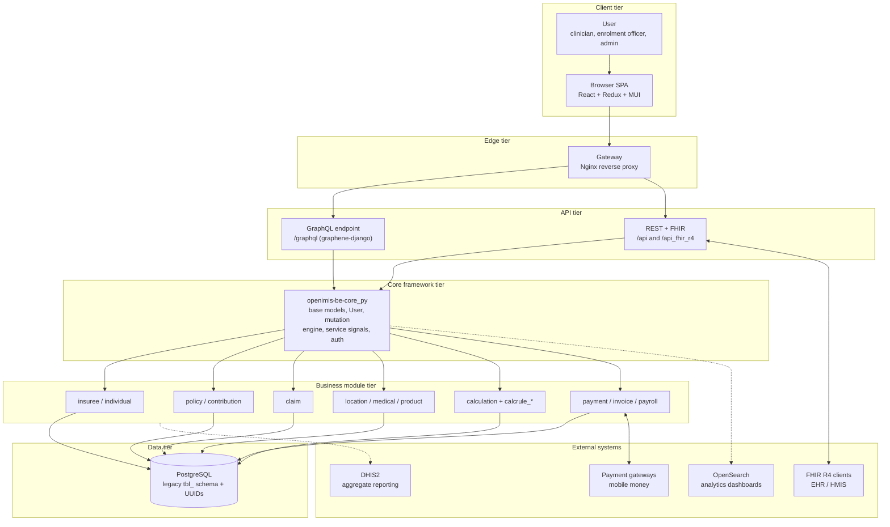
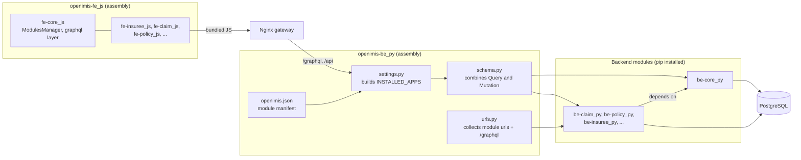
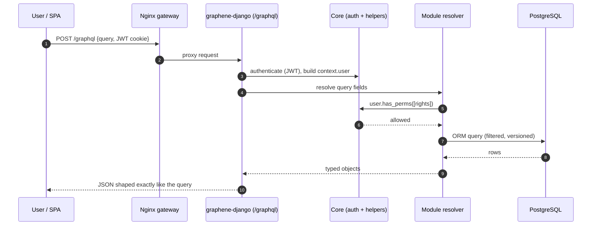
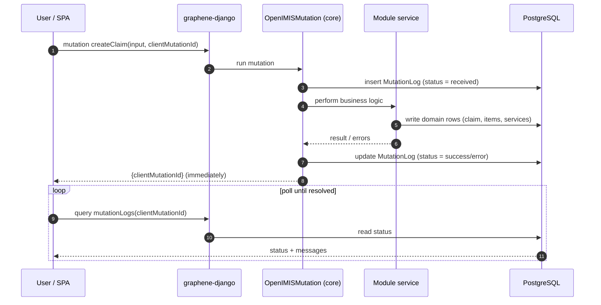

# High-Level Architecture

This chapter is the map you will keep coming back to. It gives you the whole of
openIMIS at one altitude — every major layer, why it exists, and how a request
travels from a clinician's browser down to a PostgreSQL row and back out to an
external FHIR client. Later chapters zoom into each layer; this one keeps them
all in frame at once.

If you have built Django services before, most of the pieces here will feel
familiar in isolation. What is *unfamiliar* — and what this chapter exists to
teach — is the **assembly model**: openIMIS is not one application but a large
set of independently versioned modules that are *assembled* into a running
system by two thin "assembly" repositories. Internalize that idea and the rest
of the platform stops looking sprawling and starts looking deliberate.

## Learning objectives

By the end of this chapter you will be able to:

- Draw the full openIMIS layer stack from memory: **User → Frontend → Gateway →
  API layer → Core framework → Business modules → PostgreSQL → External systems**.
- Explain *why* each layer exists and what would break without it.
- Distinguish an **assembly repository** (`openimis-be_py`, `openimis-fe_js`)
  from a **module repository** (`openimis-be-claim_py`, `openimis-fe-insuree_js`).
- Articulate the "assembly + plugins" mental model and why openIMIS chose it
  over a monolith.
- Trace a GraphQL query and an asynchronous mutation through the stack.
- Know which later chapter to open when you need the next level of detail.

## Prerequisites

- [Platform Overview](../getting-started/overview.md) — what openIMIS is and the
  problem domain (health financing) it serves.
- [Terminology & Glossary Primer](../getting-started/terminology.md) — insuree,
  policy, contribution, claim, product.
- Working knowledge of Django, the Django ORM, PostgreSQL, and Docker. You do
  **not** need to know GraphQL yet — it is introduced where it appears and taught
  in full in [GraphQL](../graphql/index.md).

---

## 1. A one-paragraph mental model

openIMIS is a **modular Django + React platform** for running health-insurance
and social-health-protection schemes. The backend is a Django project that
dynamically assembles ~47 Django apps ("modules") listed in a manifest. The
frontend is a React single-page application that assembles a matching set of
JavaScript modules. Between them sits a GraphQL API (plus REST/FHIR endpoints),
fronted by an Nginx gateway. Underneath sits a single PostgreSQL database whose
schema still carries the fingerprints of the platform's .NET/MSSQL ancestor. On
top and to the side sit external systems: FHIR clients, DHIS2, payment gateways,
and OpenSearch for analytics.

Everything else in this handbook is detail hanging off that sentence.

!!! info "Did you know?"
    openIMIS did not start life modular. Its ancestor, **IMIS**, was a
    monolithic **Microsoft .NET + Microsoft SQL Server** application with heavy
    business logic in stored procedures. The 2018–2019 re-architecture into
    Django + React modules was a deliberate strategic bet: countries needed to
    customize the system without forking a monolith. The modular design *is* the
    product strategy — not an implementation detail.

---

## 2. The layered architecture, end to end

Here is the whole stack. Read it top to bottom: each layer only talks to the
layer directly beneath it (with the deliberate exception of external systems,
which attach at several points).

The rest of this section walks each layer, top to bottom, and answers one
question for each: **what is it, and what would break without it?**

### 2.1 User

The people the system serves are not anonymous web visitors — they are
**role-bearing operators**: enrolment officers registering families,
clinicians submitting claims, scheme administrators configuring products,
finance staff reconciling payments. Every one of them authenticates and carries
a set of integer **rights** (openIMIS's permission codes). The whole security
model — from route guards in React down to `user.has_perms([...])` checks in
GraphQL resolvers — exists to map these humans to what they may see and do. See
[Security](../security/index.md).

### 2.2 Frontend (React + Redux)

The browser runs a **single-page application** built from React. It is assembled
from many `openimis-fe-<name>_js` modules by the `openimis-fe_js` assembly repo.
State lives in **Redux** (with thunks), *not* Apollo — openIMIS talks to GraphQL
through its own Redux action layer. The frontend is responsible for rendering
the UI, holding form state, dispatching GraphQL operations, and — crucially —
**polling** for the result of asynchronous mutations. It is covered in full in
[Frontend Architecture](frontend.md).

*Why it exists:* to give distributed, often low-connectivity users a responsive,
role-aware interface without shipping business logic to the client. The client
renders and orchestrates; it never decides what a claim is worth.

### 2.3 Gateway (Nginx)

A single **reverse proxy** presents one origin to the browser and fans requests
out behind it: static frontend assets, `/graphql`, `/api`, `/api_fhir_r4`. In
the reference `openimis-dist_dkr` deployment this is an Nginx container.

*Why it exists:* the browser must see one host. Without a gateway you would face
cross-origin (CORS) headaches, cookie-scoping problems (the JWT lives in an
**HttpOnly cookie**, which is far easier to manage on a single origin), and no
single place to terminate TLS or apply rate limits. The gateway is the seam
between "the internet" and "the application."

### 2.4 API layer (GraphQL + REST/FHIR)

This is the layer most likely to be new to you, so it gets extra attention.

- **`/graphql`** is the primary API. It is a single endpoint that accepts
  *queries* (reads) and *mutations* (writes) expressed in the GraphQL language,
  served by **graphene-django**. Unlike REST, where each resource has its own URL
  and the server dictates the response shape, GraphQL exposes one typed graph and
  lets the client ask for exactly the fields it needs. openIMIS builds one giant
  root `Query` and root `Mutation` by combining every module's schema (more on
  this in §4).
- **`/api` and `/api_fhir_r4`** are conventional REST endpoints (Django views /
  DRF) used for reports, tooling, and the **FHIR R4** integration surface that
  external health systems speak.

*Why two styles?* GraphQL is superb for the rich, deeply nested,
client-driven screens of the SPA. FHIR/REST is a fixed, standardized contract
that the outside world already knows how to speak. Different consumers, different
tools. See [Request Lifecycle](request-lifecycle.md) and
[GraphQL](../graphql/index.md).

!!! info "Did you know?"
    Authentication in openIMIS is done with **`django-graphql-jwt`**, but the
    token is not handed to JavaScript. It is set as an **HttpOnly cookie**, so
    the SPA code can never read it and cannot leak it via XSS. There is also
    OpenID Connect / OAuth2 support for plugging in external identity providers.

### 2.5 Core framework (`openimis-be-core_py`)

Every business module stands on **core**. Core is not a business feature; it is
the *framework within the framework*. It provides:

- **Base models** — `HistoryModel`, `HistoryBusinessModel`, `VersionedModel`
  (with `validity_from` / `validity_to` temporal columns and `legacy_id`),
  `UUIDModel`, and a `json_ext` JSON field for country-specific extension without
  schema changes.
- **The custom `User` model** and its identity types (`InteractiveUser`,
  `TechnicalUser`, `Officer`), plus the integer **rights** permission system.
- **The GraphQL mutation engine** (`OpenIMISMutation`) — the asynchronous,
  audited mutation pattern that every module reuses.
- **Service signals** (`register_service_signal` / `bind_service_signal`) — the
  server-side extension seam that lets one module hook another's business logic
  without importing it.
- Graphene helpers (`ExtendedConnection`, `OrderedDjangoFilterConnectionField`),
  the configuration overlay (`ModuleConfiguration`), scheduling (APScheduler),
  audit, and utilities.

*Why it exists:* to make 40+ modules *feel like one product*. History,
versioning, permissions, auditing, config, and the mutation lifecycle are solved
**once** in core and inherited everywhere. Read the whole story in
[Backend Deep Dive](backend.md).

### 2.6 Business modules

The actual domain lives here, one concern per module: `insuree`/`individual`
(beneficiaries), `location` / `medical` / `product` (reference data),
`policy` (coverage), `contribution` (premiums), `claim` (service delivery),
`calculation` + `calcrule_*` (pricing/valuation rules), `payment` / `invoice` /
`payroll` (money out). Each is an independent Django app in its own repository,
depending on core and on a handful of sibling modules. The dependency ordering
is the subject of [Repository Map](repository-map.md).

*Why decomposed?* Because a scheme in Nepal and a scheme in Cameroon share
maybe 80% of their logic and diverge on the other 20%. Modules let a country
swap or extend the 20% (a new calculation rule, an extra field via `json_ext`, a
replacement component) without touching — or re-testing, or re-forking — the 80%.

### 2.7 PostgreSQL

One relational database holds it all. Its schema is unusually shaped for a Django
app: many tables keep legacy **`tbl` prefixes** and **camelCase columns**, and
rows carry both legacy integer keys *and* UUIDs. That is the visible scar tissue
of the MSSQL-to-PostgreSQL migration from the IMIS era. See
[Database](../database/index.md).

*Why one database?* Insurance is inherently relational and transactional — a
claim references a policy references an insuree references a product, and money
must reconcile. A single ACID database keeps those invariants honest. openIMIS is
a modular *codebase*, not a distributed *data* architecture.

### 2.8 External systems

- **FHIR R4 clients** (EHRs, national HMIS) exchange data through
  `/api_fhir_r4/`.
- **DHIS2** receives aggregate indicators via the `dhis2_etl` module.
- **Payment gateways** (mobile money, etc.) connect through the payment/invoice
  modules.
- **OpenSearch** powers analytical dashboards via `opensearch_reports`.

*Why external?* openIMIS runs inside a national digital-health ecosystem. It is a
good citizen: it speaks the standards (FHIR), feeds the national dashboards
(DHIS2), and moves real money (gateways) rather than trying to be all of those
things itself.

---

## 3. The component view

The layer diagram shows *tiers*. This component diagram shows the **concrete
software artifacts** and who imports/serves whom — useful when you are staring at
a `docker ps` list wondering which container does what.

Notice the symmetry: **each side has one thin assembler and many fat modules.**
The backend assembler (`openimis-be_py`) reads a manifest and wires modules into
one Django project. The frontend assembler (`openimis-fe_js`) reads *its own*
manifest and wires modules into one React bundle. The two assemblers never share
code — they mirror each other in spirit.

---

## 4. Data flow: two journeys through the stack

Diagrams of tiers are static. To really understand openIMIS you must watch data
*move*. Here are the two canonical journeys. (The full treatment, with resolver
internals and JWT handling, is in [Request Lifecycle](request-lifecycle.md).)

### 4.1 A read (GraphQL query)

The key openIMIS-specific beats: the JWT arrives in a cookie and is turned into
`context.user` by core; permission checks use **integer rights**; and ORM queries
usually respect **temporal validity** (`validity_to IS NULL` for "current"
rows), because core's base models are versioned.

### 4.2 A write (asynchronous mutation)

This is the pattern that surprises Django engineers most. openIMIS mutations are
**asynchronous and audited**: the mutation does not return the created object. It
records a job, kicks off the work, and hands back a `clientMutationId`. The
client then **polls** for the outcome.

!!! info "Did you know?"
    Because **every** mutation is funneled through `OpenIMISMutation`, openIMIS
    gets a complete, uniform **audit trail** for free: who changed what, when,
    and whether it succeeded — one `MutationLog` row per attempt. In a system
    handling public health funds, that audit property is not a nice-to-have; it
    is a compliance requirement satisfied by architecture.

!!! danger "Common mistake"
    Treating a mutation response as the finished result. The mutation returns a
    `clientMutationId`, **not** your new claim. If your integration code assumes
    synchronous CRUD semantics, it will "succeed" while the actual work later
    fails silently in the `MutationLog`. Always poll the mutation status. This is
    the single most common integration bug for engineers new to openIMIS.

---

## 5. The assembly + plugins mental model

Now the central idea, stated plainly. Two kinds of repository exist, and keeping
them straight is the difference between understanding openIMIS and being
perpetually confused by it.

| | **Assembly repos** | **Module repos** |
|---|---|---|
| Examples | `openimis-be_py`, `openimis-fe_js` | `openimis-be-claim_py`, `openimis-fe-insuree_js` |
| What it is | The deployable **project** that wires modules together | An installable **plugin** that provides one concern |
| Contains business logic? | Almost none | Yes — this is where the domain lives |
| Count | Two (one BE, one FE) | Dozens (~47 backend modules alone) |
| Key artifact | `openimis.json` manifest + `settings.py`/`schema.py`/`urls.py` | `apps.py` (`AppConfig`), `models.py`, `schema.py`, `services.py` |
| Versioned | As a deployment | Independently, per module |
| You edit it to… | Choose *which* modules and *which* versions run | Change *what a module does* |

Think of it like a Linux distribution. The **kernel + a package manifest** is
the assembly; the **packages** are the modules. `openimis-be_py` is analogous to
a distro's package list plus its init system: it decides what is installed and
brings it up in the right order. It intentionally holds no domain logic of its
own.

### How assembly actually happens (backend)

1. `openimis.json` lists every module and where to get it (pip/git). A script
   renders it to `modules-requirements.txt`; pip installs each module as a Python
   package (`core`, `claim`, `policy`, …). For development you install modules
   editable: `pip install -e ../openimis-be-core_py/`.
2. `openimis/settings.py` reads the loaded module list and builds
   **`INSTALLED_APPS`** dynamically — you never hand-edit the app list.
3. `openimis/schema.py` imports each module's `schema.Query` and
   `schema.Mutation` and fuses them into one root `Query` / `Mutation` using
   **Python multiple inheritance**. One endpoint, every module's fields.
4. `openimis/urls.py` collects each module's `urls.py` patterns and mounts the
   `/graphql` endpoint.

### How assembly actually happens (frontend)

The frontend mirrors this. `openimis.json` is the FE manifest;
`openimis-config-vite.js` generates `src/modules.js`; each `openimis-fe-<name>_js`
module exports a **config object** with keys like `reducers`, `queries`,
`mutations`, `routes`, `menus`, and — the extension seam — **`contributions`**,
named slots into which any module can inject a component. The **`ModulesManager`**
from fe-core is the runtime registry (`getRef`, `getConf`, `getContribs`).

The deep mechanics of both seams — backend service signals and frontend
contributions — live in [Plugin / Module System](plugin-system.md).

??? note "Deep dive: why multiple inheritance for the schema?"
    Combining N module `Query` classes into one root could be done many ways:
    schema stitching, namespacing, a registry. openIMIS chose the bluntest tool
    Python offers — **multiple inheritance** — so that `class Query(ClaimQuery,
    PolicyQuery, InsureeQuery, ...)` yields a single class exposing the union of
    every module's fields and resolvers. It is simple and requires zero glue
    code per module. The cost is that field-name collisions across modules are
    real and must be avoided by convention (module-prefixed field names), and the
    Method Resolution Order matters if two modules define a same-named resolver.
    It is a pragmatic choice that trades a little namespace discipline for a lot
    of assembly simplicity — very much in keeping with openIMIS's overall
    philosophy.

!!! tip
    When you get lost in openIMIS, ask yourself: *"Am I looking at an assembler
    or a module?"* If a file lives under `openimis/` in `openimis-be_py`, it is
    wiring. If it lives under a package name like `claim/`, it is domain. That
    single question resolves most "where does this belong?" confusion.

---

## 6. Why this architecture (the design rationale)

It is worth pausing on *why* openIMIS looks the way it does, because the reasons
recur throughout the handbook:

- **Country customization without forking.** The founding requirement. Modules +
  `json_ext` + `ModuleConfiguration` + calculation rules let a deployment diverge
  in controlled seams instead of forking core. This one requirement explains
  90% of the architecture.
- **Independent versioning.** Each module ships on its own cadence. A claim-logic
  fix does not force a policy-module release.
- **Auditability by construction.** The uniform async-mutation engine gives every
  write an audit record — essential for public funds.
- **Standards at the edges, freedom at the center.** FHIR/REST present a stable
  external contract; GraphQL gives internal screens flexibility; the core is free
  to evolve behind both.
- **Legacy respected, not worshiped.** The `tbl`-prefixed schema and dual
  integer/UUID keys are a bridge from IMIS, kept deliberately so existing
  deployments and data could migrate.

!!! quote
    A good way to hold openIMIS in your head: *"A thin assembler brings up a
    fleet of versioned plugins, all standing on a shared core, over one
    relational database, behind one gateway, speaking GraphQL inward and FHIR
    outward."*

---

## Repository references

| Repository | Directory / File | Why it matters |
|---|---|---|
| `openimis-be_py` | `openimis.json` | The backend **module manifest** (~47 modules); the source of truth for what gets assembled. |
| `openimis-be_py` | `openimis/settings.py` | Builds `INSTALLED_APPS` dynamically from the loaded modules. |
| `openimis-be_py` | `openimis/schema.py` | Fuses every module's `Query`/`Mutation` into one GraphQL root via multiple inheritance. |
| `openimis-be_py` | `openimis/urls.py` | Collects module URL patterns and mounts `/graphql`. |
| `openimis-be_py` | `script/` | Container entrypoints: run migrations and load module configs at startup. |
| `openimis-be-core_py` | `core/apps.py`, `core/models.py` | The framework layer: `AppConfig`, base/versioned models, `User`, mutation engine, service signals. |
| `openimis-fe_js` | `openimis.json`, `openimis-config-vite.js` | Frontend manifest and the generator that emits `src/modules.js`. |
| `openimis-fe-core_js` | `ModulesManager` | Cross-module runtime registry and the custom GraphQL/Redux layer. |
| `openimis-dist_dkr` | `docker-compose.*`, `.env` | The reference deployment: `db`, `backend`, `frontend`, Nginx gateway, optional OpenSearch. |
| `openimis-be-api_fhir_r4_py` | `api_fhir_r4/` | The external FHIR R4 surface under `/api_fhir_r4/`. |

---

## Hands-on lab

**Goal:** confirm the assembly model with your own eyes, no code changes.

1. Stand up the reference stack from
   [Set Up a Dev Environment](../getting-started/setup.md) (Docker Compose).
2. Run `docker ps` and match each running container to a **tier** in the layer
   diagram of §2. Which container is the gateway? Which runs Django? Where is
   PostgreSQL?
3. Open `openimis.json` in `openimis-be_py`. Count the modules. Pick three and
   note their pip/git source.
4. Hit the API: open `/graphql` in the browser (the GraphiQL explorer) and run a
   trivial query. Watch the Network tab — confirm it is a single `POST` to one
   endpoint, and that a JWT **cookie** (not a header your JS can read) rides
   along.
5. Now trigger any create action in the UI and watch the Network tab: find the
   mutation returning a `clientMutationId`, then the follow-up **poll** queries
   reading its status. You have just observed §4.2 live.

**Deliverable:** a short note mapping every container to a tier, plus the
`clientMutationId` you captured in step 5.

## Exercises

1. In one sentence each, state what would break if you deleted (a) the gateway,
   (b) the core module, (c) the `openimis.json` manifest.
2. A colleague says "let's add the new claim-scoring feature directly in
   `openimis-be_py`." Explain, using the assembly/module distinction, why that is
   the wrong repository and where it belongs.
3. Sketch (on paper) the query data-flow diagram from memory, then check it
   against §4.1. Which beats did you forget? Those are the ones to re-read.

## Knowledge check

??? question "Q1: What is the difference between an assembly repo and a module repo? (click for answer)"
    An **assembly repo** (`openimis-be_py`, `openimis-fe_js`) is the deployable
    project that *wires modules together* using a manifest (`openimis.json`) and
    thin glue (`settings.py`, `schema.py`, `urls.py` on the backend). It holds
    almost no business logic. A **module repo** (e.g. `openimis-be-claim_py`) is
    an installable plugin that provides one domain concern and *is* where the
    business logic lives. There are two assemblers and dozens of modules.

??? question "Q2: Why does openIMIS use both GraphQL and REST/FHIR? (click for answer)"
    They serve different consumers. **GraphQL (`/graphql`)** is the primary,
    client-driven API for the rich SPA screens — the client asks for exactly the
    fields it needs from one typed graph. **REST/FHIR (`/api`, `/api_fhir_r4`)**
    is a fixed, standardized contract for the outside world (EHRs, national
    HMIS), which already knows how to speak FHIR. Flexibility inward,
    standardized stability outward.

??? question "Q3: Why does a mutation return a clientMutationId instead of the created object? (click for answer)"
    Because openIMIS mutations are **asynchronous and audited**. The
    `OpenIMISMutation` engine writes a `MutationLog`, runs the work in a service,
    and hands back a `clientMutationId` immediately; the client then **polls**
    for status. This yields a uniform audit trail for every write — critical when
    handling public health funds — at the cost of clients needing to poll rather
    than assume synchronous CRUD.

??? question "Q4: What is the role of the Nginx gateway, and why not let the browser hit Django directly? (click for answer)"
    The gateway presents **one origin** to the browser and fans requests to
    static assets, `/graphql`, `/api`, and `/api_fhir_r4`. A single origin avoids
    CORS problems, keeps the **HttpOnly JWT cookie** correctly scoped, and gives
    one place to terminate TLS and apply rate limiting. Hitting Django directly
    would reintroduce all of those cross-origin and security concerns.

??? question "Q5: In one line, what is the 'assembly + plugins' model? (click for answer)"
    A thin assembler reads a module manifest and brings up a fleet of
    independently versioned plugin modules — all standing on a shared **core**,
    over **one PostgreSQL** database, behind **one gateway**, speaking GraphQL
    inward and FHIR outward. It is the Linux-distribution pattern applied to a
    health-financing platform.

## Further reading

- [Backend Deep Dive](backend.md) — how `openimis-be_py` builds `INSTALLED_APPS`
  and the core framework in detail.
- [Plugin / Module System](plugin-system.md) — service signals and frontend
  contributions, the two extension seams.
- [Request Lifecycle](request-lifecycle.md) — the full query and async-mutation
  journey with resolver internals.
- [Frontend Architecture](frontend.md) — the React/Redux assembly and
  `ModulesManager`.
- [Repository Map](repository-map.md) — every repo, its purpose, and the
  dependency graph.
- The [openIMIS wiki](https://github.com/openimis) and the
  [official site](https://openimis.org) for governance and roadmap.
- [GraphQL](../graphql/index.md) if the query/mutation language is new to you.
