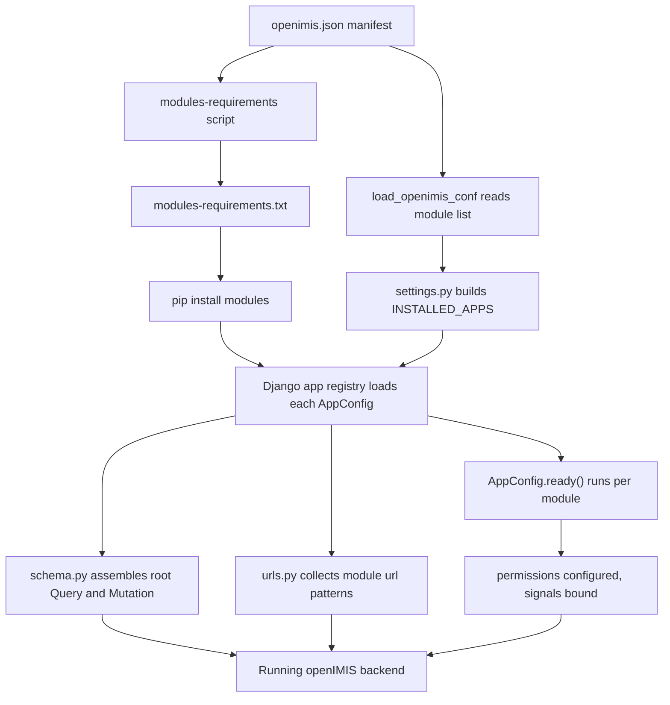
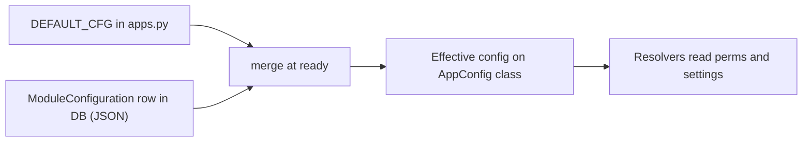
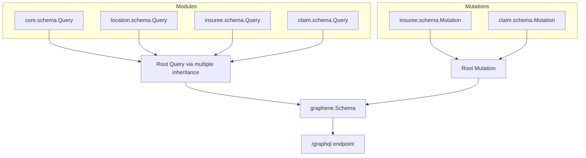
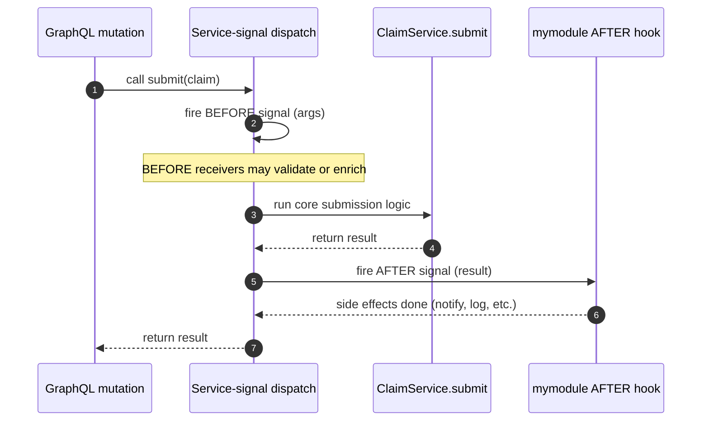

# Plugin / Module Architecture

The modular plugin system is the single most important idea in openIMIS. Nearly
every other design decision — the dynamic settings, the assembled GraphQL schema,
the integer permission codes, the service signals — exists to make **independently
versioned modules** compose into one running application. If you understand this
chapter, the rest of the backend stops looking like magic.

This is PART 5 of the architecture track and it is deliberately long. Read it with
a checkout of the assembly repo (`openimis-be_py`) and the core module
(`openimis-be-core_py`) open beside you.

## Learning objectives

By the end of this chapter you will be able to:

- Explain how openIMIS turns a JSON **manifest** into a set of installed Django
  apps at container start.
- Describe how a module **registers itself** through an `AppConfig` subclass,
  its `DEFAULT_CFG`, and the `ready()` hook.
- Trace how ~47 independent modules combine their GraphQL `Query` and `Mutation`
  classes into one root schema using Python **multiple inheritance**.
- Add integer **permission rights** in a module's `apps.py` and understand where
  they are enforced.
- Register module **URLs** and understand how they are collected centrally.
- Choose between **Django ORM signals** and openIMIS **service signals**, and
  wire a before/after hook across modules **without a hard import**.
- Explain the DB-backed **`ModuleConfiguration`** overlay over `DEFAULT_CFG`.
- Install a brand-new module end to end.

## Prerequisites

- [Backend Deep Dive](../architecture/backend.md) — Django project layout, the
  core module's base models and helpers.
- [Architecture Overview](../architecture/overview.md) — the macro picture of
  backend, frontend, gateway.
- [GraphQL in openIMIS](../graphql/index.md) — how Graphene builds a schema (this
  chapter assembles what that chapter defines).
- [Core module](../modules/core.md) — `AppConfig` conventions, `OpenIMISMutation`,
  service signals live here.
- Comfort with Python packaging (`pip install -e`), Django `AppConfig`, and
  Django migrations.

---

## 1. Why a plugin architecture at all?

openIMIS began life as **IMIS**, a monolithic .NET + Microsoft SQL Server
application. A single codebase served every country, so any national requirement
— a different premium formula, an extra beneficiary attribute, a local payment
gateway — meant patching the shared core or maintaining a private fork. Forks
drift. Drifted forks cannot receive upstream security fixes. For a
**Digital Public Good** deployed across many countries, that is an existential
problem.

The 2018–2019 re-architecture answered it with a plugin model borrowed from the
Django ecosystem and pushed much further:

- The deployable unit is an **assembly project** (`openimis-be_py`) that contains
  almost no business logic. It is a thin Django project whose job is to *discover,
  install, and wire together* modules.
- Each **module** is a separately versioned Git repository and pip package
  (`openimis-be-<name>_py`, importable as `<name>`). A country deployment picks a
  set of module versions the way you pin dependencies in `requirements.txt`.
- Modules extend each other through **named seams** — schema inheritance,
  permission codes, service signals, configuration overlays — rather than by
  importing each other's internals.

The payoff: a country can ship a `calcrule_*` module implementing its own premium
math, or a payment-gateway module for its local mobile-money provider, **without
touching core** and without forking. Upstream core keeps flowing in.

!!! info "Did you know?"
    The assembly project is intentionally "dumb." Open `openimis-be_py` and you
    will find manifest files, a settings module that builds `INSTALLED_APPS` from
    a list, a `schema.py` that stitches modules together, and startup scripts —
    but the actual domain code (insurees, claims, policies) lives entirely in the
    module repositories. The project is the *frame*; modules are the *pictures*.

---

## 2. The boot sequence: from manifest to running apps

At the highest level, four artifacts drive module loading. Follow them in order.

| Step | Artifact | Repo / file | Role |
| --- | --- | --- | --- |
| 1 | Module manifest | `openimis-be_py` → `openimis.json` | Declares which modules (and pip/git sources) make up this deployment. |
| 2 | Requirements file | generated `modules-requirements.txt` | A script converts the manifest into pip-installable lines. |
| 3 | Installed packages | Python environment | `pip install -r modules-requirements.txt` puts each `<name>` package on the path. |
| 4 | Dynamic app list | `openimis/settings.py` → `INSTALLED_APPS` | Settings reads the same module list and appends each module's app. |

### 2.1 The manifest — `openimis.json`

`openimis.json` is the source of truth for *what this deployment is made of*. It
lists every module and where to get it. Simplified and illustrative:

```json
{
  "modules": [
    { "name": "core",     "pip": "openimis-be-core" },
    { "name": "location", "pip": "openimis-be-location" },
    { "name": "insuree",  "pip": "openimis-be-insuree" },
    { "name": "policy",   "pip": "openimis-be-policy" },
    { "name": "claim",    "pip": "openimis-be-claim" },
    { "name": "calculation", "pip": "openimis-be-calculation" }
  ]
}
```

*(illustrative — see the real, ~47-entry `openimis-be_py/openimis.json` for the
exact schema, which also carries version pins and git sources.)*

Order matters: `core` is listed and loaded first because every other module
depends on it. Reference-data modules (`location`, `medical`, `product`) come
before the modules that use them (`insuree`, `policy`, `claim`).

### 2.2 Manifest → `modules-requirements.txt` → pip

A helper script reads `openimis.json` and emits a plain
`modules-requirements.txt` — one pip requirement per module — which the container
image installs. Conceptually:

```bash
# (1)!  Generate a pip requirements file from the manifest
python modules-requirements.py openimis.json > modules-requirements.txt

# (2)!  Install every module into the environment
pip install -r modules-requirements.txt
```

1. The script walks the manifest's `modules` array and turns each entry into a
   pip line (a PyPI version or a `git+https://…@<ref>` URL).
2. After this, each module's package (`core`, `claim`, …) is importable. In
   production these are pinned releases; nothing is installed that the manifest
   did not name.

For **local development** you swap the pinned installs for **editable installs**
so your working copy is the running code:

```bash
pip install -e ../openimis-be-core_py/
pip install -e ../openimis-be-claim_py/
```

Now editing `../openimis-be-claim_py/claim/services.py` changes the running app
on the next reload — no reinstall.

!!! danger "Common mistake"
    Adding a module to `openimis.json` is **not** enough on its own, and neither
    is `pip install`-ing a package that the manifest never mentions. The manifest
    is what `settings.py` reads to build `INSTALLED_APPS`. If the module is
    installed but not in the loaded module list, Django never registers its app —
    no models, no migrations, no schema, no URLs. Keep the manifest and the
    environment in sync.

### 2.3 The manifest → `INSTALLED_APPS`

This is the hinge of the whole system. Instead of a hand-written
`INSTALLED_APPS`, `openimis/settings.py` loads the module list (via
`openimisconf/load_openimis_conf.py`) and **appends each module's app config**
to the standard Django + third-party apps. Simplified:

```python
# openimis/settings.py  (simplified / illustrative)
from openimisconf import load_openimis_conf

OPENIMIS_CONF = load_openimis_conf()          # (1)!

INSTALLED_APPS = [
    "django.contrib.admin",
    "django.contrib.auth",
    "django.contrib.contenttypes",
    # ... standard Django ...
    "graphene_django",                          # (2)!
    "rest_framework",
    "rules",
]

# (3)!  Append every module named in the manifest, in order.
for module in OPENIMIS_CONF["modules"]:
    INSTALLED_APPS.append(module["name"])
```

1. `load_openimis_conf()` reads the manifest / merged configuration so settings
   and the schema assembler agree on one ordered module list.
2. Graphene, DRF, and `rules` are configured here too — Graphene points at the
   assembled root schema in `openimis/schema.py`.
3. Because this is ordinary Python running at import time, the app list is truly
   **dynamic**: change the manifest, restart, and the set of installed apps
   changes. No core code edit required.



---

## 3. How a module registers itself: the `AppConfig`

Once a module's package is installed **and** its name is in `INSTALLED_APPS`,
Django imports the module's `apps.py` and instantiates its `AppConfig` subclass.
This is the module's front door. By openIMIS convention every module ships one,
named `<Name>Config`, carrying three things:

1. A **`DEFAULT_CFG`** dictionary — the module's built-in configuration defaults.
2. Attributes that hold **permission rights** (integer codes), populated from
   config.
3. A **`ready()`** method — the lifecycle hook where the module wires itself in:
   applies its runtime configuration, publishes its permissions, and binds
   signals.

Here is a faithful-but-minimal `apps.py`:

```python
# mymodule/apps.py  (illustrative / simplified)
from django.apps import AppConfig

MODULE_NAME = "mymodule"

DEFAULT_CFG = {
    # (1)!  Integer permission rights this module defines.
    "gql_query_things_perms": [160001],
    "gql_mutation_create_thing_perms": [160002],
    "gql_mutation_update_thing_perms": [160003],
    # (2)!  Behavioural defaults an operator may override.
    "default_validity_days": 365,
}


class MyModuleConfig(AppConfig):
    name = MODULE_NAME                          # (3)!
    default_auto_field = "django.db.models.BigAutoField"

    # Attributes filled from configuration at startup.
    gql_query_things_perms = []
    gql_mutation_create_thing_perms = []
    gql_mutation_update_thing_perms = []
    default_validity_days = 365

    def _configure_permissions(self, cfg):      # (4)!
        MyModuleConfig.gql_query_things_perms = cfg["gql_query_things_perms"]
        MyModuleConfig.gql_mutation_create_thing_perms = \
            cfg["gql_mutation_create_thing_perms"]
        MyModuleConfig.gql_mutation_update_thing_perms = \
            cfg["gql_mutation_update_thing_perms"]

    def ready(self):                            # (5)!
        from core.models import ModuleConfiguration
        cfg = ModuleConfiguration.get_or_default(MODULE_NAME, DEFAULT_CFG)
        self._configure_permissions(cfg)
        self.default_validity_days = cfg["default_validity_days"]
        # Bind signals here (see section 7) so they register exactly once.
        from . import signals  # noqa: F401
```

1. Permissions are plain integers grouped by the operation they guard. openIMIS
   uses numeric **rights**, not Django's string `app_label.codename` permissions.
2. `DEFAULT_CFG` also holds non-permission behaviour so a deployment can retune
   the module from the database without a code change.
3. `name` must equal the importable package name — the same string that appears
   in the manifest and in `INSTALLED_APPS`.
4. `_configure_permissions` copies the (possibly DB-overridden) values onto the
   config class so the rest of the module reads them as
   `MyModuleConfig.gql_query_things_perms`.
5. `ready()` runs **once**, after the app registry is populated. It is the safe
   place to import models and bind signals — never do that at module top level,
   or you risk `AppRegistryNotReady`.

!!! info "Did you know?"
    Because permission attributes live on the `AppConfig` *class*, resolvers read
    them as `MyModuleConfig.gql_query_things_perms`. That indirection is what lets
    an operator remap which right guards an operation from the database — the code
    never hard-codes the integer at the call site, it reads the class attribute
    that `ready()` populated.

The real core `AppConfig` (`class CoreConfig(AppConfig)` in
`openimis-be-core_py/core/apps.py`) does exactly this at a larger scale, and it is
the best reference to copy from.

---

## 4. Configuration: `DEFAULT_CFG` overlaid by `ModuleConfiguration`

openIMIS separates **code defaults** from **deployment configuration**:

- `DEFAULT_CFG` in a module's `apps.py` is the fallback baked into the code.
- `ModuleConfiguration` (a model in **core**) stores a per-module JSON blob in the
  database. At startup, `ready()` fetches it and **overlays** it on
  `DEFAULT_CFG` — DB values win, missing keys fall back to the default.



This is why a country can change which integer right guards "create claim," or
change a default validity period, or toggle a feature — by editing a database row
(loaded at container start from JSON config files under `openimisconf`/module
config), **not** by patching Python. It is the operational half of the plugin
promise: not just "add modules without forking," but "reconfigure modules without
redeploying code."

See [Configuration](../configuration/index.md) for the full config-loading story
and where the JSON lives.

---

## 5. Assembling the GraphQL schema by multiple inheritance

Each module defines its own slice of the API in its `schema.py`: a
`Query` class (read fields + resolvers) and often a `Mutation` class (write
operations). None of them is the *whole* API. The assembly project's
`openimis/schema.py` combines them into **one root `Query` and one root
`Mutation`** using Python multiple inheritance, then hands that root to Graphene.

Think of each module's `Query` as a **mixin** contributing a few fields. The root
`Query` inherits from all of them, so it exposes the **union** of every module's
fields. Simplified:

```python
# openimis/schema.py  (simplified / illustrative)
import graphene
from core import schema as core_schema
from location import schema as location_schema
from insuree import schema as insuree_schema
from claim import schema as claim_schema


class Query(
    core_schema.Query,          # (1)!
    location_schema.Query,
    insuree_schema.Query,
    claim_schema.Query,
    graphene.ObjectType,        # (2)!
):
    pass


class Mutation(
    core_schema.Mutation,       # (3)!
    insuree_schema.Mutation,
    claim_schema.Mutation,
    graphene.ObjectType,
):
    pass


schema = graphene.Schema(query=Query, mutation=Mutation)  # (4)!
```

1. Each module's `Query` mixin brings its own fields (e.g. `claim_schema.Query`
   contributes a `claims` field and its `resolve_claims`).
2. `graphene.ObjectType` must be **last** in the MRO so the mixins' fields are
   collected before Graphene's metaclass finalizes the type.
3. The same pattern for mutations: the root `Mutation` inherits every module's
   write operations.
4. Graphene walks the combined class, gathers all inherited fields, and builds a
   single executable schema exposed at `/graphql`.

In the real assembly this list is longer and is often built by iterating the
loaded module list rather than by a hand-written class — but the mechanism is the
same: **many module mixins → one root type**.



??? note "Deep dive: how multiple inheritance actually merges the fields"
    Graphene declares fields as **class attributes**. When Python builds the root
    `Query`, its namespace is the union of the base classes' namespaces resolved
    along the **Method Resolution Order (MRO)**. Graphene's metaclass then scans
    the resulting class for anything that is a `Field` (or a `resolve_*` method)
    and registers it on the GraphQL type.

    Two consequences follow directly:

    1. **`graphene.ObjectType` goes last.** It carries the metaclass machinery
       that finalizes the type. If it appeared first, MRO would let its (empty)
       field set shadow the mixins and you would get a schema with no fields. Put
       the domain mixins first, `ObjectType` last.

    2. **Field-name collisions are silent — and dangerous.** If two modules both
       declare a field literally named `things`, the one earlier in the base list
       wins by MRO; the other is shadowed with no error. This is why openIMIS
       modules **namespace their fields** by domain
       (`claimsByStatus`, `insureeFamily`, …) rather than using generic names.
       Two modules resolving different data under the same field name is one of
       the nastiest bugs in this architecture because nothing raises — the API
       just quietly returns the wrong resolver's data.

    A resolver lives with its field on the mixin (`resolve_claims` sits on
    `claim.schema.Query`), so behaviour travels with the field into the root type.
    A resolver added in a module is automatically part of the combined schema the
    moment that module joins the base list.

To learn the resolver, argument, and connection conventions these mixins follow,
read [GraphQL in openIMIS](../graphql/index.md).

---

## 6. Permissions: integer rights defined per module

openIMIS does **not** use Django's string permission codenames for its business
authorization. Instead each right is an **integer**, defined in the owning
module's `apps.py` (as shown in section 3), grouped by the operation it guards:

```python
# in some module's DEFAULT_CFG (illustrative)
"gql_query_claims_perms": [111001],
"gql_mutation_create_claims_perms": [111002],
"gql_mutation_update_claims_perms": [111003],
```

At startup `_configure_permissions()` copies these onto the `AppConfig` class.
Resolvers and mutations then enforce them against the logged-in user's rights:

```python
# in a resolver or mutation (illustrative)
from claim.apps import ClaimConfig

def resolve_claims(self, info, **kwargs):
    user = info.context.user
    if not user.has_perms(ClaimConfig.gql_query_claims_perms):   # (1)!
        raise PermissionError("Not authorized to read claims")
    return Claim.objects.filter(...)
```

1. `has_perms` takes the **list of integer rights** the operation requires. The
   openIMIS `User` gathers rights from the roles attached to its
   `InteractiveUser`. If the user's rights don't include the required code(s),
   the operation is refused before any data is touched.

Why integers? They are stable across languages and UIs, compact to store on
roles, and — because the *mapping* from operation to right lives in
configuration — an operator can re-map which right guards which operation without
a code change. The same integer rights guard the **frontend** routes and menus
(the React side checks the user's rights too), so backend and frontend agree on
one authorization vocabulary.

Enforcement, the `User`/`InteractiveUser`/role model, and JWT are covered in
[Security](../security/index.md).

!!! danger "Common mistake"
    Do not scatter literal integers like `111002` through your resolvers. Always
    reference them through the config class (`ClaimConfig.gql_mutation_create_claims_perms`).
    Hard-coding the integer defeats the configuration overlay and makes the
    operation impossible to re-map from the database.

---

## 7. URL registration

REST-style and legacy endpoints (reports, FHIR, callbacks) still need Django URL
routing. Each module that exposes them ships a `urls.py` with a `urlpatterns`
list, and the assembly project's `openimis/urls.py` **collects** them — typically
by iterating the loaded modules and including each one's patterns under a prefix —
alongside the single `/graphql` endpoint. Simplified:

```python
# openimis/urls.py  (simplified / illustrative)
from django.urls import path, include
from graphene_django.views import GraphQLView
from openimisconf import load_openimis_conf

urlpatterns = [
    path("graphql", GraphQLView.as_view(graphiql=True)),   # (1)!
]

for module in load_openimis_conf()["modules"]:             # (2)!
    try:
        urlpatterns.append(
            path(f"api/{module['name']}/", include(f"{module['name']}.urls"))
        )
    except ModuleNotFoundError:
        pass                                               # (3)!
```

1. There is **one** GraphQL endpoint for the whole application — the assembled
   schema from section 5 serves every module's fields through it.
2. The same ordered module list drives URL collection, so a module's REST routes
   appear automatically once it is in the manifest.
3. A module without a `urls.py` is simply skipped — many modules are GraphQL-only
   and ship no REST routes at all.

The FHIR module (`openimis-be-api_fhir_r4_py`) is the clearest example: its
`urls.py` mounts the `/api_fhir_r4/` REST surface that maps openIMIS models to
FHIR resources. See [FHIR R4 API](../modules/fhir.md).

---

## 8. Signals: the loose-coupling extension seam

Modules must react to each other's actions *without importing each other's
internals* — otherwise you rebuild the monolith's tangle of dependencies.
openIMIS gives you two signal mechanisms; pick by what you are reacting to.

| Mechanism | Reacts to | Defined by | Use when |
| --- | --- | --- | --- |
| **Django ORM signals** | Model persistence events (`post_save`, `pre_delete`, …) | Django | You care that a *row* changed. |
| **openIMIS service signals** | A *service method* call, with before/after hooks | core (`register_service_signal` / `bind_service_signal`) | You care that a *business operation* ran, and want its arguments/result. |

### 8.1 Django ORM signals

Standard Django. A module connects a receiver to another module's model without
importing that module's services:

```python
# mymodule/signals.py  (illustrative)
from django.db.models.signals import post_save
from django.dispatch import receiver
from claim.models import Claim

@receiver(post_save, sender=Claim)
def on_claim_saved(sender, instance, created, **kwargs):
    if created:
        # react to a new claim row — e.g. queue a notification
        ...
```

Good for "a row appeared/changed." But ORM signals only see the **database
event** — not the business intent, the caller's arguments, or the service's
return value. For that, use service signals.

### 8.2 openIMIS service signals — the extension seam

The **service signal** framework (in core) lets a module wrap **before** and
**after** hooks around another module's *service method* — the unit of business
logic — without a hard import. The service that wants to be extensible registers
a signal; any module can bind to it.

```python
# claim/services.py  (illustrative — the extensible service)
from core.signals import register_service_signal

class ClaimService:
    @register_service_signal("claim_service.submit")   # (1)!
    def submit(self, claim):
        # ... core submission logic ...
        return result
```

1. `register_service_signal("claim_service.submit")` publishes a named seam.
   openIMIS fires a **before** signal (with the call arguments) and an **after**
   signal (with the result) around every call to `submit`.

Now a *different* module hooks in — again, no import of `ClaimService` internals:

```python
# mymodule/signals.py  (illustrative — the extending module)
from core.service_signals import bind_service_signal
from core.signals import ServiceSignalBindType

def _after_claim_submit(sender, result=None, **kwargs):   # (2)!
    # runs after every ClaimService.submit, sees the result
    notify_external_system(result)

def bind_signals():
    bind_service_signal(
        "claim_service.submit",                            # (3)!
        _after_claim_submit,
        bind_type=ServiceSignalBindType.AFTER,             # (4)!
    )
```

2. The receiver gets the service result (for AFTER) or the incoming arguments
   (for BEFORE) — the business context ORM signals cannot give you.
3. Binding is **by name string**, so `mymodule` never imports `claim`'s service
   class. The two modules are coupled only through the signal name — the essence
   of the plugin seam.
4. `BEFORE` hooks can validate or enrich inputs; `AFTER` hooks react to results.
   Call `bind_signals()` from your `AppConfig.ready()` (section 3) so it registers
   exactly once at startup.



!!! info "Did you know?"
    The **calculation-rule** framework is built entirely on this seam. That is how
    a country can inject its own premium math into contribution and claim
    valuation without core knowing the formula exists — see the deep dive below.

??? note "Deep dive: the calculation-rule plugin pattern"
    Pricing and valuation vary by country: how a premium is computed from a
    product, how a claim is valued, how capitation or third-party payment is
    calculated. Hard-coding any one formula in core would force every deployment
    to share it. So `openimis-be-calculation_py` defines a **rule registry**, and
    each concrete rule ships as its own `calcrule_*` module
    (`calcrule_contribution`, `calcrule_capitation_payment`, …).

    The pattern, at a glance:

    1. **Registration by signal.** On startup each `calcrule_*` module registers
       its rule class with the calculation module through a signal — no direct
       import of the calculation internals, and no edit to core.
    2. **Capability check.** When core needs a value, it asks the registry "which
       rules apply to *this* object in *this* context?" Each rule answers whether
       it is applicable (by product configuration, class of object, etc.).
    3. **Dispatch.** The registry calls the winning rule's `calculate(...)`; the
       rule returns the computed value, which core stores against the
       contribution, claim, or payment.

    ```python
    # calcrule_myrule/calculation_rule.py  (illustrative)
    class MyContributionRule:
        @classmethod
        def check_calculation(cls, instance):
            # is this rule applicable to `instance`?
            return getattr(instance, "product_code", None) == "MY_PLAN"

        @classmethod
        def calculate(cls, instance, **kwargs):
            return instance.income * 0.05     # a country-specific premium formula
    ```

    The lesson generalizes: **a rule is a plugin registered by signal, selected by
    a capability check, and dispatched by name.** Whenever you need
    country-specific behaviour to vary at a fixed point in a core workflow, reach
    for this pattern rather than a conditional in core. See
    [Calculation Rules](../modules/calculation.md).

---

## 9. Migrations per module

Each module owns its own `migrations/` directory and its own schema. openIMIS
does not maintain one central migrations tree; instead every module migrates
independently, exactly as any reusable Django app does. Consequences:

- A module's tables are created/updated by **its** migrations, run at container
  start (the startup scripts under `openimis-be_py/script/` run
  `migrate` before serving traffic).
- **Ordering** across modules is expressed with Django's
  `dependencies = [("core", "0001_initial"), …]`. A module whose model has a
  foreign key into `location` declares a dependency on the relevant `location`
  migration so Django applies them in a valid order.
- Adding a module to the manifest means its migrations join the run automatically
  on the next start — no central registry to edit.

Because of the legacy MSSQL heritage, many migrations create tables with `tbl`
prefixes and camelCase columns, and add UUID keys alongside legacy integer keys.
That is expected; see [Backend Deep Dive](../architecture/backend.md) and
[Database](../database/index.md) for the temporal/versioned model conventions
(`validity_from` / `validity_to`, `legacy_id`, `json_ext`).

!!! warning "Common mistake"
    Cross-module foreign keys without a declared migration `dependencies` entry
    lead to intermittent "relation does not exist" errors that only appear on a
    **fresh** database (where apply order matters) and never on your already-built
    dev DB. Always declare the dependency on the target module's migration.

---

## 10. Putting it together: install a new module end to end

Here is the full checklist to add a hypothetical `mymodule` to a deployment.

=== "1. Create the package"

    Scaffold the standard layout in a new repo `openimis-be-mymodule_py`:

    ```text
    openimis-be-mymodule_py/
      mymodule/
        __init__.py
        apps.py          # MyModuleConfig, DEFAULT_CFG, ready()
        models.py
        schema.py        # Query / Mutation mixins
        services.py
        signals.py       # ORM + service-signal bindings
        urls.py          # optional REST routes
        migrations/
        tests/
      setup.py
    ```

=== "2. Register in the manifest"

    Add an entry to `openimis-be_py/openimis.json`:

    ```json
    { "name": "mymodule", "pip": "openimis-be-mymodule" }
    ```

    Place it **after** the modules it depends on (at least after `core`).

=== "3. Install"

    ```bash
    # production: regenerate requirements + install
    python modules-requirements.py openimis.json > modules-requirements.txt
    pip install -r modules-requirements.txt

    # development: editable install of your working copy
    pip install -e ../openimis-be-mymodule_py/
    ```

=== "4. Wire the module"

    - `apps.py`: define `DEFAULT_CFG` (with integer perms), `_configure_permissions`,
      and a `ready()` that overlays `ModuleConfiguration` and binds signals.
    - `schema.py`: define `Query` / `Mutation` mixins (they join the root schema
      automatically because the module is in the loaded list).
    - `urls.py`: only if you expose REST endpoints.

=== "5. Migrate & run"

    ```bash
    python manage.py makemigrations mymodule
    python manage.py migrate
    python manage.py runserver
    ```

    Restart picks up the new `INSTALLED_APPS` entry, runs the module's migrations,
    merges its schema fields, collects its URLs, and binds its signals.

The reward: your module's fields appear under the single `/graphql` endpoint, its
permissions are enforceable and re-mappable, its services are extensible by other
modules via signals, and **you changed no core code to get there.**

For a narrated, real-code build of a full feature across models → service →
schema → frontend, follow
[End-to-End Code Walkthrough](../extending/code-walkthrough.md) and
[Extending openIMIS](../extending/index.md).

---

## Repository references

| Repository | Directory / File | Why it matters |
| --- | --- | --- |
| `openimis-be_py` | `openimis.json` | The module manifest — the source of truth for which modules make up a deployment. |
| `openimis-be_py` | `modules-requirements.txt` (generated) | pip-installable module list derived from the manifest. |
| `openimis-be_py` | `openimis/settings.py` | Builds `INSTALLED_APPS` dynamically from the loaded module list. |
| `openimis-be_py` | `openimis/schema.py` | Assembles the root GraphQL `Query`/`Mutation` from module mixins via multiple inheritance. |
| `openimis-be_py` | `openimis/urls.py` | Collects each module's `urls.py` and mounts the single `/graphql` endpoint. |
| `openimis-be_py` | `openimisconf/load_openimis_conf.py` | Loads the ordered module list / merged config used by settings and schema. |
| `openimis-be_py` | `script/` | Container-start entrypoints that run migrations and load module configs. |
| `openimis-be-core_py` | `core/apps.py` | Reference `AppConfig` (`CoreConfig`) with `DEFAULT_CFG` and `_configure_permissions`. |
| `openimis-be-core_py` | `core/models.py` | `ModuleConfiguration`, base temporal/versioned models. |
| `openimis-be-core_py` | `core/signals.py`, `core/service_signals.py` | `register_service_signal` / `bind_service_signal` — the extension seam. |
| `openimis-be-calculation_py` | `calculation/` | Rule registry underpinning the `calcrule_*` plugin pattern. |
| `openimis-be-claim_py` | `claim/apps.py`, `claim/schema.py`, `claim/services.py` | A full-featured module to copy conventions from. |

---

## Hands-on lab

**Goal:** trace one module from manifest to running fields, then extend it with a
signal — all against a running dev backend.

1. **Find the module list.** Open `openimis-be_py/openimis.json` and list the
   modules in load order. Confirm `core` is first and note where `claim` sits
   relative to `insuree`, `policy`, `location`.
2. **Follow it into settings.** In `openimis/settings.py`, find the loop that
   appends module names to `INSTALLED_APPS`. Confirm the same list drives it.
3. **Find a field's origin.** In `openimis/schema.py`, identify which module's
   `Query` mixin contributes a claim-related field. Open that module's `schema.py`
   and read the matching `resolve_*`.
4. **Find its permission.** In that module's `apps.py`, find the integer right(s)
   the resolver checks via `has_perms`. Note the config key name.
5. **Add a service-signal hook.** In a scratch module (or a fork of an existing
   one), bind an `AFTER` hook to a core service signal (e.g. a claim submit
   service). Log the result. Restart, exercise the operation via `/graphql`, and
   confirm your hook fired — **without importing** the target service class.

## Exercises

1. Your new module's GraphQL field does not appear at `/graphql`. List three
   distinct causes rooted in this chapter and how you'd check each.
2. Two modules accidentally define a `Query` field named `summaries`. Explain what
   the running schema returns and why no error is raised. Propose a naming rule to
   prevent it.
3. An operator wants "create claim" to require a different integer right than the
   default. Describe the change with **no** code deployment.
4. You need to run code after every insuree is created — but you also need the
   *service's* computed result, not just the row. Which signal mechanism do you
   choose, and where do you bind it?

## Knowledge check

??? question "Q1: What single file decides which modules make up a deployment, and what two things consume it? (click for answer)"
    `openimis-be_py/openimis.json`, the module manifest. It is consumed (via
    `load_openimis_conf`) by **`settings.py`** to build `INSTALLED_APPS`, and it is
    turned into **`modules-requirements.txt`** for `pip install`. The same ordered
    list also drives schema assembly and URL collection.

??? question "Q2: Why must `graphene.ObjectType` appear last in the root Query's base classes? (click for answer)"
    Graphene collects fields along the MRO and its metaclass (carried by
    `ObjectType`) finalizes the type. If `ObjectType` came first, its empty field
    set would win by MRO and shadow the module mixins, producing a schema with no
    fields. Domain mixins first, `ObjectType` last.

??? question "Q3: How does one module hook into another module's business operation without importing it? (click for answer)"
    Through **service signals**. The owning service is decorated with
    `register_service_signal("name")`; the extending module calls
    `bind_service_signal("name", receiver, bind_type=BEFORE|AFTER)` from its
    `AppConfig.ready()`. Coupling is by the signal-name string only — no import of
    the service class.

??? question "Q4: What is the difference between `DEFAULT_CFG` and `ModuleConfiguration`? (click for answer)"
    `DEFAULT_CFG` (in a module's `apps.py`) is the code-level default. At startup
    `ready()` overlays the module's `ModuleConfiguration` DB row (JSON) on top —
    DB values win, missing keys fall back to the default. This lets operators
    reconfigure a deployment (including which integer right guards an operation)
    without changing code.

??? question "Q5: Why are permission rights integers referenced through the config class rather than literals in resolvers? (click for answer)"
    Integers are language- and UI-neutral, compact to store on roles, and shared
    with the frontend's route guards. Reading them through the `AppConfig` class
    attribute (populated by `_configure_permissions`) lets the operation-to-right
    mapping be re-configured from the database. Hard-coded literals would break
    that overlay.

## Further reading

- openIMIS backend assembly repo: `openimis-be_py` (manifest, settings, schema,
  urls, startup scripts).
- Core module: `openimis-be-core_py` (`apps.py`, `models.py`, `signals.py`,
  `service_signals.py`).
- [GraphQL in openIMIS](../graphql/index.md) — resolver and schema conventions the
  mixins follow.
- [Security](../security/index.md) — how integer rights and JWT enforce the
  permissions defined here.
- [Calculation Rules](../modules/calculation.md) and `openimis-be-calculation_py`
  — the flagship signal-driven plugin pattern.
- [Configuration](../configuration/index.md) — the `ModuleConfiguration` overlay
  and where JSON config lives.
- Django docs: application configuration (`AppConfig.ready()`), signals, and
  migration dependencies.
- Graphene-Django docs: schema, `ObjectType`, and field resolution.
