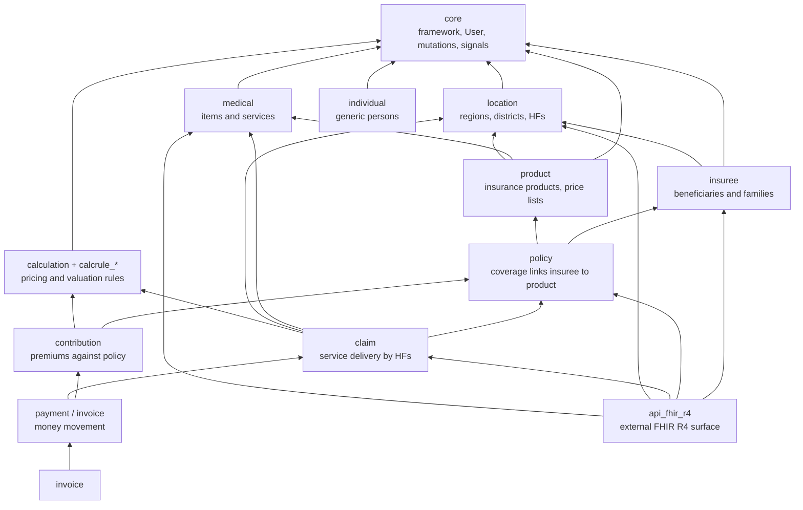

# Repository Map

openIMIS is not one repository — it is a whole **GitHub organization** of them.
The first time you browse [github.com/openimis](https://github.com/openimis) it
looks like dozens of similarly named projects with no obvious center of gravity.
This chapter is the map that fixes that. It groups every major repository by
category, tells you what each one is *for*, what it depends on, how mature it is,
and where you would customize it — and it draws the dependency graph so you can
see the whole org as one ordered structure rather than a flat list.

Keep this page open in a tab while you work. It is the at-a-glance reference. A
still-fuller table (with more peripheral and calculation-rule repos) lives in the
[Repository Appendix](../reference/appendix.md); the two are complementary — this
page is the working map, the appendix is the exhaustive index.

## Learning objectives

By the end of this chapter you will be able to:

- Recognize the **naming conventions** (`openimis-be-<name>_py`,
  `openimis-fe-<name>_js`) and read a repo's role from its name alone.
- Distinguish **assembly**, **core/infra**, and the various **business** and
  **integration** repository categories.
- State the purpose, dependencies, and customization points of every major module
  repository.
- Read the **dependency graph** from `core` at the base up to `api_fhir_r4` at
  the top, and use it to reason about load order and change impact.
- Choose the right repository for a given change without guessing.

## Prerequisites

- [High-Level Architecture](overview.md) — the assembly/module distinction and
  the layer stack.
- [Backend Deep Dive](backend.md) — how the manifest turns these repos into one
  running Django project (manifest order = dependency order).

---

## 1. Naming conventions: read the repo from its name

openIMIS repository names are rigidly systematic. Learn the pattern and most
navigation questions answer themselves.

| Pattern | Meaning | Example |
|---|---|---|
| `openimis-be_py` | Backend **assembly** (the deployable Django project) | `openimis-be_py` |
| `openimis-fe_js` | Frontend **assembly** (the deployable React SPA) | `openimis-fe_js` |
| `openimis-be-<name>_py` | Backend **module**; Python package is `<name>` | `openimis-be-claim_py` → package `claim` |
| `openimis-fe-<name>_js` | Frontend **module**; the matching UI | `openimis-fe-claim_js` |
| `openimis-dist_dkr` | **Distribution**: Docker Compose deployment | `openimis-dist_dkr` |
| `calcrule_<name>` (inside/with calculation) | A pluggable **calculation rule** | `calcrule_contribution` |

Two things fall straight out of this:

- **`be` ↔ `fe` pairing.** Most business concerns have both a backend module and
  a frontend module of the same `<name>` (`claim`, `insuree`, `policy`, …). The
  backend owns data, GraphQL, and services; the frontend owns the screens.
- **Package name ≠ repo name.** The repo is `openimis-be-core_py` but you
  `import core`. When reading tracebacks or `INSTALLED_APPS`, you see the *package*
  name (`core`, `claim`); when cloning, you use the *repo* name.

!!! info "Did you know?"
    The `_py` / `_js` suffix and `-be-` / `-fe-` infix are not decoration — tooling
    and the manifests rely on the pattern. When a new module is created it is
    expected to follow the convention exactly, which is why the whole org reads so
    uniformly.

---

## 2. The dependency graph

Before the tables, the shape. This is the mental model that makes every table
below meaningful: a layered stack with `core` at the base, reference data above
it, then beneficiaries, coverage, financial flows, and finally the FHIR surface
on top. Arrows mean "depends on / builds upon."

Read it bottom-up and it tells a story: you cannot have a **policy** without an
**insuree** and a **product**; you cannot have a **contribution** without a
**policy**; you cannot value a **claim** without **medical** items/services and a
**calculation** rule; and **FHIR** re-exposes many of these to the outside world.
That story is exactly the domain of health financing, encoded as a dependency
order — and it is the same order the module manifest loads them in (see
[Backend Deep Dive](backend.md)).

!!! info "Did you know?"
    The dependency graph is also a **change-impact map**. A change in `core`
    ripples to everything; a change in `api_fhir_r4` ripples to nothing (nothing
    depends on it). When estimating the blast radius of a change, find the repo in
    this graph and count what sits *above* it.

---

## 3. Maturity legend

The tables use a simple maturity marker so you know how much to trust and how
carefully to tread:

| Marker | Meaning |
|---|---|
| Foundational | Stable, heavily depended upon; change with great care. |
| Mature | Core domain, well established, broadly deployed. |
| Growing | Actively evolving; APIs may still shift. |
| Emerging | Newer or specialized; expect gaps and change. |

Treat these as directional guidance, not a formal support statement — confirm the
current state in each repo's README and release history.

---

## 4. Assembly repositories

The two thin projects that turn everything else into a running system. They hold
almost no business logic; they *wire*. See the assembly model in
[High-Level Architecture](overview.md).

| Repository | Purpose | Key responsibilities | Depends on | Maturity | Typical customization points |
|---|---|---|---|---|---|
| `openimis-be_py` | Backend assembly / deployable Django project | Reads `openimis.json`; builds `INSTALLED_APPS`; assembles root GraphQL schema and URLs; runs migrations and config load at startup | Every backend module (via manifest) | Foundational | Edit `openimis.json` to choose modules/versions; environment via `settings.py`; startup via `script/` |
| `openimis-fe_js` | Frontend assembly / deployable React SPA | Reads FE `openimis.json`; generates `src/modules.js`; bundles all FE modules; hosts routing and the Redux store shell | Every frontend module (via manifest); `openimis-fe-core_js` | Foundational | Edit FE `openimis.json`; theme/branding; build via Vite config |
| `openimis-dist_dkr` | Distribution / deployment | Docker Compose for `db`, `backend`, `frontend`, Nginx gateway, optional OpenSearch; startup ordering; `.env` secrets | Both assemblies | Mature | `.env`; compose overrides; gateway (Nginx) config; TLS |

---

## 5. Core / infrastructure repositories

The framework layer. Everything else depends on `core`; the rest here provide
cross-cutting platform services (tasks, workflow, reporting infrastructure).

| Repository | Purpose | Key responsibilities | Depends on | Maturity | Typical customization points |
|---|---|---|---|---|---|
| `openimis-be-core_py` | The framework within the framework | Base/versioned models (`HistoryModel`, `VersionedModel`), `json_ext`; custom `User`, `InteractiveUser`, `TechnicalUser`, `Officer`; integer **rights**; `OpenIMISMutation` async engine + `MutationLog`; **service signals**; Graphene helpers; `ModuleConfiguration`; scheduler; audit | (base) | Foundational | Extend base models; add service-signal bindings; extend User/roles; config via `ModuleConfiguration` |
| `openimis-be-tasks_management_py` | Human/automated task workflow | Task queues, approvals, assignment of work items | `core` | Growing | Task types; approval rules |
| `openimis-be-workflow_py` | Workflow orchestration | Multi-step process definitions used by other modules | `core` | Growing | Workflow definitions/steps |
| `openimis-be-report_py` | Reporting infrastructure | Report definitions and rendering (often PDF), template plumbing | `core` (+ domain modules for data) | Mature | Report templates; new report definitions |
| `openimis-be-opensearch_reports_py` | Analytics via OpenSearch | Index domain data; power dashboards/search analytics | `core`, domain modules, OpenSearch | Emerging | Index mappings; dashboards |

---

## 6. Reference-data repositories (location / medical / product)

Foundational domain data that the transactional modules point at. These change
slowly and everything downstream assumes them.

| Repository | Purpose | Key responsibilities | Depends on | Maturity | Typical customization points |
|---|---|---|---|---|---|
| `openimis-be-location_py` | Geographic + facility registry | Regions, districts, municipalities; **health facilities**; user–location scoping | `core` | Foundational | Location hierarchy depth; HF attributes via `json_ext` |
| `openimis-be-medical_py` | Medical catalog | Medical **items** (drugs/consumables) and **services** (procedures) | `core` | Mature | Item/service catalogs; classification via `json_ext` |
| `openimis-be-product_py` | Insurance products | Product definitions, benefit packages, **price lists**, ceilings/limits | `core`, `medical`, `location` | Mature | Product design; price-list rules; coverage limits |

---

## 7. Beneficiary repositories (insuree / individual)

Who is covered. `insuree` is the classic insurance beneficiary model; `individual`
is a more generic person model introduced to support social-protection use cases.

| Repository | Purpose | Key responsibilities | Depends on | Maturity | Typical customization points |
|---|---|---|---|---|---|
| `openimis-be-insuree_py` | Insurance beneficiaries | Insurees, **families/households**, photos, enrolment data; insuree numbering | `core`, `location` | Mature | Extra insuree fields via `json_ext`; numbering scheme; family rules |
| `openimis-be-individual_py` | Generic person registry | `Individual`, groups; the beneficiary backbone for social protection | `core` | Growing | Custom attributes; import pipelines |

---

## 8. Coverage & transactional repositories (policy / contribution / claim)

The heart of the insurance workflow: who is covered (policy), what they paid
(contribution), and what care was delivered and valued (claim).

| Repository | Purpose | Key responsibilities | Depends on | Maturity | Typical customization points |
|---|---|---|---|---|---|
| `openimis-be-policy_py` | Coverage | Links **insuree → product** for a validity period; policy status/lifecycle; eligibility | `core`, `insuree`, `product` | Mature | Enrolment/renewal rules; eligibility logic |
| `openimis-be-contribution_py` | Premiums | Records **premiums/contributions** against policies; payment allocation to coverage | `core`, `policy`, `calculation` | Mature | Contribution valuation via calculation rules |
| `openimis-be-claim_py` | Service delivery | Claims by **health facilities** against policies; claim items/services; adjudication/review; valuation | `core`, `policy`, `medical`, `location`, `calculation` | Mature | Adjudication rules; claim valuation; review workflow |

---

## 9. Financial repositories (payment / invoice / payroll)

Money movement, on both the premium-in and benefit/payment-out sides.

| Repository | Purpose | Key responsibilities | Depends on | Maturity | Typical customization points |
|---|---|---|---|---|---|
| `openimis-be-payment_py` | Payments | Payment records tied to contributions/claims; reconciliation; gateway integration hooks | `core`, `contribution`, `claim` | Mature | Payment-gateway adapters (mobile money); reconciliation rules |
| `openimis-be-invoice_py` | Invoicing / billing | Invoices, bills, line items; a more generalized financial-document layer | `core`, `payment` | Growing | Invoice templates; billing rules |
| `openimis-be-payroll_py` | Benefit payouts | Payroll/benefit payment runs, notably for social protection | `core`, `payment`, `individual` | Emerging | Payment cycles; payout adapters |
| `openimis-be-contract_py` | Contracts | Formal contracts (e.g. group/employer coverage agreements) | `core`, `policy`, `insuree` | Growing | Contract terms; group enrolment |

---

## 10. Calculation-rule repositories

The pluggable pricing/valuation engine. `calculation` is the framework; each
`calcrule_*` is a rule that **binds via service signals** (see
[Backend Deep Dive](backend.md)) to value contributions, claims, capitation,
third-party payments, and more — without the valued module importing the rule.

| Repository | Purpose | Key responsibilities | Depends on | Maturity | Typical customization points |
|---|---|---|---|---|---|
| `openimis-be-calculation_py` | Calculation framework | Rule registration/discovery; the signal-based hook that runs rules at the right moment | `core` | Mature | Register new rule types; extend rule metadata |
| `calcrule_contribution_*` | Contribution valuation rules | Compute contribution/premium amounts | `calculation`, `contribution`, `product` | Growing | Rate tables; product-specific formulas |
| `calcrule_validations` | Validation rules | Cross-field/business validations as calculation rules | `calculation` | Growing | Validation logic |
| `calcrule_capitation_*` | Capitation payment rules | Capitation-based provider payment | `calculation`, `claim`, `product` | Emerging | Capitation formulas |
| `calcrule_third_party_payment` | Third-party payment rules | Value provider/third-party payments | `calculation`, `claim`, `payment` | Emerging | Payment formulas |

!!! info "Did you know?"
    The `calcrule_*` repos are the clearest proof that openIMIS's plugin model
    works: a country can drop in a new pricing rule as a **separate repository**
    that binds to a service signal, and neither `contribution`, `claim`, nor
    `core` needs a single line changed to accommodate it.

---

## 11. Integration & reporting repositories

The bridges to the wider digital-health ecosystem. `api_fhir_r4` sits at the very
top of the dependency graph, re-exposing many modules through the FHIR standard.

| Repository | Purpose | Key responsibilities | Depends on | Maturity | Typical customization points |
|---|---|---|---|---|---|
| `openimis-be-api_fhir_r4_py` | FHIR R4 REST surface | Map openIMIS models to FHIR resources (Insuree→Patient, Policy→Coverage, Claim→Claim, HF→Location/Organization, staff→Practitioner); endpoints under `/api_fhir_r4/` | `core`, `insuree`, `policy`, `claim`, `location`, `medical` | Mature | Resource mappings; profiles; extensions |
| `openimis-be-dhis2_etl_py` | DHIS2 integration | Extract/transform/push **aggregate** indicators to DHIS2 | `core`, domain modules | Growing | Indicator mappings; ETL schedules |
| `openimis-be-tools_py` | Data tooling | Bulk import/export, registers, data exchange utilities | `core`, domain modules | Mature | Import/export formats; register definitions |
| `openimis-be-opensearch_reports_py` | Analytics search | Feed OpenSearch for dashboards/analytics | `core`, domain modules, OpenSearch | Emerging | Index/dashboard config |

See [Integrations](../integrations/index.md) and [FHIR R4 API](../modules/fhir.md)
for how these are used in practice.

---

## 12. Social-protection repositories

A newer family extending openIMIS beyond classic health insurance toward
social-protection / cash-transfer programs, built on the generic `individual`
person model rather than `insuree`.

| Repository | Purpose | Key responsibilities | Depends on | Maturity | Typical customization points |
|---|---|---|---|---|---|
| `openimis-be-social_protection_py` | Social protection programs | Benefit plans, beneficiary enrolment, program cycles for cash/in-kind transfers | `core`, `individual`, `payment`/`payroll` | Growing | Program definitions; eligibility; benefit rules |
| `openimis-be-individual_py` | Person backbone (shared) | Generic `Individual`/group registry underpinning social protection | `core` | Growing | Custom attributes; import pipelines |
| `openimis-be-payroll_py` | Benefit payouts (shared) | Payment runs for social-protection benefits | `core`, `payment`, `individual` | Emerging | Payout cycles/adapters |

!!! info "Did you know?"
    The split between `insuree` (insurance beneficiary) and `individual` (generic
    person) reflects openIMIS's expansion in scope. Health-insurance schemes lean
    on `insuree`/`policy`/`claim`; social-protection programs lean on
    `individual`/`social_protection`/`payroll`. Both families share the same
    `core`, which is precisely what lets one platform serve both.

---

## 13. Frontend repositories

The `fe` mirror of the backend. Each business concern generally has a matching
`openimis-fe-<name>_js` providing its screens; `openimis-fe-core_js` provides the
shared runtime — `ModulesManager`, the Redux/GraphQL layer, and the base UI.

| Repository | Purpose | Key responsibilities | Depends on | Maturity | Typical customization points |
|---|---|---|---|---|---|
| `openimis-fe-core_js` | Frontend framework | `ModulesManager` registry; custom `graphql`/`graphqlWithVariables` Redux layer; async-mutation polling ("journalize"); base MUI components, i18n, route guards | (base) | Foundational | Theme; base components; auth flow |
| `openimis-fe-insuree_js` | Insuree UI | Insuree/family screens, pickers, search | `fe-core`, `fe-location` | Mature | Forms; injected `contributions` |
| `openimis-fe-policy_js` | Policy UI | Enrolment, renewal, coverage screens | `fe-core`, `fe-insuree`, `fe-product` | Mature | Enrolment forms |
| `openimis-fe-claim_js` | Claim UI | Claim entry, review, adjudication screens | `fe-core`, `fe-medical`, `fe-location` | Mature | Claim forms; review UI |
| `openimis-fe-location_js` | Location UI | Region/district/HF management pickers | `fe-core` | Mature | Hierarchy UI |
| `openimis-fe-medical_js` / `openimis-fe-product_js` | Reference-data UI | Item/service catalogs; product/price-list editors | `fe-core` | Mature | Catalog editors |
| `openimis-fe-<name>_js` (others) | Per-module UI | Screens for contribution, payment, invoice, individual, social_protection, tools, etc. | `fe-core` + peers | Varies | Screens; `contributions` slots |

The frontend extension seam (config objects, `contributions`, `ModulesManager`)
is covered in [Frontend Architecture](frontend.md) and
[Plugin / Module System](plugin-system.md).

---

## 14. How to choose the right repository for a change

A quick decision aid — the questions to ask, in order:

1. **Is it wiring or domain?** Choosing/pinning modules, gateway config, boot
   sequence → an **assembly** or **distribution** repo. Behavior of a concern →
   the matching **module** repo.
2. **Which concern?** Follow the domain: beneficiary → `insuree`/`individual`;
   coverage → `policy`; premium → `contribution`; care delivered → `claim`;
   money out → `payment`/`invoice`/`payroll`; pricing → `calculation`/`calcrule_*`;
   external exchange → `api_fhir_r4`/`dhis2_etl`/`tools`.
3. **Backend or frontend?** Data/API/business rule → `be`. Screen/interaction →
   `fe`. Many changes touch **both** the `be` and `fe` of the same `<name>`.
4. **Would it belong in core?** Only if it is genuinely cross-cutting (a new base
   model behavior, a new mutation-engine capability). Resist putting domain logic
   in `core` — it raises the change's blast radius to *everything*.

!!! danger "Common mistake"
    Adding a country-specific feature to `core` or to an assembly repo "because it
    was convenient." That maximizes blast radius and breaks the customization
    model. Prefer a new/extended **module** — or a `calcrule_*` rule, or a
    `json_ext` field, or a `ModuleConfiguration` entry — so the change stays in a
    controlled seam. Revisit the rationale in [High-Level Architecture](overview.md).

---

## Repository references

| Repository | Directory / File | Why it matters |
|---|---|---|
| `openimis-be_py` | `openimis.json` | The definitive list of which backend repos are assembled, and in what order. |
| `openimis-fe_js` | `openimis.json` | The frontend counterpart module list. |
| `openimis-be-core_py` | `core/` | The base every other repo depends on; read it first. |
| `openimis-be-calculation_py` | `calculation/` | Anchor for the `calcrule_*` family; shows the plugin model in action. |
| `openimis-be-api_fhir_r4_py` | `api_fhir_r4/` | The top-of-graph integration surface; depends on many modules, is depended on by none. |
| `openimis-dist_dkr` | `docker-compose.*` | Ties the whole org into a runnable stack. |
| (reference) | [Repository Appendix](../reference/appendix.md) | The fuller, exhaustive repo index complementary to this map. |

---

## Hands-on lab

**Goal:** turn the map into muscle memory using the real org.

1. Browse [github.com/openimis](https://github.com/openimis). For ten repos you
   have never seen, predict category and purpose **from the name alone**, then
   open each README to check. Score yourself.
2. Open `openimis.json` in `openimis-be_py`. Confirm `core` appears early and
   that reference-data modules (`location`, `medical`, `product`) precede the
   modules that consume them (`policy`, `contribution`, `claim`). Note where
   `api_fhir_r4` sits — near the end.
3. Pick one business concern (say `claim`) and find **both** its `be` and `fe`
   repos. List the concerns each side owns.
4. Using the dependency graph in §2, pick any module and write down its full
   "blast radius": everything that sits *above* it and would be affected by a
   breaking change.

**Deliverable:** your name-prediction score from step 1 and the blast-radius list
from step 4.

## Exercises

1. Explain, from names alone, the difference between `openimis-be-claim_py`,
   `openimis-fe-claim_js`, and the package you would `import` for the first.
2. A partner wants a country-specific premium formula. Which repository (or new
   repo) should it live in, and which existing repo must it **not** modify? Why?
3. Order these by dependency, base first: `claim`, `core`, `policy`, `product`,
   `insuree`, `api_fhir_r4`. Justify each step.
4. `payroll` and `social_protection` are newer than `claim` and `policy`. What
   does that tell you about openIMIS's evolving scope, and which person model
   does each family build on?

## Knowledge check

??? question "Q1: What do the naming conventions tell you? (click for answer)"
    `openimis-be-<name>_py` is a **backend module** whose Python package is
    `<name>`; `openimis-fe-<name>_js` is the matching **frontend module**;
    `openimis-be_py` / `openimis-fe_js` are the **assembly** projects; and
    `openimis-dist_dkr` is the **Docker distribution**. From a name you can infer
    tier (assembly vs module), side (backend vs frontend), and concern — before
    opening the repo.

??? question "Q2: Why is core at the base of the dependency graph and api_fhir_r4 at the top? (click for answer)"
    `core` provides the shared framework (base models, User, mutation engine,
    service signals) that **every** module builds on, so it must load first and a
    change in it affects everything. `api_fhir_r4` sits on top because it *re-exposes*
    other modules (insuree, policy, claim, location, medical) as FHIR resources;
    it depends on many modules but **nothing depends on it**, so it loads last and
    a change in it has minimal blast radius.

??? question "Q3: What is the difference between the insuree and individual families? (click for answer)"
    `insuree` is the classic **insurance beneficiary** model (insurees, families,
    enrolment) underpinning `policy`/`contribution`/`claim`. `individual` is a
    **generic person** model introduced to support **social protection**
    (cash/in-kind transfer programs) via `social_protection` and `payroll`. Both
    families share the same `core`, which is what lets one platform serve health
    insurance and social protection at once.

??? question "Q4: Where should a new country-specific pricing rule live, and what must it not touch? (click for answer)"
    In a new/extended **`calcrule_*`** repository that **binds via service
    signals** to the relevant service (e.g. contribution or claim valuation). It
    must **not** modify `contribution`, `claim`, or `core` — the whole point of
    the calculation framework is that pricing rules plug in through the signal
    seam without those modules importing or knowing about the rule.

??? question "Q5: You need to change how a claim is adjudicated in the UI and how it is valued on the server. Which repositories? (click for answer)"
    Two, one per side of the same concern: `openimis-fe-claim_js` for the
    adjudication **screens/interaction**, and `openimis-be-claim_py` (plus,
    likely, a `calcrule_*` rule for the **valuation** logic) for the server-side
    business rule. Many real changes are exactly this kind of coordinated `be`+`fe`
    pair.

## Further reading

- [High-Level Architecture](overview.md) — why the org is split this way.
- [Backend Deep Dive](backend.md) — how the manifest turns these repos into one
  Django project (manifest order = dependency order).
- [Plugin / Module System](plugin-system.md) — the service-signal and
  contribution seams that make new modules/rules pluggable.
- [Frontend Architecture](frontend.md) — the `fe` side of the map.
- [Repository Appendix](../reference/appendix.md) — the exhaustive, complementary
  repo index.
- The [openIMIS GitHub organization](https://github.com/openimis) — the ground
  truth; every repo's README and releases.
