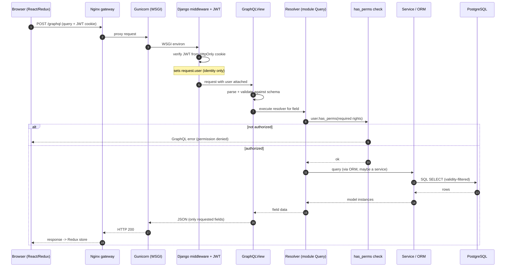
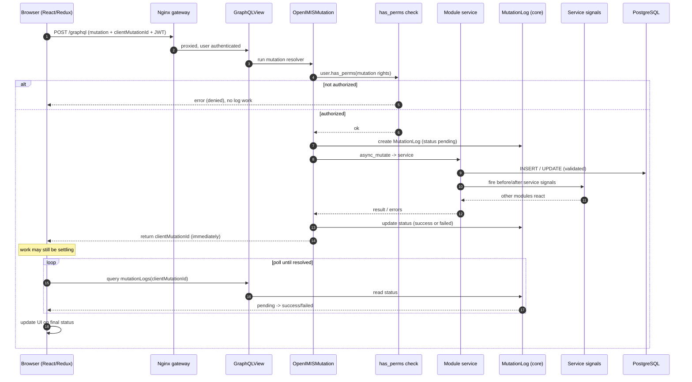

# Request Lifecycle

This chapter follows a single request all the way through openIMIS — from the
browser, across the network, into Django, through GraphQL, down to the database,
and back — and then does it again for a **mutation**, because writes in openIMIS
work very differently from reads. When you finish, you should be able to put your
finger on *exactly* where authentication happens, where authorization happens,
where business logic lives, and why a mutation returns *before* its work is
necessarily finished.

This is PART 8 of the architecture track. It assumes you already know how the
pieces are assembled; here we make them *move*.

## Learning objectives

By the end of this chapter you will be able to:

- Trace an HTTP request through the Nginx gateway, WSGI, Django middleware,
  authentication, the GraphQL view, the assembled schema, a resolver, the
  permission check, the service layer, the ORM, and back.
- Explain **where** JWT authentication happens and **why** it lives in an
  HttpOnly cookie.
- Distinguish the roles of **resolver**, **permission check**, **service**, and
  **ORM** — and why openIMIS keeps them separate.
- Describe the **asynchronous mutation pattern** (`OpenIMISMutation`): a
  `MutationLog` row, a returned `clientMutationId`, and client **polling**.
- Read both a **query** and a **mutation** sequence diagram fluently.

## Prerequisites

- [Architecture Overview](../architecture/overview.md) — the gateway/backend/db
  topology.
- [Backend Deep Dive](../architecture/backend.md) — Django project, services,
  base models.
- [Plugin / Module System](../architecture/plugin-system.md) — how the schema
  and resolvers you'll meet here got assembled.
- [GraphQL in openIMIS](../graphql/index.md) — queries, mutations, resolvers.
- [Security](../security/index.md) — JWT, the `User` model, integer rights.

---

## 1. The cast of characters

Before we trace anything, meet the layers a request passes through. Each has one
job; the discipline of keeping them separate is what makes the codebase
tractable.

| Layer | What it is | Its one job | Where it lives |
| --- | --- | --- | --- |
| **Gateway** | Nginx reverse proxy | Terminate TLS, route `/`, `/api`, `/graphql`; serve the built React app | `openimis-dist_dkr` |
| **WSGI server** | Gunicorn | Turn HTTP into Python `environ`; run worker processes | backend container |
| **Middleware** | Django middleware stack | Cross-cutting concerns: sessions, CSRF, auth, JWT | `openimis/settings.py` |
| **Authentication** | `django-graphql-jwt` | Identify *who* the caller is from the JWT cookie | core + jwt middleware |
| **GraphQL view** | `GraphQLView` (graphene-django) | Parse the query, run it against the schema | `openimis/urls.py` |
| **Schema / resolver** | Assembled root `Query`/`Mutation` | Map a field to code that fetches/changes data | `openimis/schema.py` + module `schema.py` |
| **Authorization** | `user.has_perms([...])` | Decide *whether* this user may do this | resolver / mutation |
| **Service** | Plain Python service class | Business logic, validation, orchestration | module `services.py` |
| **ORM** | Django ORM | Talk to PostgreSQL; temporal/versioned models | module `models.py` |
| **Database** | PostgreSQL | Persist state | `db` container |

!!! info "Did you know?"
    There is exactly **one** GraphQL endpoint — `/graphql` — for the entire
    application, no matter how many modules are installed. Every module's fields
    were merged into one root schema at boot (see
    [Plugin / Module System](../architecture/plugin-system.md)). The client always
    talks to the same URL; the *schema* is what varies by deployment.

---

## 2. Tracing a query, step by step

Follow a read: the frontend asks for a page of claims. We walk each hop and, for
each, say **what happens** and **why it is there**.

### 2.1 Browser → Gateway

The React SPA (Redux-based, **not** Apollo) issues an HTTP `POST` to `/graphql`
with a JSON body containing the GraphQL query string and variables. Because the
JWT sits in an **HttpOnly cookie**, the browser attaches it automatically — the
JavaScript never reads or forwards a token by hand.

The request hits **Nginx**, the single public entry point. Nginx:

- terminates TLS,
- serves the static React bundle for `/`,
- **reverse-proxies** `/graphql` and `/api/*` to the Django backend (Gunicorn).

*Why a gateway?* It gives frontend, `/api`, and `/graphql` one origin (so the
cookie is same-origin and CSRF/CORS stay simple), centralizes TLS, and lets you
scale or relocate the backend without the browser knowing.

### 2.2 Gateway → WSGI (Gunicorn) → Django

Nginx forwards the proxied request to **Gunicorn**, which translates HTTP into a
WSGI `environ` and hands it to a Django worker. Django wraps it in an
`HttpRequest` and sends it **down the middleware stack**.

### 2.3 Middleware & authentication

Django runs each middleware in order. The security-relevant ones:

- Session and common middleware (housekeeping).
- **CSRF** protection.
- The **JWT authentication** middleware from `django-graphql-jwt`, plus openIMIS
  additions. It reads the JWT from the **HttpOnly cookie**, verifies its
  signature and expiry, and resolves it to the openIMIS **`User`**, which it
  attaches to `request.user`. If there is no valid token, `request.user` is
  anonymous — the request still proceeds; individual resolvers decide what an
  anonymous caller may see.

*Why a cookie, not a header?* An **HttpOnly** cookie is unreadable from
JavaScript, which blunts token theft via XSS. The browser attaches it
automatically, so the SPA never handles the raw token. (openIMIS also supports
OpenID Connect / OAuth2 for external identity providers.) See
[Security](../security/index.md).

!!! danger "Common mistake"
    Authentication (**who are you**) is *not* authorization (**may you do this**).
    The JWT middleware only establishes identity and populates `request.user`. It
    performs **no** permission checks. Every resolver and mutation must still call
    `has_perms`. Assuming "the user got past auth, so they're allowed" is how data
    leaks.

### 2.4 The GraphQL view

The middleware stack delivers the request to `GraphQLView` (mounted at `/graphql`
in `openimis/urls.py`). The view:

1. parses the query string and variables from the JSON body,
2. validates them against the **assembled schema** (`openimis/schema.py`),
3. builds an **execution context** whose `info.context` is the Django request —
   crucially carrying `info.context.user`,
4. executes the query, calling the resolver for each requested field.

If the query names a field no module contributed, validation fails here with a
GraphQL error **before** any resolver runs.

### 2.5 Resolver → permission check

Graphene invokes the field's resolver — say `resolve_claims` on the `claim`
module's `Query` mixin. **The first thing a well-behaved resolver does is
authorize:**

```python
# claim/schema.py  (illustrative / simplified)
from claim.apps import ClaimConfig
from claim.models import Claim

class Query(graphene.ObjectType):
    claims = OrderedDjangoFilterConnectionField(ClaimGQLType)

    def resolve_claims(self, info, **kwargs):
        user = info.context.user                                   # (1)!
        if not user.has_perms(ClaimConfig.gql_query_claims_perms): # (2)!
            raise PermissionError("Not authorized to read claims")
        return Claim.objects.filter(*filter_validity())            # (3)!
```

1. `info.context` is the Django request, so `info.context.user` is exactly the
   `User` the JWT middleware attached in step 2.3.
2. **Authorization** happens here, in the resolver — against the module's integer
   rights read from its `AppConfig` (see
   [Plugin / Module System](../architecture/plugin-system.md#6-permissions-integer-rights-defined-per-module)).
   No rights, no data — the resolver raises before touching the DB.
3. For a simple read the resolver may build the queryset directly. `filter_validity()`
   restricts to currently-valid rows (the temporal `validity_from`/`validity_to`
   convention) — you rarely want expired history in a normal read.

### 2.6 Service layer, ORM, database

For a **read**, a resolver often queries the ORM directly (as above). For reads
with real business logic — or any **write** — the resolver delegates to a
**service** class in the module's `services.py`. The service is where
validation, cross-model orchestration, and service-signal firing live; keeping
that out of the resolver means the same logic is reachable from REST, tests, and
other services, not just GraphQL.

The ORM turns the queryset into SQL against **PostgreSQL**. openIMIS models carry
the legacy-derived temporal fields and `json_ext`, so a "row" is often a *version*
of an entity valid over a time window (see
[Backend Deep Dive](../architecture/backend.md) and
[Database](../database/index.md)).

### 2.7 Back up the stack

The rows become model instances, Graphene shapes them into the exact JSON the
query asked for (Graphene returns **only** the fields requested — one of
GraphQL's core wins over REST over-fetching), the view serializes the result,
Gunicorn returns HTTP, and Nginx relays it to the browser, which reduces it into
the Redux store.

### 2.8 The full query sequence



---

## 3. Tracing a mutation: the asynchronous pattern

Writes do not follow the query path. openIMIS mutations are built on the
**`OpenIMISMutation`** base class (in core), which imposes an **asynchronous,
audited** pattern. Understanding *why* is the point of this section.

### 3.1 Why writes are different

A create/update/delete in openIMIS is rarely a single INSERT. It can:

- validate against several modules' rules,
- fire **service signals** so other modules react (see
  [Plugin / Module System](../architecture/plugin-system.md#8-signals-the-loose-coupling-extension-seam)),
- recompute values through **calculation rules**,
- and must be **audited** — every business change is attributable to a user.

To keep the API responsive and every change traceable, openIMIS models a mutation
as a **job**: it records the request, kicks off the work, and hands the client a
**ticket** to check on it. The client does not block waiting for all downstream
effects.

### 3.2 The `OpenIMISMutation` flow

When a mutation resolver runs, `OpenIMISMutation`:

1. **Authorizes** — checks the caller's integer rights with `has_perms`, exactly
   like a query resolver, before doing anything.
2. **Creates a `MutationLog`** row (in core) capturing who, what, when, the input,
   and an initial status (e.g. *received/pending*). This is the audit record and
   the job's status holder.
3. **Runs the work** — delegates to the module's **service**, which validates,
   writes through the ORM, and fires service signals. As it progresses, the
   `MutationLog` status is updated (e.g. *success* or *failed*, with any error
   messages).
4. **Returns immediately** with a **`clientMutationId`** — the client-supplied
   correlation id echoed back — *without* necessarily waiting for every
   downstream effect to settle.
5. **The client polls.** Using the `clientMutationId`, the frontend queries the
   `MutationLog` status (the FE's "journalize"/polling helper does this) until it
   reads *success* or *failed*, then updates the UI.

```python
# claim/gql_mutations.py  (illustrative / simplified)
class CreateClaimMutation(OpenIMISMutation):
    _mutation_class = "CreateClaimMutation"

    class Input(OpenIMISMutation.Input):
        code = graphene.String(required=True)
        # ... claim fields ...

    @classmethod
    def async_mutate(cls, user, **data):                 # (1)!
        if not user.has_perms(ClaimConfig.gql_mutation_create_claims_perms):
            raise PermissionDenied("Not authorized")      # (2)!
        errors = ClaimService(user).create(data)          # (3)!
        return errors                                      # (4)!
```

1. Subclasses implement `async_mutate`; the base class wraps it with the
   `MutationLog` bookkeeping — create the log, run this, record the outcome.
2. Authorization again lives right here, against the module's integer mutation
   rights.
3. Real work is delegated to the **service** (validation, ORM writes, signals) —
   not written inline in the mutation.
4. Returning an empty error list means success; returned errors are written to
   the `MutationLog` for the client to read when it polls. Either way the GraphQL
   response carries the `clientMutationId` so the client can correlate.

!!! info "Did you know?"
    The `clientMutationId` is **supplied by the client** and echoed back. That is
    what makes polling possible: the frontend generated the id, so it knows which
    `MutationLog` to watch. It also makes writes **idempotent to correlate** — the
    client can always tie a later status to the exact request it sent.

### 3.3 The full mutation sequence



### 3.4 Query vs mutation at a glance

| Aspect | Query (read) | Mutation (write) |
| --- | --- | --- |
| Base machinery | plain resolver | `OpenIMISMutation` |
| Returns | the requested data | a `clientMutationId` (a ticket) |
| Completion | synchronous — data is in the response | asynchronous — client **polls** `MutationLog` |
| Audit | none required | **every** mutation writes a `MutationLog` |
| Business logic | often direct ORM; service if complex | **always** a service; fires signals |
| Authorization | `has_perms` in resolver | `has_perms` in `async_mutate` |

!!! warning "Common mistake"
    Do not treat a mutation's HTTP 200 as "the write finished and every side
    effect ran." The response means "the request was accepted and a
    `MutationLog` exists." The **authoritative outcome** is the `MutationLog`
    status the client polls. UIs that skip polling show stale or wrong state when
    downstream signal-driven work (e.g. calculation rules) is still settling.

---

## 4. Where each concern lives — and why the separation pays off

| Concern | Whose job | Consequence of putting it elsewhere |
| --- | --- | --- |
| Routing / TLS | Nginx gateway | Backend would need to serve statics and manage certs. |
| Identity (authn) | JWT middleware | Every resolver would re-parse tokens; inconsistent. |
| Authorization (authz) | resolver / mutation via `has_perms` | Middleware can't know a field's required rights; leaks. |
| Query shape | GraphQL schema + resolver | REST-style over/under-fetching returns. |
| Business logic + validation | **service** | Logic trapped in resolvers can't be reused/tested; no signal seam. |
| Persistence + temporality | ORM / models | Ad-hoc SQL loses `validity_*`, `json_ext`, versioning. |
| Audit + async status | `OpenIMISMutation` + `MutationLog` | No traceability; UI can't track long-running writes. |

The single most important boundary to internalize: **resolvers authorize and
delegate; services do the work.** Keep them apart and the same business operation
is reachable from GraphQL, REST, tests, and other modules' signals — mix them and
you get logic you can only trigger through one API.

---

## Repository references

| Repository | Directory / File | Why it matters |
| --- | --- | --- |
| `openimis-dist_dkr` | `docker-compose*.yml`, Nginx config | The gateway that terminates TLS and routes `/graphql` and `/api`. |
| `openimis-be_py` | `openimis/urls.py` | Mounts `GraphQLView` at `/graphql`. |
| `openimis-be_py` | `openimis/settings.py` | Middleware stack, Graphene + `django-graphql-jwt` config. |
| `openimis-be_py` | `openimis/schema.py` | The assembled root schema the view executes against. |
| `openimis-be-core_py` | `core/schema.py` (`OpenIMISMutation`) | The asynchronous, audited mutation base class. |
| `openimis-be-core_py` | `core/models.py` (`MutationLog`) | The audit + status record the client polls. |
| `openimis-be-core_py` | User / auth code | The `User`/`InteractiveUser` and `has_perms` that back authorization. |
| `openimis-be-claim_py` | `claim/schema.py`, `claim/gql_mutations.py`, `claim/services.py` | A real query resolver, a mutation, and a service to trace end to end. |
| `openimis-fe_js` | core `graphql`/`graphqlWithVariables` + polling helper | The Redux layer that sends queries and polls `MutationLog`. |

---

## Hands-on lab

**Goal:** watch both lifecycles happen against a running dev stack.

1. **Find the endpoint.** In `openimis-be_py/openimis/urls.py`, locate the
   `GraphQLView` mount. Confirm there is only one `/graphql`.
2. **Watch a query.** With the backend running, open GraphiQL at `/graphql`. Run
   a small `claims` query. In the backend logs, observe the single request; note
   that only the fields you asked for come back.
3. **Break authorization on purpose.** Log in as a user *without* the claims-read
   right (or temporarily require a right the user lacks) and re-run the query.
   Confirm you get a permission error from the **resolver**, not the middleware.
4. **Watch a mutation.** Run a create mutation and include a `clientMutationId`.
   Observe that the response returns almost immediately with that id.
5. **Poll the log.** Query the `MutationLog` (or `mutationLogs`) by your
   `clientMutationId` and watch the status move to *success*/*failed*. This is
   exactly what the frontend's polling helper does for you.

## Exercises

1. A teammate says "we authenticate in middleware, so resolvers don't need to
   check anything." Refute this in two sentences, naming what middleware does and
   does not do.
2. Explain why the JWT lives in an **HttpOnly cookie** rather than being read by
   JavaScript and sent in an `Authorization` header. Name one threat it mitigates.
3. A mutation returns HTTP 200 but the UI shows stale data. Give the most likely
   cause rooted in the async pattern, and the fix.
4. Draw (in words) where a **service signal** fires in the mutation sequence and
   name one thing another module might do in an `AFTER` hook.
5. Why does openIMIS return **only** the fields a query requested, and how does
   that differ from a typical REST endpoint?

## Knowledge check

??? question "Q1: Which layer populates request.user, and does it perform authorization? (click for answer)"
    The **JWT authentication middleware** (`django-graphql-jwt` plus openIMIS
    additions) reads the token from the HttpOnly cookie, verifies it, and attaches
    the openIMIS `User` to `request.user`. It performs **authentication only** — no
    authorization. Permission checks happen later, in each resolver/mutation via
    `has_perms`.

??? question "Q2: In a query, where exactly does the permission check happen and against what? (click for answer)"
    Inside the **resolver** (e.g. `resolve_claims`), which calls
    `user.has_perms(SomeConfig.gql_query_*_perms)` — the module's **integer
    rights** read from its `AppConfig`. It runs before any DB access; failure
    raises a GraphQL error and no rows are read.

??? question "Q3: What does a mutation return immediately, and how does the client learn the final outcome? (click for answer)"
    It returns the **`clientMutationId`** (the id the client supplied), not the
    finished result. The client then **polls** the `MutationLog` — filtered by that
    id — until the status reads *success* or *failed*, and updates the UI on the
    final status.

??? question "Q4: Why is a MutationLog created for every mutation? (click for answer)"
    Two reasons: **audit** (every business change is attributable to a user, with
    inputs and outcome recorded) and **status** (it holds the async job's state so
    the client can poll it). `OpenIMISMutation` creates it before the work runs
    and updates it as the service completes.

??? question "Q5: Why keep business logic in a service instead of the resolver/mutation? (click for answer)"
    So the same operation is reusable and testable from GraphQL, REST, other
    services, and signal receivers — and so it can fire **service signals** that
    let other modules extend it. Logic embedded in a resolver is reachable only
    through that one GraphQL field and can't participate in the extension seam.

## Further reading

- [GraphQL in openIMIS](../graphql/index.md) — schema, resolvers, connections,
  the argument conventions used above.
- [Security](../security/index.md) — JWT, HttpOnly cookies, OIDC/OAuth2, the
  `User`/`InteractiveUser` model, and integer rights.
- [Plugin / Module System](../architecture/plugin-system.md) — how the resolvers
  and mutations you traced were assembled and how service signals fire.
- [Backend Deep Dive](../architecture/backend.md) — services, base temporal
  models, `MutationLog`.
- `openimis-be-core_py/core/schema.py` — read the real `OpenIMISMutation` to see
  the `MutationLog` bookkeeping first-hand.
- `django-graphql-jwt` docs — cookie-based JWT authentication for Graphene.
- graphene-django docs — `GraphQLView`, execution context, and resolvers.
