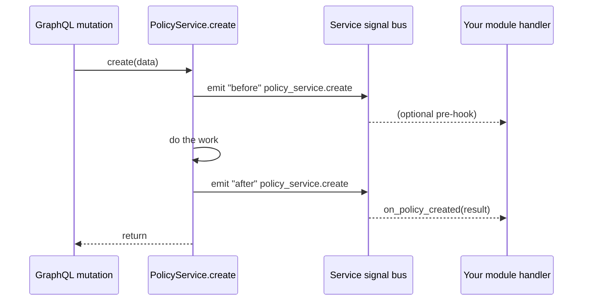

# Best Practices

This chapter is the field manual for working *with* openIMIS's grain rather than
against it. The [Architecture Critique](../critique/index.md) explained why the
platform is shaped the way it is; this chapter turns that understanding into
concrete habits: how to format code, how to structure a change, how to test it,
how to keep it fast, and which well-worn traps to sidestep. Treat it as a
checklist you return to, not a one-time read.

## Learning objectives

By the end of this chapter you will be able to:

- Apply openIMIS's **coding standards** on both backend (black/flake8/isort) and
  frontend (eslint/prettier).
- Follow the platform's core **architectural patterns**: the service layer,
  service signals over hard imports, config over fork, and base-model reuse.
- Structure a change through the recommended **workflow**, from branch to PR.
- Write **tests** the openIMIS way: per-module suites and factories.
- Diagnose and avoid the classic **performance** traps (N+1, missing validity
  filters, absent indexes).
- Recognize and fix the most **common pitfalls** from a lookup table.

## Prerequisites

- [The Core Module](../modules/core.md) — services, signals, base models.
- [Architecture: Backend Deep Dive](../architecture/backend.md) — module layout.
- [GraphQL](../graphql/index.md) — the async mutation pattern you will be testing.
- [Database](../database/index.md) — validity filtering and indexes.
- Recommended: [Architecture Critique](../critique/index.md) — the *why* behind the
  *how* below.

!!! tip "The one principle under everything"
    Almost every best practice below reduces to one idea: **extend at the seams,
    never through the middle.** openIMIS gives you explicit extension points —
    modules, service signals, `contributions`, `DEFAULT_CFG`. Use them. The moment
    you reach past a seam (hard-importing another module, patching core, mutating a
    versioned row in place) you have signed up for pain.

---

## Coding standards

### Backend — black, flake8, isort

openIMIS backend modules follow standard Python tooling. Configure your editor to
run these on save; configure CI to reject anything that fails.

| Tool | Role | Typical invocation |
| --- | --- | --- |
| **black** | Opinionated formatter — settles all whitespace/quote debates | `black <package>/` |
| **isort** | Sorts and groups imports deterministically | `isort <package>/` |
| **flake8** | Lints for unused names, undefined refs, style violations | `flake8 <package>/` |

```bash
# Illustrative pre-commit sweep for a single module
cd ../openimis-be-claim_py
isort claim/
black claim/
flake8 claim/
python -m pytest claim/tests/
```

!!! tip "Order matters"
    Run **isort → black → flake8**. isort and black can disagree if run in the
    wrong order (isort reorders imports, black may reformat them); running isort
    first, black second, then linting last avoids the churn. A `pre-commit` config
    that pins this order is the cleanest setup.

!!! info "Did you know?"
    black is *intentionally* unconfigurable about most things. That is a feature:
    across ~47 module repos maintained by different teams, an opinionated formatter
    means every file reads the same regardless of author. Do not fight it with
    `# fmt: off` except for genuinely tabular data.

### Frontend — eslint, prettier

The React frontend (`openimis-fe_js` and each `openimis-fe-<name>_js` module)
uses ESLint for correctness and Prettier for formatting.

| Tool | Role |
| --- | --- |
| **prettier** | Formats JS/JSX/JSON/CSS — the black of the frontend |
| **eslint** | Catches bugs and enforces React/hooks rules |

```bash
# Illustrative frontend checks
npx prettier --write "src/**/*.{js,jsx}"
npx eslint "src/**/*.{js,jsx}"
```

!!! danger "Common mistake"
    Do not disable ESLint's `react-hooks/exhaustive-deps` wholesale to silence
    warnings. In the openIMIS FE, effects that fetch GraphQL and dispatch Redux
    actions are exactly where a missing dependency causes stale data or infinite
    refetch loops. Fix the dependency array; don't mute the rule.

---

## Architectural patterns

### The service layer — business logic lives in services, not resolvers

Keep GraphQL mutations/resolvers thin. Their job is auth, input marshalling, and
delegation. The actual work belongs in a module's `services.py`, in a service
class that can be called from GraphQL, REST/FHIR, a management command, or a test
— without any of them knowing about the others.

```python
# Illustrative — the shape, not the exact code
class ClaimService:
    def __init__(self, user):
        self.user = user

    def create(self, data):
        self.validate(data)          # business rules here
        claim = Claim.objects.create(**data)
        # trigger valuation, signals, etc.
        return claim
```

```python
# The mutation stays thin (illustrative)
class CreateClaimMutation(OpenIMISMutation):
    @classmethod
    def async_mutate(cls, user, **data):
        if not user.has_perms(ClaimConfig.gql_mutation_create_claims_perms):
            raise PermissionDenied("unauthorized")
        ClaimService(user).create(data)   # delegate
```

!!! tip "Why the service layer earns its keep"
    Because REST/FHIR (`api_fhir_r4`), GraphQL, and background jobs all need the
    same business logic, putting it in a service is what stops it from being copied
    three times and drifting. When you fix a validation rule, you fix it once.

### Service signals over hard imports — the extension seam

When your module needs to react to *another* module's operation, do **not** import
that module's service and call it. Bind to its **service signal**. Core's
`register_service_signal("module.service.method")` +
`bind_service_signal(...)` let you run logic *before/after* another service's call
without a code dependency on it. See [The Core Module](../modules/core.md).

```python
# Illustrative — react after a policy is created, from a different module
from core.signals import bind_service_signal

def on_policy_created(sender, result=None, **kwargs):
    # do your module's follow-up work
    ...

bind_service_signal(
    "policy_service.create",
    on_policy_created,
    bind_type="after",   # illustrative kwarg
)
```



!!! danger "Common mistake"
    `from policy.services import PolicyService` inside an unrelated module creates
    a hard dependency that (a) breaks if `policy` is not in the deployment's
    manifest, and (b) welds two modules together so neither can be released
    independently. That defeats the entire modular architecture. **Bind a signal
    instead.**

### Config over fork — never patch core to change behavior

If you need different behavior, reach for the two customization axes first:
change **which modules run** (the manifest) or **how a module behaves** (its
`DEFAULT_CFG`, overridden by the DB `ModuleConfiguration`). Forking core or
copy-editing another module's source is almost always wrong. See
[Configuration](../configuration/index.md).

| You want to... | Wrong way | Right way |
| --- | --- | --- |
| Change a business parameter | Edit the module's source | Override its config in `ModuleConfiguration` |
| Add a feature to the domain | Patch an existing module | Ship a **new module** in the manifest |
| React to another module | Hard-import its service | **Bind a service signal** |
| Change a permission | Hardcode a role check | Configure integer **rights** on the role |
| Inject FE UI | Fork the FE module | Register a **`contribution`** at a named point |

### Base models — inherit, don't reinvent

Core provides `HistoryModel`, `HistoryBusinessModel`, `VersionedModel`,
`UUIDModel`, and the `json_ext` JSONField. New business entities should inherit
the right base so they get temporal versioning, UUIDs, `legacy_id`, and
extensibility for free — consistent with every other module.

!!! info "Reach for json_ext before a schema migration"
    When a country needs an extra field that is not core to the domain, prefer the
    `json_ext` JSONField over adding a column. It keeps deployments interoperable
    (no divergent schemas) and is exactly what the field exists for. Add a real
    column only when the data is queried/indexed heavily. See
    [Database](../database/index.md).

---

## Recommended workflow

```mermaid
flowchart LR
    A["Pick/clone the right module repo"] --> B["Branch from its default branch"]
    B --> C["pip install -e the module for a live loop"]
    C --> D["Write service + tests first"]
    D --> E["Wire GraphQL/FHIR thinly on top"]
    E --> F["isort / black / flake8"]
    F --> G["Run the module test suite"]
    G --> H["Open PR against that module repo"]
    H --> I["Bump the pin in openimis.json if needed"]
```



1. **Work in the owning module's repo**, not the assembly repo. A change to claims
   logic is a PR to `openimis-be-claim_py`, not to `openimis-be_py`.
2. **Use editable installs** for the dev loop:
   `pip install -e ../openimis-be-claim_py/` so edits are live in the running
   assembly.
3. **Branch, never commit to the default branch.** One change, one branch, one PR.
4. **Service and tests first, API last** — so the logic is validated independently
   of GraphQL's async ceremony.
5. **Update the manifest pin** (`openimis.json`) only when the deployable assembly
   must move to your new module version.

!!! tip "Editable installs are the single biggest DX win"
    Without `pip install -e`, every module edit means reinstalling from git — a
    miserable loop. With it, the assembly repo imports your working tree directly.
    Set this up on day one.

---

## Testing practices

### Per-module test suites

Each module owns its tests under `<name>/tests/`. Run a module's suite in
isolation — you do not need the whole platform to test one module's logic.

```bash
# Illustrative — run just the insuree module's tests
cd ../openimis-be-insuree_py
python -m pytest insuree/tests/
```

### Factories over fixtures

Prefer factory functions/classes that build valid domain objects (an insuree, a
policy, a product) over brittle JSON fixtures. Factories keep tests readable and
survive schema evolution far better than frozen fixture files.

```python
# Illustrative factory usage
insuree = create_test_insuree()            # sensible valid defaults
policy = create_test_policy(insuree=insuree, product=create_test_product())
```

!!! tip "Test the service, then the mutation"
    Write most of your assertions against the **service** (synchronous, direct).
    Add a thinner set of tests for the **mutation** to confirm auth and the async
    `MutationLog` wiring. This mirrors the service-layer pattern and keeps you from
    fighting polling in every test.

!!! warning "Remember validity in test assertions"
    When asserting that an update happened, remember it created a **new version**
    rather than mutating the old row. Query with a validity filter (or the
    framework's `filter_validity` helper) or you may assert against a superseded
    version and get confusing failures. See the temporal model in
    [Database](../database/index.md).

---

## Performance tips

The [critique's scalability section](../critique/index.md) named the hotspots;
here is how to avoid them in code.

| Technique | When | Why |
| --- | --- | --- |
| `select_related(...)` | Following a ForeignKey/OneToOne you will read | One join instead of one query per row |
| `prefetch_related(...)` | Following a reverse/many relation | Batches the related fetch, kills N+1 |
| Validity filter (`filter_validity`) | **Every** query on a versioned model | Excludes superseded rows; also prunes the scan |
| Indexes on `validity_from`/`validity_to` + FKs | Large historical tables (claims) | Keeps temporal joins from degrading as history grows |
| `.only()` / `.values()` | Wide tables, list views | Fetch only the columns you render |
| Push analytics to OpenSearch | Heavy reporting | Keep the transactional DB out of report scans |

### The N+1 trap, concretely

```python
# BAD (illustrative) — one query per insuree to get its family
for insuree in Insuree.objects.filter(*filter_validity()):
    print(insuree.family.location.name)   # N+1: family, then location, per row

# GOOD
qs = Insuree.objects.filter(*filter_validity()).select_related("family__location")
for insuree in qs:
    print(insuree.family.location.name)    # one query
```

!!! danger "Common mistake — the silent missing validity filter"
    A query on a versioned model *without* a validity filter returns **every
    historical version** of every record, not the current ones. It usually
    "works" in dev with little history and then returns duplicates and wrong
    counts in production. Make `filter_validity()` a reflex on every versioned
    query. This is the most common performance *and* correctness bug in openIMIS.

---

## Debugging

- **Writes fail silently?** Look in the `MutationLog`, not the HTTP response. The
  async mutation pattern records errors there. Query the log by `clientMutationId`.
  See [GraphQL](../graphql/index.md).
- **A GraphQL field seems to come from nowhere?** It is contributed by a module's
  `schema.Query`/`Mutation` and mixed into the root via multiple inheritance in
  `openimis/schema.py`. Check the module list and the MRO, not one file. See
  [Repository Map](../architecture/repository-map.md).
- **Permission denied with a valid user?** Resolve the integer permission code to
  its name in the owning module's `apps.py` and confirm the user's role carries
  that exact code. Off-by-one integer codes are a classic. See
  [Security](../security/index.md).
- **Empty query results after an update?** Suspect a missing validity filter or an
  assertion against a superseded version.
- **Frontend data stale or looping?** Check the effect's dependency array and the
  journalize polling — not Apollo (there is none).
- **Enable SQL logging** to hunt N+1: turn on Django's `django.db.backends`
  logger in dev and watch the query count per request.

---

## Common pitfalls

| Pitfall | Symptom | Fix |
| --- | --- | --- |
| Missing validity filter | Duplicate/old rows, wrong counts | Add `filter_validity()` to every versioned query |
| Hard-importing another module | Deployment breaks when that module is absent | Bind a **service signal** instead |
| Expecting a mutation to return the object | Only get a `clientMutationId` | Poll `MutationLog` / use the FE journalize helper |
| Confusing UUID and legacy integer id | Wrong row or empty result on a join | Read the model; know which key the API/join expects |
| N+1 on relations | Slow list views, query storms | `select_related` / `prefetch_related` |
| Patching core to change behavior | Merge hell on upstream updates | Config override or a new module (config over fork) |
| Eyeballing integer permission codes | Wrong role grants, silent auth holes | Resolve codes to names in `apps.py` before granting |
| Mutating a versioned row in place | Lost history, broken as-of queries | Create a new version; let validity windows manage state |
| Adding a column for a country-specific field | Divergent schemas, interop breakage | Prefer `json_ext` unless heavily queried |
| Editing the assembly repo for module logic | Change in the wrong repo, no module release | PR the **owning module** repo; bump the manifest pin |
| Running isort after black | Formatter churn / CI flip-flop | isort → black → flake8, in that order |

---

## Contribution guidelines

!!! example "A well-formed openIMIS contribution"
    1. **Right repo.** The change lives in the module it belongs to
       (`openimis-be-<name>_py` / `openimis-fe-<name>_js`), not the assembly.
    2. **Branch + PR.** Never commit to a default branch; one focused PR.
    3. **Tests included.** New logic ships with per-module tests using factories;
       the module suite passes.
    4. **Formatted + linted.** isort/black/flake8 (backend) or prettier/eslint
       (frontend) all clean.
    5. **Seams, not surgery.** Extends via service signals / `contributions` /
       config — no hard cross-module imports, no core patches.
    6. **Config-driven.** New tunables are added to `DEFAULT_CFG`, not hardcoded.
    7. **History-safe.** Versioned models are updated by new versions, and queries
       carry validity filters.
    8. **Docs & config keys noted.** Any new `DEFAULT_CFG` key or permission code is
       documented in the PR.

!!! info "Where to coordinate"
    Substantial changes — especially anything touching core base models or the
    schema assembly — should be discussed with the community first (the openIMIS
    Technical Advisory Group and the relevant repo maintainers). Core is
    load-bearing for every deployment; changes there ripple through everything that
    inherits from it. See the [Architecture Critique](../critique/index.md) on
    maintainability-in-the-large.

---

## Hands-on lab

!!! example "Lab: harden a module change end to end"
    Pick any backend module (`insuree` is a good choice) and:

    1. `pip install -e` it into a running assembly.
    2. Add a trivial method to its service (e.g. a derived read helper) plus a
       per-module test using a factory.
    3. Deliberately write a query on a versioned model **without** a validity
       filter, observe the extra rows, then fix it.
    4. Introduce an N+1 (loop over a relation), turn on SQL logging, count the
       queries, then collapse it with `select_related`.
    5. Run isort → black → flake8 and the module's test suite until green.
    6. Write the PR description against the contribution checklist above.

    You will have exercised the service layer, factories, the validity trap, the
    N+1 fix, the tooling order, and the contribution flow — the whole chapter in
    one change.

## Exercises

1. Rewrite a hypothetical hard import
   (`from policy.services import PolicyService`) as a service-signal binding.
   Which `bind_type` do you need if you must run *before* the policy is saved?
2. Given a country that needs one extra optional field on `Insuree`, argue for
   `json_ext` vs. a real column. Under what condition does the column win?
3. Sketch the minimal set of tests for a new mutation: which assertions go against
   the service, which against the mutation, and why?

## Knowledge check

??? question "Q1: Why bind a service signal instead of importing another module's service? (click for answer)"
    A hard import creates a code dependency that breaks if that module is absent
    from the deployment's manifest and welds the two modules together so neither
    can release independently — defeating the modular architecture. A service
    signal lets you run before/after another service's call with no import and no
    dependency.

??? question "Q2: What is the correct tool order for backend formatting/linting, and why? (click for answer)"
    **isort → black → flake8.** isort reorders imports first, black then settles
    formatting (including on those imports), and flake8 lints last. Reversing isort
    and black causes formatter churn where the two disagree and CI flip-flops.

??? question "Q3: Your list view is slow and SQL logging shows one query per row for a related object. What is the fix, and which method for a forward FK vs. a reverse/many relation? (click for answer)"
    It's an N+1. Use **`select_related`** for forward ForeignKey/OneToOne
    relations (SQL join), and **`prefetch_related`** for reverse or many-to-many
    relations (a batched second query). Also confirm the base query still carries
    its validity filter.

??? question "Q4: Where do errors from a failed mutation actually surface, and how do you find them? (click for answer)"
    In the **`MutationLog`**, not the immediate HTTP/GraphQL response — the async
    mutation pattern records status and errors there. Find them by the
    `clientMutationId` the mutation returned (the FE journalize helper polls this
    automatically).

??? question "Q5: A country needs a business parameter changed. Rank the options from best to worst. (click for answer)"
    Best: **override the module's config** via `ModuleConfiguration` (config over
    fork) — no code change, no fork. Next: if it's genuinely new behavior, **ship a
    new module**. Worst: **patch the module's source or fork core**, which creates
    permanent merge pain against upstream and breaks the commons model.

## Further reading

- [Architecture Critique](../critique/index.md) — the rationale behind these rules.
- [The Core Module](../modules/core.md) — services, signals, base models in depth.
- [GraphQL](../graphql/index.md) — the async mutation pattern you test around.
- [Database](../database/index.md) — validity filtering and indexing.
- [Configuration](../configuration/index.md) — the config-over-fork machinery.
- [Extending openIMIS](../extending/index.md) — a full new-module walkthrough.
- [Troubleshooting](../reference/troubleshooting.md) — when the pitfalls above bite.
- Tooling: [black](https://black.readthedocs.io),
  [flake8](https://flake8.pycqa.org), [isort](https://pycqa.github.io/isort/),
  [ESLint](https://eslint.org), [Prettier](https://prettier.io).
