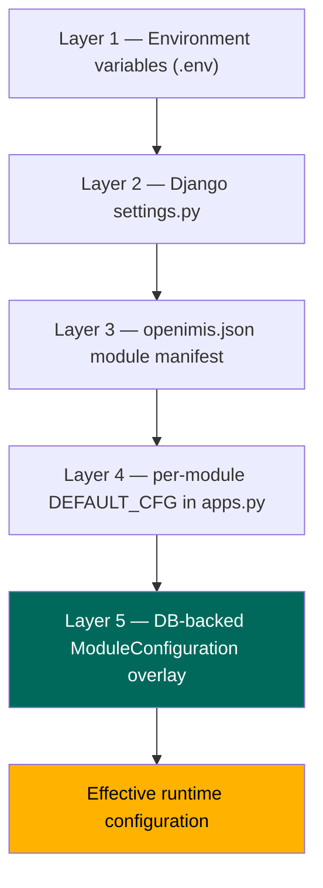
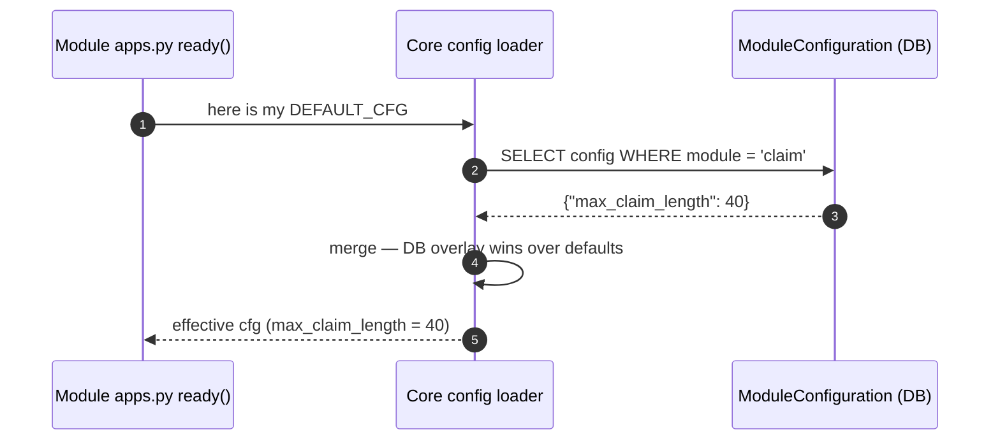
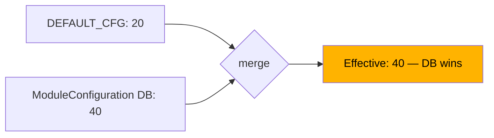

# Part 13 — The Configuration System

There is a question that decides whether an openIMIS deployment stays maintainable for a decade or rots into an unpatchable fork: **when a country needs the software to behave differently, where does that difference go?** The answer openIMIS gives — the answer that runs through every part of this handbook — is a **layered configuration system**. You change behavior by turning knobs, not by editing core code. This chapter is the definitive tour of those layers, their precedence, and how to use them.

If you internalize one sentence from Part 13, make it this: **environment configures the deployment, the manifest configures the modules present, and the database configures their runtime behavior — code stays untouched.**

## Learning objectives

- Describe the five configuration layers and the **precedence** between them.
- Distinguish **build-time** configuration (which modules exist) from **runtime** configuration (how they behave).
- Read a module's `DEFAULT_CFG` in `apps.py` and understand how the DB overlay changes it *without a code change*.
- Manage **secrets**, **feature flags**, and **localization** through the right layer.
- Apply the **country-customization strategy**: configuration over forking.
- Override a module's configuration via `ModuleConfiguration`, with a worked example.

## Prerequisites

- [Backend Deep Dive](../architecture/backend.md) — how modules assemble; where `apps.py` lives.
- [Docker Architecture](../docker/index.md) — the `.env` file and the startup config-load step.
- [The Database](../database/index.md) — `ModuleConfiguration` is a DB-stored record; `json_ext` is the data-layer sibling of this idea.
- [Deployment & Operations](../docker/deployment.md) — how these layers differ per environment and country.

---

## 1. The five layers

openIMIS configuration is a **stack of overlays**. Each layer sits on top of the previous one and can override it. Reading from the bottom (most static, set earliest) to the top (most dynamic, applied last):



| # | Layer | Lives in | Scope | Changed by | When it takes effect |
| --- | --- | --- | --- | --- | --- |
| 1 | **Environment variables** | `.env` (Docker), OS env | Deployment-wide | Ops editing `.env`/secrets | Container start |
| 2 | **Django settings** | `openimis/settings.py` | Whole Django project | Developers (reads env vars) | Process start |
| 3 | **Module manifest** | `openimis.json` | Which modules exist at all | Developers / build (image rebuild) | Image build |
| 4 | **`DEFAULT_CFG`** | each module's `apps.py` | One module's defaults | Module developers | App load |
| 5 | **`ModuleConfiguration`** | database (core) | One module, per deployment, at runtime | **Operators, no code change** | App load, from DB — the winning layer |

The single most important distinction cutting across this table:

!!! tip "Build-time vs. runtime"
    Layers 1–4 are largely **build/boot-time** and code-adjacent. Layer 5 is **runtime and data-driven** — it lives in the database, so an operator can change a running deployment's behavior with a record edit and a restart, *without touching source or rebuilding an image*. That is the layer that makes country customization possible.

---

## 2. Layer by layer

### Layer 1 — Environment variables (`.env`)

The deployment's raw values: database connection, secrets, host names, feature switches that must exist before Django even imports. Supplied by `docker-compose` from `.env` ([Docker Architecture §6](../docker/index.md#6-environment-variables-and-env)). Never contains code; never committed with real secret values.

### Layer 2 — Django `settings.py`

`openimis/settings.py` is the ordinary Django settings module — with one openIMIS twist: it **reads Layer 1** (`os.environ`) for anything deployment-specific, and it **builds `INSTALLED_APPS` dynamically** from the loaded module list rather than hard-coding it. So settings is where env vars become Django configuration and where the module set becomes real apps.

```python
# illustrative — settings.py reading env and assembling apps
DEBUG = os.environ.get("DEBUG", "False") == "True"
SECRET_KEY = os.environ.get("DJANGO_SECRET_KEY")
DATABASES = {"default": {
    "ENGINE": "django.db.backends.postgresql",
    "NAME": os.environ.get("DB_NAME"),
    "HOST": os.environ.get("DB_HOST", "db"),
    # ...
}}
INSTALLED_APPS = [...core Django...] + OPENIMIS_MODULES  # built from the manifest
```

### Layer 3 — `openimis.json` (the module manifest)

The manifest lists ~47 modules, each with a pip/git source. It answers **"which modules exist in this deployment at all?"** — a *build-time* question. Add or remove a module here and rebuild the image ([Docker §4](../docker/index.md#4-how-the-backend-image-is-built)). You cannot enable a module at runtime that the manifest never installed; the manifest is the outer boundary of what's even possible.

### Layer 4 — `DEFAULT_CFG` in `apps.py`

Each module ships sensible defaults in its `AppConfig` subclass. This is the module developer's statement of "here's how I behave out of the box."

```python
# illustrative — a module's apps.py
from django.apps import AppConfig

class ClaimConfig(AppConfig):
    name = "claim"

    # default runtime configuration for this module
    DEFAULT_CFG = {
        "gql_query_claims_perms": [111001],
        "gql_mutation_create_claims_perms": [111002],
        "default_validations_disabled": False,
        "max_claim_length": 20,
    }

    def ready(self):
        # core reads DEFAULT_CFG, overlays the DB config, exposes the result
        self._load_config(cfg)
```

Two openIMIS conventions to note here (both grounded in [Core](../modules/core.md)):

- **Permission codes are integers** (e.g. `[111001]`), defined per module in `apps.py`, and enforced later via `user.has_perms([...])`.
- The `ready()` hook is where the module hands its `DEFAULT_CFG` to core so the **next layer** can overlay it.

### Layer 5 — `ModuleConfiguration` (the DB overlay)

This is the keystone. Core (`openimis-be-core_py`) defines a `ModuleConfiguration` model — a database table keyed by module name, storing a JSON blob of configuration. At startup, for each module, core **merges the DB `ModuleConfiguration` on top of that module's `DEFAULT_CFG`**. Whatever the DB says **wins**.



Because this record lives in the database, an operator changes a deployment's behavior by editing a row (via the admin, a data migration, or the config-load step) and restarting — **no source edit, no image rebuild.** The [Docker startup sequence](../docker/index.md#3-startup-order-the-part-people-get-wrong) even loads/seeds these records (`openimisconf/load_openimis_conf.py`) before the app serves, so the overlay is present from the first request.

!!! info "Did you know?"
    `ModuleConfiguration` is the runtime, *behavioral* sibling of the database's [`json_ext`](../database/index.md#5-json_ext-extensibility-without-migrations). One lets you extend **behavior** per deployment without code changes; the other lets you extend **data** per deployment without migrations. Same philosophy, two layers of the stack: **customize without forking.**

---

## 3. Precedence, precisely

When two layers speak to the same thing, the higher (later-applied) layer wins. Concretely for a module's runtime config:

> **`ModuleConfiguration` (DB) overrides `DEFAULT_CFG` (code).**

And across the whole stack, the guiding order is: environment provides raw values → settings turns them into Django config → the manifest bounds which modules exist → each module supplies defaults → the DB overlay has the final say on runtime behavior.

!!! danger "Common mistake — editing `DEFAULT_CFG` to change one deployment"
    A tempting-but-wrong fix: a country needs `max_claim_length = 40`, so you edit the module's `apps.py` `DEFAULT_CFG` and redeploy. Now you've **forked the module.** Every future upstream update conflicts with your edit, and every *other* deployment that shares the image inherits your country's value. The correct fix is a `ModuleConfiguration` row for that deployment (see [§6](#6-worked-example-overriding-a-modules-config)). Reserve `DEFAULT_CFG` edits for genuinely universal default changes that belong upstream.

!!! danger "Common mistake — trying to enable a module via DB config"
    `ModuleConfiguration` tunes modules that the **manifest already installed** (Layer 3). You cannot switch on a module that `openimis.json` never included — that's a build-time change requiring an image rebuild. Know which layer owns your change *before* you try to make it.

---

## 4. Secrets

Secrets belong in **Layer 1**, delivered as environment variables (or mounted secret files) — never in `settings.py` source, never in `openimis.json`, never committed.

| Secret | Layer | Notes |
| --- | --- | --- |
| `DJANGO_SECRET_KEY` | 1 (env) | Strong, unique per environment. |
| `DB_PASSWORD` | 1 (env) | Injected at runtime; rotated. |
| OIDC client secret / API keys | 1 (env) | Scoped per environment. |

`settings.py` (Layer 2) *reads* these from the environment but does not *contain* them. Full production handling — secret stores, rotation, per-environment separation — is in [Deployment & Operations §5](../docker/deployment.md#5-secrets-management) and [Security](../security/index.md).

!!! danger "Common mistake"
    Putting a secret in `ModuleConfiguration` (the DB) or in `openimis.json` because "it's configuration too." Secrets are configuration, but they belong in the **environment layer** with restricted access — not in a database row visible to admins or in a manifest that lives in git.

---

## 5. Feature flags, localization, and country strategy

### Feature flags via module config

A feature toggle is just a key in a module's config, overridable per deployment via Layer 5. `default_validations_disabled`, an optional workflow step, an integration on/off switch — these live in `DEFAULT_CFG` with a safe default and are flipped per country through `ModuleConfiguration`. No branching code paths compiled per deployment; one image, many behaviors.

### Localization / i18n

openIMIS is multilingual by design:

- **Backend:** Django i18n plus per-module translation handling; user-facing strings are translatable, not hard-coded.
- **Frontend:** each `openimis-fe-<name>_js` module exports `translations`, and the UI uses **react-intl** (see [Frontend Architecture](../architecture/frontend.md)). Language is a configuration/user concern, not a fork.
- **Data-level labels** (product names, location names) live in the data, and extra locale-specific fields can ride in [`json_ext`](../database/index.md#5-json_ext-extensibility-without-migrations).

### Country customization strategy

Putting it together, here is the decision table every implementer should keep on the wall:

| The country needs to change... | Do it in | Layer | Rebuild image? |
| --- | --- | --- | --- |
| Database, hostnames, secrets | `.env` | 1 | No (restart) |
| Which modules run at all | `openimis.json` | 3 | **Yes** |
| A module's runtime behavior / feature flag / permissions mapping | `ModuleConfiguration` | 5 | No (restart) |
| Extra beneficiary data fields | `json_ext` | data | No |
| Language / labels | i18n + config | 2/5 | No |
| Genuinely new business logic | a **new module** + service signals | 3 | Yes (add module) |

!!! quote "Configuration over forking"
    Everything above avoids editing core. The prize is upgradeability: when upstream ships a security fix, a **configured** deployment pulls the new image, migrates, and keeps its `.env` + DB config + `json_ext` + custom modules. A **forked** deployment merges — until it can't. This is the same prime directive as [Deployment §8](../docker/deployment.md#8-country-specific-deployment-customization); configuration is how you obey it.

---

## 6. Worked example — overriding a module's config

**Scenario.** A national scheme's claims can carry a longer claim code than the default. The `claim` module ships `DEFAULT_CFG = {"max_claim_length": 20, ...}` in `claim/apps.py`. This country needs `40`. We must **not** touch source.

### Step 1 — Identify the key

Read the module's `apps.py` to find the real key name and default (here, illustratively, `max_claim_length`). Never guess — the authoritative keys are in the module's `DEFAULT_CFG`.

### Step 2 — Create/adjust the `ModuleConfiguration` row

The overlay is a DB record for module `claim`. You can set it several ways; all land in the same table.

=== "Django admin / shell"

    ```python
    # illustrative
    from core.models import ModuleConfiguration
    cfg, _ = ModuleConfiguration.objects.get_or_create(module="claim")
    data = cfg.config or {}
    data["max_claim_length"] = 40
    cfg.config = data
    cfg.layer = "be"        # backend-layer config
    cfg.is_disabled = False
    cfg.save()
    ```

=== "Config-load at startup"

    Provide the module config JSON that `openimisconf/load_openimis_conf.py` loads at container start ([Docker §3](../docker/index.md#3-startup-order-the-part-people-get-wrong)), so the row is seeded on deploy:

    ```json
    {
      "claim": { "max_claim_length": 40 }
    }
    ```

=== "Data migration"

    Ship the override as a Django **data migration** in a country-specific module, so it's versioned and reproducible across environments — the most auditable option for production.

### Step 3 — Restart and verify

On restart, core reads `DEFAULT_CFG` (`max_claim_length = 20`), overlays the `ModuleConfiguration` (`= 40`), and the DB value wins. The effective config the module reads at runtime is `40`.



The result: this deployment behaves differently, the source is byte-for-byte upstream, and the next upgrade is a clean image pull. That is the entire point of the configuration system in one change.

!!! warning "Only override keys that exist"
    Overriding a key the module doesn't define does nothing useful — the module reads its own known keys. Confirm the key in `DEFAULT_CFG` first, and prefer overriding the minimum (merge onto existing config rather than replacing the whole blob, or you may wipe other overrides).

---

## Repository references

| Repository | Directory / File | Why it matters |
| --- | --- | --- |
| `openimis-be_py` | `openimis/settings.py` | Layer 2 — reads env, builds `INSTALLED_APPS` from the manifest. |
| `openimis-be_py` | `openimis.json` | Layer 3 — the module manifest (which modules exist). |
| `openimis-be_py` | `openimisconf/load_openimis_conf.py` | Loads/seeds Layer 5 config at startup. |
| `openimis-be_py` | `.env` / `.env.example` | Layer 1 — environment values and secrets. |
| `openimis-be-core_py` | `core/models.py` (`ModuleConfiguration`) | Layer 5 — the DB overlay model. |
| `openimis-be-core_py` | `core/apps.py` | The config-merge machinery (`DEFAULT_CFG` overlaid by DB config). |
| any module | `<name>/apps.py` (`DEFAULT_CFG`) | Layer 4 — a module's default config and integer permission codes. |
| `openimis-fe-*_js` | module config `translations` | i18n/localization on the frontend. |

---

## Hands-on lab

!!! example "Lab — change behavior without changing code"
    Against a running dev stack ([Docker Architecture](../docker/index.md)):

    1. **Find a real config key.** Open a module's `apps.py` and read its `DEFAULT_CFG`. Pick a benign key to change (a length limit, a boolean flag).
    2. **Confirm the default at runtime:**
       ```bash
       docker compose exec backend python manage.py shell
       ```
       ```python
       from django.apps import apps
       cfg = apps.get_app_config("claim")   # or your chosen module
       print(cfg.DEFAULT_CFG)               # inspect the shipped defaults
       ```
    3. **Create a `ModuleConfiguration` override** (Step 2 above) for that module and key.
    4. **Restart the backend** and verify the effective value changed to your override, while `apps.py` on disk is unchanged (`git status` clean).
    5. **Prove precedence:** temporarily set a *different* value in `DEFAULT_CFG` locally and confirm the **DB value still wins** at runtime. Revert the source edit.
    6. **Reflect:** you changed one deployment's behavior with a database row and a restart — no rebuild, no fork. Map this to the country-customization table in [§5](#5-feature-flags-localization-and-country-strategy).

## Exercises

1. For each change, name the correct layer and whether it needs an image rebuild: (a) new DB password, (b) enable a not-yet-installed analytics module, (c) raise a claim length limit for one country, (d) add a French translation, (e) add a national-ID field.
2. Explain, with the precedence rule, why editing `DEFAULT_CFG` to fix one deployment is a latent fork.
3. Where must a new OIDC client secret live, and why is `ModuleConfiguration` the wrong place?
4. Design the config for a feature flag that enables an optional claim validation only in Country A, shipped as a reproducible data migration.

## Knowledge check

??? question "Q1: Name the five configuration layers from most static to most dynamic. (click for answer)"
    1) Environment variables (`.env`), 2) Django `settings.py`, 3) `openimis.json` module manifest, 4) per-module `DEFAULT_CFG` in `apps.py`, 5) DB-backed `ModuleConfiguration` overlay. Each overlays the previous; the DB layer has the final say on runtime behavior.

??? question "Q2: When `DEFAULT_CFG` and `ModuleConfiguration` set the same key, which wins and why does that matter? (click for answer)"
    `ModuleConfiguration` (the DB overlay) wins. It matters because it lets an operator change a single deployment's runtime behavior with a database record and a restart — no source edit, no image rebuild — which is what keeps deployments upgradeable instead of forked.

??? question "Q3: Why can't you enable a brand-new module via `ModuleConfiguration`? (click for answer)"
    `ModuleConfiguration` only tunes modules that already exist — modules the `openimis.json` manifest (Layer 3) installed at build time. Adding a module is a build-time change requiring a manifest edit and image rebuild; the DB overlay can't install code.

??? question "Q4: In which layer do secrets belong, and where must they never go? (click for answer)"
    In the environment layer (Layer 1) as env vars or mounted secret files, injected at runtime. They must never be committed in `settings.py`, `openimis.json`, or stored in a `ModuleConfiguration` DB row.

??? question "Q5: A country needs a longer claim length. Outline the correct change and why it beats editing `DEFAULT_CFG`. (click for answer)"
    Create/update a `ModuleConfiguration` row for the `claim` module setting the length key to the new value (via admin/shell, the startup config-load, or a data migration), then restart. The source stays identical to upstream, so the next upgrade is a clean image pull — whereas editing `DEFAULT_CFG` forks the module and leaks the value to every deployment sharing the image.

## Further reading

- [Backend Deep Dive](../architecture/backend.md) — how `apps.py`, settings, and the manifest fit the module architecture.
- [The Database](../database/index.md) — `ModuleConfiguration` storage and its data-layer sibling `json_ext`.
- [Docker Architecture](../docker/index.md) — the `.env` layer and the startup config-load step.
- [Deployment & Operations](../docker/deployment.md) — per-environment/country configuration and secrets in production.
- [Security](../security/index.md) — secret handling and the risks of misconfigured settings.
- openIMIS repositories: [github.com/openimis](https://github.com/openimis) — read `core/apps.py`, `core/models.py`, and any module's `apps.py` for the authoritative config machinery.
