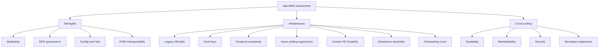
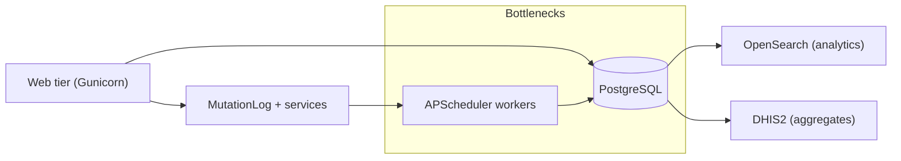

# Architecture Critique

No architecture is free. Every design decision openIMIS made bought something and
cost something, and a competent engineer evaluating the platform deserves an
honest accounting of both sides of that ledger. This chapter is that accounting.
It is deliberately balanced: openIMIS is a mature, thoughtfully engineered
platform doing genuinely hard things, and it also carries real debt and real
friction. We will name both, and — crucially — frame each weakness as a
**tradeoff with a rationale**, because almost none of them are accidents.

We close with a **comparison** against seven other extensible platforms —
Django Oscar, Saleor, ERPNext, OpenMRS, DHIS2, Odoo, and Medplum — so you can
place openIMIS on the map of "big configurable domain platforms" and understand
what it borrowed, what it invented, and where it sits.

## Learning objectives

By the end of this chapter you will be able to:

- Articulate openIMIS's core architectural **strengths** and why they matter for
  its mission as a Digital Public Good.
- Name its principal **weaknesses** and explain the tradeoff each one represents,
  not merely that it is "bad".
- Distinguish **technical debt** (legacy artifacts to be paid down) from
  **deliberate design constraints** (things that look odd but are load-bearing).
- Reason about openIMIS's **scalability, maintainability, security, and developer
  experience** with specifics rather than vibes.
- **Compare** openIMIS to adjacent platforms and choose intelligently between them
  for a given problem.

## Prerequisites

- [Architecture Overview](../architecture/overview.md) — you must already hold the
  "assembly repo + module manifest" mental model.
- [Plugin / Module System](../architecture/plugin-system.md) — the plugin seams are
  the subject of most of the praise and most of the complaints below.
- [The Core Module](../modules/core.md) — `HistoryModel`, `OpenIMISMutation`,
  service signals, and the `User` model are all critiqued here.
- [GraphQL](../graphql/index.md) — the async mutation pattern and schema assembly
  come up repeatedly.
- Helpful but optional: [Database](../database/index.md),
  [Security](../security/index.md), [Repository Map](../architecture/repository-map.md).

!!! info "How to read a critique"
    A critique is not a verdict. The goal is not to decide whether openIMIS is
    "good" — it is demonstrably good enough that national health schemes run on
    it — but to make its tradeoffs *legible*, so you can extend it without
    fighting its grain, and evaluate it without either fanboyism or cynicism.

---

## The shape of the assessment

Keep that shape in mind. The strengths and weaknesses are not independent lists —
several weaknesses are the *shadow* cast by a strength. Modularity buys
independence but costs onboarding. Temporal versioning buys auditability but
costs query complexity. That coupling is the whole point of a tradeoff analysis.

---

## Strengths

### Modularity — the central bet, and it paid off

openIMIS's defining decision was to decompose a monolithic .NET application into
roughly **47 independently versioned Django modules**, each in its own Git
repository, assembled at startup by `openimis-be_py` (see
[Plugin / Module System](../architecture/plugin-system.md)). This is not
cosmetic. It is what lets Tanzania, Nepal, Cameroon, and Chad each run different
combinations of modules — and their own custom modules — **without forking core**.

!!! info "Did you know?"
    The module manifest (`openimis.json`) is the load-bearing artifact of the
    whole platform. `openimis/settings.py` builds `INSTALLED_APPS` dynamically
    from it, and `openimis/schema.py` stitches the GraphQL schema from it. Change
    the manifest, and you change the application — no code edits required. That is
    the mechanism behind "config over fork."

Why it matters:

- **Independent release cadence.** A fix to `claim` does not force a release of
  `insuree`. Modules are pip-installable from pinned git refs.
- **Country customization is additive.** A deployment adds a module; it does not
  patch a shared file. Merge conflicts against upstream core effectively vanish.
- **The seams are explicit.** Service signals and the FE `contributions` registry
  give modules named, discoverable places to hook each other.

### DPG governance — the architecture serves the mission

openIMIS is a recognized **[Digital Public Good](../reference/glossary.md)**,
governed by the openIMIS Initiative with a community Technical Advisory Group and
historically funded by SDC and GIZ. This is an architectural strength, not just a
political one: the modular design *is* the governance model expressed in code.
Because customization is additive, a national ministry can own its own modules
while still consuming upstream security fixes to core. The commons stays coherent
even as deployments diverge.

### Config over fork — reconfigure a deployment without touching code

Each module ships a `DEFAULT_CFG` dict in its `apps.py`, which is overlaid at
startup by a per-module JSON stored in the database (`ModuleConfiguration` in
core). Operators retune permissions, feature flags, and business parameters
against a running system. Combined with the modular manifest, this yields two
independent axes of customization: **which modules run** (manifest) and **how each
one behaves** (config). See [Configuration](../configuration/index.md).

### FHIR R4 — first-class health-domain interoperability

`openimis-be-api_fhir_r4_py` exposes REST FHIR endpoints under `/api_fhir_r4/`,
mapping domain models to standard resources (Insuree → Patient, Policy →
Coverage, Claim → Claim, HealthFacility → Location/Organization). For a health
platform, speaking FHIR is table stakes for national interoperability, and
openIMIS speaks it natively rather than through a bolt-on. See the
[FHIR R4 module](../modules/fhir.md).

!!! tip "The strengths reinforce each other"
    Modularity makes FHIR a *module* you can include or exclude. DPG governance
    makes that module a shared asset. Config-over-fork lets each country map its
    own coding systems. The four strengths are one strength viewed from four
    angles: **customize without forking, forever.**

---

## Weaknesses (as tradeoffs)

Each weakness below is presented as *tradeoff → rationale → cost you actually
pay → how to live with it*. None of these should be read as "openIMIS is bad
here." They are the bill for the strengths above.

### Legacy database debt

**The tradeoff.** openIMIS inherited its schema from IMIS, a 15-year-old .NET +
Microsoft SQL Server application. Many tables keep `tbl` prefixes and camelCase
column names; the port went MSSQL → PostgreSQL.

**Rationale.** A greenfield schema would have meant abandoning years of production
data and stored-procedure business logic that real schemes depended on. The
migration prioritized **data continuity** over cleanliness — the correct call for
a system holding live beneficiary records.

**Cost you pay.** ORM models carry `db_table`/`db_column` overrides; the schema
reads inconsistently (new modules like `individual` are clean, old ones like the
legacy `insuree`/`policy` tables are not); newcomers are surprised by column
names. See [Database](../database/index.md).

### Dual keys — legacy integer IDs alongside UUIDs

**The tradeoff.** Legacy tables were keyed by integer IDs; openIMIS added UUIDs
alongside them (the `legacy_id` field on versioned models points back at the old
integer key).

**Rationale.** UUIDs are what you want for a distributed, multi-deployment DPG and
for FHIR resource identity. But integer keys were embedded in existing data,
reports, and foreign keys, so they could not simply be dropped.

**Cost you pay.** Two identity concepts coexist; you must know which one a given
API or table expects. GraphQL exposes UUIDs; some legacy joins still lean on
integers.

!!! danger "Common mistake"
    Do not assume the `id` you see in a GraphQL response is the same key used in a
    legacy join or a raw SQL report. openIMIS models frequently carry **both** a
    UUID and a legacy integer id (`legacy_id`). Confusing them silently returns
    the wrong row or an empty result. When in doubt, read the model in the module
    repo — do not guess.

### Temporal versioning complexity

**The tradeoff.** Core's `VersionedModel` / `HistoryModel` give every business
record `validity_from` / `validity_to` fields. A "record" is really a chain of
time-sliced rows; the "current" version is the one whose validity window is open.

**Rationale.** In social health protection, **history is not optional** — you must
be able to answer "what was this insuree's coverage on the date of service?" for
audit, claims adjudication, and dispute resolution. Temporal versioning bakes that
into the data model rather than leaving it to application code.

**Cost you pay.** Every query must filter for validity, or it silently returns
superseded rows. Updates create new versions rather than mutating in place.
Joins across versioned tables multiply the where-clauses. This is genuinely the
steepest conceptual hill for a Django engineer used to one-row-per-entity.

??? note "Deep dive: why 'just use django-simple-history' would not have worked"
    Off-the-shelf history libraries typically keep an audit *shadow table* while
    the main table stays single-row-per-entity. openIMIS instead makes validity a
    first-class part of the primary key space: the *live* table holds all
    versions, and business queries are expected to filter on the validity window.
    That is heavier, but it makes "as-of" queries a normal filter rather than a
    special audit-log lookup — essential when adjudicating a claim against the
    policy state *as it was on the service date*. The cost is that you cannot
    forget the filter, and the framework helpers (`filter_validity`) exist
    precisely because forgetting it is the number-one temporal bug. See
    [Database](../database/index.md).

### Async mutation polling ergonomics

**The tradeoff.** Every write goes through `OpenIMISMutation`: the mutation creates
a `MutationLog`, kicks off work in a service, and returns a `clientMutationId`.
The client then **polls** the mutation's status until it resolves.

**Rationale.** Writes in this domain can be slow (valuation, calculation rules,
downstream effects) and **must be audited** — every mutation leaves a durable
`MutationLog` row. The async pattern makes auditing universal and long-running
work non-blocking. See [GraphQL](../graphql/index.md).

**Cost you pay.** The developer experience of a write is heavier than a normal
GraphQL mutation. You do not get the result inline; you get an id and must poll
(the FE "journalize" helper does this for you). Error surfacing is indirect —
failures land in the `MutationLog`, not in the immediate HTTP response. For
simple synchronous writes this feels like ceremony.

!!! warning "This is the ergonomics complaint developers voice most"
    New contributors expect `mutation { createInsuree(...) { insuree { id } } }`
    to return the created insuree. It does not — it returns a
    `clientMutationId` you must poll on. This is intentional and audited, but it
    is the single biggest "why is this so indirect?" moment. Budget time for it.

### Custom frontend GraphQL layer instead of Apollo

**The tradeoff.** The React frontend does **not** use Apollo Client. GraphQL runs
through a custom Redux layer in FE core: `graphql` / `graphqlWithVariables` action
creators plus a "journalize" polling helper that watches `MutationLog` status.

**Rationale.** The async, poll-based mutation model does not fit Apollo's
optimistic-update / normalized-cache assumptions cleanly, and the platform
predates the current Apollo ecosystem maturity. A custom layer gave precise
control over the polling lifecycle and kept everything inside the existing Redux
store the rest of the app already used. See
[Frontend Architecture](../architecture/frontend.md).

**Cost you pay.** You cannot lean on the enormous Apollo ecosystem — devtools,
cache normalization, codegen, community answers. New frontend engineers must learn
a bespoke data layer instead of a transferable industry-standard one. Caching and
refetch logic are hand-rolled.

### Heavy multiple-inheritance schema assembly

**The tradeoff.** `openimis/schema.py` builds the root `Query` and `Mutation` by
importing each module's `schema.Query` / `schema.Mutation` and combining them via
**Python multiple inheritance** into one class each.

**Rationale.** It is a strikingly simple mechanism: a module contributes to the API
merely by defining `Query`/`Mutation` classes, and the assembly repo mixes them
in. No registry boilerplate, no manual field wiring.

**Cost you pay.** The root schema is an MRO (method resolution order) of dozens of
base classes. Name collisions between modules are resolved by inheritance order,
which is implicit. Tracing "where does this GraphQL field come from?" means
knowing the module list and the MRO, not grepping one file. It is elegant until it
is confusing.

??? note "Deep dive: the MRO as an implicit API contract"
    Because the root `Query` inherits from every module's `Query`, two modules that
    define a resolver or field of the same name will silently shadow one another
    according to the order they appear in the assembly's base-class list. There is
    no compile-time collision error — Python just picks the first in the MRO. In
    practice modules namespace their fields to avoid this, but the *mechanism*
    offers no protection. This is the price of the "just define a class and it's
    wired" simplicity. Contrast with a registry pattern, which would surface a
    duplicate-registration error but require every module to call `register(...)`.

### Steep onboarding

**The tradeoff.** There is no single repository you can clone and read like a
normal Django project. The application only exists once the assembly repo has read
the manifest and stitched ~47 modules together.

**Rationale.** This is the direct, unavoidable consequence of modularity. You
cannot have both "one repo you can read top to bottom" and "47 independently
versioned repos countries customize freely." openIMIS chose the latter because its
mission requires it.

**Cost you pay.** Time-to-first-contribution is long. A newcomer must internalize
the manifest, dynamic `INSTALLED_APPS`, schema assembly, service signals, the
async mutation pattern, temporal versioning, dual keys, *and* the FE
`ModulesManager` before they can confidently change anything. This handbook exists
largely to shorten that curve.

!!! info "The recurring pattern"
    Notice that six of the seven weaknesses are the **shadow of a strength**:
    legacy DB debt is the shadow of data continuity; dual keys of the UUID
    migration; temporal complexity of auditability; async ergonomics of universal
    auditing; the custom FE layer of the async model; onboarding of modularity.
    Only the multiple-inheritance assembly is a pure implementation choice you
    could imagine differently without giving anything up.

---

## Technical debt

Debt is specifically the stuff that is *not* load-bearing — artifacts that could
be paid down without changing the platform's identity.

| Debt item | What it is | Why it persists | Interest you pay |
| --- | --- | --- | --- |
| `tbl`-prefixed / camelCase tables | Legacy MSSQL naming ported verbatim | Renaming means migrating live national data | Cognitive friction, inconsistent schema |
| Legacy stored-procedure heritage | Some business logic descended from SPs | Rewrites are risky against production schemes | Logic split between eras/conventions |
| Dual integer + UUID keys | Two identity systems coexist | Legacy FKs and reports embed integers | Ambiguity about which key an API wants |
| Mixed module maturity | New modules clean, old ones legacy-shaped | Modules evolve independently | Inconsistent conventions across the codebase |
| Hand-rolled FE GraphQL layer | Custom Redux data layer, no Apollo | Rewrite is large; current layer works | No ecosystem leverage; bespoke knowledge |
| Sparse per-module docs | Docs vary in depth per repo | Community capacity is finite | Source-diving required (this site helps) |

!!! tip "Debt vs. design"
    Temporal versioning, service signals, and the async mutation pattern are **not
    debt** — they are deliberate, load-bearing design. Do not "refactor them away."
    The `tbl` prefixes and dual keys **are** debt — but debt that is rational to
    keep servicing rather than repay, because the principal (a live-data migration)
    is enormous.

---

## Scalability concerns

openIMIS is a fairly standard Django application at the request layer, so most
Django scaling wisdom applies — but the domain adds specific pressure points.

- **Read amplification from temporal joins.** Validity-filtered queries across
  several versioned tables can generate wide, multi-condition SQL. Without the
  right indexes on `validity_from` / `validity_to` and foreign keys, these degrade
  as history accumulates. See performance tips in
  [Best Practices](../best-practices/index.md).
- **Async mutation backlog.** The `MutationLog` + service model plus the scheduler
  (APScheduler) means write throughput is bounded by worker capacity, not just the
  web tier. Heavy claim batches (valuation via calculation rules) are the classic
  hotspot.
- **Single PostgreSQL by default.** The reference `openimis-dist_dkr` deployment
  runs one PostgreSQL. Read replicas, partitioning of the largest historical
  tables (claims), and connection pooling are deployment concerns you must add.
- **OpenSearch offloads analytics.** `opensearch_reports` exists precisely because
  heavy reporting on the transactional store does not scale — analytics are pushed
  to OpenSearch and aggregates to DHIS2.
- **Schema assembly is startup cost, not request cost.** The multiple-inheritance
  stitch happens once at boot; it does not tax individual requests.

!!! warning "The honest scaling summary"
    openIMIS scales like a well-built Django app with an audit-heavy write path and
    a history-heavy read path. It is not a horizontally-sharded, cloud-native
    system out of the box — nor does its target context (national schemes on
    modest infrastructure) usually demand that. Plan capacity around the
    **write/audit worker path** and **historical read indexing**, not the web tier.

---

## Maintainability

**In favor.** Modularity localizes change: a bug lives in one module's repo, tested
by that module's own test suite. Service signals decouple modules so you can alter
one without importing it into another. `DEFAULT_CFG` centralizes tunables.

**Against.** The same modularity distributes knowledge across ~47 repos with
uneven documentation and convention drift. Cross-cutting changes (touching core
base models, say) ripple through everything that inherits them. The implicit MRO
in schema assembly makes some "where does this come from?" questions genuinely
hard.

The net is a platform that is **highly maintainable in the small** (fix one
module) and **demanding in the large** (evolve a core contract). That is the
correct optimization for a DPG: most contributors touch one module; only the core
team touches the framework, and they are the ones equipped to reason about the
ripple.

---

## Security considerations

See [Security](../security/index.md) for the full treatment; the critique-level
points:

- **Rights-based permissions are integer codes.** Every mutation/resolver enforces
  `user.has_perms([<int codes>])`, with codes defined per module in `apps.py`
  (e.g. `gql_query_claims_perms = [111001]`). This is uniform and auditable, but
  the codes are **opaque magic numbers** — a security reviewer cannot read intent
  from `[111001]` without a lookup. Trade: consistency and DB-driven role config
  vs. readability.
- **JWT in an HttpOnly cookie.** Auth uses `django-graphql-jwt` with the token in
  an HttpOnly cookie (mitigating XSS token theft), plus OIDC/OAuth2 for external
  IdPs. Cookie-based auth means **CSRF posture matters** — you must trust the
  gateway and CSRF config. See the cookie-issue troubleshooting in
  [Troubleshooting](../reference/troubleshooting.md).
- **Universal audit.** The async `MutationLog` gives every write a durable audit
  trail essentially for free — a genuine security *strength* born from the
  ergonomically awkward async pattern.
- **Custom `User` composition.** The openIMIS `User` composes `InteractiveUser`
  (humans), `TechnicalUser` (service accounts), and `Officer`/`i_user`. Powerful
  and domain-accurate, but a non-standard auth surface reviewers must learn rather
  than assume Django defaults.

!!! danger "Security review pitfall"
    Because permissions are integer codes, it is easy to grant a role the wrong
    number and not notice — `111002` looks a lot like `111001`. Always resolve the
    code to its named permission in the owning module's `apps.py` during review.
    Never eyeball integer permission lists.

---

## Developer experience

| Dimension | Verdict | Detail |
| --- | --- | --- |
| First-run setup | Good | `openimis-dist_dkr` boots the whole stack via docker-compose |
| Editable dev loop | Good | `pip install -e ../openimis-be-<mod>_py/` for hot module iteration |
| Discoverability | Mixed | Seams are explicit but spread across 47 repos; MRO is implicit |
| Writing a mutation | Heavy | Async `MutationLog` + polling is more ceremony than plain GraphQL |
| Frontend data layer | Bespoke | Custom Redux GraphQL, not Apollo — knowledge doesn't transfer out |
| Testing | Good | Per-module test suites + factories; run one module in isolation |
| Debugging | Mixed | `MutationLog` centralizes write errors, but they're indirect |
| Docs | Improving | Official wiki + per-repo READMEs of varying depth; this handbook |

**The honest DX summary:** openIMIS rewards investment. The first month is steep —
async mutations, temporal versioning, dual keys, MRO assembly, a bespoke FE layer.
After that, the modularity that made onboarding hard makes *day-to-day work
pleasant*: you work in one small, well-bounded module with its own tests, and the
platform's seams do what you need. It is a platform optimized for the
**committed contributor**, not the drive-by one — an appropriate optimization for
infrastructure that countries run for a decade.

!!! quote "One-line verdict"
    openIMIS is a principled, mission-fit architecture whose every rough edge is
    the price of a real capability — auditability, history, or customization —
    that its domain genuinely requires. Learn the grain and it works with you.

---

## Comparison with adjacent platforms

openIMIS belongs to a family of **large, extensible, domain-specific platforms**.
Comparing it to its neighbors clarifies what is distinctive. Two are e-commerce
frameworks that pioneered "config over fork" (Oscar, Saleor); two are health
platforms in its own domain (OpenMRS, Medplum); two are broad business/ERP
platforms with mature plugin systems (ERPNext, Odoo); and one is the global
health data platform openIMIS actually integrates with (DHIS2).

| Platform | Domain | Stack | Extensibility model | GraphQL / API | Plugin system | Target users | Maturity |
| --- | --- | --- | --- | --- | --- | --- | --- |
| **openIMIS** | Health insurance / social protection | Django + React | Modules assembled from manifest; service signals; config-over-fork | GraphQL (Graphene, async mutations) + REST/FHIR R4 | ~47 pip/git modules stitched via multiple inheritance | Ministries, insurers, LMIC schemes | Mature, niche, DPG |
| **Django Oscar** | E-commerce | Django (no default FE) | **Fork-the-app override**: subclass and shadow core apps | REST (DRF) via add-ons | App-override pattern, no runtime manifest | Django shops needing deep customization | Mature |
| **Saleor** | E-commerce | Django + separate JS storefront | API-first headless; app/webhook extensions | **GraphQL-first** (native, sync) | Apps via webhooks/permissions, out-of-process | Modern headless commerce teams | Mature, active |
| **ERPNext** | ERP (accounting, HR, inventory) | Frappe (Python) + JS | Metadata-driven DocTypes; custom apps on Frappe | REST + RPC; some GraphQL community | Frappe "apps" installed onto the framework | SMBs, ERP implementers | Mature, broad |
| **OpenMRS** | Clinical EMR | Java (Spring) + React (OWA/microfrontends) | OSGi-style modules; extension points | REST (FHIR module available) | Runtime module `.omod` system | Clinics, hospitals, LMIC health | Mature, health-domain |
| **DHIS2** | Aggregate health data / HMIS | Java + React | App platform + metadata model | REST (rich), some GraphQL-ish query | Installable web apps on a platform API | National HMIS, M&E, statistics | Mature, ubiquitous |
| **Odoo** | ERP / business apps | Python + OWL (JS) | Model inheritance (`_inherit`), addon modules | XML-RPC / JSON-RPC (no native GraphQL) | Huge addon marketplace, runtime install | SMBs to enterprise, integrators | Very mature, huge |
| **Medplum** | Healthcare backend / FHIR | TypeScript (Node) + React | **FHIR-native** data model; bots/subscriptions | **FHIR REST + GraphQL** native | Bots, subscriptions, access policies | Health-tech developers/startups | Newer, fast-moving |

### Reading the table

**Extensibility model — the core axis.** openIMIS's "manifest of independently
versioned modules + service signals + config-over-fork" is closest in *spirit* to
**Odoo's** addon-and-inheritance model and **OpenMRS's** runtime module system,
and closest in *governance* to **DHIS2** (both are DPGs serving national health
systems). It differs sharply from **Django Oscar**, whose extensibility is
fork-and-override: in Oscar you subclass and shadow core apps in your own project,
whereas openIMIS keeps your customization in a *separate module* the manifest
loads. openIMIS's approach scales to many independent customizers better; Oscar's
is simpler for a single shop.

**GraphQL / API.** openIMIS and **Saleor** and **Medplum** are the GraphQL members
of this family, but with a twist: Saleor and Medplum offer *synchronous,
industry-standard* GraphQL (Medplum even exposes FHIR-native GraphQL), while
openIMIS layers its **async, `MutationLog`-audited mutation pattern** on top of
Graphene. That gives openIMIS universal write-auditing that the others lack by
default, at the cost of the polling ergonomics discussed above. **OpenMRS**,
**DHIS2**, **ERPNext**, and **Odoo** are REST/RPC-first, with FHIR as an add-on
where health-relevant.

**Domain fit.** In its own lane, openIMIS's true peers are **OpenMRS**,
**DHIS2**, and **Medplum**. But the fit is complementary, not competitive:
OpenMRS/Medplum manage *clinical* records (the encounter, the patient chart);
openIMIS manages *financing* (who is covered, what was claimed, who pays);
DHIS2 aggregates *statistics*. A realistic national stack might run OpenMRS or
Medplum for clinical data, openIMIS for insurance, and push aggregates to DHIS2 —
which is exactly why openIMIS ships `dhis2_etl` and FHIR R4. See
[Integrations](../integrations/index.md).

**Plugin mechanism, specifically.** openIMIS's multiple-inheritance schema stitch
is unusual. **Odoo** uses model inheritance (`_inherit`) pervasively, so it is the
nearest analogue — Odoo developers will find openIMIS's "mix in every module's
class" instinct familiar. **OpenMRS** (`.omod` modules) and **DHIS2** (installable
apps) favor a more explicit runtime-registration model with clearer boundaries but
more ceremony. **Saleor** and **Medplum** push extensions *out of process*
(webhooks, bots) for isolation, trading in-process power for operational
decoupling — the opposite of openIMIS's in-process, in-schema composition.

**Maturity and target users.** openIMIS is **mature within a narrow niche**:
deep in health financing for LMICs, thin outside it. **Odoo**, **ERPNext**, and
**DHIS2** are broader and larger. **Medplum** is the newest and most modern-stack
(TypeScript, FHIR-native) but health-tech-startup-oriented rather than
ministry-oriented. If you want a modern greenfield healthcare backend, Medplum is
the shiny option; if you must run a *national insurance scheme as a governed
public good*, openIMIS's specific tradeoffs — auditability, temporal history,
FHIR, config-over-fork, DPG governance — are exactly the ones you want, and no
general platform matches them.

!!! info "When would you pick openIMIS?"
    Pick openIMIS when the problem is **health financing / social protection at
    national scale**, you need **auditable history and FHIR interoperability**, and
    you want **many deployments to customize without forking a commons**. Pick a
    neighbor when your problem is clinical records (OpenMRS/Medplum), aggregate
    statistics (DHIS2), commerce (Oscar/Saleor), or general business/ERP
    (Odoo/ERPNext). The platforms are more often *complements* than substitutes.

---

## Repository references

| Repository | Directory / File | Why it matters |
| --- | --- | --- |
| `openimis-be_py` | `openimis.json` | The module manifest — the artifact behind "config over fork" and modularity |
| `openimis-be_py` | `openimis/schema.py` | The multiple-inheritance schema assembly critiqued above |
| `openimis-be_py` | `openimis/settings.py` | Dynamic `INSTALLED_APPS` — modularity made concrete |
| `openimis-be-core_py` | `core/models.py` | `HistoryModel` / `VersionedModel` — temporal versioning, dual keys, `legacy_id` |
| `openimis-be-core_py` | `core/schema.py` | `OpenIMISMutation` — the async, audited mutation pattern |
| `openimis-be-core_py` | `core/apps.py` | `DEFAULT_CFG`, integer permission codes, `_configure_permissions()` |
| `openimis-fe_js` | FE core `graphql`/`graphqlWithVariables` + journalize | The custom, non-Apollo GraphQL layer |
| `openimis-be-api_fhir_r4_py` | `api_fhir_r4/` | FHIR R4 mapping — the interoperability strength |
| `openimis-dist_dkr` | `docker-compose.yml` | Reference deployment — the scalability baseline |

---

## Knowledge check

??? question "Q1: Name two weaknesses that are the direct 'shadow' of a strength, and state the strength each casts. (click for answer)"
    Examples: **onboarding difficulty** is the shadow of **modularity** (you can't
    have 47 independently customizable repos *and* one readable repo); **async
    mutation polling ergonomics** is the shadow of **universal write auditing** (the
    `MutationLog` that makes writes awkward is the same thing that audits every
    write); **temporal query complexity** is the shadow of **auditable history**;
    **dual keys** are the shadow of the **UUID migration** needed for a distributed
    DPG. Any two with correct pairing.

??? question "Q2: Why does openIMIS not use Apollo Client on the frontend? (click for answer)"
    Because its **async, poll-based mutation model** (return a `clientMutationId`,
    then poll `MutationLog` status) does not fit Apollo's optimistic-update /
    normalized-cache assumptions cleanly, and the platform predates current Apollo
    maturity. A custom Redux layer (`graphql`/`graphqlWithVariables` + a journalize
    polling helper) gave precise control over the polling lifecycle inside the
    existing store. The cost is losing the Apollo ecosystem.

??? question "Q3: Which two platforms in the comparison are openIMIS's closest analogues for its *plugin mechanism*, and why? (click for answer)"
    **Odoo** (pervasive model inheritance via `_inherit`, mirroring openIMIS's
    "mix in every module's class" multiple-inheritance stitch) and **OpenMRS**
    (a runtime module system for a health platform, though more explicit and
    ceremony-heavy). DHIS2 is the closest *governance* analogue (fellow health DPG)
    but uses installable apps rather than in-process class composition.

??? question "Q4: A reviewer sees a role granted permission `[111002]`. What is the critique-level concern and the correct action? (click for answer)"
    Permissions are **opaque integer codes**; `111002` is easy to confuse with a
    neighbor like `111001`, and intent is not readable from the number. The correct
    action is to **resolve the code to its named permission in the owning module's
    `apps.py`** rather than eyeballing it. This is the readability tradeoff of the
    otherwise-uniform, DB-configurable rights system.

??? question "Q5: You need a national stack that manages clinical encounters, insurance coverage, and statistical reporting. How do openIMIS and its neighbors fit together? (click for answer)"
    They are **complements, not substitutes**: use **OpenMRS or Medplum** for
    clinical records (patient chart, encounters), **openIMIS** for insurance
    financing (coverage, claims, provider payment), and push aggregates to
    **DHIS2** for statistics. openIMIS ships `dhis2_etl` and FHIR R4 precisely to
    sit in this ecosystem. See [Integrations](../integrations/index.md).

---

## Further reading

- [Architecture Overview](../architecture/overview.md) and
  [Plugin / Module System](../architecture/plugin-system.md) — the strengths in
  depth.
- [Best Practices](../best-practices/index.md) — how to work *with* the grain the
  critique describes.
- [Database](../database/index.md) — the temporal model and legacy schema in full.
- [Security](../security/index.md) — rights, JWT cookies, and the audit trail.
- Official openIMIS wiki: [openimis.atlassian.net/wiki](https://openimis.atlassian.net/wiki/)
- Peer platforms: [Saleor](https://saleor.io), [Medplum](https://www.medplum.com),
  [OpenMRS](https://openmrs.org), [DHIS2](https://dhis2.org),
  [Odoo](https://www.odoo.com), [ERPNext](https://erpnext.com),
  [Django Oscar](https://django-oscar.readthedocs.io).
