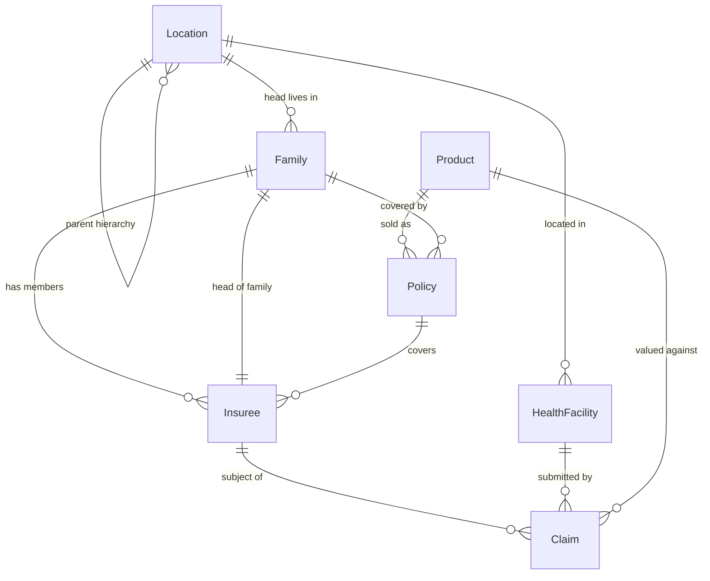
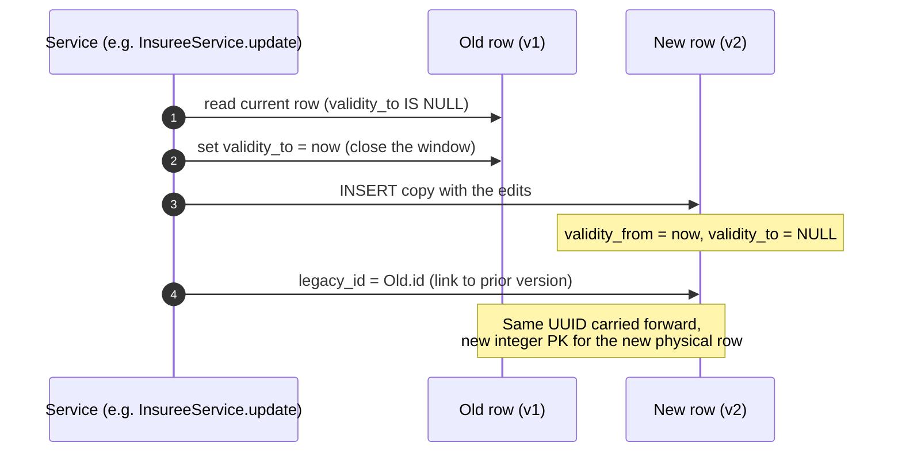
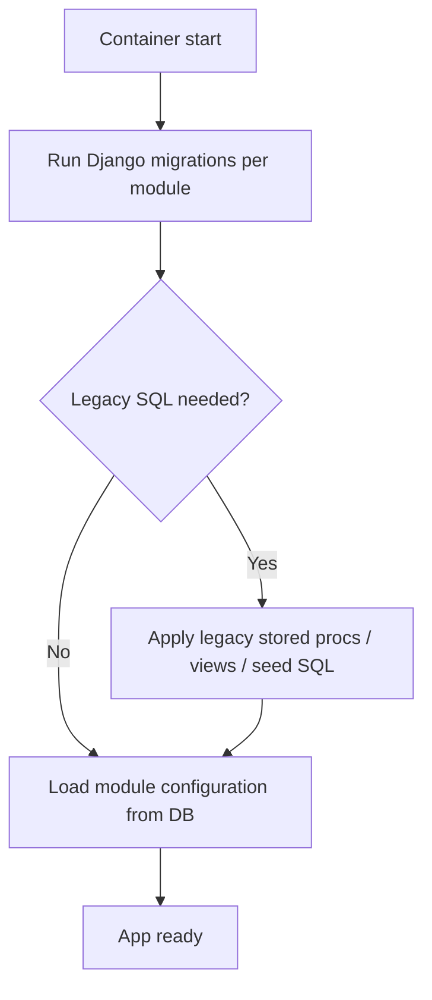

# Part 10 — The Database

openIMIS did not start life as a Django application. It started as **IMIS**, a monolithic Microsoft .NET application backed by **Microsoft SQL Server**, complete with stored procedures and a schema shaped by fifteen years of production use in national health-insurance schemes. When the platform was re-architected into modular Django/React openIMIS around 2018–2019, the team made a deliberate, consequential decision: **keep the data, port the schema.** They did not throw away the model and start clean.

That decision is the single most important thing to understand about the openIMIS database. Almost every "why is it like *this*?" question you will ask has the same answer: **because a running MSSQL IMIS database had to be migratable into it without losing a single insuree, policy, or claim.** This chapter teaches you to read the schema the way its authors think about it, so that the legacy quirks stop looking like mistakes and start looking like constraints honored.

## Learning objectives

By the end of this chapter you will be able to:

- Explain the MSSQL → PostgreSQL heritage and read the `tbl`-prefixed, camelCase schema without confusion.
- Map a physical table to its Django model using `Meta.db_table` and column-level `db_column`.
- Describe the **dual-key** strategy (legacy integer PK alongside a UUID) and justify *why* both exist.
- Explain **temporal versioning / soft delete** via `validity_from` / `validity_to` / `legacy_id`, and how `HistoryModel` and `VersionedModel` implement it.
- Write ORM queries that return only *currently valid* rows, and recognize the classic bug of forgetting to.
- Use `json_ext` for country customization without schema migrations.
- Reason about indexes, migrations (per-module Django + legacy SQL), transactions, and performance.

## Prerequisites

- [Backend Deep Dive](../architecture/backend.md) — how modules assemble into one Django project.
- [Core module](../modules/core.md) — where the base model classes live.
- [Platform Overview](../getting-started/overview.md) — the .NET/MSSQL → Django/React history.
- Working knowledge of the Django ORM, model `Meta` options, and PostgreSQL. We do **not** re-explain those; we explain what openIMIS does *with* them.

---

## 1. Schema heritage: reading a ported database

The first time an experienced Django engineer opens the openIMIS schema, three things look wrong. None of them are.

| What you see | What Django "normally" does | Why openIMIS does it differently |
| --- | --- | --- |
| Table named `tblInsuree` | `insuree_insuree` (`<app>_<model>`) | The physical table name is inherited from IMIS. Django is told about it via `Meta.db_table`. |
| Column `LastName`, `OtherNames`, `CHFID` | `last_name`, `other_names`, snake_case | Columns keep the original MSSQL camelCase names; the model maps them with `db_column`. |
| Integer PK `InsureeID` **and** a `UUID` column | one PK, usually `id` | Dual keys. The legacy integer stayed as the physical PK; a UUID was added for the new API surface. See [§3](#3-the-dual-key-uuid-strategy). |

The Django model is essentially a **translation layer** over the legacy physical schema. The Python attribute names are modern and snake_case; the `db_column`/`db_table` metadata pins each attribute back to the exact legacy identifier so the ORM emits SQL the old database recognizes.

!!! example "Illustrative — a model mapped onto a legacy table"
    This is a *simplified* sketch of the pattern you will find in `openimis-be-insuree_py` (`insuree/models.py`). It is illustrative, not a verbatim copy — read the real source for the authoritative field list.

    ```python
    # illustrative
    class Insuree(core_models.VersionedModel):
        id = models.AutoField(db_column="InsureeID", primary_key=True)
        uuid = models.CharField(db_column="InsureeUUID", max_length=36,
                                default=uuid.uuid4, unique=True)
        chf_id = models.CharField(db_column="CHFID", max_length=12, null=True)
        last_name = models.CharField(db_column="LastName", max_length=100)
        other_names = models.CharField(db_column="OtherNames", max_length=100)
        family = models.ForeignKey("insuree.Family", db_column="FamilyID",
                                   on_delete=models.deletion.DO_NOTHING,
                                   related_name="members", null=True)
        json_ext = models.JSONField(db_column="JsonExt", blank=True, null=True)

        class Meta:
            managed = True
            db_table = "tblInsuree"
    ```

    Notice the shape of the decisions:

    - `db_table = "tblInsuree"` — physical name, not `insuree_insuree`.
    - Every field carries an explicit `db_column` in legacy casing.
    - The primary key is a legacy **integer** `AutoField` on `InsureeID`.
    - There is *also* a `uuid` column.
    - `on_delete=DO_NOTHING` shows up a lot — because openIMIS **soft-deletes** (closes validity windows) rather than issuing SQL `DELETE`. More on that in [§4](#4-temporal-versioning-and-soft-delete).

!!! info "Did you know?"
    Because column names are pinned with `db_column`, you can rename a *Python attribute* for readability in a new module version and the underlying database is untouched — no migration, no risk to a live IMIS dataset. The legacy name is the contract; the Python name is a convenience.

### Naming conventions cheat-sheet

| Convention | Example | Notes |
| --- | --- | --- |
| Legacy tables keep `tbl` prefix | `tblInsuree`, `tblFamilies`, `tblPolicy`, `tblClaim` | Set via `Meta.db_table`. |
| Legacy columns are PascalCase/camelCase | `InsureeID`, `CHFID`, `ValidityFrom` | Set via `db_column`. |
| **New** modules (post-migration) often use plain Django names | `individual_individual`, `tasks_management_task` | Modules with no IMIS ancestor (e.g. `individual`, `social_protection`, `tasks_management`) frequently use ordinary `<app>_<model>` tables and snake_case — they never had to migrate legacy data. |
| Foreign key columns end in `ID` | `FamilyID`, `ProdID`, `HFID` | Mapped with `db_column`; the Python field is a normal `ForeignKey`. |

This split matters: **not every table is legacy.** The `tbl`-prefixed, camelCase world is the IMIS core (insuree, family, policy, product, claim, location, medical…). The newer modules are "Django-native." When you can't guess a table name, open the module's `models.py` and read its `Meta`.

---

## 2. Relationships: the domain graph

Before the keys and versioning, fix the domain shape in your head. The core insurance model is a small, stable graph:



Read it in plain domain language:

- **Location** is a self-referencing hierarchy: region → district → municipality → village. Health facilities and families hang off a location.
- **Family** is the household unit; **Insuree** is a person, always belonging to a family (one member is the head).
- **Product** is an insurance product (benefit package + price list + rules). A **Policy** is a concrete instance of a product sold to a family for a period.
- A **Claim** is a service-delivery event: a health facility claims for care given to an insuree, valued against the product's price lists and [calculation rules](../modules/calculation.md).

Every one of those boxes is a *versioned* table. Which brings us to keys.

!!! info "Did you know?"
    `Location` modeling one physical table with a self-join is why a single misconfigured `parent` pointer can make an entire district "disappear" from reports — the row is valid, but it's orphaned in the hierarchy. Location integrity is a common source of support tickets.

---

## 3. The dual-key UUID strategy

Almost every core table has **two** identities:

1. A **legacy integer primary key** — e.g. `InsureeID`, the physical PK, unchanged from IMIS.
2. A **UUID column** — e.g. `InsureeUUID`, added during modularization.

Your instinct is to ask: pick one. Why carry both?

=== "Why keep the integer PK"

    - **Existing data.** Millions of rows across a national deployment already have integer PKs, and thousands of foreign keys point at them. Rewriting every FK to a UUID during migration is a massive, error-prone, downtime-heavy operation. Keeping the integer PK makes migration a *copy*, not a *rewrite*.
    - **Legacy SQL & stored procedures.** IMIS shipped stored procedures and reports that join on integer keys. Some of that SQL survives (see [§6](#6-migrations-django-plus-legacy-sql)). It expects integers.
    - **Index size & join cost.** A 4-byte integer key indexes tighter and joins cheaper than a 36-char UUID string. On the hot claim/policy joins this is not nothing.

=== "Why add the UUID"

    - **Stable public identifier.** The GraphQL API exposes UUIDs, never raw integer PKs. A UUID is safe to put in URLs and API payloads: it is not guessable or enumerable, so you don't leak "how many insurees exist" or invite `id + 1` probing.
    - **Distributed creation.** UUIDs can be generated client-side or offline (field enrollment on a laptop with no connectivity) and stay unique when the data syncs back. Integer autonumber can't do that.
    - **Decoupling API from storage.** The API contract is the UUID; the storage PK is an implementation detail free to stay legacy.

So the rule of thumb is:

!!! tip "Integer inside, UUID outside"
    The **integer PK is the internal, physical identity** used for joins and legacy SQL. The **UUID is the external, logical identity** used by GraphQL, the frontend, and integrations. Resolvers look objects up by UUID; the ORM joins them by integer.

!!! danger "Common mistake"
    Do not expose or accept the integer PK in a new API. If a mutation takes an `id`, it should be the **UUID**, resolved to the row server-side. Leaking integer PKs re-introduces enumeration attacks that the UUID column was specifically added to prevent. See [Security](../security/index.md).

---

## 4. Temporal versioning and soft delete

This is the concept that most surprises engineers new to openIMIS, and the one that causes the most bugs if misunderstood. **openIMIS core tables are not updated in place, and rows are not deleted.** Instead the database keeps a *temporal history*: every version of a record is a physical row, and time-validity columns say which version was "current" when.

### The three columns

| Column | Type | Meaning |
| --- | --- | --- |
| `validity_from` (`ValidityFrom`) | datetime | When this version became effective. |
| `validity_to` (`ValidityTo`) | datetime, **nullable** | When this version was superseded. **`NULL` ⇒ this is the currently valid row.** |
| `legacy_id` (`LegacyID`) | int, nullable | Points to the integer PK of the previous version of the same logical record — the version chain. |

The invariant you must internalize:

> **A row is "live" if and only if `validity_to IS NULL`.** Everything else is history.

### What an "update" actually does

When you change a versioned record, openIMIS does **not** run `UPDATE tblInsuree SET ...`. It performs a copy-on-write:



Step by step:

1. Load the current version (the one with `validity_to IS NULL`).
2. **Close** it: set its `validity_to = now`. It is now history — still in the table, no longer "live."
3. **Insert** a brand-new row with the edited values, `validity_from = now`, `validity_to = NULL`. It is the new live version.
4. Link them: the new row's `legacy_id` references the old row's integer PK, forming a backward chain.
5. The **UUID is carried forward** — the logical entity keeps its public identity across versions; only the physical integer PK differs per row.

A **delete** is the same minus the insert: just set `validity_to = now`. The row stays in the table forever (auditable), but no longer satisfies `validity_to IS NULL`, so it vanishes from normal queries. That is **soft delete**.

!!! info "Did you know?"
    This gives openIMIS *bitemporal-ish* auditability for free: you can reconstruct exactly what a policy or claim looked like on any past date by filtering `validity_from <= D AND (validity_to IS NULL OR validity_to > D)`. Financial and clinical systems in this domain are frequently required to prove historical state — versioning is a compliance feature, not just a convenience.

### How the base classes implement it

The plumbing lives in [`openimis-be-core_py`](../modules/core.md) (`core/models.py`). You inherit it; you rarely write it.

| Base class | Gives you | Typical use |
| --- | --- | --- |
| `UUIDModel` | a UUID column + helpers | anything needing a public id |
| `VersionedModel` | `validity_from`, `validity_to`, `legacy_id` + `save_history()` / delete-as-close semantics | the classic legacy insurance tables (insuree, family, policy, claim…) |
| `HistoryModel` | versioning built on **`django-simple-history`**-style change tracking + `json_ext` + UUID, with `is_deleted` / validity handling | newer modules (individual, social_protection, tasks_management, payroll…) |
| `HistoryBusinessModel` | `HistoryModel` plus business-date fields (`date_valid_from` / `date_valid_to`) distinct from *technical* validity | records where the *business* effective period differs from the *row* lifetime (e.g. a contract effective next month, created today) |

Two subtle but important distinctions:

- **`VersionedModel` vs `HistoryModel`.** `VersionedModel` is the *legacy* mechanism — the `validity_from/to` + `legacy_id` chain described above, matching how IMIS worked. `HistoryModel` is the *modern* mechanism used by post-migration modules; it achieves the same "never lose the past" goal but with a cleaner, Django-native implementation. When you read core, expect to see both. Use whichever base class the module you're extending already uses.
- **Technical validity vs business validity.** `validity_from/to` describe the *row's* lifetime (when this version existed in the database). `HistoryBusinessModel`'s date fields describe the *real-world* period the record is about. A policy can be *created* today (technical) but *effective* next month (business). Don't conflate them.

??? note "Deep dive: querying only currently-valid rows"
    Because history rows live in the same table, **every normal query must exclude them.** The canonical filter is `validity_to__isnull=True`.

    ```python
    # illustrative — the everyday "give me live insurees" query
    live = Insuree.objects.filter(validity_to__isnull=True)

    # a single logical entity, current version, by its stable UUID:
    insuree = Insuree.objects.get(uuid=some_uuid, validity_to__isnull=True)

    # point-in-time: what did it look like on 2025-01-01?
    from django.db.models import Q
    as_of = datetime(2025, 1, 1)
    snapshot = Insuree.objects.filter(
        uuid=some_uuid,
        validity_from__lte=as_of,
    ).filter(Q(validity_to__isnull=True) | Q(validity_to__gt=as_of))
    ```

    In practice you rarely type `validity_to__isnull=True` by hand, because openIMIS provides help:

    - Many models expose a **custom manager / queryset** whose default `.filter_validity()` (or an `active`/`current` manager) already applies the live filter. Check the model's manager before assuming you must filter manually.
    - The Graphene filter connections in core (`OrderedDjangoFilterConnectionField` and friends) apply validity filtering as part of resolving list queries, so GraphQL clients get live rows by default.

    The safe habit: **assume a query returns history unless something guarantees otherwise**, and know exactly which mechanism is doing the filtering for the query you're writing.

!!! danger "Common mistake — forgetting the validity filter"
    The number-one openIMIS data bug:

    ```python
    # WRONG: returns every historical version too — duplicates, stale data,
    # inflated counts, wrong totals in reports.
    Insuree.objects.filter(family=fam)

    # RIGHT: only the live version of each insuree.
    Insuree.objects.filter(family=fam, validity_to__isnull=True)
    ```

    Symptoms of the missing filter: an insuree who "appears three times," a claim total that's double the real figure, a policy that "won't delete" (you closed one version but queried all of them), or a `get()` that raises `MultipleObjectsReturned`. If any of those appear, **your first suspicion should be a missing `validity_to__isnull=True`.** When you write raw SQL or a legacy report, you must add `WHERE ValidityTo IS NULL` yourself — there is no ORM to do it for you.

---

## 5. `json_ext`: extensibility without migrations

openIMIS is deployed in many countries, each with its own regulatory data needs: one country needs a national ID field on insurees, another needs a caste/ethnicity field for equity reporting, a third needs a tribal-authority code. If every country's fields became real columns, the schema would fork per country and core migrations would become impossible.

The solution is a single JSON column, **`json_ext`** (`JsonExt`), present on most core and modern models:

```json
{
  "national_id": "NP-4471-2201",
  "enrollment_channel": "mobile-agent",
  "consent": { "given": true, "date": "2025-06-14" }
}
```

- It is a PostgreSQL `jsonb`-backed `JSONField`. You can add per-deployment fields **without a migration**.
- Country modules and [calculation rules](../modules/calculation.md) read and write it.
- It can be queried with Django's JSON lookups (`json_ext__national_id="..."`), and — because it's `jsonb` — indexed with a GIN index when a field is queried hot.

!!! tip "Config over forking"
    `json_ext` is the data-layer expression of openIMIS's central philosophy, the same one behind [module configuration](../configuration/index.md): **customize by configuration and extension, never by forking core.** A new required field for one country belongs in `json_ext`, not in a patched `tblInsuree`.

!!! danger "Common mistake"
    Don't put **relational, heavily-queried, integrity-critical** data in `json_ext` just to skip a migration. JSON has no foreign keys, no `NOT NULL`, weaker indexing, and no referential integrity. If a field is core to the domain, joined on constantly, or must be consistent, it deserves a real column and a proper migration. `json_ext` is for the *long tail* of per-deployment extras.

---

## 6. Migrations: Django plus legacy SQL

openIMIS has **two** migration mechanisms, and you need both in your mental model.



1. **Per-module Django migrations.** Every module owns its `migrations/` package. Because the deployable project ([`openimis-be_py`](../architecture/backend.md)) assembles modules dynamically from `openimis.json`, `manage.py migrate` walks *all installed modules* and applies each one's migrations in dependency order — `core` first, then `location`, `medical`, `product`, `insuree`, `policy`, `claim`, and so on. The [Docker startup](../docker/index.md) runs this automatically before the app serves traffic.

2. **Legacy SQL.** Some behavior — stored procedures, views, functions inherited from IMIS, or the initial schema for legacy tables — is applied as **raw SQL**, either through `migrations.RunSQL` operations inside Django migrations or through SQL scripts run at container init. This is why you'll occasionally see stored procedures in the running database that no Python code seems to create.

!!! warning "Migrations with versioned/legacy tables are delicate"
    When you write a migration that touches a `tbl`-prefixed table, remember:

    - The **table name is `db_table`**, not `<app>_<model>` — Django's autodetector handles this if the model's `Meta` is correct, but hand-written `RunSQL` must use the legacy name.
    - You almost never `DELETE`; you close validity windows. A data migration that "removes" rows should set `validity_to`, not issue `DELETE`.
    - Never rewrite integer PKs of live legacy tables in a migration. FKs and legacy SQL depend on them.

---

## 7. Indexes, performance, and transactions

### Indexes

| Index target | Why |
| --- | --- |
| `uuid` columns (unique) | Every API lookup is by UUID — this must be indexed and unique. |
| `validity_to` | Nearly every query filters `validity_to IS NULL`; a partial or plain index here helps enormously on large tables. |
| Foreign key columns (`FamilyID`, `ProdID`, `HFID`, `PolicyID`) | The insurance domain is join-heavy; FK indexes keep claim/policy joins fast. |
| Natural business keys (`CHFID`, product code, HF code) | Frequently searched by operators; often unique-per-live-row. |
| GIN on hot `json_ext` fields | When a country queries a `json_ext` field at scale, index just that path. |

!!! info "Did you know?"
    A **partial index** `CREATE INDEX ... ON tblInsuree (FamilyID) WHERE ValidityTo IS NULL;` indexes only live rows. On a table where 80% of rows are closed history, this can be dramatically smaller and faster than a full index — a natural fit for temporal tables.

### Performance considerations

- **History bloat.** Versioned tables grow forever. A frequently-edited entity accumulates many closed rows. Plan for it: partial indexes on live rows, periodic archival of ancient history to cold storage, and vacuum/autovacuum tuning so PostgreSQL reclaims space from closed-then-superseded churn.
- **`N+1` across versions.** Because a naive query can return multiple versions per entity, an unfiltered list can be far bigger than the logical row count — pathological in reports. Filter validity *first*, then paginate.
- **Read the manager, not just the model.** Whether a query is fast often depends on whether it went through a validity-aware manager. A raw `.objects.all()` on a big versioned table is almost always a mistake.

### Transactions

- **Copy-on-write must be atomic.** Closing the old version and inserting the new one is *one* logical change; if the process dies between them you get either two live rows or zero. Versioned updates run inside `transaction.atomic()` (in core services and the `OpenIMISMutation` machinery) so the close+insert commit or roll back together.
- **Mutations are audited transactions.** The core [asynchronous mutation pattern](../graphql/index.md) writes a `MutationLog`, performs work in a service inside a transaction, and records success/failure. A rolled-back mutation leaves a failed `MutationLog`, not a half-written entity.
- **Isolation.** Standard PostgreSQL `READ COMMITTED` applies; the temporal design means most "conflicts" are avoided structurally (you insert a new version rather than fighting over an in-place update), but you still wrap multi-row invariants in a transaction.

---

## Repository references

| Repository | Directory / File | Why it matters |
| --- | --- | --- |
| `openimis-be-core_py` | `core/models.py` | Home of `UUIDModel`, `VersionedModel`, `HistoryModel`, `HistoryBusinessModel`, and the validity/`json_ext` plumbing. |
| `openimis-be-core_py` | `core/apps.py` (`CoreConfig`) | `ModuleConfiguration` storage; the `DEFAULT_CFG` overlay pattern. |
| `openimis-be-insuree_py` | `insuree/models.py` | Canonical example of `tblInsuree`/`tblFamilies` mapped via `Meta.db_table` + `db_column`, dual keys, versioning. |
| `openimis-be-policy_py` | `policy/models.py` | `tblPolicy` versioned table linking families to products. |
| `openimis-be-claim_py` | `claim/models.py` | `tblClaim` — the join of insuree, health facility, and product; heavy versioning + valuation. |
| `openimis-be-location_py` | `location/models.py` | Self-referencing `Location` hierarchy and `HealthFacility`. |
| `openimis-be_py` | `openimis/settings.py`, `openimis.json` | How installed modules — and therefore which migrations run — are assembled. |
| `openimis-be_py` | `script/` entrypoints | Where migrations and legacy SQL/config loading run at container start. |

---

## Hands-on lab

!!! example "Lab — see versioning with your own eyes"
    Prerequisite: a running dev stack ([Set Up a Dev Environment](../getting-started/setup.md) / [Docker](../docker/index.md)) with a demo dataset loaded.

    1. **Open a Django shell** against the running backend:
       ```bash
       docker compose exec backend python manage.py shell
       ```
    2. **Find a live insuree and inspect the keys:**
       ```python
       from insuree.models import Insuree
       i = Insuree.objects.filter(validity_to__isnull=True).first()
       print(i.id, i.uuid, i.validity_from, i.validity_to)  # note: validity_to is None
       ```
    3. **Count live vs. total** for that person's UUID:
       ```python
       Insuree.objects.filter(uuid=i.uuid).count()                      # all versions
       Insuree.objects.filter(uuid=i.uuid, validity_to__isnull=True).count()  # should be 1
       ```
    4. **Trigger an update** through the UI or a GraphQL mutation (edit the insuree's other names), then re-run step 3. You should now see the total climb while the live count stays **1**. Inspect the newly-closed row: its `validity_to` is set, and the new row's `legacy_id` points back to it.
    5. **Try the classic bug:** run `Insuree.objects.filter(uuid=i.uuid)` and observe the duplicate. Convince yourself why a report that forgot `validity_to__isnull=True` would double-count.
    6. **Peek at the physical schema:**
       ```bash
       docker compose exec db psql -U <user> -d <db> -c "\d \"tblInsuree\""
       ```
       Confirm the legacy table name, camelCase columns, integer PK, UUID column, and validity columns are exactly as described.

## Exercises

1. Write a queryset that returns, for one family, only the **currently-valid head of family**. Prove it survives an update to the head.
2. Given a UUID, reconstruct what the insuree looked like on `2024-01-01` using only `validity_from` / `validity_to`.
3. Design where a new country-specific field ("household electrification status") should live — real column or `json_ext`? Justify using the criteria in [§5](#5-json_ext-extensibility-without-migrations).
4. Explain, to a teammate who knows Django but not openIMIS, why `on_delete=DO_NOTHING` is common here and why that is *not* dangerous given soft delete.

## Knowledge check

??? question "Q1: Why does a core openIMIS table carry both an integer PK and a UUID? (click for answer)"
    The **integer PK is legacy and internal** — it preserves IMIS data and lets existing foreign keys and legacy SQL keep working, and it's cheaper to index/join. The **UUID is new and external** — it's the stable, non-enumerable public identifier exposed by GraphQL and used across distributed/offline enrollment. Integer inside, UUID outside.

??? question "Q2: What single WHERE condition distinguishes a live row from history, and why is it so bug-prone? (click for answer)"
    `validity_to IS NULL` (`validity_to__isnull=True`). It's bug-prone because history rows live in the *same table*; omit the filter and every query silently includes superseded versions, causing duplicates, inflated totals, and `MultipleObjectsReturned`.

??? question "Q3: Describe what physically happens in the database when you 'update' a versioned insuree. (click for answer)"
    Copy-on-write inside a transaction: the current row's `validity_to` is set to now (closing it), a new row is inserted with the edits, `validity_from = now`, `validity_to = NULL`, and `legacy_id` pointing at the old row's integer PK. The UUID carries forward; the integer PK is new. Nothing is UPDATEd in place and nothing is DELETEd.

??? question "Q4: When should country-specific data go in `json_ext` versus a real column? (click for answer)"
    `json_ext` for the long tail of per-deployment extras that aren't heavily joined or integrity-critical — it avoids per-country schema forks and needs no migration. A real column when the field is core, joined on frequently, must be `NOT NULL`/foreign-keyed, or needs strong indexing/referential integrity.

??? question "Q5: Why is `Meta.db_table = \"tblInsuree\"` present, and what does it tell you about the table's origin? (click for answer)"
    It pins the Django model to the legacy physical table name inherited from MSSQL IMIS instead of Django's default `insuree_insuree`. Its presence (plus camelCase `db_column`s and a `tbl` prefix) marks the table as **migrated legacy data**, versus newer modules that use Django-native table names because they had no IMIS ancestor.

## Further reading

- [Backend Deep Dive](../architecture/backend.md) — how modules and their migrations assemble.
- [Core module](../modules/core.md) — the base model classes in depth.
- [Configuration System](../configuration/index.md) — the "config over forking" philosophy `json_ext` expresses at the data layer.
- [Docker Architecture](../docker/index.md) — where migrations and legacy SQL run at container start.
- [Troubleshooting](../reference/troubleshooting.md) — symptoms of the missing-validity-filter bug and how to diagnose them.
- openIMIS repositories: [github.com/openimis](https://github.com/openimis) — read `core/models.py` and `insuree/models.py` for the authoritative field definitions.
- PostgreSQL docs on `jsonb`, GIN indexes, and partial indexes — the mechanisms behind `json_ext` and live-row indexing.
