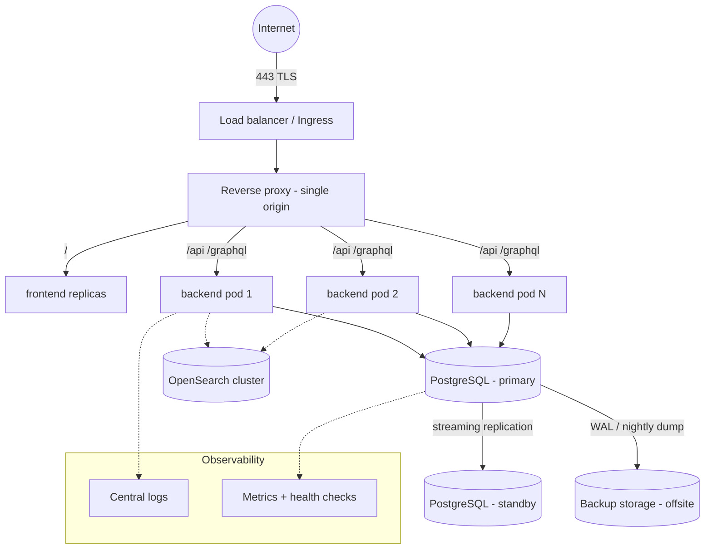
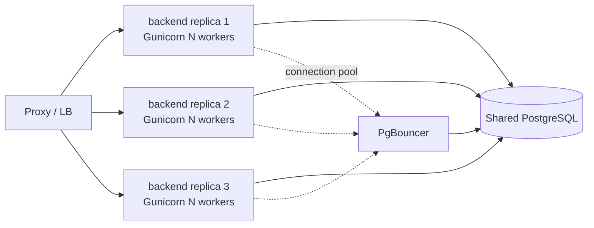
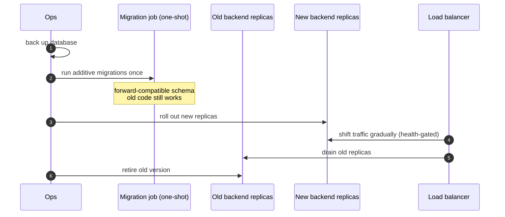

# Deployment & Operations

The [previous chapter](index.md) got the stack running on your laptop. This one is about running it in a country. openIMIS deployments are not toy apps — they are the operational backbone of **national social health protection** schemes, holding the beneficiary registry, the policies, and the claims that pay real health facilities for real care. Downtime and data loss have human consequences. Production operations therefore prioritize, in order: **don't lose data, stay available, stay secure, then scale.**

This chapter covers the deployment models, the reverse proxy and TLS, how to scale a stateless Django app against a shared database, backups and production migrations, secrets, observability, upgrades, and how each country tailors its deployment **without forking core.**

## Learning objectives

- Choose between single-node `docker-compose` and orchestrated (Kubernetes) deployment, and know the trade-offs.
- Configure the reverse proxy for TLS termination and a single secure origin.
- Scale the backend horizontally by treating it as a **stateless app over a shared database** (Gunicorn workers + multiple replicas).
- Design a **backup + restore** strategy and run migrations safely in production.
- Manage **secrets** correctly across environments.
- Stand up **observability**: logs, health checks, and OpenSearch-based monitoring/analytics.
- Reason about **zero-downtime upgrades** given that the backend self-migrates.
- Apply **country-specific customization** through configuration, not code forks.

## Prerequisites

- [Docker Architecture](index.md) — the stack, its startup order, and the gateway.
- [Configuration System](../configuration/index.md) — the layered `.env` → settings → manifest → DB-config model you'll tune per environment.
- [Security](../security/index.md) — auth, TLS, and hardening this chapter assumes.
- [The Database](../database/index.md) — migrations and the temporal schema you'll back up and upgrade.

---

## 1. Deployment models

There are two broad shapes, and most openIMIS deployments start with the first.

=== "Single-node docker-compose"

    The entire stack from [Part 12](index.md) on one adequately-sized VM, orchestrated by `docker compose`, fronted by the gateway with TLS.

    **Good when:** a single country instance, moderate and predictable load, a small ops team, and simplicity/auditability matter more than elastic scale. This is the **most common production topology** for openIMIS and it is entirely legitimate — a well-provisioned single node with good backups serves a national scheme reliably.

    **Trade-offs:** the node is a single point of failure; scaling is *vertical* (bigger VM) plus more Gunicorn workers; upgrades briefly touch the whole box. You mitigate with backups, a standby VM, and a rehearsed restore.

=== "Orchestrated / Kubernetes"

    The same containers as Kubernetes workloads: the backend as a horizontally-scalable **Deployment** (many stateless pods behind a Service), the frontend as another, an **Ingress** as the gateway/TLS layer, PostgreSQL as either a managed cloud database or a carefully-run StatefulSet, and OpenSearch as its own operator-managed cluster.

    **Good when:** high availability is required, load is variable, you already run Kubernetes, or you need rolling upgrades and self-healing.

    **Trade-offs:** substantially more operational complexity. **Stateful components need care** — running PostgreSQL in Kubernetes is a specialist task; most teams use a *managed* database instead and keep only the stateless tiers in the cluster. Don't adopt Kubernetes for its own sake; adopt it when its HA/scaling guarantees are genuinely needed.



The invariant that makes everything on the right of that diagram possible: **the backend is stateless.** All state lives in PostgreSQL (and uploaded media / OpenSearch). That is what lets you run one backend or ten identically.

---

## 2. Reverse proxy and TLS

In production the gateway does two extra jobs beyond the routing you saw in [Part 12](index.md#5-how-the-gateway-routes): it **terminates TLS** and it is the **only** thing on the public internet.

- **TLS termination at the edge.** The gateway (Nginx/Ingress) holds the certificate and serves HTTPS; traffic to `backend`/`frontend` stays on the private network. Certificates come from Let's Encrypt (ACME auto-renewal) or the country's own CA.
- **Redirect HTTP → HTTPS** and set security headers (HSTS, sane cache/security headers) at the proxy.
- **Single origin preserved.** TLS doesn't change routing: `/` → frontend, `/api` + `/graphql` → backend, all under one HTTPS origin. That single-origin design is what keeps the **HttpOnly JWT cookie** working and the app CORS-free (see [Security](../security/index.md)).
- **Cookie flags in prod.** With HTTPS the auth cookie is served `Secure` + `HttpOnly` (+ appropriate `SameSite`). Ensure `DEBUG=False` and correct `ALLOWED_HOSTS`/`SITE_URL` so Django emits secure cookies and absolute URLs correctly.

!!! danger "Common mistake — terminating TLS but leaving Django thinking it's on HTTP"
    Behind a TLS-terminating proxy, Django must be told the original request was HTTPS (via the forwarded proto header and `SECURE_PROXY_SSL_HEADER`), or it will build `http://` URLs and may refuse to set `Secure` cookies. Configure the proxy to pass `X-Forwarded-Proto` and Django to trust it. Symptom: redirect loops or "insecure cookie" behavior behind a perfectly good certificate.

---

## 3. Scaling the backend

Because the backend is a **stateless Django app over a shared database**, scaling has two independent dials.

### Dial 1 — Gunicorn workers (scale up, within one container)

Gunicorn runs multiple worker processes per container. More workers = more concurrent requests handled by one backend instance. The classic starting point is roughly `2 × CPU cores + 1` workers, tuned by profiling. Because openIMIS is I/O-bound (lots of database round-trips), you can often push worker count a bit higher, but watch **database connections**: every worker holds connections, and PostgreSQL has a `max_connections` ceiling.

### Dial 2 — Replicas (scale out, more containers)

Run several identical backend containers/pods behind the proxy. Since no request depends on which instance served the last one (state is in the DB and the JWT cookie, not in-process), the load balancer can spread requests freely. This is *horizontal* scaling and it's the main lever under real load.



!!! tip "The database is the real bottleneck"
    Stateless app tiers scale trivially; the **shared PostgreSQL** does not. Before adding backend replicas, make sure the database can take the extra connections and query load. Put a **connection pooler (PgBouncer)** in front of PostgreSQL so N replicas × M workers don't exhaust `max_connections`. Offload heavy read/analytics traffic to **OpenSearch** ([§6](#6-observability)) and read replicas rather than hammering the primary.

!!! warning "Two things that are NOT the stateless web tier"
    - **The scheduler (APScheduler).** Background jobs must run in exactly one place, or you'll double-execute. If you scale the backend, run the scheduler as a *single* dedicated instance/replica, not once per web replica.
    - **Migrations.** Applied once per deploy, not per replica ([§4](#4-database-backups-and-migrations-in-production)).

---

## 4. Database backups and migrations in production

### Backups — the non-negotiable

The database volume holds everything irreplaceable. Protect it in layers:

| Layer | Mechanism | Recovery capability |
| --- | --- | --- |
| Logical dumps | `pg_dump` on a schedule (nightly), stored **offsite** | Restore to a point-in-day; portable across versions |
| Physical / continuous | WAL archiving + base backups (e.g. `pgBackRest`, `wal-g`) | **Point-in-time recovery** to any moment |
| Standby replica | Streaming replication to a second server | Fast failover; not a substitute for backups |
| Verification | **Periodic test restores** into a scratch environment | Proves the backups actually work |

!!! danger "An untested backup is not a backup"
    The most common — and most catastrophic — operations failure is discovering during an incident that the backups were corrupt, incomplete, or never actually ran. **Rehearse the restore** on a schedule. Also remember openIMIS **soft-deletes**: because rows are versioned rather than physically deleted ([Database](../database/index.md#4-temporal-versioning-and-soft-delete)), the database grows steadily — size your storage and dump windows accordingly.

### Migrations in production

The backend **self-migrates at startup** ([Part 12 §3](index.md#3-startup-order-the-part-people-get-wrong)) — hugely convenient, and a real hazard if unmanaged:

- **Back up immediately before migrating.** A migration is a schema change on live national data. Take a fresh dump first, every time.
- **Run migrations once, not per replica.** With multiple backend replicas, don't let all of them race to migrate. Run migrations as a **dedicated one-shot step** (a migration job/init container, or a single "primary" backend) *before* rolling out the new app replicas. Concurrent migrations corrupt state.
- **Test migrations on a restored copy first.** Restore last night's dump into staging, run the new migrations there, confirm they apply cleanly and in reasonable time on production-sized data. Long-running migrations on huge versioned tables can lock things — know the runtime before production.
- **Forward-compatible when possible.** For zero-downtime, prefer additive migrations (new nullable columns, new tables) that the *old* code tolerates, so old and new app versions can briefly coexist during a rollout ([§7](#7-zero-downtime-upgrades)).

---

## 5. Secrets management

`.env` is fine for a laptop. Production secrets need more discipline.

| Secret | Where it must **not** live | Where it should live |
| --- | --- | --- |
| `DJANGO_SECRET_KEY` | git, image layers, shared chat | Secret store / orchestrator secret, injected at runtime |
| `DB_PASSWORD` | committed `.env`, Dockerfile | Secret store; rotated |
| OIDC client secrets, API keys | source, logs | Secret store; scoped per environment |
| TLS private keys | app repo | Proxy/Ingress secret; restricted file perms |

Principles:

- **Never commit real secrets.** Commit `.env.example` with placeholders; keep the real `.env` out of git and off images.
- **Inject at runtime**, don't bake into images. Docker/Compose secrets, Kubernetes Secrets, or an external manager (Vault, cloud secret manager) delivered as env vars or mounted files.
- **Distinct secrets per environment.** Dev, staging, and production must not share a `DJANGO_SECRET_KEY` or database password.
- **Rotate**, and have a documented rotation procedure — especially after any suspected exposure or staff change.

Cross-reference: the security implications of these values are detailed in [Security](../security/index.md), and their layering in [Configuration](../configuration/index.md).

---

## 6. Observability

You cannot operate what you cannot see. Three pillars.

### Logging

- Containers log to **stdout/stderr**; ship those to a central store (ELK/OpenSearch, Loki, or a cloud logging service) so logs survive container churn and are searchable across replicas.
- Log at appropriate levels; **never log secrets, tokens, or full request bodies** containing beneficiary data. With `DEBUG=False`, Django won't leak tracebacks to users — route them to your log sink instead.

### Health checks

- The `db` **healthcheck** gates startup ([Part 12](index.md#3-startup-order-the-part-people-get-wrong)).
- Give the **backend** a health/readiness endpoint the load balancer or Kubernetes probes hit, so unhealthy replicas are pulled from rotation automatically. Distinguish *liveness* (process alive) from *readiness* (can serve — DB reachable, migrations applied).
- Alert on: backend 5xx rate, DB connection saturation, disk space (remember the ever-growing versioned tables), certificate expiry, and replication lag.

### Analytics and monitoring with OpenSearch

The optional **OpenSearch** service backs the `opensearch_reports` module. Beyond analytics dashboards for programme data, the same cluster commonly doubles as the **log/metrics sink**, giving operators one place to search operational logs and programme analytics. Running it well means a proper multi-node cluster with its own persistence and resourcing — treat it as infrastructure, not an afterthought.

!!! info "Did you know?"
    Offloading reporting queries to OpenSearch isn't only a features decision — it's a **scaling** decision. Heavy analytical scans over the versioned PostgreSQL tables compete with transactional traffic (enrollment, claims). Serving reports from OpenSearch keeps the primary database responsive for the operations that must never slow down.

---

## 7. Zero-downtime upgrades

Because the backend self-migrates, naïve upgrades cause a blip: recreate the backend, it migrates, brief unavailability. To approach zero downtime:



Key ideas:

1. **Decouple migration from app rollout.** Run migrations as a single controlled step *before* bringing up new app replicas — never let replicas race to migrate ([§4](#4-database-backups-and-migrations-in-production)).
2. **Make migrations forward-compatible.** Additive changes (nullable columns, new tables) let old and new backend versions run simultaneously during the rollout window. Reserve destructive changes for a later, separate step once all replicas are new. The **soft-delete/versioning** model helps here: you close old versions rather than dropping data, so schema evolution rarely requires destructive DELETEs.
3. **Roll replicas gradually behind health checks** so traffic only moves to instances that are ready.
4. **Keep a rollback path:** the pre-upgrade backup, the previous image tag, and a plan. If a migration can't be cleanly reversed, that's exactly why the backup exists.

!!! warning "Single-node reality check"
    True zero-downtime needs multiple replicas and forward-compatible migrations. On a **single-node** deployment you generally accept a short maintenance window: announce it, back up, upgrade, verify. That's a perfectly responsible posture for many national instances — honesty about the window beats a fragile pretense of zero downtime.

---

## 8. Country-specific deployment customization

openIMIS runs in many countries, each with different products, languages, regulatory fields, and integrations. The governing rule — the whole reason the platform is modular — is:

!!! quote "The prime directive"
    **Customize by configuration and extension, never by forking core.** A forked core cannot receive upstream security fixes and features; a configured deployment can.

Where each kind of difference lives:

| Country difference | Handled by | Not by |
| --- | --- | --- |
| Which modules run | `openimis.json` manifest (image build) | patching another country's image |
| Runtime behavior, permissions, feature toggles | DB-backed `ModuleConfiguration` overlay | editing module `DEFAULT_CFG` in source |
| Environment values (URLs, DB, secrets) | `.env` per deployment | hard-coding in settings |
| Extra data fields | `json_ext` columns ([Database](../database/index.md#5-json_ext-extensibility-without-migrations)) | new columns forked into `tblInsuree` |
| Language / labels | i18n (backend + react-intl) + config | forking the frontend |
| New country logic | a **new module** + service signals | editing core in place |

All of these are the deployment-time expressions of the [Configuration System](../configuration/index.md). The operational payoff is concrete: when upstream ships a security patch, a *configured* deployment pulls the new image, runs migrations, and keeps its `.env` + DB config + `json_ext` + custom modules intact. A *forked* deployment has to merge, and eventually stops merging, and eventually stops getting fixes.

---

## Repository references

| Repository | Directory / File | Why it matters |
| --- | --- | --- |
| `openimis-dist_dkr` | `docker-compose.yml`, gateway conf, `.env.example` | The production stack, TLS/proxy config, and environment template you adapt per country. |
| `openimis-be_py` | `Dockerfile`, `script/` | Startup migration/config behavior you must control in prod deploys. |
| `openimis-be_py` | `openimis/settings.py` | Where `DEBUG`, `ALLOWED_HOSTS`, secure-cookie/proxy-header, and DB settings are read. |
| `openimis-be_py` | `openimis.json` | Per-country module set (build-time). |
| `openimis-be-core_py` | `core/apps.py` (`ModuleConfiguration`) | The runtime config overlay operators tune without code changes. |
| `openimis-be-opensearch_reports_py` | module root | Analytics/monitoring backed by OpenSearch. |

---

## Hands-on lab

!!! example "Lab — production-shape a deployment"
    Do this against a staging VM or a second local project, never a live instance.

    1. **Harden the environment file:** set `DEBUG=False`, a strong unique `DJANGO_SECRET_KEY`, correct `ALLOWED_HOSTS`/`SITE_URL`, and a real `DB_PASSWORD`. Confirm the app still boots and that error pages no longer show tracebacks.
    2. **Add TLS at the gateway:** put a certificate (self-signed for the lab) on the proxy, redirect HTTP→HTTPS, and configure `X-Forwarded-Proto` + Django's `SECURE_PROXY_SSL_HEADER`. Verify the auth cookie is now `Secure`.
    3. **Take and restore a backup:**
       ```bash
       docker compose exec db pg_dump -U <user> <db> > backup.sql   # dump
       # simulate loss into a scratch DB, then:
       docker compose exec -T db psql -U <user> <scratchdb> < backup.sql
       ```
       Prove the restore contains your data. This is the single most important operational muscle to build.
    4. **Scale the backend** to multiple replicas (`docker compose up -d --scale backend=3` or the compose `deploy.replicas` equivalent) and confirm the proxy balances across them and login still works on any replica (statelessness proven).
    5. **Separate migrations from rollout:** disable auto-migrate-on-start for a run, apply migrations as a one-shot (`docker compose run --rm backend python manage.py migrate`), *then* start the app replicas. Note the difference from the default self-migrating behavior.
    6. **Wire up observability:** ship container logs to a central sink and add a backend health probe the proxy consults; kill a replica and watch it get pulled from rotation.

## Exercises

1. Draw the failure modes of the single-node model and the mitigation for each (SPOF, disk fills from versioned growth, bad migration, cert expiry).
2. You must add three national-ID-style fields for a new country. Show that this needs **no** core changes — specify exactly where each lives.
3. Your backend is at 6 replicas × 8 Gunicorn workers and PostgreSQL is refusing connections. Diagnose and propose a fix without adding database CPU.
4. Write the upgrade runbook for a schema change that adds a new nullable column, targeting zero downtime across 3 replicas.

## Knowledge check

??? question "Q1: What property of the backend makes horizontal scaling possible, and what must you watch as you add replicas? (click for answer)"
    The backend is **stateless** — all state is in PostgreSQL (plus media/OpenSearch) and the JWT cookie — so any replica can serve any request. As you add replicas, watch database **connection exhaustion** (use PgBouncer) and don't run the single-instance scheduler or migrations per replica.

??? question "Q2: Why must migrations be decoupled from app rollout when running multiple replicas? (click for answer)"
    If every replica self-migrates at start, they race and can corrupt schema state. Migrations must run **once** as a controlled one-shot step before new app replicas roll out — ideally additive/forward-compatible so old and new code coexist during the rollout.

??? question "Q3: What must you configure so Django sets Secure cookies correctly behind a TLS-terminating proxy? (click for answer)"
    The proxy must forward `X-Forwarded-Proto`, and Django must trust it via `SECURE_PROXY_SSL_HEADER`, with `DEBUG=False` and correct `ALLOWED_HOSTS`/`SITE_URL`. Otherwise Django thinks it's on HTTP, builds `http://` URLs, and may refuse Secure cookies — causing redirect loops or insecure-cookie behavior.

??? question "Q4: Why is offloading reports to OpenSearch a scaling decision, not just a feature? (click for answer)"
    Heavy analytical scans over the versioned PostgreSQL tables compete with transactional enrollment/claims traffic. Serving reports from OpenSearch keeps the primary database responsive for operations that must not slow down, effectively separating the analytical and transactional workloads.

??? question "Q5: A country needs extra beneficiary fields and a new language. Why is forking core the wrong answer? (click for answer)"
    A fork can't cleanly receive upstream security fixes and features. Extra fields belong in `json_ext`, language in i18n/config, behavior in the DB-backed `ModuleConfiguration`, and new logic in a new module — all of which survive image upgrades. Configuration over forking keeps the deployment maintainable and patchable.

## Further reading

- [Docker Architecture](index.md) — the stack this chapter operationalizes.
- [Configuration System](../configuration/index.md) — the layered config you tune per environment and country.
- [Security](../security/index.md) — TLS, secrets, auth, and hardening in depth.
- [The Database](../database/index.md) — backups, migrations, and the versioned growth you must plan for.
- openIMIS distribution repo and wiki: [github.com/openimis](https://github.com/openimis).
- PostgreSQL docs: continuous archiving / PITR, streaming replication; PgBouncer documentation.
