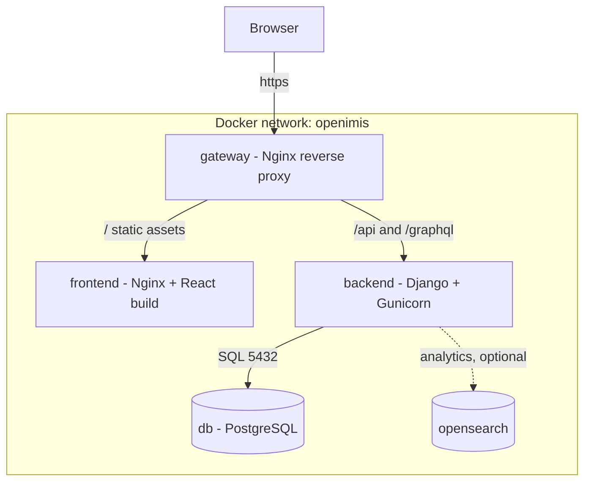
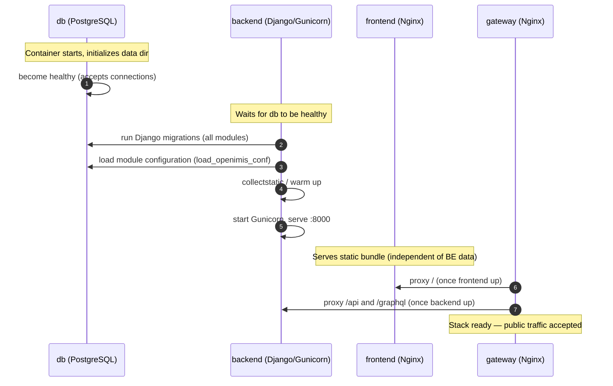
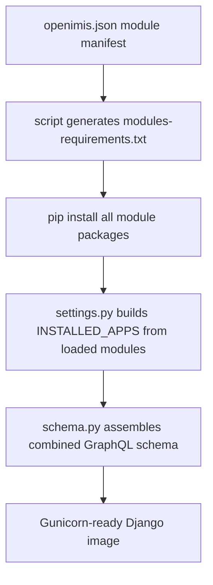

# Part 12 — Docker Architecture

openIMIS is not one program. It is a **Django backend assembled from ~47 modules**, a **React single-page application assembled from its own set of frontend modules**, a **PostgreSQL database** carrying a schema descended from legacy IMIS, a **reverse proxy** stitching them into one origin, and optionally an **OpenSearch** cluster for analytics. Getting all of that to stand up, in the right order, with the right configuration, on any engineer's laptop *and* on a national production server — that is the job of the distribution repository, **`openimis-dist_dkr`**, and its `docker-compose` stack.

This chapter is the map of that stack: which containers exist, how they talk, what order they must start in, and why. By the end you will bring the whole thing up yourself.

## Learning objectives

- Enumerate the containers in the openIMIS Docker stack and state each one's job.
- Explain the **startup order** — why `db` must be healthy before `backend`, and why `backend` must migrate and load module config before it serves.
- Trace a browser request through the **gateway** to either the frontend or the backend (`/api`, `/graphql`).
- Understand how the **backend image is built** from `openimis-be_py` and how it installs modules from `openimis.json`.
- Read and reason about the `docker-compose` **services, volumes, networks**, and the `.env` file.
- Bring the stack up and verify it end-to-end.

## Prerequisites

- [Backend Deep Dive](../architecture/backend.md) — how modules assemble into one Django project.
- [The Database](../database/index.md) — why migrations at startup matter and what they touch.
- [Configuration System](../configuration/index.md) — the layered config model the containers read.
- Comfort with Docker, `docker compose`, images vs. containers, volumes, and Linux networking basics. We build on those, not re-teach them.

---

## 1. The services

The stack is a small set of cooperating containers, each a single responsibility. The exact service names and image tags evolve, so treat this as the shape — confirm specifics in the `docker-compose.yml` of `openimis-dist_dkr`.

| Service | Image / base | Responsibility | Listens on |
| --- | --- | --- | --- |
| `db` | PostgreSQL | The single source of truth. Holds the legacy-derived schema, all module tables, and the DB-backed `ModuleConfiguration`. | 5432 (internal) |
| `backend` | Built from `openimis-be_py` | Django app served by **Gunicorn**. Runs migrations + loads module config at start, then serves `/api` and `/graphql`. | 8000 (internal) |
| `frontend` | Built from `openimis-fe_js`, served by **Nginx** | Static React SPA bundle (built with Vite). Pure static files — no application logic at runtime. | 80 (internal) |
| `gateway` | Nginx reverse proxy | The **only** publicly exposed service. Routes `/` to `frontend`, `/api` + `/graphql` to `backend`, terminates the single origin. | 80/443 (published) |
| `opensearch` *(optional)* | OpenSearch (+ Dashboards) | Backing store for `opensearch_reports` analytics; only present when analytics is enabled. | 9200 (internal) |

The mental model:



Read the crucial facts off that diagram:

- **Only the gateway is exposed.** `db`, `backend`, and `frontend` have no published ports; they're reachable only on the internal Docker network by service name. This is a security posture, not an accident — the database is never on the public internet, and the backend is never hit except through the proxy.
- **The frontend is dumb.** It's a bundle of static files. All "smarts" (auth, data, business logic) live in `backend`. The React app talks to `/graphql` on the *same origin*, so there is no CORS problem and the JWT cookie flows cleanly.
- **The backend is the only writer to the database.** Everything funnels through Django.

!!! info "Did you know?"
    Serving the SPA and the API from **one origin** (via the gateway) is what lets openIMIS store the auth JWT in an **HttpOnly cookie** instead of `localStorage`. Same origin ⇒ the cookie is sent automatically with every `/graphql` request, and JavaScript can't read it — a meaningful XSS mitigation. Split origins would have forced a weaker token-in-JS design. See [Security](../security/index.md).

---

## 2. Volumes and networks

### Volumes

| Volume | Mounted by | Purpose |
| --- | --- | --- |
| `database` (named volume) | `db` | Persists PostgreSQL data across container restarts. **Deleting this destroys your data.** |
| `photos` / media (bind or named) | `backend` | Insuree photos and uploaded files — must survive container rebuilds. |
| gateway config | `gateway` | Nginx `.conf` routing rules and (in prod) TLS certificates. |
| `opensearch-data` *(optional)* | `opensearch` | Analytics index persistence. |

The rule: **anything stateful lives in a volume, not the container filesystem.** Containers are cattle — rebuilt freely. The database volume is the one you protect with your life (and backups — see [Deployment & Operations](deployment.md)).

### Networks

By default compose creates one bridge network for the project. Containers resolve each other by **service name** as DNS host: the backend connects to the database at host `db`, the gateway proxies to `backend:8000` and `frontend:80`. That name-based service discovery is why the `.env` database host is literally `db`, not an IP.

!!! tip "Two networks in hardened setups"
    Production configurations sometimes split into a *frontend* network (gateway ↔ frontend/backend) and a *backend* network (backend ↔ db), so the database is not even on the same network as the public-facing proxy. If you see two networks in the compose file, that's the reason.

---

## 3. Startup order — the part people get wrong

You cannot start these containers in any order. There is a strict dependency chain, and if you violate it the stack fails in confusing ways (backend crash-looping because the DB isn't ready; frontend served but every API call 502s).



Walk the chain:

1. **`db` first, and it must be *healthy*, not merely *started*.** PostgreSQL takes seconds to initialize its data directory on first boot. "Container running" ≠ "accepting connections." Compose expresses this with `depends_on` + a **healthcheck** (e.g. `pg_isready`) so the backend waits for *ready*, not just *created*.
2. **`backend` second, and it does real work before serving.** On start, the backend's entrypoint script (from `openimis-be_py`, under `script/`) runs:
   - `manage.py migrate` — applies every installed module's migrations in dependency order (`core` first). See [Database → Migrations](../database/index.md#6-migrations-django-plus-legacy-sql).
   - **module config load** (`openimisconf/load_openimis_conf.py`) — seeds/updates the DB-backed `ModuleConfiguration` overlay so runtime config is present.
   - `collectstatic` / warmup, then **Gunicorn** starts and binds `:8000`.
   Only *after* all that does the backend answer requests. This is why the first boot is slow and why you must not front it with the gateway prematurely.
3. **`frontend`** can come up in parallel — it's static and doesn't need the database — but there's no point routing traffic to it before the backend is ready, because the app immediately calls `/graphql`.
4. **`gateway` last (logically).** It ties the origin together. Until backend and frontend are up, its upstreams don't exist. In practice compose starts it early and Nginx tolerates upstreams appearing, but the stack is only *usable* once the backend has finished migrating and Gunicorn is live.

!!! danger "Common mistake — assuming 'container up' means 'ready'"
    A backend that crash-loops on first boot is almost always racing the database: it tried to migrate before PostgreSQL accepted connections. The fix is a **healthcheck-gated `depends_on`** (wait for `db` healthy), not a `sleep`. Likewise, a frontend that loads but shows "network error" everywhere means the **backend isn't finished migrating** yet — wait for it, don't restart the frontend.

!!! info "Did you know?"
    Because migrations run automatically at backend start, **deploying a new version is often just: pull the new backend image and recreate the backend container.** It migrates itself forward. That convenience is also a hazard in production — see the zero-downtime discussion in [Deployment & Operations](deployment.md).

---

## 4. How the backend image is built

This is the piece that connects Docker to the [module architecture](../architecture/backend.md). The backend image is not a fixed application — it's **assembled at build time from a manifest.**



1. **`openimis.json` is the source of truth.** It lists ~47 modules, each with a pip/git source and version. A build script turns it into `modules-requirements.txt`.
2. **`pip install`** pulls every module into the image. For development you swap this for **editable installs** (`pip install -e ../openimis-be-core_py/`) so a bind-mounted checkout's changes are live without rebuilding.
3. At **runtime**, `openimis/settings.py` reads the loaded module list and builds `INSTALLED_APPS` dynamically; `openimis/schema.py` imports each module's `schema.Query`/`schema.Mutation` and combines them by multiple inheritance into one root schema; `openimis/urls.py` collects each module's URL patterns plus `/graphql`.

The consequence for Docker: **which modules a deployment runs is a property of the image (the manifest baked in), the migrations that run, and the config loaded** — not something you toggle at runtime. Add a module ⇒ change `openimis.json` ⇒ rebuild the backend image ⇒ new migrations run on next start. This is the through-line from [Configuration](../configuration/index.md): environment tunes behavior at runtime, but the *set of installed modules* is a build-time decision.

!!! tip "Dev vs. prod image"
    In development, the compose file typically **bind-mounts** your local backend and module checkouts into the container and uses editable installs, so you edit code on the host and Django's autoreloader (or a restart) picks it up. In production, the image is **self-contained** — code baked in, no bind mounts — so it's reproducible and immutable.

---

## 5. How the gateway routes

The gateway is a plain Nginx reverse proxy, and its config is short and worth understanding literally, because it's the whole reason the SPA and API feel like "one website."

```nginx
# illustrative gateway routing — see openimis-dist_dkr for the real conf
location /api/ {
    proxy_pass http://backend:8000;
}
location /graphql {
    proxy_pass http://backend:8000;
}
location /site_static/ {   # Django static/admin assets
    proxy_pass http://backend:8000;
}
location / {               # everything else = the React SPA
    proxy_pass http://frontend:80;
}
```

| Incoming path | Proxied to | Why |
| --- | --- | --- |
| `/` and all app routes | `frontend:80` | The React SPA bundle. Client-side routing handles sub-paths. |
| `/graphql` | `backend:8000` | The single GraphQL endpoint the whole app uses. |
| `/api/...` | `backend:8000` | REST/legacy endpoints: reports, FHIR (`/api/api_fhir_r4/`), auth helpers. |
| static/admin | `backend:8000` | Django-served static (admin, etc.). |

Because everything is served from the **same origin** through this one proxy, the browser sees a single site. The JWT HttpOnly cookie set by the backend is scoped to that origin and rides along on every `/graphql` call automatically. In production this same layer terminates **TLS** ([Deployment & Operations](deployment.md)).

!!! danger "Common mistake — bypassing the gateway in dev"
    If you expose the backend on `localhost:8000` and the frontend on `localhost:3000` and hit them directly, you've created **two origins**. Now the auth cookie won't flow, you'll fight CORS, and "it works in prod but not locally" bugs appear. Prefer running the *gateway* locally so your dev topology matches production. When you must run split, know that you're deviating from the real routing.

---

## 6. Environment variables and `.env`

`docker-compose` reads a **`.env`** file for all deployment-specific values — this is layer one of the [configuration system](../configuration/index.md). It never contains code, only values, and it is **never committed** with real secrets.

| Variable (illustrative names) | Consumed by | Purpose |
| --- | --- | --- |
| `DB_HOST` | backend | Database host — the service name `db`. |
| `DB_NAME`, `DB_USER`, `DB_PASSWORD`, `DB_PORT` | backend, db | Database connection + PostgreSQL init credentials. |
| `DJANGO_SECRET_KEY` | backend | Django cryptographic secret. **Must** be strong and secret in prod. |
| `DEBUG` | backend | `True` only in dev. Must be `False` in production. |
| `ALLOWED_HOSTS` | backend | Hostnames Django will serve. |
| `SITE_ROOT` / `SITE_URL` | backend, gateway | Base path/URL the app is served under. |
| `REMOTE_USER_AUTHENTICATION` / OIDC vars | backend | External identity provider (OpenID Connect) settings. |
| `OPENSEARCH_*` | backend, opensearch | Analytics connection, when enabled. |

!!! danger "Common mistake — a leaked or default `DJANGO_SECRET_KEY` / `DEBUG=True` in prod"
    Two of the most damaging misconfigurations: a **weak or shared `DJANGO_SECRET_KEY`** undermines session/token integrity, and **`DEBUG=True`** in production leaks stack traces, settings, and SQL to anyone who triggers an error. Both are `.env` values — get them right per environment. Deeper treatment in [Security](../security/index.md) and [Deployment & Operations](deployment.md).

---

## Repository references

| Repository | Directory / File | Why it matters |
| --- | --- | --- |
| `openimis-dist_dkr` | `docker-compose.yml` | The authoritative list of services, volumes, networks, and `depends_on` ordering. |
| `openimis-dist_dkr` | `.env` / `.env.example` | The environment variables every service reads. Start from the example. |
| `openimis-dist_dkr` | gateway Nginx conf | The real `/`, `/api`, `/graphql` routing and (in prod) TLS. |
| `openimis-be_py` | `Dockerfile`, `script/` | How the backend image is built and what the entrypoint runs (migrate + config load) at start. |
| `openimis-be_py` | `openimis.json` | The module manifest that determines which packages the image installs. |
| `openimis-be_py` | `openimisconf/load_openimis_conf.py` | The module-config load step in the startup sequence. |
| `openimis-fe_js` | `Dockerfile` / Nginx conf | How the React bundle is built (Vite) and served statically. |

---

## Hands-on lab

!!! example "Lab — bring the whole stack up"
    1. **Clone the distribution repo:**
       ```bash
       git clone https://github.com/openimis/openimis-dist_dkr.git
       cd openimis-dist_dkr
       ```
    2. **Create your environment file** from the template and set at minimum a database password and a Django secret:
       ```bash
       cp .env.example .env
       # edit .env: set DB_PASSWORD, DJANGO_SECRET_KEY; keep DEBUG for dev only
       ```
    3. **Start the stack:**
       ```bash
       docker compose up -d
       ```
    4. **Watch the startup order happen.** Follow the backend logs and observe migrations and config loading run *before* Gunicorn binds:
       ```bash
       docker compose logs -f backend
       ```
       You'll see `db` become healthy, then `Applying ... migrations`, then the module-config load, then Gunicorn workers boot. This is [§3](#3-startup-order-the-part-people-get-wrong) in the flesh.
    5. **Check every service:**
       ```bash
       docker compose ps
       ```
       Confirm `db` is healthy and `backend`, `frontend`, `gateway` are up. Note that only the gateway publishes a host port.
    6. **Open the app** at the gateway's URL (e.g. `http://localhost`). Log in with the demo credentials from the docs.
    7. **Prove the routing** yourself:
       ```bash
       curl -i http://localhost/graphql        # hits backend
       curl -i http://localhost/                # hits frontend SPA
       ```
    8. **Inspect the internal network** — confirm the backend reaches the DB by service name:
       ```bash
       docker compose exec backend python manage.py dbshell -c "select 1;"
       ```
    9. **Tear down without losing data**, then bring it back and confirm persistence:
       ```bash
       docker compose down            # keeps named volumes
       docker compose up -d           # data still there
       ```
       (Only `docker compose down -v` deletes the database volume — never do that in anger.)

## Exercises

1. From the real `docker-compose.yml`, list every published (host-mapped) port. Is anything besides the gateway exposed? Should it be?
2. Explain what breaks, and how it manifests, if you remove the healthcheck on `db`.
3. You add a new backend module. Enumerate every step from `openimis.json` to that module's tables existing in the running database.
4. Write the gateway `location` block that would route a new `/reports/` REST endpoint to the backend, and say why it must not fall through to the SPA.

## Knowledge check

??? question "Q1: Why is only the gateway published to the host, and what does that buy you? (click for answer)"
    Defense in depth: the database, backend, and frontend are reachable only on the internal Docker network by service name, so the DB is never on the public internet and the backend is only ever reached through the proxy. It also enables the single-origin model, which is what makes the HttpOnly JWT cookie work.

??? question "Q2: What three things does the backend do at container start *before* it serves traffic, and why in that order? (click for answer)"
    It waits for `db` to be healthy, runs all module Django migrations (core first), and loads the DB-backed module configuration — then starts Gunicorn. Migrations must precede serving so the schema exists; config load must precede serving so runtime behavior is defined. Serving before these would 500 on every request.

??? question "Q3: Why must `db` be 'healthy' rather than merely 'started' before the backend begins? (click for answer)"
    PostgreSQL needs time to initialize and accept connections; a running container isn't yet a ready database. If the backend migrates against a not-yet-listening DB it crash-loops. A healthcheck-gated `depends_on` (e.g. `pg_isready`) makes the backend wait for *ready*.

??? question "Q4: How does the set of installed modules get 'into' the backend image, and is it a runtime toggle? (click for answer)"
    `openimis.json` (the manifest) is turned into `modules-requirements.txt` and pip-installed at image build time; `settings.py` builds `INSTALLED_APPS` from the loaded list at runtime. It is **not** a runtime toggle — changing the module set means editing the manifest and rebuilding the image, after which new migrations run on next start.

??? question "Q5: A teammate runs backend on :8000 and frontend on :3000 directly and can't stay logged in. Why? (click for answer)"
    They created two origins, bypassing the gateway. The HttpOnly auth cookie is scoped to the backend's origin and won't be sent to the frontend's origin, and CORS gets in the way. Running the gateway locally (single origin) matches production and fixes it.

## Further reading

- [Deployment & Operations](deployment.md) — taking this stack to production: TLS, scaling, backups, upgrades.
- [Configuration System](../configuration/index.md) — how `.env`, settings, the manifest, and DB config layer together.
- [The Database](../database/index.md) — what the startup migrations actually do.
- [Security](../security/index.md) — the single-origin/HttpOnly-cookie rationale in full.
- openIMIS distribution repo: [github.com/openimis/openimis-dist_dkr](https://github.com/openimis/openimis-dist_dkr).
- Docker Compose docs on `depends_on` conditions and healthchecks.
