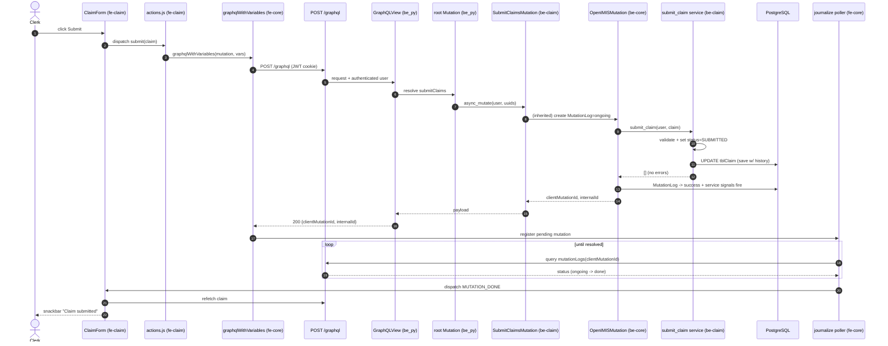

# End-to-End Code Walkthrough

> **Part 17 — The Capstone: One Feature, Every Layer**

This chapter is the payoff for everything else in the handbook. We pick **one concrete user action — a health facility clerk submitting a claim** — and follow it from the pixel they click all the way to a PostgreSQL row and back to the "Claim submitted" toast. At every hop we name the **real repository, directory, and file**. If you have read [Frontend Architecture](../architecture/frontend.md), [The GraphQL Layer](../graphql/index.md), and [Core module](../modules/core.md), this is where those threads tie together.

## Learning objectives

By the end of this chapter you will be able to:

- Trace a claim submission through **every layer**: React form → Redux GraphQL action → HTTP `/graphql` → Graphene view → assembled schema → `OpenIMISMutation` → service → ORM → PostgreSQL → `MutationLog`/signals → response → frontend polling → UI update.
- Point to the **specific files** at each hop across `openimis-fe-claim_js`, `openimis-fe-core_js`, `openimis-be_py`, `openimis-be-claim_py`, and `openimis-be-core_py`.
- Explain *why* the response is asynchronous and how the frontend knows when the work is really done.

## Prerequisites

- [Frontend Architecture](../architecture/frontend.md) — the config object, the Redux GraphQL layer, `journalize`/polling.
- [The GraphQL Layer](../graphql/index.md) — queries, mutations, the schema assembly.
- [Core module](../modules/core.md) — `OpenIMISMutation`, `MutationLog`, service signals, base models.
- [Claim module](../modules/claim.md) — the domain we are tracing.
- [Request Lifecycle](../architecture/request-lifecycle.md) — the backend request path in general.

---

## 0. The scenario

A clerk at a health facility opens a claim, adds diagnoses and service/item lines for an insuree, and clicks **Submit**. The claim must be created (or updated) and moved into a submitted state so it can later be reviewed and valued. Everything below is that one click.

The hops, at a glance:

| # | Layer | Repository | Key file(s) |
| --- | --- | --- | --- |
| 1 | Claim form / component | `openimis-fe-claim_js` | `src/components/ClaimForm.js`, `pages/ClaimEditPage.js` |
| 2 | Redux action creator | `openimis-fe-claim_js` | `src/actions.js` |
| 3 | GraphQL Redux layer | `openimis-fe-core_js` | `src/helpers/api` (`graphqlWithVariables`) |
| 4 | HTTP transport | (browser) → | `POST /graphql` with JWT cookie |
| 5 | GraphQL endpoint | `openimis-be_py` | `openimis/urls.py`, `openimis/schema.py` |
| 6 | Assembled schema | `openimis-be_py` | `openimis/schema.py` (combines module `Mutation`s) |
| 7 | Mutation class | `openimis-be-claim_py` | `claim/schema.py`, `claim/gql_mutations.py` |
| 8 | Async base + audit | `openimis-be-core_py` | `core/schema.py` (`OpenIMISMutation`), `core/models.py` (`MutationLog`) |
| 9 | Service (business logic) | `openimis-be-claim_py` | `claim/services.py` |
| 10 | ORM / models | `openimis-be-claim_py` | `claim/models.py` (`Claim`, `ClaimItem`, `ClaimService`) |
| 11 | Signals | `openimis-be-core_py` / `openimis-be-claim_py` | `core/signals.py`, `claim/signals.py` |
| 12 | Database | PostgreSQL | `tblClaim`, `tblClaimItems`, `tblClaimServices`, `core_Mutation*` |
| 13 | Poll + UI update | `openimis-fe-core_js` + `openimis-fe-claim_js` | journalize helpers, `src/reducer.js` |

---

## 1. The frontend form (`openimis-fe-claim_js`)

The clerk is looking at a claim edit page. The route was contributed by the claim module's config object (`src/index.js`) into core's router (see [Frontend Architecture](../architecture/frontend.md)); the page renders a `ClaimForm` component in `openimis-fe-claim_js/src/components/`. The form is a controlled React component: it holds the in-progress claim (`edited`) in state, reuses **published components** from other modules via `ModulesManager` (e.g. `insuree.InsureePicker`, `medical.DiagnosisPicker`, item/service pickers), and localizes every label with `react-intl`.

```jsx
// openimis-fe-claim_js/src/components/ClaimForm.js  (illustrative / simplified)
function ClaimForm({ modulesManager, edited, onChange }) {
  const InsureePicker = modulesManager.getRef("insuree.InsureePicker");
  const DiagnosisPicker = modulesManager.getRef("medical.DiagnosisPicker");
  // ... item lines, service lines, dates, health facility ...
  return (/* MUI inputs bound to `edited`, calling onChange */);
}
```

When the clerk clicks **Submit**, the page dispatches a Redux action — it does **not** call `fetch` or Apollo directly.

```jsx
// openimis-fe-claim_js/src/pages/ClaimEditPage.js  (illustrative)
onSubmit = () => {
  this.props.submit(this.state.claim, this.clientMutationLabel());
};
// mapDispatchToProps binds `submit` to the action creator below.
```

---

## 2. The Redux action creator (`openimis-fe-claim_js/src/actions.js`)

The claim module's `actions.js` builds the GraphQL mutation document and hands it to the core helper `graphqlWithVariables`. Note the payload contains only a **client mutation id / ticket request** — not a promise of the finished claim.

```javascript
// openimis-fe-claim_js/src/actions.js  (illustrative / simplified)
import { graphqlWithVariables } from "@openimis/fe-core";

export function submit(claim, clientMutationLabel) {
  const mutation = `
    mutation ($input: SubmitClaimsMutationInput!) {
      submitClaims(input: $input) { clientMutationId internalId }
    }`;
  const variables = { input: { uuids: [claim.uuid] } };
  return graphqlWithVariables(
    mutation, variables, "CLAIM_MUTATION",
    { clientMutationLabel, mutationType: "SUBMIT" },  // for the journal
  );
}
```

---

## 3. The custom GraphQL Redux layer (`openimis-fe-core_js`)

`graphqlWithVariables` lives in the frontend **core** module (`openimis-fe-core_js/src/helpers/api`). It:

1. dispatches a `CLAIM_MUTATION_REQ` action (so the UI can show "submitting"),
2. issues `POST /graphql` with the query + variables — the **JWT is sent automatically** because it is an `HttpOnly` cookie,
3. dispatches `CLAIM_MUTATION_RESP` (or `_ERR`) with the immediate response,
4. **registers the mutation in the journal** (using `clientMutationId` / `internalId`) so the poller will chase its `MutationLog` status.

There is no Apollo cache here — the response is Redux state, and the *real* completion arrives later, via polling (hop 13).

---

## 4–5. HTTP `/graphql` and the endpoint (`openimis-be_py`)

The browser sends one `POST /graphql`. On the server, `openimis-be_py` is the **assembly project**. `openimis/urls.py` routes `/graphql` to Graphene's `GraphQLView` (wrapped with CSRF/JWT middleware). `django-graphql-jwt` reads the JWT from the cookie and attaches the authenticated `user` to `info.context`.

```python
# openimis-be_py/openimis/urls.py  (illustrative / simplified)
from graphene_django.views import GraphQLView
urlpatterns = [
    path("graphql", csrf_exempt(GraphQLView.as_view(graphiql=True)), name="graphql"),
    # ... each module's urls.py collected here ...
]
```

---

## 6. The assembled schema (`openimis-be_py/openimis/schema.py`)

Graphene needs one root `Mutation`. openIMIS builds it by importing every module's `schema.Mutation` and combining them with **Python multiple inheritance** — so `submitClaims` (defined in the claim module) becomes a field on the single root mutation.

```python
# openimis-be_py/openimis/schema.py  (illustrative / simplified)
import claim.schema, insuree.schema, policy.schema, core.schema

class Mutation(
    claim.schema.Mutation,
    insuree.schema.Mutation,
    policy.schema.Mutation,
    core.schema.Mutation,
    graphene.ObjectType,
):
    pass

schema = graphene.Schema(query=Query, mutation=Mutation)
```

Graphene resolves `submitClaims` to the `Field` the claim module registered.

---

## 7. The mutation class (`openimis-be-claim_py`)

In `openimis-be-claim_py/claim/schema.py`, the `Mutation` class exposes `submit_claims = SubmitClaimsMutation.Field()`. The mutation itself (in `claim/schema.py` or `claim/gql_mutations.py`) subclasses core's **`OpenIMISMutation`**, so it inherits the audited, asynchronous machinery.

```python
# openimis-be-claim_py/claim/schema.py  (illustrative / simplified)
from core.schema import OpenIMISMutation
from .apps import ClaimConfig
from .services import submit_claim
from .models import Claim


class SubmitClaimsMutation(OpenIMISMutation):
    _mutation_module = "claim"
    _mutation_class = "SubmitClaimsMutation"

    class Input(OpenIMISMutation.Input):
        uuids = graphene.List(graphene.String)

    @classmethod
    def async_mutate(cls, user, **data):
        errors = []
        if not user.has_perms(ClaimConfig.gql_mutation_submit_claims_perms):
            raise PermissionDenied("unauthorized")
        for uuid in data["uuids"]:
            claim = Claim.objects.get(uuid=uuid)
            errors += submit_claim(user, claim)   # delegate to the service
        return errors            # [] == success; non-empty == validation errors
```

---

## 8. The async base and audit (`openimis-be-core_py`)

`OpenIMISMutation` (in `openimis-be-core_py/core/schema.py`) is the linchpin. Its `mutate` (inherited by every mutation) does, roughly:

1. create a **`MutationLog`** row (`core/models.py`) with status *received/ongoing*, capturing the user, module, mutation class, and input,
2. call the subclass's `async_mutate(...)`,
3. if it returns an empty list, mark the `MutationLog` **success**; if it returns errors (or raises), mark it **failed** and store the error detail,
4. return `{ clientMutationId, internalId }` to the caller **immediately** — the client got a *ticket*, not the finished claim.

```python
# openimis-be-core_py/core/schema.py  (illustrative / simplified)
class OpenIMISMutation(graphene.relay.ClientIDMutation):
    internal_id = graphene.Field(graphene.String)

    @classmethod
    def mutate_and_get_payload(cls, root, info, **data):
        mutation_log = MutationLog.objects.create(
            client_mutation_id=data.get("client_mutation_id"),
            json_content=data, user=info.context.user,
            module=cls._mutation_module, mutation_class=cls._mutation_class,
        )
        try:
            errors = cls.async_mutate(info.context.user, **data)
            mutation_log.mark_error(errors) if errors else mutation_log.mark_success()
        except Exception as exc:
            mutation_log.mark_error([{"message": str(exc)}])
        return cls(internal_id=mutation_log.id,
                   client_mutation_id=data.get("client_mutation_id"))
```

!!! info "Did you know?"
    Whether the work runs inline or on a background worker, the **contract to the client is the same**: you get a `clientMutationId`, and the truth of what happened lives in `MutationLog`. That indirection is what makes every state-changing operation in openIMIS auditable — a hard requirement for a system moving public health-insurance money.

---

## 9. The service (`openimis-be-claim_py/claim/services.py`)

The mutation delegates to `submit_claim` in `claim/services.py`. **This is where the real domain logic lives**: validating the claim, checking the insuree's policy coverage window, transitioning the claim `status` to *submitted*, and persisting. The service emits a **service signal** so other modules (valuation via `calculation`, reporting, etc.) can react.

```python
# openimis-be-claim_py/claim/services.py  (illustrative / simplified)
from core.signals import register_service_signal
from .models import Claim

@register_service_signal("claim_service.submit")
def submit_claim(user, claim):
    errors = validate_claim(claim)      # dates, lines, coverage, duplicates
    if errors:
        return errors
    claim.status = Claim.STATUS_SUBMITTED
    claim.submit_stamp = now()
    claim.save(username=user.username)  # HistoryModel records who + when
    return []
```

---

## 10. The ORM / models (`openimis-be-claim_py/claim/models.py`)

The claim aggregate spans several tables. `Claim` (with its `ClaimItem` and `ClaimService` lines) subclasses core base models, inheriting temporal validity, UUIDs, `legacy_id`, and `json_ext`.

```python
# openimis-be-claim_py/claim/models.py  (illustrative / simplified)
from core.models import VersionedModel
from insuree.models import Insuree
from location.models import HealthFacility

class Claim(VersionedModel):
    STATUS_ENTERED, STATUS_SUBMITTED = 2, 4
    insuree = models.ForeignKey(Insuree, db_column="InsureeID", ...)
    health_facility = models.ForeignKey(HealthFacility, db_column="HFID", ...)
    status = models.SmallIntegerField(db_column="ClaimStatus")
    # ... claimed/approved amounts, dates ...
    class Meta:
        db_table = "tblClaim"
```

`claim.save(...)` issues `UPDATE tblClaim ...` (and inserts/updates the item/service line tables). Because `Claim` is versioned, the write respects the `validity_from`/`validity_to` temporal pattern rather than destructively overwriting history.

---

## 11–12. Signals and the database

Two kinds of signals fire:

- The **service signal** `claim_service.submit` — any module that called `bind_service_signal("claim_service.submit", handler, after=True)` now runs (e.g. queue the claim for valuation, emit an audit event, notify).
- Standard **Django ORM signals** (`post_save` on `Claim`) that modules or core may listen to.

PostgreSQL now holds: the updated `tblClaim` row (status = submitted), any `tblClaimItems` / `tblClaimServices` rows, and a `MutationLog` row (in the `core` mutation tables) marked success or error. The audit trail is complete.

---

## 13. The response, polling, and the UI update

The immediate HTTP response carried only `{ clientMutationId, internalId }`. So how does the clerk's screen learn the claim was accepted?

The frontend **journal + poller** (in `openimis-fe-core_js`) periodically queries the backend for the `MutationLog` status of the registered `clientMutationId`:

```graphql
query ($clientMutationId: String!) {
  mutationLogs(clientMutationId: $clientMutationId) {
    edges { node { status clientMutationId error } }
  }
}
```

When `status` flips to **done** (or **error**), the poller dispatches a completion action. The claim module reacts: it refetches the affected claim(s), and shows a success snackbar (or surfaces the validation errors from `MutationLog.error`). Only now does the clerk see "Claim submitted."

---

## The whole journey, as a sequence diagram



!!! danger "Common mistake"
    Reading the immediate response as "the claim is submitted." It is **not** — it only means the mutation was *accepted*. Validation (dates, coverage, duplicate lines) happens in the service and its outcome lands in `MutationLog`. A UI that skips the poll will show false success and hide real validation errors. This is the single most common misunderstanding when moving from Apollo-style mutations to openIMIS.

??? note "Deep dive: where valuation happens"
    Submission does not *price* the claim. In openIMIS, valuation (what the scheme will pay) is driven by the **calculation rule** framework (`openimis-be-calculation_py` + `calcrule_*` modules), typically triggered downstream of submission via service signals and later review states. Our walkthrough stops at *submitted*; follow the `claim_service.submit` signal bindings and the [Calculation Rules](../modules/calculation.md) chapter to trace pricing.

## Repository references

| Repository | Directory / File | Why it matters |
| --- | --- | --- |
| `openimis-fe-claim_js` | `src/components/ClaimForm.js`, `pages/ClaimEditPage.js` | The form the clerk uses; reuses published pickers via `ModulesManager`. |
| `openimis-fe-claim_js` | `src/actions.js`, `src/reducer.js` | Builds the mutation; handles the response/completion in Redux state. |
| `openimis-fe-core_js` | `src/helpers/api` (`graphqlWithVariables`), journalize helpers | The custom GraphQL layer + mutation polling. |
| `openimis-be_py` | `openimis/urls.py` | Routes `/graphql` to Graphene with JWT middleware. |
| `openimis-be_py` | `openimis/schema.py` | Combines each module's `Query`/`Mutation` into the root schema. |
| `openimis-be-claim_py` | `claim/schema.py`, `claim/gql_mutations.py` | `SubmitClaimsMutation` (an `OpenIMISMutation`); `has_perms` check. |
| `openimis-be-claim_py` | `claim/services.py` | `submit_claim` — validation + status transition; service signal. |
| `openimis-be-claim_py` | `claim/models.py` | `Claim`, `ClaimItem`, `ClaimService` on core base models. |
| `openimis-be-core_py` | `core/schema.py` (`OpenIMISMutation`), `core/models.py` (`MutationLog`) | The async, audited mutation base and its log. |
| `openimis-be-core_py` | `core/signals.py` | `register_service_signal` / `bind_service_signal` — the extension seam. |

## Hands-on lab

!!! example "Lab 17.1 — Instrument the whole path yourself"
    1. Open Redux DevTools and submit a claim. Capture the `_REQ` and `_RESP` actions and the `internalId` in the response.
    2. In GraphiQL (`/graphql`), query `mutationLogs(clientMutationId: "...")` and watch the status move to done.
    3. In a Django shell (`python manage.py shell`), fetch the `Claim` by uuid and confirm `status` is submitted and the history reflects the save.
    4. Add a `bind_service_signal("claim_service.submit", ...)` handler in a scratch app that prints the claim id, resubmit, and confirm it fires — you have just extended the pipeline without touching the claim module.

## Exercises

1. The clerk clicked Submit but nothing updates for a few seconds. Which component is responsible for eventually updating the UI, and how does it know the work finished?
2. A claim fails validation. Trace exactly where the error message is produced and where the frontend reads it.
3. Explain why `submitClaims` can be defined in `openimis-be-claim_py` yet still be a field on `openimis-be_py`'s root mutation.
4. Which single class turns an ordinary mutation into an audited, asynchronous one, and which repo defines it?

## Knowledge check

??? question "Q1: The immediate GraphQL response to a submit contains only clientMutationId/internalId. Why, and where is the real outcome? (click for answer)"
    Because openIMIS mutations are **asynchronous and audited** via `OpenIMISMutation`: they create a `MutationLog`, run the service, and return a ticket. The real outcome (success or validation errors) is stored on the `MutationLog` row and read by the frontend poller.

??? question "Q2: How does `submitClaims`, defined in the claim module, become callable on the assembled schema? (click for answer)"
    `openimis-be_py/openimis/schema.py` combines every module's `schema.Mutation` via Python **multiple inheritance** into one root `Mutation`, so the claim module's `Field` is exposed on the single schema Graphene serves at `/graphql`.

??? question "Q3: Which file holds the claim submission business logic, and why not the mutation class? (click for answer)"
    `openimis-be-claim_py/claim/services.py` (`submit_claim`). Logic lives in services so it is reusable (tests, other modules, signals), keeps GraphQL out of the domain, and can advertise a service signal for extension.

??? question "Q4: How is the JWT transmitted on the submit request, and why is that secure? (click for answer)"
    It rides an `HttpOnly` cookie the browser attaches automatically to `POST /graphql`. JavaScript cannot read it, so an XSS bug cannot exfiltrate the token; the backend `django-graphql-jwt` middleware validates it and sets `info.context.user`.

??? question "Q5: Name two things that must be true in PostgreSQL after a successful submission. (click for answer)"
    The `tblClaim` row has `status` = submitted (with history preserved), and a `MutationLog` row for that `clientMutationId` is marked success (error empty). Item/service line tables reflect the claim's lines.

## Further reading

- [Claim module](../modules/claim.md) — the domain model behind this walkthrough.
- [Core module](../modules/core.md) — `OpenIMISMutation`, `MutationLog`, service signals in depth.
- [The GraphQL Layer](../graphql/index.md) and [Frontend Architecture](../architecture/frontend.md) — the two sides of the wire.
- [Extension Guide](index.md) — build your own module using the exact patterns traced here.
- [openimis-be-claim_py](https://github.com/openimis) and [openimis-fe-claim_js](https://github.com/openimis) — read the real source for each hop.
