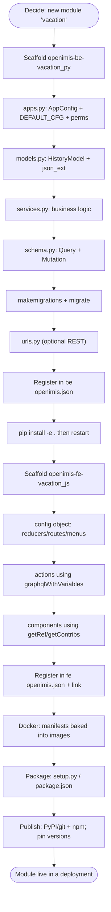
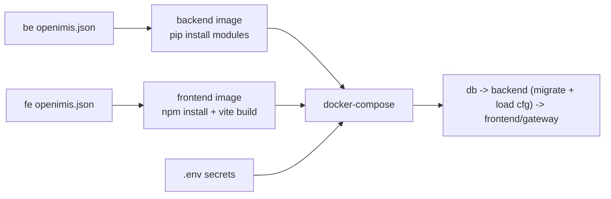

# Extension Guide

> **Part 15 — Extending openIMIS: Build a New Module**

This is the chapter where everything you have learned becomes muscle memory. You will scaffold a **new backend module** (`openimis-be-<name>_py`) and a matching **new frontend module** (`openimis-fe-<name>_js`), wire them into the two assemblies, add Docker support, and package/publish them. We will build a small, illustrative module called **`vacation`** (imagine a benefit that tracks approved wellness leave for insurees) — pick any name for your own; the anatomy is identical for every real module.

## Learning objectives

By the end of this chapter you will be able to:

- Scaffold a backend module: `apps.py` (an `AppConfig` with `DEFAULT_CFG` + permission codes), `models.py` (core base models + `json_ext`), `services.py`, `schema.py` (`Query` / `Mutation`), `migrations/`, and `urls.py`.
- Register the module in the backend `openimis.json` manifest and install it editable.
- Scaffold a frontend module: the **config object** contributing `menus`, `routes`, `reducers`, and using `ModulesManager` + published components; register it in the frontend `openimis.json`.
- Add Docker support, package both halves (`setup.py` / npm `package.json`), and publish.

## Prerequisites

- [Backend Deep Dive](../architecture/backend.md) and [Plugin / Module System](../architecture/plugin-system.md) — the module pattern.
- [Frontend Architecture](../architecture/frontend.md) — the config object, `ModulesManager`, the Redux GraphQL layer.
- [The GraphQL Layer](../graphql/index.md) — you should know queries, mutations, and the `OpenIMISMutation` async pattern.
- [Core module](../modules/core.md) — base models (`HistoryModel`, `json_ext`), `OpenIMISMutation`, service signals.
- [Set Up a Dev Environment](../getting-started/setup.md) — you have `openimis-be_py` and `openimis-fe_js` running.

---

## 0. The big picture

A module is a **vertical slice** shipped as two repositories (backend + frontend), each independently versioned, each pinned by an assembly manifest. Nothing in core changes when you add a module — that is the whole point.



Work the backend first — the frontend calls it, so it helps to have a live GraphQL schema to build against.

---

## 1. Backend module

### 1.1 Repository layout

Create a repository named **`openimis-be-vacation_py`** with the standard module layout. The installed Python package is just `vacation`.

```text
openimis-be-vacation_py/
├── setup.py
├── README.md
├── vacation/
│   ├── __init__.py
│   ├── apps.py
│   ├── models.py
│   ├── services.py
│   ├── schema.py
│   ├── gql_queries.py
│   ├── gql_mutations/
│   │   ├── __init__.py
│   │   ├── create_vacation.py
│   │   └── update_vacation.py
│   ├── signals.py
│   ├── urls.py
│   ├── apps_settings? (config lives in apps.py)
│   ├── migrations/
│   │   └── 0001_initial.py
│   └── tests/
│       └── test_services.py
```

### 1.2 `apps.py` — `AppConfig`, `DEFAULT_CFG`, permissions

Every module is a Django app. openIMIS convention: subclass `AppConfig`, define a **`DEFAULT_CFG`** dict of tunables, define integer **permission codes**, and load runtime config from the DB in `ready()` (the DB config, stored in core's `ModuleConfiguration`, *overlays* `DEFAULT_CFG` so operators can retune without code changes).

```python
# vacation/apps.py  (illustrative / simplified)
from django.apps import AppConfig

MODULE_NAME = "vacation"

# Permission codes are INTEGERS, unique across openIMIS. Pick an unused range.
DEFAULT_CFG = {
    "gql_query_vacations_perms": [160001],
    "gql_mutation_create_vacation_perms": [160002],
    "gql_mutation_update_vacation_perms": [160003],
    "gql_mutation_delete_vacation_perms": [160004],
    "default_validity_days": 30,
}


class VacationConfig(AppConfig):
    name = MODULE_NAME

    gql_query_vacations_perms = []
    gql_mutation_create_vacation_perms = []
    gql_mutation_update_vacation_perms = []
    gql_mutation_delete_vacation_perms = []
    default_validity_days = 30

    def _configure_permissions(self, cfg):
        VacationConfig.gql_query_vacations_perms = cfg["gql_query_vacations_perms"]
        VacationConfig.gql_mutation_create_vacation_perms = cfg["gql_mutation_create_vacation_perms"]
        VacationConfig.gql_mutation_update_vacation_perms = cfg["gql_mutation_update_vacation_perms"]
        VacationConfig.gql_mutation_delete_vacation_perms = cfg["gql_mutation_delete_vacation_perms"]

    def ready(self):
        from core.models import ModuleConfiguration
        cfg = ModuleConfiguration.get_or_default(MODULE_NAME, DEFAULT_CFG)
        self._configure_permissions(cfg)
        VacationConfig.default_validity_days = cfg.get("default_validity_days", 30)
```

!!! danger "Common mistake"
    **Permission codes must be unique integers across the whole platform.** Two modules that reuse the same code silently share access. Before you pick a range, grep the other modules' `apps.py` (`gql_..._perms`) and choose a block nobody else uses. Document your range in the README.

!!! info "Did you know?"
    `DEFAULT_CFG` is not just constants — it is the *contract* an operator can override per deployment. The value lives in `DEFAULT_CFG`, gets overlaid by the JSON stored in `ModuleConfiguration` (core), and is read back in `ready()`. That is how a country can re-tune your module without forking it. See [Configuration](../configuration/index.md).

### 1.3 `models.py` — core base models + `json_ext`

Reuse core's base models rather than plain `django.db.models.Model`. `HistoryModel` gives you temporal validity (`validity_from` / `validity_to`), UUID identity, `legacy_id`, and a **`json_ext`** JSONField for schemaless extension fields — the openIMIS idiom for "let deployments add fields without a migration."

```python
# vacation/models.py  (illustrative / simplified)
from django.db import models
from core.models import HistoryModel
from insuree.models import Insuree


class Vacation(HistoryModel):
    insuree = models.ForeignKey(
        Insuree, on_delete=models.DO_NOTHING,
        related_name="vacations", db_column="InsureeID",
    )
    start_date = models.DateField(db_column="StartDate")
    end_date = models.DateField(db_column="EndDate")
    status = models.CharField(max_length=16, default="DRAFT", db_column="Status")
    # json_ext is provided by HistoryModel: deployment-specific extra fields
    # e.g. instance.json_ext = {"reason": "wellness", "approvedBy": "..."}

    class Meta:
        db_table = "tblVacation"   # legacy-style table naming is the house style
```

!!! info "Did you know?"
    The `tbl` prefix and `db_column` CamelCase are not accidents — they are the **legacy heritage** from the original .NET/MSSQL IMIS. New tables follow the house style so the schema reads consistently. See [Database](../database/index.md).

### 1.4 `services.py` — business logic

**Keep business logic in services, not in resolvers.** A service is a plain class/functions that validates and persists. Mutations call services; so can other modules (and tests). This is also where you emit **service signals** so other modules can hook you without importing you.

```python
# vacation/services.py  (illustrative / simplified)
from datetime import date
from core.signals import register_service_signal
from .models import Vacation
from .apps import VacationConfig


class VacationService:
    def __init__(self, user):
        self.user = user

    @register_service_signal("vacation_service.create")
    def create(self, data: dict) -> Vacation:
        self._validate(data)
        vacation = Vacation(**data)
        vacation.save(username=self.user.username)   # HistoryModel audits the writer
        return vacation

    def _validate(self, data: dict):
        if data["end_date"] < data["start_date"]:
            raise ValueError("end_date must not precede start_date")
```

!!! info "Did you know?"
    `@register_service_signal("vacation_service.create")` lets another module `bind_service_signal("vacation_service.create", handler, after=True)` to run logic after every vacation is created — no import, no dependency. That decoupled seam is the backend twin of the frontend's `contributions`. See [Plugin / Module System](../architecture/plugin-system.md).

### 1.5 `schema.py` and `gql_mutations/` — Query and Mutation

Your GraphQL types live in `gql_queries.py`; your `Query` and `Mutation` classes in `schema.py`. Mutations subclass core's **`OpenIMISMutation`** so they inherit the audited, asynchronous pattern (create a `MutationLog`, run the service, return a `clientMutationId`).

```python
# vacation/gql_queries.py  (illustrative / simplified)
import graphene
from graphene_django import DjangoObjectType
from core import ExtendedConnection
from .models import Vacation


class VacationGQLType(DjangoObjectType):
    class Meta:
        model = Vacation
        interfaces = (graphene.relay.Node,)
        connection_class = ExtendedConnection   # adds totalCount / edgeCount
        filter_fields = {
            "id": ["exact"],
            "status": ["exact", "icontains"],
            "start_date": ["exact", "gte", "lte"],
        }
```

```python
# vacation/gql_mutations/create_vacation.py  (illustrative / simplified)
import graphene
from core.schema import OpenIMISMutation
from ..apps import VacationConfig
from ..services import VacationService


class CreateVacationMutation(OpenIMISMutation):
    _mutation_module = "vacation"
    _mutation_class = "CreateVacationMutation"

    class Input(OpenIMISMutation.Input):
        insuree_id = graphene.Int(required=True)
        start_date = graphene.Date(required=True)
        end_date = graphene.Date(required=True)

    @classmethod
    def async_mutate(cls, user, **data):
        if not user.has_perms(VacationConfig.gql_mutation_create_vacation_perms):
            raise PermissionError("unauthorized")
        try:
            VacationService(user).create(data)
            return None          # None == success; MutationLog marked done
        except Exception as exc:  # returned errors become MutationLog error detail
            return [{"message": str(exc)}]
```

```python
# vacation/schema.py  (illustrative / simplified)
import graphene
from core.schema import OrderedDjangoFilterConnectionField
from .apps import VacationConfig
from .gql_queries import VacationGQLType
from .gql_mutations.create_vacation import CreateVacationMutation
from .gql_mutations.update_vacation import UpdateVacationMutation


class Query(graphene.ObjectType):
    vacations = OrderedDjangoFilterConnectionField(
        VacationGQLType, orderBy=graphene.List(graphene.String),
    )

    def resolve_vacations(self, info, **kwargs):
        if not info.context.user.has_perms(VacationConfig.gql_query_vacations_perms):
            raise PermissionError("unauthorized")
        return Vacation.objects.filter(*filter_validity())


class Mutation(graphene.ObjectType):
    create_vacation = CreateVacationMutation.Field()
    update_vacation = UpdateVacationMutation.Field()
```

The assembly repo (`openimis-be_py`, `openimis/schema.py`) combines every module's `Query` and `Mutation` into one root via multiple inheritance — you write only your slice.

!!! danger "Common mistake"
    Do not put permission checks *only* on the frontend. Every resolver and every mutation must call `user.has_perms([...])` with the **same integer codes** from `apps.py`. The frontend guard is UX; the backend check is security. Enforce in both.

### 1.6 Migrations

Standard Django. Because you used `db_table = "tblVacation"` and explicit `db_column`s, the migration is deterministic and legacy-consistent.

```bash
# from openimis-be_py, with the module installed editable
python manage.py makemigrations vacation
python manage.py migrate vacation
```

### 1.7 `urls.py` — optional REST endpoints

Most modules are pure GraphQL, but you can expose REST (reports, callbacks, FHIR). The assembly's `openimis/urls.py` collects each module's `urls.py`.

```python
# vacation/urls.py  (illustrative)
from django.urls import path
from . import views

urlpatterns = [
    path("vacation/export/", views.export_csv, name="vacation_export"),
]
```

### 1.8 Register in the backend `openimis.json` and install editable

Add your module to the backend assembly manifest so `INSTALLED_APPS` and the schema pick it up.

```json
// openimis-be_py/openimis.json  (add an entry)
{
  "name": "vacation",
  "pip": "openimis-be-vacation @ git+https://github.com/your-org/openimis-be-vacation_py.git@v1.0.0"
}
```

For development, install the local checkout **editable** so code changes are live:

```bash
pip install -e ../openimis-be-vacation_py/
python manage.py migrate
python manage.py runserver   # or restart the container
```

Confirm it worked: open GraphiQL at `/graphql` and check that `vacations` appears in the schema and a `createVacation` mutation exists.

---

## 2. Frontend module

### 2.1 Repository layout

Create **`openimis-fe-vacation_js`**; the npm package is `@openimis/fe-vacation`.

```text
openimis-fe-vacation_js/
├── package.json
├── src/
│   ├── index.js          # the config object (public API)
│   ├── constants.js
│   ├── reducer.js
│   ├── actions.js        # graphqlWithVariables-based
│   ├── pages/
│   │   ├── VacationsPage.js
│   │   └── VacationPage.js
│   ├── components/
│   │   ├── VacationSearcher.js
│   │   └── VacationForm.js
│   ├── menus/
│   │   └── VacationMainMenu.js
│   └── translations/
│       ├── en.json
│       └── fr.json
```

### 2.2 The config object

This object *is* the module's API. It contributes a reducer, routes, and menu entries, and publishes reusable components.

```javascript
// openimis-fe-vacation_js/src/index.js  (illustrative / simplified)
import messages_en from "./translations/en.json";
import reducer from "./reducer";
import VacationsPage from "./pages/VacationsPage";
import VacationPage from "./pages/VacationPage";
import VacationMainMenu from "./menus/VacationMainMenu";
import VacationStatusPicker from "./components/VacationStatusPicker";
import { RIGHT_VACATION } from "./constants";

const ROUTE_VACATIONS = "vacation/vacations";
const ROUTE_VACATION = "vacation/vacation";

const DEFAULT_CONFIG = {
  "translations": [{ key: "en", messages: messages_en }],
  "reducers": [{ key: "vacation", reducer }],
  "refs": [
    { key: "vacation.VacationStatusPicker", ref: VacationStatusPicker },
    { key: "vacation.route.vacations", ref: ROUTE_VACATIONS },
  ],
  // Contribution: mount routes into core's router
  "core.Router": [
    { path: ROUTE_VACATIONS, component: VacationsPage },
    { path: ROUTE_VACATION + "/:vacation_uuid?", component: VacationPage },
  ],
  // Contribution: add a top-level menu entry, right-gated
  "core.MainMenu": [
    {
      text: <FormattedMessage module="vacation" id="menu.vacations" />,
      icon: <BeachAccessIcon />,
      route: "/" + ROUTE_VACATIONS,
      filter: (rights) => rights.includes(RIGHT_VACATION),
    },
  ],
};

export function VacationModule(cfg) {
  return { ...DEFAULT_CONFIG, ...cfg };
}
```

### 2.3 Actions using `graphqlWithVariables` (not Apollo)

Data flows through the core Redux GraphQL layer — no Apollo. See [Frontend Architecture](../architecture/frontend.md) for the full model.

```javascript
// openimis-fe-vacation_js/src/actions.js  (illustrative / simplified)
import { graphqlWithVariables, formatPageQuery } from "@openimis/fe-core";

export function fetchVacations(modulesManager, filters) {
  const projection = ["id", "status", "startDate", "endDate",
                      "insuree{uuid, chfId, lastName}"];
  const payload = formatPageQuery("vacations", filters, projection);
  return graphqlWithVariables(payload, {}, "VACATION_VACATIONS");
}

export function createVacation(vacation, clientMutationLabel) {
  const mutation = `mutation ($input: CreateVacationMutationInput!) {
    createVacation(input: $input) { clientMutationId internalId }
  }`;
  return graphqlWithVariables(
    mutation, { input: vacation }, "VACATION_MUTATION",
    { clientMutationLabel },   // journalize tracks + polls this mutation
  );
}
```

The reducer handles `VACATION_VACATIONS_REQ/RESP/ERR` and writes results into `state.vacation`.

### 2.4 Components using `ModulesManager` and published components

Reuse core/other-module components **by key**, never by direct import.

```jsx
// openimis-fe-vacation_js/src/components/VacationForm.js  (illustrative)
import React from "react";
export default function VacationForm({ modulesManager, edited, onChange }) {
  const InsureePicker = modulesManager.getRef("insuree.InsureePicker");
  const readOnly = modulesManager.getConf("fe-vacation", "form.readOnly", false);
  return (
    <>
      <InsureePicker
        value={edited?.insuree}
        readOnly={readOnly}
        onChange={(insuree) => onChange({ ...edited, insuree })}
      />
      {/* date inputs, status picker via getRef("vacation.VacationStatusPicker") */}
    </>
  );
}
```

### 2.5 Register in the frontend `openimis.json` and link

```json
// openimis-fe_js/openimis.json  (add an entry)
{ "name": "@openimis/fe-vacation", "npm": "@openimis/fe-vacation@^1.0.0" }
```

For development, link your local checkout so edits are live, then let the generator rebuild `src/modules.js`:

```bash
# in openimis-fe-vacation_js
npm link
# in openimis-fe_js
npm link @openimis/fe-vacation
npm start   # runs the Vite dev server; generator regenerates src/modules.js
```

!!! danger "Common mistake"
    After adding the manifest entry, if the menu does not appear, check three things in order: (1) is the package linked/installed? (2) did the generator include it in `src/modules.js`? (3) does the logged-in user have the integer right your `filter` checks? Nine times out of ten it is one of these, not your component.

=== "Backend recap"

    1. `openimis-be-vacation_py` with the standard layout.
    2. `apps.py`: `AppConfig`, `DEFAULT_CFG`, unique integer perms, `ready()` overlay.
    3. `models.py`: subclass `HistoryModel`, use `json_ext`, `tbl`-style table.
    4. `services.py`: business logic + `register_service_signal`.
    5. `schema.py` / `gql_mutations/`: `Query` + `OpenIMISMutation` subclasses, `has_perms` checks.
    6. `makemigrations` / `migrate`.
    7. Add to backend `openimis.json`; `pip install -e`; verify in GraphiQL.

=== "Frontend recap"

    1. `openimis-fe-vacation_js` with the standard layout.
    2. `src/index.js`: the config object (reducers, routes, menus, refs, translations).
    3. `actions.js`: `graphqlWithVariables` — never Apollo.
    4. Components: `getRef` / `getConf` / `getContribs` — never direct imports.
    5. Add to frontend `openimis.json`; `npm link`; verify the menu/route render.

---

## 3. Docker support

You rarely change images to add a module — the images build **from the manifests**. The distribution repo `openimis-dist_dkr` builds a backend image that `pip install`s from the backend `openimis.json`, and a frontend image that npm-installs from the frontend `openimis.json` and runs the Vite build. So "Docker support" for your module means:

1. Your module is listed in both `openimis.json` manifests with a resolvable source (git/PyPI, npm).
2. Any new **env vars / secrets** your module needs are added to `.env` and referenced in `docker-compose`.
3. Any startup data load (fixtures, default `ModuleConfiguration`) is wired into the backend startup `script/`.



See [Docker & Deployment](../docker/index.md) for the full compose topology.

---

## 4. Packaging and publishing

=== "Backend (setup.py → PyPI/git)"

    ```python
    # openimis-be-vacation_py/setup.py  (illustrative)
    from setuptools import setup, find_packages
    setup(
        name="openimis-be-vacation",
        version="1.0.0",
        packages=find_packages(),
        install_requires=["openimis-be-core", "openimis-be-insuree"],
        include_package_data=True,
    )
    ```

    Publish by tagging a semantic version and either pushing to PyPI or referencing the git tag directly from the backend `openimis.json` (`git+https://...@v1.0.0`). **Pin the version** in the manifest — the assembly is a lockfile of module versions.

=== "Frontend (package.json → npm)"

    ```json
    // openimis-fe-vacation_js/package.json  (illustrative)
    {
      "name": "@openimis/fe-vacation",
      "version": "1.0.0",
      "main": "src/index.js",
      "peerDependencies": {
        "@openimis/fe-core": "^1.9.0",
        "react": "^18", "redux": "^4", "@mui/material": "^5"
      }
    }
    ```

    Declare shared libraries (React, MUI, Redux, `@openimis/fe-core`) as **peerDependencies** so the assembly provides one shared copy — never bundle your own React (that causes the "invalid hook call" crash). Publish to npm, then pin the version in the frontend `openimis.json`.

!!! info "Did you know?"
    Both manifests are effectively **lockfiles**: they pin every module to an exact/compatible version. A reproducible openIMIS deployment is fully described by the two `openimis.json` files plus `.env`. See [Developer Workflow](../workflow/index.md) for the release/versioning discipline.

## Repository references

| Repository | Directory / File | Why it matters |
| --- | --- | --- |
| `openimis-be-<name>_py` | `<name>/apps.py` | `AppConfig`, `DEFAULT_CFG`, integer permission codes, `ready()` config overlay. |
| `openimis-be-<name>_py` | `<name>/models.py` | Models on `HistoryModel` / `json_ext`; legacy-style table names. |
| `openimis-be-<name>_py` | `<name>/services.py` | Business logic; `register_service_signal` seams. |
| `openimis-be-<name>_py` | `<name>/schema.py`, `gql_mutations/` | `Query` + `OpenIMISMutation` subclasses; `has_perms`. |
| `openimis-be_py` | `openimis.json` | Register the backend module + pin its version. |
| `openimis-be_py` | `openimis/schema.py` | Combines every module's `Query`/`Mutation` into the root schema. |
| `openimis-fe-<name>_js` | `src/index.js` | The **config object** — the module's entire public API. |
| `openimis-fe-<name>_js` | `src/actions.js` | `graphqlWithVariables` data flow (not Apollo). |
| `openimis-fe_js` | `openimis.json`, `openimis-config-vite.js` | Register the frontend module; the generator that builds `src/modules.js`. |
| `openimis-dist_dkr` | `docker-compose.yml`, `.env` | Images build from the manifests; add secrets/config here. |

## Hands-on lab

!!! example "Lab 15.1 — Ship a backend module end to end"
    1. Scaffold `openimis-be-vacation_py` with the layout above.
    2. Write `apps.py`, `models.py`, `services.py`, `schema.py`, and `gql_mutations/create_vacation.py`.
    3. Add the module to the backend `openimis.json`, `pip install -e`, and `makemigrations`/`migrate`.
    4. In GraphiQL (`/graphql`), run the `vacations` query and the `createVacation` mutation. Confirm a `MutationLog` row appears and resolves.

!!! example "Lab 15.2 — Add the frontend and see it in the app"
    1. Scaffold `openimis-fe-vacation_js`; write the config object, reducer, one action, one page, one menu.
    2. Add it to the frontend `openimis.json`, `npm link`, and start the dev server.
    3. Grant your dev user the integer right your menu `filter` checks.
    4. Navigate to the new menu, open the searcher, and create a vacation — watch the mutation register in the journal (Redux DevTools) and the new row appear via the backend.

## Exercises

1. You need a per-deployment tunable "max vacation days." Where does its default live, and how does an operator override it without code changes?
2. A reporting module wants to run logic after every vacation is created, without importing your module. What do you both do?
3. Explain why React must be a `peerDependency` of your frontend module.
4. Give the exact two files that must both list your module for a Docker build to include it.

## Knowledge check

??? question "Q1: Where do you put business logic — resolver, mutation, or service — and why? (click for answer)"
    In the **service**. Resolvers/mutations are thin: they check `has_perms` and delegate. Services are reusable (other modules, tests, signals can call them), keep GraphQL concerns out of domain logic, and are where you `register_service_signal` for extensibility.

??? question "Q2: What makes a mutation asynchronous and audited in openIMIS? (click for answer)"
    Subclassing core's **`OpenIMISMutation`**. It creates a `MutationLog`, runs your `async_mutate`, and returns a `clientMutationId`; success is `return None`, errors are returned as a list. The frontend polls the `MutationLog` status via `journalize`.

??? question "Q3: Your new frontend menu does not appear. Name the three things to check, in order. (click for answer)"
    (1) Is the package installed/linked and listed in the frontend `openimis.json` so the generator put it in `src/modules.js`? (2) Did the module load (check `ModulesManager` / no console errors)? (3) Does the logged-in user hold the integer **right** the menu `filter` requires?

??? question "Q4: Why must permission codes be globally unique integers, and where are they defined? (click for answer)"
    They are defined in each module's `apps.py` (`gql_..._perms`). If two modules reuse a code, they unintentionally share access — a security bug. Pick an unused integer block and document it.

??? question "Q5: What two files fully describe a reproducible openIMIS deployment's module set? (click for answer)"
    The backend `openimis.json` (in `openimis-be_py`) and the frontend `openimis.json` (in `openimis-fe_js`) — each pins module versions like a lockfile. Add `.env` for secrets and you can rebuild the exact deployment.

## Further reading

- [End-to-End Code Walkthrough](code-walkthrough.md) — trace a real feature through both halves you just learned to build.
- [Developer Workflow](../workflow/index.md) — the setup, test, and release loop for module authors.
- [Plugin / Module System](../architecture/plugin-system.md) and [Frontend Architecture](../architecture/frontend.md) — the seams your module plugs into.
- [openimis-be-core_py](https://github.com/openimis/openimis-fe-core_js) and [openimis-fe-core_js](https://github.com/openimis/openimis-fe-core_js) — read the base classes you subclass.
- [Best Practices](../best-practices/index.md) — conventions reviewers will hold you to.
