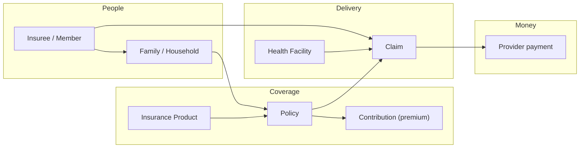
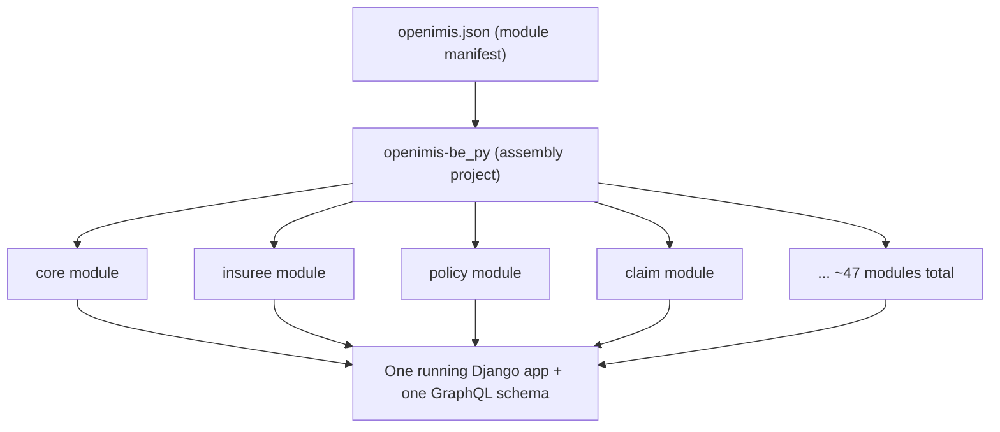
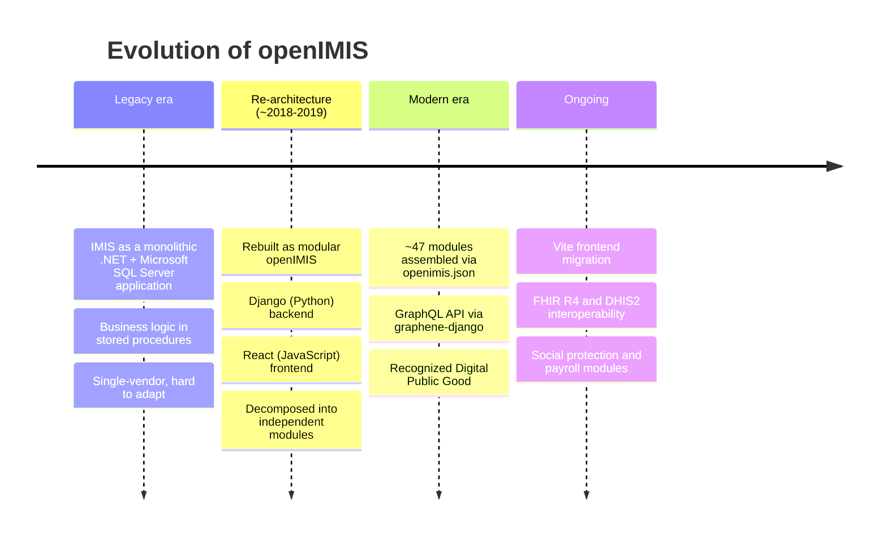

# Platform Overview

> **Part 1 of the course.** Before any code, you need to know what openIMIS *is for*. This chapter builds the domain and architectural intuition that every later chapter assumes. It is long on purpose — read it once, carefully, and the rest of the handbook will click into place.

## Learning objectives

By the end of this chapter you will be able to:

- Explain what openIMIS is and the real-world problem it exists to solve.
- Describe the **health-financing / social health protection** ecosystem it models — members, policies, contributions, providers, and claims — and how those pieces fit together.
- Explain what a **Digital Public Good** is and why openIMIS is governed as one.
- Articulate the **modular ("plugin") architecture philosophy** and, crucially, *why* it exists.
- Trace the platform's evolution from the legacy **.NET + Microsoft SQL Server IMIS** to the modular **Django + React openIMIS**, and recognize the legacy heritage still visible in the code.

## Prerequisites

- The [course home page](../index.md) and its high-level layer diagram.
- Working knowledge of Django and PostgreSQL (assumed throughout this handbook).
- No prior knowledge of health insurance, GraphQL, or enterprise architecture is required — we build all three from first principles.

---

## What is openIMIS?

**openIMIS** stands for **open Insurance Management Information System**. It is an open-source software platform for administering **health insurance and social health protection schemes**: registering the people who are covered, recording the policies that cover them, collecting the contributions (premiums) that fund those policies, and processing the claims that health facilities submit when they deliver care.

Put plainly: if a government or an NGO in a low- or middle-income country runs a health-financing scheme — a national health insurance fund, a community-based mutual, a voucher programme — openIMIS is a ready-made system to run the *information* side of it. Who is covered? Until when? Have they paid? Is this clinic allowed to treat them? How much do we owe the clinic for last month's visits?

!!! info "Did you know?"
    openIMIS is deployed in production in a number of countries across Africa and Asia — including Tanzania, Cameroon, Nepal, Chad, and the Democratic Republic of the Congo, among others. The same modular codebase you will study here is configured differently in each country to match its scheme rules, languages, and organizational structure. That "configure, don't fork" property is not an accident — it is the entire point of the architecture, as you will see below.

### Why was openIMIS created?

Health financing in low- and middle-income countries (LMICs) has a chronic tooling problem. Schemes are often run on spreadsheets, paper registers, or bespoke software that a single vendor built and now holds hostage. Each new scheme reinvents the same wheel — enrolment, eligibility, claims — at great cost, with no interoperability and no shared learning.

openIMIS exists to break that cycle. It is a **shared, free, open-source "core banking system" for health protection schemes**: a common platform that many countries can adopt, adapt, and improve together, rather than each paying to rebuild the basics. Its development has been supported over the years by the **Swiss Agency for Development and Cooperation (SDC)** and **GIZ**, and it is steered by the **openIMIS Initiative** and a community **Technical Advisory Group**.

### The problems it solves

Concretely, openIMIS addresses the operational headaches of running a health-financing scheme:

| Problem | How openIMIS helps |
| --- | --- |
| **Beneficiary registry** — knowing who is enrolled and their family structure | Insuree / individual registries with household and group modelling |
| **Coverage** — which product covers whom, and when it starts and ends | Policies link insurees to insurance products with validity periods |
| **Financing** — collecting and tracking premiums | Contribution records against policies; payment reconciliation |
| **Provider network** — which facilities can serve which members | A location hierarchy plus a registry of health facilities |
| **Claims** — paying providers for care actually delivered | Claim capture, adjudication, valuation via pricing rules, and payment |
| **Reporting & interoperability** — telling the story to ministries and donors | FHIR R4 endpoints, DHIS2 aggregate exports, OpenSearch analytics |
| **Local adaptation** — every country's rules are different | A modular architecture and a runtime configuration model |

!!! quote "The mental model that helps most"
    Think of openIMIS as **insurance-scheme middleware**. It sits between *the people who are covered*, *the facilities that treat them*, and *the fund that pays for it all* — keeping the shared truth about coverage, eligibility, and money owed.

---

## The health-financing ecosystem openIMIS models

You cannot understand the code until you understand the domain it encodes. Here is the ecosystem in the smallest number of moving parts. (The [Terminology Primer](terminology.md) defines each term precisely; this section is the story that connects them.)

Walk the ecosystem in the order a real scheme experiences it:

1. **Members and families.** People enrol, usually as a **family or household**, not as isolated individuals. One member is often the head; dependents are covered under the same policy. openIMIS models the person as an **insuree** (and, in newer social-protection work, as a more general **individual**).

2. **Products.** A scheme offers one or more **insurance products** — the "plan" definitions. A product says what is covered, the premium, the waiting periods, ceilings, and which medical services and items are included, often via a **price list**.

3. **Policies.** A **policy** is the contract that links a family to a product for a period of time. It has a start date, an expiry date, and a status. The policy is what makes a person *actually covered* right now.

4. **Contributions.** To keep a policy active, someone pays **contributions** (premiums). openIMIS records these against the policy. No contributions, no valid coverage.

5. **Providers and the location hierarchy.** Care is delivered by **health facilities** (clinics, hospitals), which sit inside a **location hierarchy** — typically region → district → municipality → village. The hierarchy governs both administration and which facilities serve which members.

6. **Claims.** When a covered member receives care, the facility submits a **claim** listing the services and items provided. openIMIS checks eligibility, adjudicates the claim against the product's rules, and **values** it — often using pluggable **calculation rules** (for example, capitation or fee-for-service).

7. **Payment.** Approved, valued claims translate into money the scheme owes providers, handled by the **payment** and **invoice** modules and, at the edges, external payment gateways.

!!! example "One sentence that uses every term"
    *A **member** in a **family** holds a **policy** on a health-insurance **product**, kept active by **contributions**; when they visit a **health facility** in their **location**, the facility files a **claim**, which openIMIS values and turns into a provider **payment**.*

Every business module you will study — [insuree](../modules/insuree.md), [policy](../modules/policy.md), [product](../modules/medical.md), [claim](../modules/claim.md), [contribution & payment](../modules/payment.md), [calculation](../modules/calculation.md) — implements one node of this ecosystem.

---

## openIMIS as a Digital Public Good

A **Digital Public Good (DPG)** is open-source software (or open data, content, or standards) that helps achieve the UN Sustainable Development Goals, is built to be freely adopted and adapted, and meets a published set of criteria around openness, privacy, and "do no harm." openIMIS is a recognized DPG.

Why does this matter to you as an engineer? Because it shapes the codebase and the way you are expected to work in it:

- **Openness is a hard requirement, not a nicety.** The whole platform — every module — is open source under permissive terms. There is no proprietary "enterprise edition" hiding the interesting parts.
- **Reusability is a design goal.** The architecture is deliberately built so that one deployment's improvements can flow back to everyone. This is why country-specific behavior lives in configuration and add-on modules, not in forks.
- **Global commons governance.** Decisions are made in the open by the openIMIS Initiative and its Technical Advisory Group. Contributions follow a public process (see the [Developer Workflow](../workflow/index.md) chapter).

!!! info "Did you know?"
    The DPG philosophy is the *social* explanation for the *technical* modularity you are about to study. "Don't fork, extend" is not just good engineering advice here — it is how a global public good stays a single, shared thing instead of fragmenting into dozens of incompatible national codebases.

---

## The modular architecture philosophy — and why it exists

This is the most important idea in the entire handbook, so we introduce it here and expand it in [Architecture](../architecture/overview.md).

openIMIS is not one big Django project with dozens of apps in one repository. It is a small **assembly project** (the repo `openimis-be_py`) plus roughly **47 independent modules**, each in its own repository, each versioned on its own, wired together at startup.

**Why build it this way?** Because every country's scheme is different, and the alternative — one monolith with country-specific `if` statements, or a fork per country — is a maintenance catastrophe. Modularity buys openIMIS four things:

1. **Country-specific customization without forking core.** A deployment picks which modules to include (via `openimis.json`) and configures each one at runtime. Nepal and Tanzania run the *same core* with different modules and different configuration.
2. **Independent evolution.** The `claim` module can release on its own schedule without a lock-step release of the entire platform.
3. **A clean extension seam.** New behavior arrives as a **new module** that hooks into existing ones through well-defined seams (service signals on the backend, "contributions" on the frontend) — without editing the modules it extends.
4. **Shared improvements flow upstream.** Because customization is additive, a feature built for one country can be packaged as a module and offered to all.

!!! danger "Common mistake"
    Newcomers open `openimis-be_py`, see almost no business logic, and conclude the project is empty or that they are in the wrong place. They are not. The assembly repo is *supposed* to be thin — it is a manifest plus wiring. The business logic lives in the module repos named `openimis-be-<name>_py`. Learn to read the [Repository Map](../architecture/repository-map.md) early and this confusion disappears.

We will not fully unpack *how* the assembly happens here — dynamic `INSTALLED_APPS`, GraphQL schema stitching by Python multiple inheritance, service signals — that is the job of the [Architecture](../architecture/overview.md) and [Plugin System](../architecture/plugin-system.md) chapters. For now, hold the *shape* and the *why*.

??? note "Deep dive: how this compares to architectures you may know"
    If you have worked with Django's own third-party app ecosystem (`INSTALLED_APPS` full of pip packages), openIMIS will feel familiar — it is that idea, industrialized. Each module *is* a Django app, but with extra conventions: an `AppConfig` carrying a `DEFAULT_CFG`, a `schema.py` exposing `Query`/`Mutation` fragments, integer permission codes, and service-signal registration. If you have worked with microservices, note the contrast: openIMIS modules are **plugins in one process**, not separate services over a network. You get modular *code* and independent *release cadence*, but a single deployable app and a single database — which sidesteps the distributed-systems tax while keeping most of the organizational benefits. The [Architecture Critique](../critique/index.md) chapter weighs these trade-offs honestly.

---

## Countries and deployment models

openIMIS is designed to be deployed and operated by in-country teams, not consumed as a hosted SaaS. Common deployment shapes:

- **National scheme, self-hosted.** A ministry or national health insurance fund runs openIMIS on its own infrastructure, configured for its products, locations, and languages.
- **Programme or pilot.** An NGO or donor programme runs a scoped deployment for a specific population or region, often as a pilot that later scales.
- **Docker-based.** The reference distribution (`openimis-dist_dkr`) is `docker-compose`-based, which is also how most developers run it locally — see [Set Up a Dev Environment](setup.md).

Because deployments differ so much, **configuration** is a first-class concern: which modules are loaded, and how each is tuned at runtime. The [Configuration](../configuration/index.md) chapter covers the runtime model in depth; the short version is that each module ships defaults (`DEFAULT_CFG`) which are overlaid by per-deployment JSON stored in the database, so operators reconfigure without touching code.

!!! tip "Localization is everywhere"
    Multi-language support (via `react-intl` on the frontend), configurable location hierarchies, and country-tunable product and calculation rules mean a single codebase adapts to very different national contexts. Keep this in mind whenever you are tempted to hard-code a label, a level of the location tree, or a business rule.

---

## From legacy IMIS to modern openIMIS

To read the openIMIS database and API without confusion, you must know where it came from.

**The legacy: IMIS.** openIMIS began life as **IMIS**, a monolithic application built on **Microsoft .NET** with a **Microsoft SQL Server** database. Much of its business logic lived in **stored procedures**. It worked, but it was hard to adapt per country and tied to a single technology stack and vendor.

**The re-architecture (~2018–2019).** The platform was rebuilt as **modular openIMIS**: a **Django** backend and a **React** frontend, decomposed into the independently versioned modules described above. This modularization is the platform's central design idea — it is what lets many countries share one core.

**The heritage you will still see.** The rewrite kept the existing database shape so that legacy data could migrate, so the modern code carries visible fingerprints of its past:

| Legacy fingerprint | What you will see | Why |
| --- | --- | --- |
| `tbl` table prefixes | `tblInsuree`, `tblClaim`, `tblPolicy`, ... | Table names inherited from the IMIS schema |
| camelCase columns | `InsureeID`, `ClaimStatus`, ... | MSSQL naming preserved through migration |
| Dual keys | Legacy **integer** IDs *and* newer **UUID**s | UUIDs added for the modern API without dropping legacy keys (`legacy_id`) |
| Temporal columns | `validity_from` / `validity_to` on many models | Historical versioning inherited and formalized in `HistoryModel` |
| MSSQL → PostgreSQL | PostgreSQL today, MSSQL heritage in names | The datastore was modernized; the schema names largely were not |

!!! danger "Common mistake"
    Expecting idiomatic Django `snake_case` table and column names everywhere. Many core models map to legacy `tbl*` tables with camelCase columns via explicit `Meta.db_table` and `db_column`. When a migration or raw query looks "wrong," it is usually just the legacy schema showing through. The [Database](../database/index.md) chapter maps this in detail.

??? note "Deep dive: why keep the legacy schema at all?"
    Rewrites that also redesign the database force a risky, all-at-once data migration and break every existing report and integration. By preserving the schema and layering a modern ORM, API, and UUID keys on top, the openIMIS team let real deployments migrate incrementally and kept legacy reporting alive during the transition. It is a pragmatic decision that trades some aesthetic cleanliness for a dramatically safer migration path — a recurring theme in enterprise systems, and a good lesson in why "just rewrite it cleanly" is rarely the whole story.

---

## Putting it together

You now have the three foundations the rest of the course builds on:

1. **The domain** — the health-financing ecosystem of members, families, products, policies, contributions, facilities, claims, and payments.
2. **The philosophy** — an open, reusable Digital Public Good whose modular "configure, don't fork" architecture lets many countries share one core.
3. **The history** — a modular Django/React platform layered over a legacy .NET/MSSQL schema, whose fingerprints you will keep meeting in the code.

Next, lock in the vocabulary in the [Terminology Primer](terminology.md), then get the platform running locally in [Set Up a Dev Environment](setup.md). After that, the [Architecture](../architecture/overview.md) section opens the hood on how the modules actually assemble into one application.

---

## Hands-on lab

You do not need any code running for this lab — it is about building an accurate map before you touch the system.

!!! example "Lab 1 — Map the ecosystem to the modules"
    **Goal:** connect the domain story to the real repositories.

    1. Open [github.com/openimis](https://github.com/openimis) in a browser and skim the list of repositories. Notice the naming pattern `openimis-be-<name>_py` (backend) and `openimis-fe-<name>_js` (frontend).
    2. For each node in the ecosystem diagram above — member, product, policy, contribution, health facility, claim, payment — find at least one repository whose name plausibly implements it. (Hint: `insuree`, `product`/`medical`, `policy`, `contribution`, `location`, `claim`, `payment`/`invoice`.)
    3. Open the `openimis-be_py` repository and find the file **`openimis.json`**. Skim it. This is the module manifest — the list of every module the assembled backend includes. Count roughly how many modules are listed.
    4. In your own words, write two or three sentences explaining to an imaginary teammate *why* the business logic is not in `openimis-be_py` itself.

    **Success looks like:** you can name the repository behind each domain concept, and you can explain the assembly-repo-versus-module-repo distinction without looking it up.

## Knowledge check

??? question "Q1: In one sentence, what is openIMIS for? (click for answer)"
    openIMIS is an open-source platform for administering health insurance and social health protection schemes — registering covered members, recording the policies and products that cover them, collecting contributions, and processing the claims that health facilities submit — primarily for low- and middle-income countries.

??? question "Q2: A policy links which two things, and what keeps it active? (click for answer)"
    A **policy** links a **family/insuree** to an insurance **product** for a period of time. It is kept active by **contributions** (premium payments) recorded against it.

??? question "Q3: Why is openIMIS built as ~47 independent modules rather than one monolith? (click for answer)"
    So that each country can customize its deployment by choosing and configuring modules **without forking the core**. Modularity enables country-specific customization, independent release cadence per module, a clean additive extension seam, and upstream sharing of improvements — which also aligns with openIMIS being a reusable Digital Public Good.

??? question "Q4: Name two legacy fingerprints you will see in the openIMIS database and explain where they come from. (click for answer)"
    Any two of: `tbl`-prefixed table names, camelCase column names, dual integer + UUID keys (with `legacy_id`), and `validity_from`/`validity_to` temporal columns. They come from the original **IMIS** application, a monolithic **.NET + Microsoft SQL Server** system whose schema was preserved when openIMIS was rebuilt on Django and PostgreSQL, to allow safe data migration.

??? question "Q5: What does it mean that openIMIS is a Digital Public Good, and how does that connect to its architecture? (click for answer)"
    A Digital Public Good is open-source software built to be freely adopted and adapted in service of the UN Sustainable Development Goals, meeting published openness and "do no harm" criteria. It connects to the architecture because the DPG goal of *reusability* is the social reason for the technical *modularity*: "configure and extend, don't fork" keeps the platform a single shared commons rather than fragmenting into incompatible national forks.

## Further reading

- [openimis.org](https://openimis.org) — the initiative, community, and country stories.
- [github.com/openimis](https://github.com/openimis) — every module and assembly repository.
- [Official openIMIS wiki](https://openimis.atlassian.net/wiki/) — functional and product documentation, the authoritative source for scheme concepts.
- [Digital Public Goods Alliance](https://digitalpublicgoods.net/) — what a DPG is and the registry openIMIS appears in.
- Next in this handbook: [Terminology Primer](terminology.md) and [Set Up a Dev Environment](setup.md).
