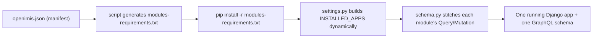
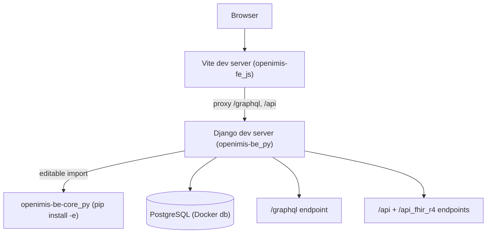

# Set Up a Dev Environment

> **Part 3 of the course.** Reading about openIMIS only gets you so far — you learn the plugin architecture fastest by watching it assemble itself on your own machine. This chapter is a **concise quickstart**: clone the assembly repos, understand the manifest, boot the stack with Docker, and run the backend and frontend with editable module installs. The deeper material — CI, testing, migrations discipline, releases — lives in the [Developer Workflow](../workflow/index.md) chapter, which this page deliberately does **not** duplicate.

## Learning objectives

By the end of this chapter you will be able to:

- Clone the two backend/frontend **assembly repos** and locate their **`openimis.json`** manifests.
- Boot a full local stack with the Docker distribution (`openimis-dist_dkr`).
- Run the **backend** locally with a module installed **editable** (`pip install -e`), and the **frontend** with **Vite**.
- Reach the running app at its default URLs and know where to turn when something breaks.

## Prerequisites

- [Platform Overview](overview.md) and [Terminology Primer](terminology.md) — you should know what an *assembly repo*, a *module*, and the *manifest* are before running any of this.
- Installed locally: **Git**, **Docker + Docker Compose**, **Python 3.x** with `venv`, and **Node.js + npm** (or Yarn). These are assumed background for this handbook.

!!! tip "Two ways to run openIMIS locally"
    - **Docker-first (recommended to start):** bring the whole stack up with `openimis-dist_dkr`. Fastest path to "it's running in my browser," great for exploring.
    - **Native module dev:** run the backend and frontend directly on your host with one or more modules installed **editable**, so your code changes take effect immediately. This is how you actually develop a module.

    Most developers use **both**: Docker for the database and the parts they are not editing, native for the module they are working on.

---

## The pieces you will clone

Three repositories matter for local development. (See the [Repository Map](../architecture/repository-map.md) for the complete picture.)

| Repo | Role | You will clone it to... |
| --- | --- | --- |
| `openimis-be_py` | Backend **assembly** project (Django) | run/serve the backend, edit `openimis.json` |
| `openimis-fe_js` | Frontend **assembly** SPA (React + Vite) | run the UI |
| `openimis-dist_dkr` | **Docker** distribution (`docker-compose`) | boot the whole stack quickly |
| `openimis-be-<name>_py` | Any **module** you want to edit | `pip install -e` it into the backend |

```bash
# Clone the assemblies and the Docker distribution side by side
git clone https://github.com/openimis/openimis-be_py.git
git clone https://github.com/openimis/openimis-fe_js.git
git clone https://github.com/openimis/openimis-dist_dkr.git

# Clone a module you intend to edit (example: core)
git clone https://github.com/openimis/openimis-be-core_py.git
```

!!! warning "Clone side by side"
    Keep the module repos as **siblings** of `openimis-be_py`, not nested inside it. The editable-install commands below use relative paths like `../openimis-be-core_py/`, which assumes a flat directory layout:

    ```text
    openimis/
      openimis-be_py/
      openimis-fe_js/
      openimis-dist_dkr/
      openimis-be-core_py/
    ```

---

## The manifest: `openimis.json`

Everything starts with the **module manifest**. In `openimis-be_py` the file `openimis.json` lists every backend module the assembled app should load, each with a source (a pip package and/or a Git reference).

```json
{
  "modules": [
    { "name": "core",     "pip": "openimis-be-core" },
    { "name": "insuree",  "pip": "openimis-be-insuree" },
    { "name": "policy",   "pip": "openimis-be-policy" },
    { "name": "claim",    "pip": "openimis-be-claim" }
  ]
}
```

*Illustrative* — the real manifest lists roughly **47** modules and richer source specs *(see `openimis-be_py/openimis.json`)*.

The assembly turns this manifest into installable requirements and a dynamic app list:



You edit `openimis.json` when you want to **add, remove, or re-point a module** (for example, point `core` at your local checkout during development). *How* `settings.py` and `schema.py` consume this is the subject of the [Backend Deep Dive](../architecture/backend.md) and [Plugin System](../architecture/plugin-system.md) chapters — here we just run it.

!!! info "Did you know?"
    The frontend has its **own** `openimis.json` in `openimis-fe_js`. On the frontend, `openimis-config-vite.js` reads that manifest and generates `src/modules.js`, the file that imports every frontend module's config object. Same idea, two assemblies.

---

## Path A — Docker quickstart

The fastest way to see openIMIS running is the Docker distribution. It brings up the database, backend, frontend, and a gateway together.

```bash
cd openimis-dist_dkr

# Provide configuration/secrets (copy the example env and edit as needed)
cp .env.example .env     # exact filename may vary — check the repo README

# Bring the stack up
docker compose up -d

# Watch the backend do its first-run migrations and config loads
docker compose logs -f backend
```

The compose stack typically includes these services (names may vary slightly by version — confirm in `openimis-dist_dkr`):

| Service | What it is |
| --- | --- |
| `db` | PostgreSQL |
| `backend` | Django served via Gunicorn; runs migrations + loads module configs on start |
| `frontend` | React build served by Nginx |
| `gateway` | Nginx reverse proxy tying the frontend, `/api`, and `/graphql` together |
| `opensearch` *(optional)* | Backing store for `opensearch_reports` analytics |

!!! danger "Common mistake: startup order matters"
    The **backend runs database migrations and loads each module's configuration on first start**, so it must come up *after* `db` is accepting connections. If the backend container appears to crash-loop on a fresh checkout, it is usually racing the database — give `db` time to become healthy (or rely on the compose health/ordering config) and retry. Watch `docker compose logs -f backend` to confirm migrations actually completed before you go hunting for other causes.

Once the stack is healthy, open the app (see [Default URLs](#default-urls-and-ports) below). At this point you have a working openIMIS with no code of your own — perfect for exploring the UI and the GraphQL endpoint.

---

## Path B — Native backend with an editable module

To actually develop, you want your changes in a module to take effect without rebuilding a container. That is what an **editable install** (`pip install -e`) gives you.

```bash
cd openimis-be_py

# 1. Create and activate a virtualenv
python -m venv venv
source venv/bin/activate         # Windows: venv\Scripts\activate

# 2. Install the assembled backend's requirements
pip install -r requirements.txt

# 3. Install the module(s) you are editing in EDITABLE mode.
#    This overrides the pip-installed version with your local checkout.
pip install -e ../openimis-be-core_py/

# 4. Point the backend at a database (Docker's db is convenient) via env/.env,
#    then run migrations and start the dev server.
python openimis/manage.py migrate
python openimis/manage.py runserver 0.0.0.0:8000
```

*Illustrative command layout* — confirm exact paths and settings-module conventions in `openimis-be_py` (its README and `openimis/settings.py`). The key idea: **`pip install -e ../openimis-be-<name>_py/`** makes Python import your working copy of that module, so edits to its `models.py`, `schema.py`, `services.py`, etc. are picked up on reload.

!!! tip "Editable install + the manifest"
    An editable install changes *where Python finds the code*; the module must still be **listed in `openimis.json`** so the assembly loads it into `INSTALLED_APPS` and stitches its schema. Editable-installing a module that the manifest does not include will not make it appear in the app.

---

## Path C — Native frontend with Vite

The frontend is a React SPA that recently migrated to **Vite** (from Create React App + CRACO).

```bash
cd openimis-fe_js

# 1. Install dependencies
npm install

# 2. Generate src/modules.js from the frontend openimis.json manifest
#    (Vite config helper — see openimis-config-vite.js)
npm run build:modules      # exact script name may vary; check package.json

# 3. Start the Vite dev server (hot module reload)
npm run start              # or: npm run dev — check package.json scripts
```

Vite serves the SPA with hot-reload and proxies API/GraphQL calls to the backend (configured in the Vite config). Because the frontend uses a **custom Redux-based GraphQL layer — not Apollo** — and the async `MutationLog` polling described in the [Terminology Primer](terminology.md), expect the network tab to show a mutation request followed by **status-polling** queries. That is normal; it is explained fully in [Frontend Architecture](../architecture/frontend.md).

!!! danger "Common mistake"
    Forgetting to (re)generate `src/modules.js` after changing the frontend `openimis.json`. If a frontend module's menu, route, or component "isn't there," the manifest-to-`modules.js` generation step (via `openimis-config-vite.js`) very likely did not run. Regenerate, then restart the dev server.

---

## The local dev topology

Here is how the pieces talk to each other when you mix Docker and native processes — the common "database and gateway in Docker, the module I'm editing native" setup:



The frontend dev server proxies GraphQL and REST calls to your native Django server; your Django server imports the module you are editing directly from its checkout; and both share the PostgreSQL instance (often the one from the Docker distribution).

---

## Default URLs and ports

Exact ports depend on your compose file and dev-server config — always confirm against `openimis-dist_dkr` and the two assembly repos — but the typical local layout is:

| Surface | Typical local URL |
| --- | --- |
| Frontend SPA (via gateway) | `http://localhost/front` |
| Frontend (native Vite dev server) | `http://localhost:3000` |
| Backend, native Django dev server | `http://localhost:8000` |
| GraphQL endpoint | `http://localhost:8000/graphql` (or `/api/graphql` behind the gateway) |
| GraphiQL explorer | the GraphQL URL in a browser (when enabled) |
| REST / FHIR | `.../api/` and `.../api_fhir_r4/` |

!!! tip "Meet GraphiQL early"
    When the backend is up, open the GraphQL endpoint in a browser to reach **GraphiQL**, an interactive query explorer. Even before you know GraphQL, poke at it — run the introspection, expand `Query`, and see the fields each module contributes. It is the single best way to *feel* the stitched-together schema the [GraphQL chapter](../graphql/index.md) explains.

---

## Hands-on lab

!!! example "Lab 3 — From zero to a running query"
    **Goal:** stand up openIMIS and run your first GraphQL query against it.

    1. Clone `openimis-be_py`, `openimis-fe_js`, and `openimis-dist_dkr` as **siblings** in one parent directory.
    2. In `openimis-dist_dkr`, create your `.env` and run `docker compose up -d`. Follow `docker compose logs -f backend` until you see migrations complete and the module configs load. Note in your own words *why* the backend must start after `db`.
    3. Open the frontend in your browser (see [Default URLs](#default-urls-and-ports)). Confirm the login screen renders.
    4. Open the **GraphQL endpoint** in your browser to reach GraphiQL. Run a tiny query — for example, introspect the schema or fetch the current user — and confirm you get a JSON response. (If auth blocks you, that is expected; note *which* status the response carries.)
    5. **Editable-install challenge:** stop the Docker `backend`, run the backend natively per Path B with `pip install -e ../openimis-be-core_py/`, add a trivial harmless change to a docstring in `core`, reload, and confirm your change is picked up without reinstalling.

    **Success looks like:** the app renders in your browser, GraphiQL returns a response, and you have watched an editable module change take effect live.

## Exercises

1. Open both `openimis.json` files (backend and frontend). List three modules that appear in the backend manifest and find their matching `openimis-be-<name>_py` repositories.
2. In the frontend, locate `openimis-config-vite.js` and describe, in two sentences, what it generates and why the app cannot start without it.
3. Identify, from `openimis-dist_dkr`, which service acts as the **gateway** and what three things it routes together.

## Knowledge check

??? question "Q1: What does `pip install -e ../openimis-be-core_py/` do, and why is it useful in development? (click for answer)"
    It installs the `core` module in **editable** mode, so Python imports your local working copy instead of the pip-published version. Edits to that checkout take effect on the next reload without reinstalling — the standard way to develop a module against the assembled backend.

??? question "Q2: Why must the Docker `backend` service start after `db`? (click for answer)"
    Because on first start the backend **runs database migrations and loads each module's configuration into the database**. Without a ready `db`, those steps fail and the container may crash-loop. Startup order is `db` → `backend` → `frontend`/`gateway`.

??? question "Q3: You editable-installed a module but it doesn't appear in the running app. What did you likely forget? (click for answer)"
    To list it in **`openimis.json`**. The editable install only changes where Python finds the code; the module must be in the manifest so the assembly adds it to `INSTALLED_APPS` and stitches its GraphQL schema.

??? question "Q4: The frontend uses which build tool and which state library — and notably which library does it NOT use for GraphQL? (click for answer)"
    It builds with **Vite** and manages state with **Redux** (with thunks). It does **not** use **Apollo** — GraphQL goes through a custom Redux-based layer in core, including the async `MutationLog` polling ("journalize") helper.

??? question "Q5: A frontend module's menu item isn't showing up after you edited the frontend manifest. What's the most likely cause? (click for answer)"
    `src/modules.js` was not regenerated. After changing the frontend `openimis.json`, you must re-run the generation step (via `openimis-config-vite.js`) and restart the dev server so the new module config is imported.

## Where to go next

- If something above broke, start at [Reference → Troubleshooting](../reference/troubleshooting.md) — it catalogs the common local-setup failures (migration races, missing `.env` values, manifest/`modules.js` drift, port conflicts).
- For CI, automated testing, migration discipline, and the release/contribution process, go to the [Developer Workflow](../workflow/index.md) chapter — this quickstart deliberately stays out of that territory.
- With the app running, open the hood: [Architecture Overview](../architecture/overview.md), then learn the API in [GraphQL](../graphql/index.md).

## Further reading

- `openimis-be_py`, `openimis-fe_js`, and `openimis-dist_dkr` **READMEs** — the authoritative, version-current setup steps.
- [github.com/openimis](https://github.com/openimis) — all module repositories.
- [Official openIMIS wiki](https://openimis.atlassian.net/wiki/) — deployment and installation guides.
- [Vite documentation](https://vitejs.dev/) — the frontend build tool.
