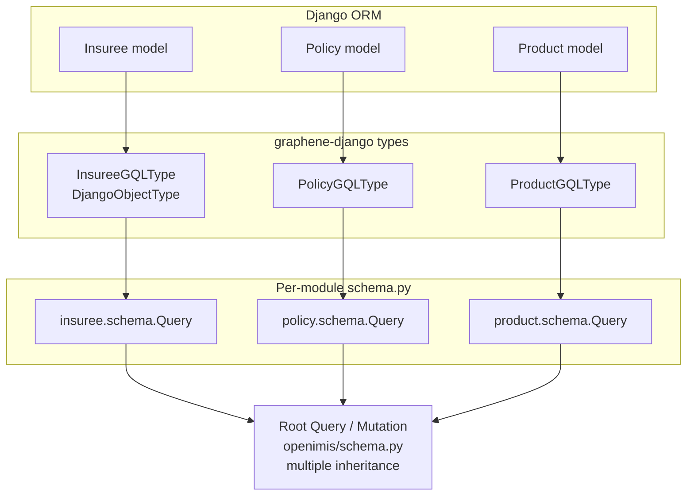
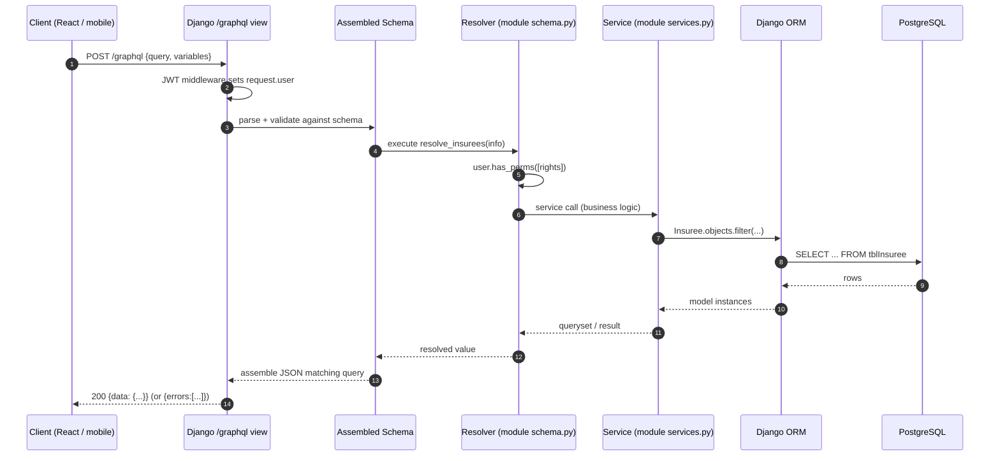
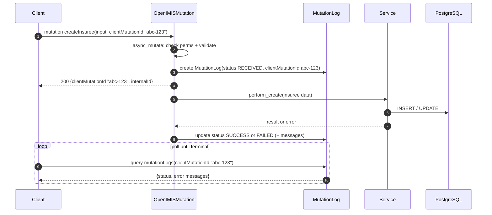
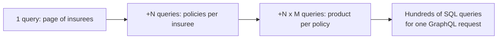

# GraphQL from First Principles

> **Part 6 of the openIMIS Developer Academy.** You already write Django models,
> serializers, and DRF viewsets. This chapter teaches you GraphQL from zero —
> what it is, why openIMIS bet its entire API surface on it, and how the
> `graphene-django` stack turns your ORM models into a single typed endpoint.
> By the end you will read, write, and reason about openIMIS queries and
> mutations with the same fluency you have with a DRF `ViewSet`.

## Learning objectives

By the end of this chapter you will be able to:

- Explain what GraphQL is and articulate, point by point, how it differs from a
  REST/DRF API.
- Justify **why** openIMIS chose GraphQL over REST for its primary API.
- Trace how `graphene-django` builds a schema from Django models using
  `ObjectType`, Relay connections, and `OrderedDjangoFilterConnectionField`.
- Write resolvers and understand where permission checks and validation belong.
- Read and write openIMIS **queries** and, critically, the asynchronous
  `OpenIMISMutation` / `MutationLog` **mutation** pattern with `clientMutationId`
  polling.
- Diagnose and fix the **N+1 query problem** in resolvers.
- Follow a request end to end: `Client → /graphql → schema → resolver → service
  → ORM → DB`.

## Prerequisites

This chapter assumes you have read:

- [Architecture Overview](../architecture/overview.md) — the modular backend.
- [Request Lifecycle](../architecture/request-lifecycle.md) — how a request
  moves through the Django project.
- [Plugin / Module System](../architecture/plugin-system.md) — how modules are
  assembled, because the GraphQL schema is assembled the same way.
- [Core module](../modules/core.md) — where `OpenIMISMutation`,
  `ExtendedConnection`, and the `User` model live.

You should be comfortable with Django models, the ORM, and DRF. You do **not**
need any prior GraphQL knowledge — we build it up from nothing.

---

## 1. What is GraphQL?

GraphQL is a **query language for your API** plus a **runtime** that executes
those queries against your data. It was created at Facebook and is now an
open standard governed by the GraphQL Foundation.

Strip away the hype and there are exactly four ideas. If you internalize these
four, everything else is detail.

1. **One endpoint, not many.** A REST API exposes dozens of URLs
   (`/api/insurees/`, `/api/insurees/42/`, `/api/policies/?insuree=42`). A
   GraphQL API exposes **a single URL** — in openIMIS, `/graphql` — and you
   describe what you want in the request body.
2. **The client specifies the fields.** In REST the *server* decides the shape
   of every response. In GraphQL the *client* writes a query that names exactly
   the fields it wants, and the response mirrors that shape — no more, no less.
3. **One round trip for a graph of data.** Because you can ask for related
   objects in the same query (an insuree *and* their policies *and* each
   policy's product), you replace a waterfall of REST calls with a single
   request.
4. **A typed schema is the contract.** Every field has a type. The schema is
   introspectable — tools can read it, validate queries against it, and generate
   documentation and autocompletion. There is no "read the wiki to find out what
   fields exist"; the schema *is* the documentation.

!!! info "Did you know?"
    The "QL" in GraphQL is real: a GraphQL query is a string sent to the server,
    parsed, validated against the schema, and executed — much like SQL is a
    string sent to a database. The difference is that GraphQL resolves each field
    by calling a **resolver function** you (or the framework) wrote, so the
    "database" behind a GraphQL field can be a Django ORM query, a REST call to
    another service, or a computed value.

### A first taste

Here is a REST interaction you already understand, followed by its GraphQL
equivalent. Suppose you want an insuree's chosen name plus the products of each
of their policies.

=== "REST / DRF (multiple calls)"

    ```bash
    # 1. Fetch the insuree
    GET /api/insurees/9a3f.../
    # -> { "id": "9a3f...", "chfId": "100001", "otherNames": "Amina",
    #      "lastName": "Diallo", "gender": "F", ...30 more fields you didn't want }

    # 2. Fetch their policies (separate endpoint, separate round trip)
    GET /api/policies/?insuree=9a3f...
    # -> [ { "id": "...", "product": 12, ... }, ... ]

    # 3. For each policy, fetch the product to get its name (N more round trips!)
    GET /api/products/12/
    ```

=== "GraphQL (one call)"

    ```graphql
    query {
      insurees(chfId: "100001") {
        edges {
          node {
            otherNames
            lastName
            policies {
              edges {
                node {
                  product { code name }
                }
              }
            }
          }
        }
      }
    }
    ```

    One request. Exactly the fields named. The response is JSON shaped like the
    query (we show the full response in [§6](#6-your-first-query)).

---

## 2. GraphQL vs REST — a side-by-side

You will get the most out of GraphQL by mapping each concept onto something you
already know from DRF.

| Concern | REST / DRF | GraphQL (graphene-django) |
| --- | --- | --- |
| **Endpoints** | Many URLs, one per resource/action | **One** URL: `/graphql` |
| **Who chooses response fields** | Server (the serializer) | **Client** (the query) |
| **Over-fetching** | Common — you get all serializer fields | Eliminated — you name fields |
| **Under-fetching** | Common — extra calls for related data | Eliminated — traverse the graph in one query |
| **Round trips for related data** | Often N+1 network calls | Usually **one** |
| **Type contract** | OpenAPI/Swagger (bolted on, optional) | **Built-in, introspectable schema** |
| **Versioning** | `/api/v1`, `/api/v2` | Evolve the schema; deprecate fields with `@deprecated` |
| **Reads** | `GET` verbs | **Query** operations |
| **Writes** | `POST`/`PUT`/`PATCH`/`DELETE` | **Mutation** operations |
| **List filtering** | Query params + `django-filter` | Filter arguments on connection fields |
| **Pagination** | `?limit=&offset=` or page numbers | **Relay cursor connections** (`first`/`after`) |
| **Error model** | HTTP status codes (404, 400, 403) | HTTP 200 + an `errors` array in the body |
| **Discovery** | Read the docs | Introspect the schema (GraphiQL autocompletes) |

!!! warning "GraphQL usually returns HTTP 200 even on 'errors'"
    This trips up every REST engineer once. A GraphQL response is `200 OK` even
    when a field failed to resolve; the failure appears as an `errors` array
    alongside (possibly partial) `data`. Do not write client code that keys off
    the HTTP status alone. openIMIS layers its **own** business-error convention
    on top of this via `MutationLog` (see [§8](#8-mutations-the-openimismutation-pattern)).

### The two problems GraphQL solves by design

- **Over-fetching:** a REST endpoint returns a fixed, fat payload. A mobile
  enrolment app on a 2G connection in a rural district does not want 40 insuree
  fields to render a name badge. GraphQL lets it ask for two.
- **Under-fetching (the N+1 network problem):** a dashboard needs an insuree,
  their policies, and each product. REST forces a request waterfall. GraphQL
  collapses it into one typed request.

---

## 3. Why openIMIS chose GraphQL

openIMIS is not a single product with one UI. It is a **platform** deployed by
many countries, each with different modules enabled, different rules, and
often **country-specific frontends and mobile apps**. That context makes
GraphQL a natural fit for three concrete reasons.

- **Heterogeneous, evolving clients.** Tanzania's UI, Nepal's UI, a claims
  mobile app, and an FHIR bridge all read the same data differently. A
  client-specified query language means each client fetches its own shape
  without the backend shipping a new endpoint per screen.
- **Over/under-fetching would be brutal here.** openIMIS models form a deep
  graph — insuree → family → policies → product → items/services → price lists.
  REST would force either enormous fixed payloads or chatty request waterfalls.
  Field selection and graph traversal solve both.
- **A modular schema that grows with the platform.** openIMIS has ~47 backend
  modules, and deployments enable different subsets. Because the root schema is
  **assembled** from each installed module's `Query` and `Mutation` (via Python
  multiple inheritance in `openimis/schema.py`), enabling a module *automatically
  extends the API*. There is no central API layer to edit. A single typed schema
  that different deployments compose differently is exactly what a plugin
  platform needs.

!!! info "Did you know?"
    The openIMIS **frontend does not use Apollo Client**. It talks to `/graphql`
    through a thin custom layer in `openimis-fe-core_js` — Redux action creators
    called `graphql` / `graphqlWithVariables`, plus a "journalize"/polling helper
    that watches the asynchronous `MutationLog`. GraphQL the protocol does not
    obligate you to any particular client library; openIMIS chose Redux thunks
    over Apollo.

---

## 4. The schema architecture in openIMIS

openIMIS uses **`graphene-django`**, the Django integration for the Graphene
GraphQL library. Here is the layered picture, from your Django model up to the
single root schema.



### 4.1 ObjectTypes from Django models

A GraphQL **ObjectType** is the analogue of a DRF **serializer**: it declares
which fields of a model are exposed and under what GraphQL types. With
`graphene-django` you subclass `DjangoObjectType` and point it at a model.

```python
# illustrative — faithful to openIMIS conventions (see openimis-be-insuree_py/
# insuree/gql_queries.py and openimis-be-core_py/core/schema.py)
import graphene
from graphene_django import DjangoObjectType
from core import ExtendedConnection
from core.schema import OrderedDjangoFilterConnectionField
from .models import Insuree


class InsureeGQLType(DjangoObjectType):
    class Meta:
        model = Insuree
        interfaces = (graphene.relay.Node,)     # (1)!
        connection_class = ExtendedConnection    # (2)!
        filter_fields = {                         # (3)!
            "chf_id": ["exact", "istartswith", "icontains"],
            "last_name": ["exact", "icontains"],
            "gender__code": ["exact"],
        }
```

1. Implementing the Relay `Node` interface gives every object a globally unique,
   opaque `id` and enables cursor-based pagination (connections). This is the
   Relay convention Graphene builds on.
2. `connection_class = ExtendedConnection` swaps the default Relay connection for
   openIMIS's core subclass, which adds `totalCount` and `edgeCount` — you almost
   always want these for a paginated UI.
3. `filter_fields` is `django-filter` syntax. It declares which lookups become
   GraphQL filter arguments — the GraphQL equivalent of a DRF `FilterSet`.

!!! info "Did you know?"
    Because `DjangoObjectType` reads your model's fields, adding a field to a
    model and exposing it in GraphQL is often a one-line change — much less
    ceremony than a matching REST serializer + viewset + URL route. This is a big
    part of why openIMIS modules can evolve their API quickly.

### 4.2 Relay-style connections and `ExtendedConnection`

When you make a type a Relay `Node` and expose it as a list, Graphene wraps the
list in a **connection**. Instead of a bare JSON array you get:

```
Connection
 ├── edges: [ { node: <the object>, cursor: <opaque string> }, ... ]
 └── pageInfo: { hasNextPage, hasPreviousPage, startCursor, endCursor }
```

This looks verbose, but it is what makes stable cursor pagination possible
(covered in [§10](#10-pagination-relay-cursor-connections)). openIMIS's core
defines **`ExtendedConnection`** to add two fields every real UI needs:

```python
# illustrative (see openimis-be-core_py/core/schema.py)
class ExtendedConnection(graphene.relay.Connection):
    class Meta:
        abstract = True

    total_count = graphene.Int()   # total rows matching the filter
    edge_count = graphene.Int()    # rows in THIS page

    def resolve_total_count(self, info, **kwargs):
        return self.length

    def resolve_edge_count(self, info, **kwargs):
        return len(self.edges)
```

`totalCount` lets the frontend render "Showing 25 of 3,410"; `edgeCount` is the
size of the current page. Vanilla Relay connections give you neither.

### 4.3 `OrderedDjangoFilterConnectionField`

The field you actually put on a `Query` to expose a filterable, sortable,
paginated list is openIMIS's **`OrderedDjangoFilterConnectionField`**. Think of
it as `DjangoFilterConnectionField` (from `graphene-django`, which wires
`filter_fields` into GraphQL arguments) **plus** an `orderBy` argument so clients
can sort — the GraphQL analogue of DRF's `OrderingFilter`.

```python
# illustrative (see openimis-be-insuree_py/insuree/schema.py)
class Query(graphene.ObjectType):
    insurees = OrderedDjangoFilterConnectionField(
        InsureeGQLType,
        orderBy=graphene.List(of_type=graphene.String),  # e.g. ["lastName","-chfId"]
        show_history=graphene.Boolean(),
    )

    def resolve_insurees(self, info, **kwargs):
        # permission check + queryset shaping happen here — see §9
        ...
```

Every openIMIS list query you meet — `insurees`, `policies`, `claims`,
`locations` — is one of these fields. Learn this one field and you can read the
query side of every module.

---

## 5. Resolvers

A **resolver** is the function that produces the value for a field. This is the
single most important concept in GraphQL, so slow down here.

- Every field in the schema has a resolver.
- If you don't write one, Graphene supplies a **default resolver** that just
  reads the attribute off the parent object (`getattr(parent, field_name)`). For
  a `DjangoObjectType`, that means most scalar fields resolve for free by reading
  the model instance.
- You write an explicit resolver when a field needs logic: permissions, filtering
  the queryset, computing a value, or calling a service.

The resolver signature is `resolve_<field>(parent, info, **args)`:

```python
# illustrative
def resolve_insurees(self, info, **kwargs):
    user = info.context.user          # (1)!
    Query._check_permissions(user)    # (2)!
    qs = Insuree.objects.filter(validity_to__isnull=True)  # (3)!
    return gql_optimizer.query(qs, info)                    # (4)!
```

1. `info.context` is the Django **`HttpRequest`**. So `info.context.user` is the
   authenticated Django user — the same object you'd read in a DRF view. This is
   the bridge between GraphQL and Django's auth. (`info` also carries the parsed
   query, useful for query optimization.)
2. Permission enforcement lives in the resolver. See [§9](#9-permissions-authorization).
3. `validity_to__isnull=True` is the openIMIS idiom for "the currently valid
   row" — most core models are **temporally versioned** (`validity_from` /
   `validity_to`), so you almost always filter to live records.
4. `gql_optimizer.query(qs, info)` inspects the incoming query and applies
   `select_related` / `prefetch_related` automatically — the N+1 mitigation from
   [§11](#11-performance-and-the-n1-problem).

!!! info "Did you know?"
    The `self` (parent) argument of a root `Query` resolver is usually `None` —
    the root query has no parent object. For a *nested* field like
    `Insuree.policies`, the parent is the `Insuree` instance, which is how the
    resolver knows *whose* policies to return.

---

## 6. Your first query

Let's run a real query against openIMIS and see the response shape. Open the
GraphiQL IDE (typically served at `/graphql` in a dev build) and paste:

```graphql
query InsureeWithPolicies {
  insurees(chfId_Iexact: "100001", first: 1) {
    totalCount
    edges {
      node {
        uuid
        chfId
        otherNames
        lastName
        gender { code }
        policies {
          edges {
            node {
              enrollDate
              expiryDate
              product { code name }
            }
          }
        }
      }
    }
  }
}
```

The response is JSON shaped exactly like the query:

```json
{
  "data": {
    "insurees": {
      "totalCount": 1,
      "edges": [
        {
          "node": {
            "uuid": "9a3f8b12-4c7d-4e2a-bb90-2f0c1e6d7a55",
            "chfId": "100001",
            "otherNames": "Amina",
            "lastName": "Diallo",
            "gender": { "code": "F" },
            "policies": {
              "edges": [
                {
                  "node": {
                    "enrollDate": "2026-01-15",
                    "expiryDate": "2027-01-14",
                    "product": { "code": "BASIC", "name": "Basic Health Cover" }
                  }
                }
              ]
            }
          }
        }
      ]
    }
  }
}
```

Notice three things a REST engineer should savour:

- You asked for `gender { code }` — a *nested* selection — and got exactly that,
  not the whole gender object.
- `policies` and `product` came back **in the same request**. No waterfall.
- `totalCount` came from `ExtendedConnection`.

### Variables — the parameterized query

Never string-concatenate values into a query. GraphQL has **variables**, the
equivalent of parameterized SQL:

```graphql
query InsureeByChf($chf: String!, $limit: Int = 10) {
  insurees(chfId_Iexact: $chf, first: $limit) {
    edges { node { uuid lastName } }
  }
}
```

```json
{ "chf": "100001", "limit": 5 }
```

The `String!` means "required string"; `Int = 10` gives a default. This is
exactly what the frontend's `graphqlWithVariables` action creator sends.

---

## 7. The request lifecycle

Here is how a query travels through openIMIS, tying together everything from
[Request Lifecycle](../architecture/request-lifecycle.md) with the GraphQL layer.



The key insight: **GraphQL sits on top of your existing Django stack.** The
`/graphql` view is just another Django view; `info.context` is the request; the
resolver calls the same **services** and **ORM** a DRF view would. GraphQL
changes the *shape of the contract*, not the layers beneath it. Business logic
belongs in `services.py`, never in resolvers — the resolver is a thin
authorization-and-shaping layer.

---

## 8. Mutations — the `OpenIMISMutation` pattern

Reads are queries; **writes are mutations**. A vanilla GraphQL mutation looks
like a query that changes data and returns a result. openIMIS, however, wraps
*all* writes in a distinctive **asynchronous, audited** pattern built on the
core base class **`OpenIMISMutation`** and a **`MutationLog`** model. You must
understand this pattern to do anything real in openIMIS, so we cover it
thoroughly.

### 8.1 Why asynchronous?

Many openIMIS operations are heavy: enrolling a family, valuing a batch of
claims through calculation rules, generating payments. Making the client block
on an HTTP request for these is fragile. So openIMIS mutations follow a
**fire-and-poll** model:

1. The client sends the mutation. The server **validates**, creates a
   **`MutationLog`** row (status = *RECEIVED*), kicks off the work, and
   **immediately returns a `clientMutationId`** — an id the *client* generated to
   identify this operation.
2. The work proceeds (synchronously or via the scheduler), updating the
   `MutationLog` status to *SUCCESS* or *FAILED*, recording any error messages.
3. The client **polls** the `mutationLogs` query using its `clientMutationId`
   until the status is terminal, then reads the outcome.

This gives every write a durable **audit trail** (who, what, when, success or
failure) and decouples slow work from the request.



### 8.2 What a mutation looks like

```python
# illustrative — faithful to the OpenIMISMutation pattern
# (see openimis-be-core_py/core/schema.py and any module's gql_mutations/)
from core.schema import OpenIMISMutation
from .services import InsureeService
from .apps import InsureeConfig


class CreateInsureeMutation(OpenIMISMutation):
    _mutation_module = "insuree"
    _mutation_class = "CreateInsureeMutation"

    class Input(OpenIMISMutation.Input):     # (1)!
        chf_id = graphene.String(required=True)
        last_name = graphene.String(required=True)
        other_names = graphene.String(required=True)
        gender_id = graphene.String(required=False)
        # clientMutationId + clientMutationLabel are inherited from the base Input

    @classmethod
    def async_mutate(cls, user, **data):      # (2)!
        if not user.has_perms(InsureeConfig.gql_mutation_create_insurees_perms):
            raise PermissionDenied(_("unauthorized"))
        try:
            service = InsureeService(user)
            service.create_or_update(data)    # (3)!
            return None                        # (4)!
        except Exception as exc:
            return [{
                "message": _("insuree.mutation.failed_to_create_insuree"),
                "detail": str(exc),
            }]
```

1. Every mutation defines an inner `Input` subclassing `OpenIMISMutation.Input`,
   which already carries `clientMutationId` and `clientMutationLabel`. Inputs are
   the GraphQL equivalent of a DRF serializer's writable fields.
2. You override **`async_mutate`**, not `mutate`. The base class handles creating
   the `MutationLog`, wrapping in a transaction, catching exceptions, and setting
   final status. Your job is: check permissions, call the service.
3. **All business logic lives in the service**, not the mutation. The mutation is
   the authorization + input-marshalling boundary.
4. Return **`None`** on success. Return a **list of error dicts** on failure —
   the base class writes them into the `MutationLog` for the client to poll.

### 8.3 Sending a mutation and polling

**Step 1 — send the mutation** (the client invents `clientMutationId`, here a
UUID `abc-123`):

```graphql
mutation CreateInsuree($input: CreateInsureeMutationInput!) {
  createInsuree(input: $input) {
    clientMutationId
    internalId
  }
}
```

```json
{
  "input": {
    "clientMutationId": "abc-123",
    "clientMutationLabel": "Create insuree Amina Diallo",
    "chfId": "100042",
    "lastName": "Diallo",
    "otherNames": "Amina"
  }
}
```

Immediate response — note it does **not** contain the created insuree, only the
handle:

```json
{ "data": { "createInsuree": { "clientMutationId": "abc-123", "internalId": "551" } } }
```

**Step 2 — poll `mutationLogs`** until status is terminal:

```graphql
query PollMutation($id: String!) {
  mutationLogs(clientMutationId: $id) {
    edges {
      node {
        status        # 0 RECEIVED, 1 SUCCESS, 2 ERROR (values per core)
        error
        clientMutationId
      }
    }
  }
}
```

```json
{
  "data": {
    "mutationLogs": {
      "edges": [
        { "node": { "status": 1, "error": "", "clientMutationId": "abc-123" } }
      ]
    }
  }
}
```

Status `1` (SUCCESS) means the insuree now exists; the client re-queries
`insurees` to display it. A non-empty `error` with a failure status tells the UI
what went wrong. The frontend's "journalize" helper automates exactly this poll
loop.

!!! danger "Common mistake: expecting the created object back synchronously"
    Coming from DRF, you expect `POST /insurees/` to return the created insuree
    in the same response. openIMIS mutations **do not** — they return a
    `clientMutationId`, and you must **poll `mutationLogs`** for success, then
    re-query the entity. Writing frontend code that reads
    `response.data.createInsuree.insuree.uuid` will fail: there is no such field.
    Always: send → poll `mutationLogs` → re-query.

??? note "Deep dive: transactions, signals, and where validation really happens"
    `OpenIMISMutation.mutate` (the method you do *not* override) wraps
    `async_mutate` so that: (a) the whole operation runs inside a database
    transaction — a failure rolls back cleanly; (b) `register_service_signal`
    hooks in *other* modules can fire **before/after** the service call, letting a
    country-specific module inject validation or side effects without touching the
    insuree module (the same extension seam described in the
    [Plugin / Module System](../architecture/plugin-system.md)); and (c) the
    `MutationLog` is updated to its terminal status even if an exception is
    raised. Input-shape validation (required fields, types) is enforced by
    GraphQL **before** your resolver runs — a missing `chfId` is rejected by the
    schema. *Business* validation (is this CHF id unique? is the gender code
    valid?) belongs in the **service**, which raises exceptions that become
    `MutationLog` errors.

---

## 9. Permissions & authorization

openIMIS authorization is **integer rights** checked in resolvers and mutations.
This is covered in depth in the [Authentication & Authorization](../security/index.md)
chapter; here is what you need for GraphQL specifically.

- Each module declares permission codes as **integers** in its `apps.py`
  `AppConfig` (e.g. `gql_query_claims_perms = [111001]`,
  `gql_mutation_create_insurees_perms = [101002]`).
- A role carries a set of rights; a user's rights are the union of their roles'.
- You enforce with Django's standard `user.has_perms([...])`, passing the
  integer codes:

```python
# illustrative — the canonical guard at the top of a resolver/mutation
from django.core.exceptions import PermissionDenied
from django.utils.translation import gettext as _

def resolve_claims(self, info, **kwargs):
    user = info.context.user
    if user.is_anonymous or not user.has_perms(ClaimConfig.gql_query_claims_perms):
        raise PermissionDenied(_("unauthorized"))
    ...
```

!!! danger "Common mistake: forgetting the permission check in a resolver"
    GraphQL has **no per-URL middleware** to lean on the way REST does. There is
    one endpoint. If a resolver or mutation omits its `has_perms` check, that data
    or operation is exposed to **any authenticated user**. Every resolver that
    returns protected data and every mutation must check rights explicitly —
    treat it as non-negotiable boilerplate, and grep the module for the config
    constant to confirm it is wired.

---

## 10. Pagination — Relay cursor connections

REST pagination is usually offset-based (`?limit=25&offset=50`). GraphQL/Relay
uses **cursor-based** pagination, which is more stable when rows are being
inserted concurrently. The connection arguments are:

| Argument | Meaning | REST analogue |
| --- | --- | --- |
| `first: N` | take the first N after the cursor | `limit` (forward) |
| `after: "<cursor>"` | start after this opaque cursor | `offset` (roughly) |
| `last: N` | take the last N before the cursor | `limit` (backward) |
| `before: "<cursor>"` | end before this cursor | — |

A cursor is an **opaque** base64 string — do not parse it; just pass back the
`endCursor` you were given. The pattern is: fetch a page, read
`pageInfo.endCursor` and `pageInfo.hasNextPage`, then request the next page with
`after: <endCursor>`.

```graphql
query FirstPage {
  insurees(first: 25, orderBy: ["lastName"]) {
    totalCount            # from ExtendedConnection
    pageInfo { hasNextPage endCursor }
    edges { cursor node { uuid lastName } }
  }
}
```

Next page — reuse the `endCursor`:

```graphql
query NextPage($cursor: String!) {
  insurees(first: 25, after: $cursor, orderBy: ["lastName"]) {
    pageInfo { hasNextPage endCursor }
    edges { node { uuid lastName } }
  }
}
```

!!! info "Did you know?"
    Because openIMIS filter fields, `orderBy`, and Relay pagination all live on
    the **same** `OrderedDjangoFilterConnectionField`, a single query can filter
    (`lastName_Icontains: "dia"`), sort (`orderBy: ["-chfId"]`), and paginate
    (`first: 25, after: ...`) at once — the whole DRF "filter + order + paginate"
    trio, expressed as arguments on one field.

---

## 11. Performance and the N+1 problem

This is the one place GraphQL can hurt you, and every openIMIS developer must
understand it.

### The problem

Recall the query that fetches insurees and, for each, their policies' products.
The naive execution is:

1. One query to fetch the page of insurees. (`1`)
2. For **each** insuree, a query to fetch its policies. (`N`)
3. For **each** policy, a query to fetch its product. (`N × M`)

That is the **N+1 problem** (really 1 + N + N×M). It is the GraphQL cousin of
the classic Django template `for obj in qs: obj.related.field` trap — except in
GraphQL the *client* controls how deep the graph goes, so a well-meaning query
can quietly detonate your database.



### The mitigations

- **`select_related`** — for forward `ForeignKey` / `OneToOne` (a `JOIN`). Use for
  `policy.product`, `insuree.gender`.
- **`prefetch_related`** — for reverse FKs and `ManyToMany` (a second query,
  batched). Use for `insuree.policies`.
- **DataLoader / `graphene-django-optimizer`** — batches and caches per-request
  so nested resolvers don't each hit the DB. openIMIS resolvers commonly return
  `gql_optimizer.query(queryset, info)`, which reads the incoming GraphQL query
  and applies the right `select_related` / `prefetch_related` **automatically**
  based on the fields the client actually requested.

```python
# illustrative — two ways to defuse N+1 in a resolver
def resolve_insurees(self, info, **kwargs):
    qs = Insuree.objects.filter(validity_to__isnull=True)
    # Manual, explicit:
    qs = qs.select_related("gender").prefetch_related("policies__product")
    # …or let the optimizer read the query and do it for you:
    return gql_optimizer.query(qs, info)
```

!!! danger "Common mistake: shipping a resolver with no query optimization"
    A resolver that returns a bare `Model.objects.filter(...)` will *work* in
    tests with three rows and *melt* in production when a client requests a deep
    nested selection over thousands of rows. Before you consider a list resolver
    done, ask: "what happens when the client selects a nested connection?" If the
    answer isn't `select_related` / `prefetch_related` / `gql_optimizer`, it's not
    done. Watch `django.db.connection.queries` (or Django Debug Toolbar) during a
    nested query to *see* the count.

??? note "Deep dive: what a DataLoader actually does"
    A DataLoader sits between resolvers and the database for the life of one
    request. When ten sibling resolvers each ask "give me product #X", the loader
    doesn't fire ten `SELECT`s — it **collects the keys within a tick of the event
    loop**, issues one `SELECT ... WHERE id IN (…)`, and hands each caller its
    row from an in-memory cache. It solves batching (one query instead of N) and
    caching (the same key isn't fetched twice). `graphene-django-optimizer` gives
    you much of this benefit declaratively for ORM-backed types; hand-written
    `DataLoader`s are for cases the optimizer can't infer.

---

## Repository references

| Repository | Directory / File | Why it matters |
| --- | --- | --- |
| `openimis-be_py` | `openimis/schema.py` | Assembles the root `Query`/`Mutation` from every module via multiple inheritance — the whole GraphQL surface. |
| `openimis-be_py` | `openimis/urls.py` | Mounts the single `/graphql` endpoint (and REST/FHIR routes). |
| `openimis-be_py` | `openimis/settings.py` | Graphene + `graphql_jwt` configuration; builds `INSTALLED_APPS` dynamically. |
| `openimis-be-core_py` | `core/schema.py` | Defines `OpenIMISMutation`, `ExtendedConnection`, `OrderedDjangoFilterConnectionField`, `MutationLog`. |
| `openimis-be-core_py` | `core/apps.py` | `CoreConfig` with `DEFAULT_CFG` and integer permission codes. |
| `openimis-be-insuree_py` | `insuree/gql_queries.py`, `insuree/schema.py` | A canonical `DjangoObjectType` + `Query` + `OrderedDjangoFilterConnectionField`. |
| `openimis-be-insuree_py` | `insuree/gql_mutations/` | Real `OpenIMISMutation` subclasses to model your own on. |
| `<any module>` | `services.py` | Where business logic belongs — resolvers/mutations call these. |
| `openimis-fe-core_js` | `src/actions.js` (graphql helpers) | The `graphql` / `graphqlWithVariables` Redux action creators + the polling "journalize" helper. |

---

## Hands-on lab

!!! example "Lab: read, write, and diagnose"
    Spin up a dev backend (see [Set Up a Dev Environment](../getting-started/setup.md))
    and open GraphiQL at `/graphql`.

    1. **Explore the schema.** In GraphiQL, open the Docs panel and find the
       `insurees` query. Note its filter arguments and that it returns an
       `InsureeGQLTypeConnection` with `totalCount`.
    2. **Field selection.** Write a query returning only `chfId` and `lastName`
       for the first 5 insurees. Then add `otherNames`. Observe the response grow
       to match the query — you changed the payload with no backend change.
    3. **Traverse the graph.** Extend the query to include each insuree's
       `policies { edges { node { product { code } } } }`. One request, nested
       data.
    4. **Paginate.** Add `first: 5` and select `pageInfo { hasNextPage endCursor }`.
       Copy the `endCursor`, run a second query with `after:`, and confirm you get
       the next 5.
    5. **Mutate + poll.** Send `createInsuree` with a `clientMutationId` you
       choose. Capture the returned id, then run the `mutationLogs` poll query
       until `status` is terminal. Finally re-query `insurees` to see your row.
    6. **Catch an N+1.** Enable query logging (or Django Debug Toolbar) and run
       the deep nested query from step 3 against a seeded dataset. Count the SQL
       queries. Now imagine the resolver used `gql_optimizer.query(qs, info)` —
       predict how the count changes.

## Exercises

1. Rewrite the REST waterfall from [§1](#1-what-is-graphql) as a single GraphQL
   query and count the round trips saved.
2. Given the mutation in [§8.2](#82-what-a-mutation-looks-like), add a new
   optional input field `phone` and describe where its **validation** should live
   (hint: not the mutation).
3. A resolver returns `Claim.objects.filter(validity_to__isnull=True)` with no
   permission check and no optimization. List the **two** distinct defects and
   the fix for each.

## Knowledge check

??? question "Q1: In GraphQL, who decides which fields appear in a response, and how does that differ from DRF? (click for answer)"
    The **client** decides, by naming fields in the query. In DRF the **server**
    decides via the serializer. This is what eliminates over-fetching: the
    response is shaped exactly like the request.

??? question "Q2: Why does openIMIS return a `clientMutationId` instead of the created object? (click for answer)"
    Because mutations are **asynchronous and audited**. `OpenIMISMutation` creates
    a `MutationLog`, does the work in a service, and returns the client-supplied
    `clientMutationId` immediately. The client **polls `mutationLogs`** for the
    terminal status, then re-queries the entity. This gives every write a durable
    audit trail and decouples slow work from the request.

??? question "Q3: What does `ExtendedConnection` add over a vanilla Relay connection, and why do UIs need it? (click for answer)"
    `totalCount` (total rows matching the filter) and `edgeCount` (rows on the
    current page). UIs need `totalCount` to render "Showing 25 of 3,410" and to
    build page controls; vanilla Relay connections expose neither.

??? question "Q4: You add a nested connection to a query and your DB melts. What happened and name two fixes. (click for answer)"
    The **N+1 problem**: each parent triggers a separate query for its children
    (1 + N, and worse when nested). Fixes: `select_related` (forward FK/O2O
    joins), `prefetch_related` (reverse FK / M2M batching), and/or
    `gql_optimizer.query(qs, info)` / DataLoaders to batch per request.

??? question "Q5: Why is forgetting a `has_perms` check more dangerous in GraphQL than in a REST API? (click for answer)"
    REST has many URLs and can lean on per-route middleware/guards. GraphQL has
    **one endpoint**, so there is no per-URL choke point — authorization must be
    enforced **inside each resolver and mutation** with `user.has_perms([codes])`.
    An omitted check exposes that field/operation to any authenticated user.

## Further reading

- [Authentication & Authorization](../security/index.md) — rights, roles, and how
  `info.context.user` gets populated by JWT.
- [Request Lifecycle](../architecture/request-lifecycle.md) — the Django layers
  beneath `/graphql`.
- [Plugin / Module System](../architecture/plugin-system.md) — how the schema is
  assembled from modules and how service signals extend mutations.
- [Core module](../modules/core.md) — `OpenIMISMutation`, `ExtendedConnection`,
  `MutationLog` reference.
- Official **GraphQL** learning site: <https://graphql.org/learn/>.
- **Graphene-Django** documentation: <https://docs.graphene-python.org/projects/django/>.
- **Relay** connection specification: <https://relay.dev/graphql/connections.htm>.
- **graphene-django-optimizer** (N+1 mitigation): the project README on GitHub.
- **openIMIS** GitHub organization: <https://github.com/openimis>.
