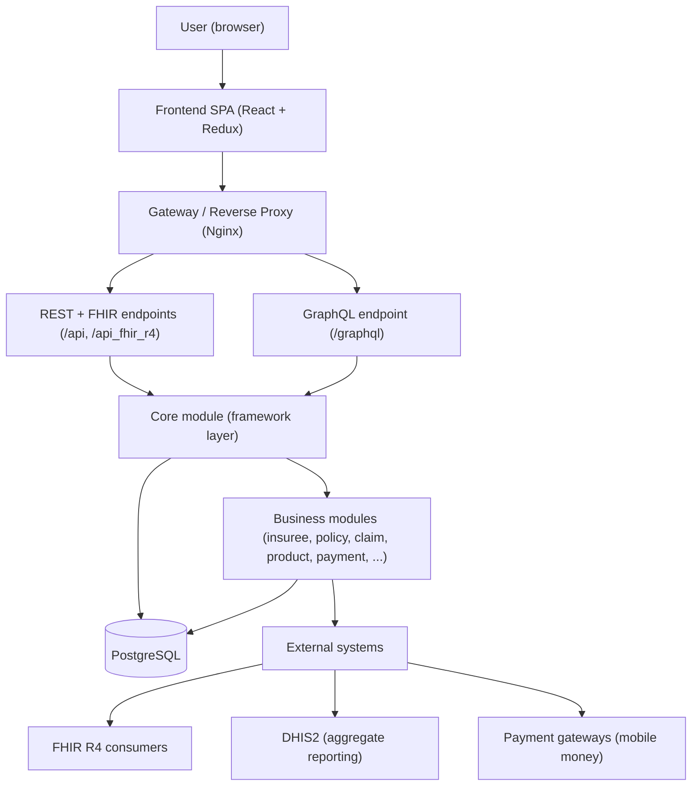

# openIMIS Developer Academy

A hands-on architectural handbook and course for engineers who want to understand — and extend — **openIMIS**, the open-source platform for health insurance and social health protection. Written for people who already ship Django, but have never touched GraphQL or an enterprise-scale plugin architecture.

Welcome. This site is a **course disguised as reference documentation**. You can read it front-to-back like a book, or jump to the chapter you need and treat it as a manual. Either way, the goal is the same: to take a competent Django engineer and make them productive — and confident — inside the openIMIS codebase.

!!! quote "The one-sentence version"
    openIMIS is a modular **Django + React** platform that many countries deploy to run their health-financing schemes; its whole design revolves around **plugins (modules)** so that no country ever has to fork the core.

---

## What this handbook is

openIMIS is not a small project. The backend alone is assembled from roughly **47 independently versioned modules**, each living in its own Git repository, wired together at startup into a single Django project and a single GraphQL schema. That design is powerful, but it is also unusual — you cannot learn it by reading one `models.py`. You have to understand the *seams*: how modules discover each other, how the schema is stitched together, how a mutation actually runs, and why the database still carries the scars of a 15-year-old .NET application.

This handbook explains those seams from first principles. It assumes you know Python, Django, the ORM, Django REST Framework, Docker, and PostgreSQL cold. It assumes you know **nothing** about GraphQL or "enterprise architecture" as a discipline — so we teach both, carefully, where they appear.

!!! info "Did you know?"
    openIMIS is a recognized **Digital Public Good (DPG)**. It is developed as a global commons, historically funded by the Swiss Agency for Development and Cooperation (SDC) and GIZ, and governed by the openIMIS Initiative together with a community Technical Advisory Group. The code you will read is the same code running national schemes in countries across Africa and Asia.

---

## Who this is for

### You are
A backend engineer fluent in Django and the ORM who has just been dropped into the openIMIS codebase and needs a mental model fast.

### You are
A full-stack developer who knows React and Redux but wants to understand how the frontend talks to a GraphQL backend it doesn't own end-to-end.

### You are
A technical lead evaluating openIMIS for a national deployment, who needs to judge the architecture, not just the feature list.

### You are
A contributor from the openIMIS community who wants a single, coherent narrative to onboard new teammates.

If you have **never written GraphQL**, that is expected and fine. If you have never seen a "module manifest" or an "assembly repo", that is exactly what we are here to explain.

---

## How the course is structured

The material is layered. Each layer assumes the ones before it, but every chapter also restates its prerequisites so you can enter sideways.

| Stage | You will learn | Chapters |
| --- | --- | --- |
| **Orient** | What openIMIS is, the domain vocabulary, and how to stand up a local environment | [Getting Started](getting-started/index.md) |
| **Understand** | The plugin architecture, the request lifecycle, the repository map | [Architecture](architecture/overview.md) |
| **Speak the API** | GraphQL from first principles, as openIMIS uses it | [GraphQL](graphql/index.md) |
| **Know the domain** | The business modules — insuree, policy, claim, product, payment | [Modules](modules/index.md) |
| **Go deep** | Database, security, Docker, configuration, integrations | [Database](database/index.md), [Security](security/index.md), [Docker](docker/index.md) |
| **Build** | Extend openIMIS with your own module, end to end | [Extending openIMIS](extending/index.md) |
| **Practice** | A graded, seven-level guided track | [Developer Academy](academy/index.md) |

---

## Course map

### <a href="getting-started/index.md">1. Getting Started</a>
What openIMIS is, the domain terminology every developer must know, and a working local dev environment in under an hour.

### <a href="architecture/overview.md">2. Architecture</a>
The plugin system, the assembly repos, dynamic `INSTALLED_APPS`, schema stitching, and the full request lifecycle.

### <a href="graphql/index.md">3. GraphQL</a>
GraphQL taught from zero: queries, mutations, connections, and the asynchronous `OpenIMISMutation` pattern.

### <a href="modules/core.md">4. The Core Module</a>
`HistoryModel`, the custom `User`, rights-based permissions, service signals, and the calculation-rule framework.

### <a href="modules/index.md">5. Business Modules</a>
Insuree, policy, product, claim, contribution, payment — the health-financing domain, module by module.

### <a href="architecture/frontend.md">6. Frontend</a>
The React SPA, Redux (not Apollo), the `ModulesManager`, contributions, and the Vite migration.

### <a href="integrations/index.md">7. Integrations</a>
FHIR R4, DHIS2 ETL, payment gateways, and OpenSearch analytics.

### <a href="extending/index.md">8. Extending openIMIS</a>
Write, register, and ship your own module — backend and frontend — following an end-to-end walkthrough.

### <a href="academy/index.md">9. Developer Academy</a>
A seven-level guided track, from Foundations to Expert, with exercises and knowledge checks.

### <a href="reference/glossary.md">10. Reference</a>
The full glossary, troubleshooting guide, and a repository appendix you will return to often.

---

## The big picture

Before any detail, hold this shape in your head. Everything else in the handbook is a zoom-in on one of these layers.

Read that diagram top to bottom and you have the itinerary for this course. The browser talks to a **React SPA**. The SPA talks through a **gateway** to a **GraphQL** endpoint (and, for reports and interoperability, some **REST/FHIR** endpoints). Those endpoints are served by the **Core module**, which provides the framework that every **business module** builds on. The business modules read and write **PostgreSQL** and, at the edges, push and pull data to **external systems** like FHIR consumers, DHIS2, and payment providers.

!!! tip "A note on the two 'assemblies'"
    openIMIS has two top-level *assembly* repositories that glue everything together: **`openimis-be_py`** on the backend and **`openimis-fe_js`** on the frontend. Neither contains much business logic itself — each is a manifest plus wiring that assembles dozens of module repositories into one running application. Understanding these two repos is the single highest-leverage thing you can do early, and [Architecture](architecture/overview.md) starts there.

---

## How to use this site

!!! note "Reading paths"
    === "Read it as a course"
        Start at [Getting Started](getting-started/index.md) and follow the navigation top to bottom. Do the **Hands-on lab** and **Knowledge check** at the end of each chapter. Then work through the graded [Developer Academy](academy/index.md) levels.

    === "Use it as a manual"
        Jump straight to the chapter you need — every substantial page lists its **Prerequisites** at the top with links, so you can back-fill just enough context. The [Reference glossary](reference/glossary.md) and [Repository appendix](reference/appendix.md) are your quick-lookup companions.

    === "Onboard a teammate"
        Point them at this home page, then at the [Architecture overview](architecture/overview.md) and the [End-to-End Code Walkthrough](extending/code-walkthrough.md). Those three pages give the fastest path to a correct mental model.

A few conventions used throughout:

- **Relative links** connect chapters — e.g. the [Core module](modules/core.md) or the [Request Lifecycle](architecture/request-lifecycle.md). Follow them freely; you will not get lost.
- Code labeled *illustrative* or *simplified* is written to faithfully reflect openIMIS conventions, not copied line-for-line. When exact detail matters, we cite the real file — for example *(see `openimis-be-core_py/core/apps.py`)* — and tell you to read the source.
- Collapsible **Deep dive** blocks hold advanced tangents. Skip them on a first pass.
- We **never invent line numbers**. Files and classes, yes; line numbers, never — they drift with every release.

!!! danger "Common mistake"
    Do not try to understand openIMIS by opening a single repository and reading it like a normal Django project. There is no single repository. The application only exists once the assembly repo has read its **module manifest** and stitched the pieces together. If a class seems to come from nowhere, it almost certainly lives in another module's repo — the [Repository Map](architecture/repository-map.md) will help you find it.

---

## A word on accuracy and scope

!!! warning "This is a community handbook"
    This site is an independent, community-oriented educational resource. It is **not** official openIMIS documentation and is not endorsed by the openIMIS Initiative. openIMIS is a fast-moving, modular platform: module counts, exact file layouts, and configuration keys change between releases. Where a detail is version-dependent, we say so and point you to the authoritative repository under [github.com/openimis](https://github.com/openimis) to confirm. Trademarks and code belong to their respective owners. Always treat the source code and the [official openIMIS wiki](https://openimis.atlassian.net/wiki/) as the final authority.

Ready? Begin with **[Getting Started](getting-started/index.md)** — it orients you to the platform, teaches the vocabulary, and gets a local environment running.

## Further reading

- The openIMIS website and community hub: [openimis.org](https://openimis.org)
- All source repositories: [github.com/openimis](https://github.com/openimis)
- Official product and functional wiki: [openIMIS on Atlassian](https://openimis.atlassian.net/wiki/)
- Digital Public Goods Alliance registry: [digitalpublicgoods.net](https://digitalpublicgoods.net/registry/)
- GraphQL, from the source: [graphql.org/learn](https://graphql.org/learn/)
