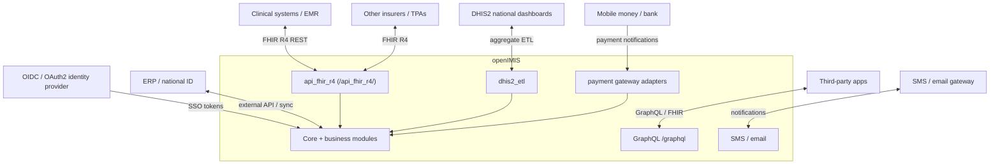
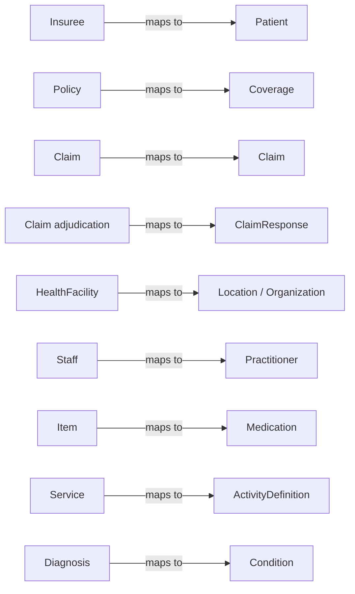
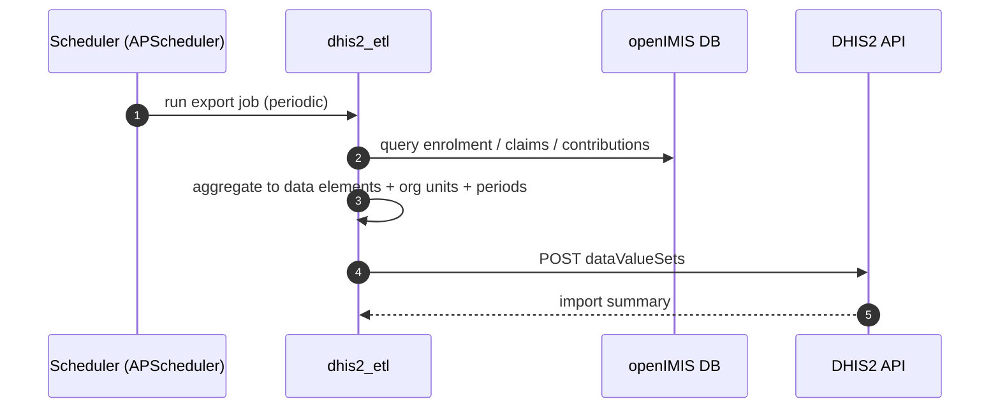
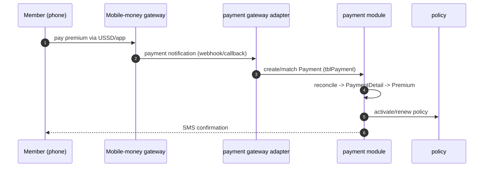
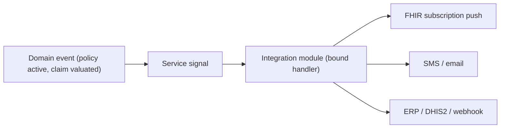

# Integrations

openIMIS is rarely the only system in a country's health-financing landscape. It
must exchange beneficiary and claim data with clinical systems using
international standards, push aggregate figures to national monitoring
dashboards, accept enrolment payments from mobile-money gateways, notify members
by SMS, and sometimes sync identities with a national ID or ERP system. This
part of the handbook covers those **outward-facing seams**.

The star of the show is **FHIR R4** (`openimis-be-api_fhir_r4_py`), openIMIS's
standards-based REST API for clinical interoperability. We cover it thoroughly
here; a separate deep-dive module page is not required — cross-link to this
chapter.

!!! abstract "Learning objectives"
    By the end of this chapter you will be able to:

    - Map the main openIMIS models to their **FHIR R4** resource equivalents.
    - Call the `/api_fhir_r4/` REST endpoints and understand how they differ from
      the [GraphQL](../graphql/index.md) API.
    - Describe how **DHIS2** aggregate export works.
    - Explain the integration patterns for **payment gateways**, **SMS/email**,
      **ERP/identity**, external APIs, and **webhooks/eventing**.

!!! note "Prerequisites"
    - [The Core module](../modules/core.md) — service accounts (`TechnicalUser`),
      rights, and the async mutation pattern.
    - [Insuree](../modules/insuree.md), [Policy](../modules/policy.md),
      [Claim](../modules/claim.md), [Location](../modules/location.md) — the
      domain models FHIR resources map onto.
    - Basic REST familiarity (you have this) and a passing awareness of HL7 FHIR
      (we teach the openIMIS-specific mapping).

---

## The integration landscape



Two API surfaces coexist, by design:

| Surface | Consumer | Shape | When to use |
| --- | --- | --- | --- |
| **GraphQL** `/graphql` | The openIMIS React frontend and bespoke integrators | Async mutations, connection queries, JWT-in-cookie | Rich internal operations, the admin UI. |
| **FHIR R4 REST** `/api_fhir_r4/` | External **clinical** systems, other insurers, HL7 tooling | Standard RESTful FHIR resources, JSON | Standards-based interoperability with the wider health IT world. |

!!! info "Did you know?"
    openIMIS keeps GraphQL for its own frontend but exposes **FHIR** to the
    outside world precisely because external clinical systems already speak FHIR.
    Rather than force partners to learn openIMIS's GraphQL schema, it meets them at
    an international standard. This is the classic "internal API vs. public
    integration API" split.

---

## FHIR R4 — clinical interoperability

**HL7 FHIR** (Fast Healthcare Interoperability Resources) is the dominant modern
standard for exchanging healthcare data. It models everything as **resources**
(Patient, Coverage, Claim, Organization…) with a uniform REST interface. openIMIS
does not *store* FHIR; `openimis-be-api_fhir_r4_py` is a **mapping layer** that
translates openIMIS models to and from FHIR resources on the fly, under the base
path `/api_fhir_r4/`.

### Resource mapping table

| openIMIS model | FHIR R4 resource | Notes |
| --- | --- | --- |
| [Insuree](../modules/insuree.md) | **Patient** | The beneficiary. CHF/insurance number → Patient identifier. |
| [Policy](../modules/policy.md) | **Coverage** | Active coverage of a patient under a product. |
| Policy agreement / contract | **Contract** | The legal coverage agreement. |
| [HealthFacility](../modules/location.md) | **Location** / **Organization** | Physical location and the org that runs it. |
| Medical staff / claim admin | **Practitioner** / **PractitionerRole** | Who delivers/administers care. |
| [Medical Item](../modules/medical.md) | **Medication** | A drug/consumable. |
| [Medical Service](../modules/medical.md) | **ActivityDefinition** | A billable act/procedure. |
| [Claim](../modules/claim.md) | **Claim** | Service delivery submitted for reimbursement. |
| Claim adjudication result | **ClaimResponse** | The adjudicated outcome (approved/rejected, valued). |
| [Diagnosis](../modules/medical.md) (ICD) | **Condition** | Diagnoses on a claim. |
| Healthcare provision | **HealthcareService** | Services a facility offers. |
| Claim feedback / communication | **CommunicationRequest** | Feedback and messaging. |
| Eligibility check | **CoverageEligibilityRequest** | "Is this patient covered for this?" |
| Contribution / invoice | **Invoice** (+ subscriptions) | Billing artifacts. |



### Calling the FHIR API

```bash
# Retrieve insurees as FHIR Patients
curl -H "Authorization: Bearer <JWT>" \
     https://your-openimis/api_fhir_r4/Patient/

# A single coverage
curl -H "Authorization: Bearer <JWT>" \
     https://your-openimis/api_fhir_r4/Coverage/<uuid>/

# Submit a claim as a FHIR Claim bundle (POST)
curl -X POST -H "Content-Type: application/fhir+json" \
     -H "Authorization: Bearer <JWT>" \
     --data @claim.fhir.json \
     https://your-openimis/api_fhir_r4/Claim/
```

Key behaviours (from `openimis-be-api_fhir_r4_py`):

- **Standard REST verbs** — `GET` collections and instances (e.g.
  `GET /api_fhir_r4/Patient/`), `POST` to create where supported.
- **Pagination** — FHIR Bundle paging with a configurable default page size
  (10 by default).
- **Subscriptions** — a **REST-hook** subscription channel for `Patient`,
  `Organization` and `Invoice` resources, enabling push notifications to external
  systems.
- **Auth** — the same identity backbone as the rest of openIMIS. A
  [`TechnicalUser`](../modules/core.md) service account with the right integer
  rights, authenticating via JWT (or OIDC), is the clean way for a machine
  integrator to call FHIR.

!!! danger "Common mistake"
    Do not confuse the **FHIR `Claim` submission** path with the internal GraphQL
    `createClaim` mutation. Both create a claim, but FHIR is synchronous REST while
    GraphQL is the async `MutationLog`-polled pattern. Also: submitting a FHIR
    `Claim` still runs the same [adjudication pipeline](../modules/claim.md) — FHIR
    is a **doorway**, not a bypass of the business rules.

??? note "Deep dive: why Location *and* Organization for a facility?"
    FHIR separates the **physical place** (`Location`) from the **legal entity**
    that operates it (`Organization`). A single openIMIS `HealthFacility` carries
    both concepts (its geography via [location](../modules/location.md), its
    identity/legal form as an org), so the mapping layer can present it as either
    resource depending on the query. This is a good illustration of impedance
    mismatch between a pragmatic operational model and a normalised standard.

---

## DHIS2 — aggregate reporting

**DHIS2** is the world's most widely deployed health management information
platform; ministries use it for aggregate national indicators. openIMIS integrates
via **`openimis-be-dhis2_etl_py`**, which **extracts** operational data (enrolment,
claims, contributions), **transforms** it into DHIS2 data-value/aggregate formats,
and **loads** it to a DHIS2 instance through DHIS2's API.



- It is an **aggregate**, one-directional push (openIMIS → DHIS2) — individual
  records are summarised into DHIS2 **data elements**, **org units** and
  **periods**, not sent row-by-row.
- Runs on the **scheduler** (APScheduler) that core provides, typically on a
  periodic cadence.
- The openIMIS [location hierarchy](../modules/location.md) maps to DHIS2 **org
  units**; getting that mapping right is the crux of a DHIS2 integration.

!!! info "Did you know?"
    Aggregate export exists because DHIS2 answers a different question than
    openIMIS: not "what is this one claim's status?" but "how many claims, of what
    value, in this district this quarter?" Sending individual records would both
    violate DHIS2's aggregate model and leak personal data.

---

## Payment providers & mobile money

Because members often enrol and pay premiums by **mobile money**, openIMIS
integrates with payment gateways. The pattern (see
[Contribution & Payment](../modules/payment.md)):



- Incoming notifications land as `Payment` records (status begins
  `NOTYETCONFIRMED`) and are **reconciled** to a policy/product, ultimately
  creating a `Premium` that activates the policy.
- The `Payment` model's `phone_number`, `transaction_no`, `receipt_no` and
  `date_last_sms` fields exist for exactly this loop.
- New providers are added as **adapters** that bind to the payment module's
  signals — no change to core payment logic.

!!! danger "Common mistake"
    Treat gateway callbacks as **untrusted**. Verify the provider's signature and
    make reconciliation **idempotent** (a duplicated callback must not create two
    `Premium` rows). The `transaction_no` is your idempotency key.

---

## SMS & email notifications

Notifications ride on Django's standard facilities plus scheme-specific hooks:

- **Email** via Django's `EMAIL_*` settings and `send_mail`/templated backends.
- **SMS** via a configured gateway; enrolment/renewal/payment events trigger
  messages (the `date_last_sms` field on `Payment` tracks the last SMS sent).
- Delivery is typically wired through **service signals** — a notification module
  binds *after* a policy activation or claim event and dispatches the message,
  keeping messaging decoupled from business logic.

---

## ERP & identity systems

| Integration | Mechanism |
| --- | --- |
| **Identity / SSO** | openIMIS supports **OpenID Connect / OAuth2** alongside its JWT auth (see [Security](../security/index.md)), so an external **identity provider** can issue tokens. Users map to core `InteractiveUser`/`TechnicalUser`. |
| **National ID** | Beneficiary identity can be reconciled against a national registry via the external-API pattern or FHIR `Patient` identifiers. |
| **ERP / finance** | Financial artifacts from the [invoice](../modules/payment.md) module can be exported/synced to an ERP; price lists can be sourced from an ERP via signals. |

---

## External APIs, webhooks & eventing

openIMIS's extension seams double as integration seams:

- **Inbound** — FHIR REST and GraphQL let external systems read/write with a
  `TechnicalUser` service account and integer rights.
- **Outbound push** — FHIR **REST-hook subscriptions** (Patient/Organization/
  Invoice) and gateway callbacks provide event push.
- **Internal eventing** — core's **service signals**
  (`register_service_signal`/`bind_service_signal`) are the in-process event bus;
  an integration module binds to lifecycle events (policy activated, claim
  valuated) and fans them out to external systems. See
  [Claim signals](../modules/claim.md) and [Calculation](../modules/calculation.md).



!!! tip "Prefer signals over patching"
    When you must react to an openIMIS event for an integration, **bind to a
    service signal** rather than editing the emitting module. Your integration then
    lives in its own module, survives upgrades, and can be toggled by adding or
    removing it from the assembly `openimis.json`.

---

## Hands-on lab

!!! example "Lab: read the same insuree two ways"
    1. Create an insuree with an active [policy](../modules/policy.md).
    2. Query them over **GraphQL** (`insurees { … }`) and note the shape.
    3. `GET /api_fhir_r4/Patient/` with a valid token and find the **same** person
       as a FHIR `Patient`. Note how the CHF number appears as an identifier.
    4. `GET /api_fhir_r4/Coverage/` and locate the `Coverage` corresponding to the
       policy. Confirm both APIs surface the same underlying rows.
    5. Write one sentence explaining when you would hand an external partner the
       FHIR endpoint vs. the GraphQL endpoint.

---

## Knowledge check

??? question "Q1: Why does openIMIS expose FHIR to external systems but use GraphQL internally? (click for answer)"
    GraphQL is tailored to openIMIS's own frontend (async mutations, connections,
    cookie JWT). External **clinical** systems already speak the **FHIR** standard,
    so exposing FHIR lets partners integrate without learning openIMIS's bespoke
    schema. It is the internal-API vs. public-integration-API split.

??? question "Q2: Which FHIR resources do Insuree, Policy, Claim, and a claim's adjudication map to? (click for answer)"
    Insuree → **Patient**, Policy → **Coverage**, Claim → **Claim**, and the
    adjudication result → **ClaimResponse** (with Diagnosis → Condition,
    HealthFacility → Location/Organization, staff → Practitioner/PractitionerRole).

??? question "Q3: Why is DHIS2 export aggregate and one-directional? (click for answer)"
    DHIS2 answers aggregate questions (counts/values per org unit per period), not
    per-record ones. Sending individual claims would break DHIS2's aggregate data
    model and expose personal data, so `dhis2_etl` summarises into data
    elements/org units/periods and pushes them out.

??? question "Q4: A mobile-money gateway sends the same payment callback twice. How do you avoid double-activating a policy? (click for answer)"
    Make reconciliation **idempotent** using `transaction_no` as the key: if a
    `Payment` with that transaction already exists, ignore the duplicate. Also
    verify the callback signature — gateway callbacks are untrusted input.

??? question "Q5: You need an external system notified whenever a policy activates. What is the cleanest mechanism? (click for answer)"
    **Bind to a core service signal** for policy activation from your own
    integration module and push outward (FHIR subscription, webhook, SMS). This
    keeps the integration decoupled, upgrade-safe, and toggleable via the assembly
    manifest — no patching of the policy module.

---

## Repository references

| Repository | Directory / File | Why it matters |
| --- | --- | --- |
| `openimis-be-api_fhir_r4_py` | `api_fhir_r4/converters/` | The model↔FHIR resource mapping (Insuree→Patient, etc.). |
| `openimis-be-api_fhir_r4_py` | `api_fhir_r4/views.py`, `urls.py` | REST endpoints under `/api_fhir_r4/`. |
| `openimis-be-dhis2_etl_py` | `dhis2_etl/` | Aggregate extract/transform/load to DHIS2. |
| `openimis-be-payment_py` | `payment/` | Gateway reconciliation → `Premium`. |
| `openimis-be-core_py` | `core/service_signals.py` | The internal event bus integrations bind to. |

## Further reading

- Source: [openimis-be-api_fhir_r4_py](https://github.com/openimis/openimis-be-api_fhir_r4_py),
  [openimis-be-dhis2_etl_py](https://github.com/openimis/openimis-be-dhis2_etl_py)
- HL7 FHIR R4 spec: [hl7.org/fhir/R4](https://hl7.org/fhir/R4/)
- DHIS2 developer docs: [docs.dhis2.org](https://docs.dhis2.org/)
- [Claim](../modules/claim.md), [Policy](../modules/policy.md),
  [Insuree](../modules/insuree.md) — the mapped domain models.
- [Contribution & Payment](../modules/payment.md) — mobile-money enrolment.
- Official docs: [openIMIS wiki](https://openimis.atlassian.net/wiki/).
