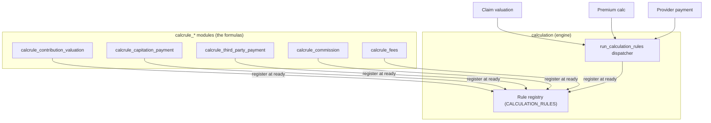
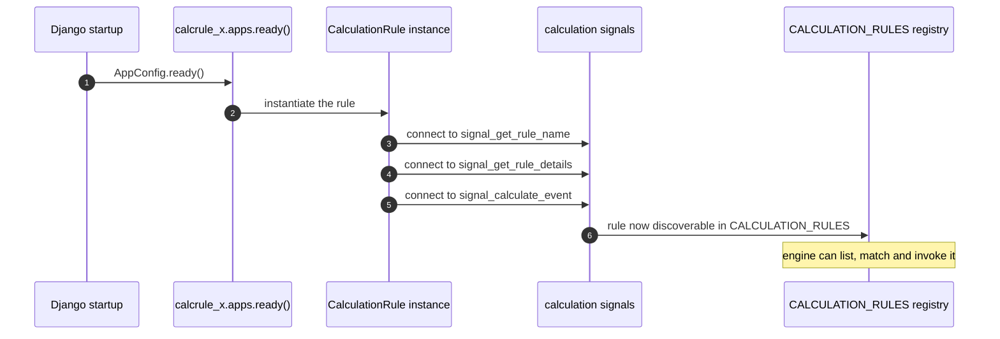
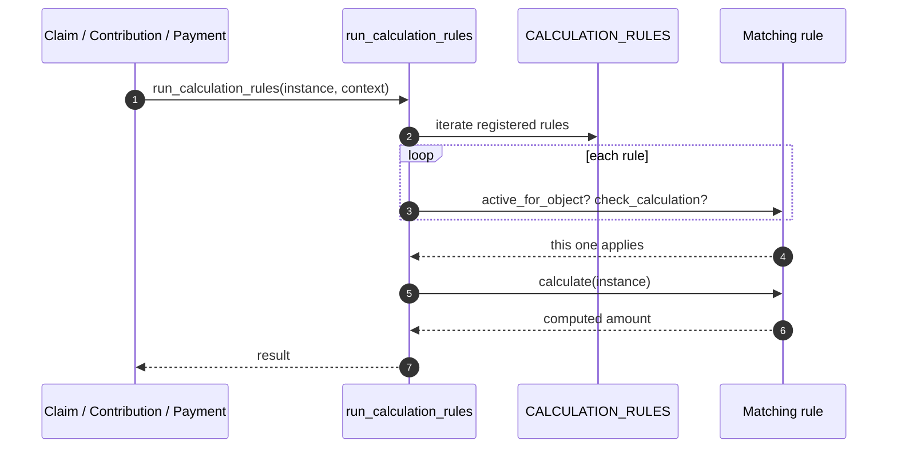
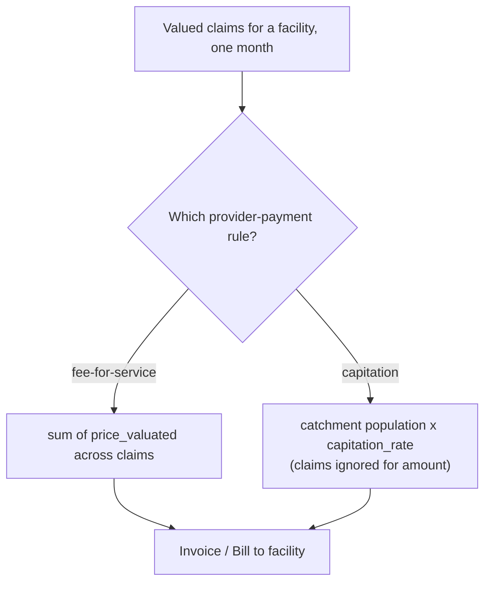
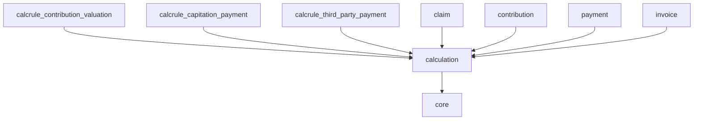

# Calculation Rules

Every health-financing scheme prices things differently. One country pays
providers **fee-for-service**; another pays **capitation** per registered head; a
third splits payments with a **third party**; contributions may be a flat premium
in one scheme and a **percentage of income** in another. Hard-coding any of these
formulas into the [claim](../modules/claim.md) or
[contribution](../modules/payment.md) modules would force every country to fork
the core. openIMIS instead ships a **pluggable calculation engine**
(`openimis-be-calculation_py`) and a family of **`calcrule_*`** modules that
register formulas at startup.

This chapter explains why that engine exists, how a rule registers itself via
signals, and how the platform invokes the right rule at the right moment.

!!! abstract "Learning objectives"
    By the end of this chapter you will be able to:

    - Explain **why** openIMIS externalises pricing/valuation into pluggable rules.
    - Describe the `ABSCalculationRule` interface a rule implements.
    - Trace how a `calcrule_*` module **registers** via the calculation module's
      signals at `ready()`, and how `run_calculation_rules` **invokes** it.
    - Name the common rule families (contribution valuation, capitation,
      third-party payment, commission, fees) and where each fires.

!!! note "Prerequisites"
    - [The Core module](../modules/core.md) — the **service-signal** seam
      (`register_service_signal` / `bind_service_signal`) and Django's `AppConfig.ready()`.
    - [Claim](../modules/claim.md) — valuation is a prime consumer of rules.
    - [Contribution & Payment](../modules/payment.md) — premiums and provider
      payment are computed by rules.

---

## Purpose — why a pluggable engine?

Consider the alternatives for "how much does the scheme pay for this claim?":

- **Hard-code it** in the claim module → every country forks; upgrades become
  merge nightmares.
- **Make it configuration data** (like the [product](../modules/medical.md)
  ceilings) → works for *parameters* but not for genuinely different **formulas**
  (a capitation head-count sum is not the same *shape* of computation as a
  fee-for-service line sum).
- **Make it code, but pluggable** → a country ships a small `calcrule_*` module
  implementing its formula; core discovers and calls it. Nobody forks.

openIMIS chose the third option. The calculation module is a thin **registry +
dispatcher**; the actual arithmetic lives in independently versioned rule modules.



!!! info "Did you know?"
    The calculation module deliberately uses a **no-database approach** for the
    rules themselves — a rule is a **class in code**, not a row you edit. Its
    *parameters* may be stored (e.g. a capitation rate on a product's `json_ext`),
    but the *formula* is versioned Python. That keeps computations auditable and
    reproducible: you can point at the exact commit that priced a historical claim.

---

## The rule interface

Every rule subclasses **`ABSCalculationRule`** (the abstract base provided by the
core/calculation framework). It is a **strategy object**: the engine holds a
collection of them and asks each whether it applies to a given object, then asks
the applicable one to compute.

| Method (illustrative) | Responsibility |
| --- | --- |
| `ready()` (in the module's `apps.py`) | Instantiate the rule and **register** it with the engine's signals. |
| `active_for_object(instance, context, ...)` | Boolean — does this rule apply to *this* object in *this* context? |
| `check_calculation(instance)` | Is this rule the correct/configured one for the instance's linked class? |
| `calculate(instance, *args, **kwargs)` | The actual formula — returns the computed value(s). |
| `get_parameters(sender, class_name, instance)` | Expose the tunable parameters the rule reads (rendered in the UI). |
| `get_linked_class(sender, class_name)` | Declare which openIMIS models this rule attaches to. |
| `get_rule_name` / `get_rule_details` | Identity/metadata used by the dispatcher and UI. |
| `uuid` (property) | Stable identifier for the rule. |

```python
# Illustrative — the shape of a calcrule, not exact source.
# See openimis-be-calculation_py + any calcrule_* module.
from calculation.models import ABSCalculationRule

class CapitationPaymentRule(ABSCalculationRule):
    uuid = "0e1b6d4c-…"
    calculation_rule_name = "Capitation payment"

    @classmethod
    def active_for_object(cls, instance, context, type, sub_type):
        return context == "PaymentPlan" and sub_type == "capitation"

    @classmethod
    def check_calculation(cls, instance):
        return cls.uuid == str(instance.calculation)

    @classmethod
    def calculate(cls, instance, *args, **kwargs):
        population = catchment_population_for(instance.health_facility)
        rate = instance.json_ext["capitation_rate"]
        return population * rate
```

---

## Registration — how a rule joins the engine

Registration happens **once, at startup**, using Django's `AppConfig.ready()` and
the calculation module's **signals**. This is the same "publish yourself into a
registry so core can find you without importing you" pattern used across
openIMIS's plugin seams.



The calculation module defines signals such as **`signal_get_rule_name`**,
**`signal_get_rule_details`**, and **`signal_calculate_event`**. A `calcrule_*`
module's `ready()` connects its rule to these; the rule thereby lands in the
engine's `CALCULATION_RULES` collection (imported from `calculation.apps`). No
module imports another's class directly — they meet on the signal bus.

!!! danger "Common mistake"
    If your rule never fires, the usual cause is that its **`apps.py` is not
    registering it in `ready()`**, or the module isn't in the assembly's
    `openimis.json` manifest (so its `AppConfig` never loads). A rule that isn't
    connected to the signals at startup is invisible to the dispatcher — there is
    no lazy discovery.

---

## Invocation — how a rule is called

When the claim, contribution, or payment code needs a number, it calls the
engine's dispatcher rather than any specific rule:

```python
# Illustrative — consumer side.
# See openimis-be-calculation_py/calculation/services.py
from calculation.services import run_calculation_rules

result = run_calculation_rules(instance, context="Claim", user=user)
```

Inside, the dispatcher walks `CALCULATION_RULES`, asks each rule
`active_for_object(...)` / `check_calculation(...)`, and calls `calculate(...)` on
the one that matches. Supporting helpers you will meet in
`calculation/services.py`:

| Function | Role |
| --- | --- |
| `run_calculation_rules(instance, context, user, **kwargs)` | Entry point — dispatch to applicable rules. |
| `get_rule_name(class_name)` / `get_rule_details(class_name)` | Identity/metadata lookups. |
| `get_calculation_object(uuid)` | Fetch a specific rule by UUID. |
| `get_parameters(class_name, instance)` | Gather a rule's tunable parameters. |
| `get_linked_class(class_name_list)` | Resolve which models a rule attaches to. |



---

## The rule families

The `calcrule_*` modules are separate repos, each a formula family. Common ones
(names as they appear in the ecosystem — confirm exact repo names against the
assembly manifest for your release):

| Rule family (module) | Fires during | Computes |
| --- | --- | --- |
| **`calcrule_contribution_valuation`** | premium recording / policy enrolment | The required contribution for a policy (flat, income-percentage, etc.). |
| **`calcrule_capitation_payment`** | provider payment run | A per-head amount per facility from [catchment population](../modules/location.md), independent of individual claims. |
| **`calcrule_third_party_payment`** | provider payment | The share payable to a third party (e.g. a fund settling on behalf of members). |
| **`calcrule_commission`** | enrolment / renewal | Commission owed to enrolment officers/agents. |
| **`calcrule_fees`** | various | Administrative or registration fees. |

Because each is a plugin, a deployment includes **only the rules it needs**. A
scheme that pays purely fee-for-service simply omits the capitation module.

!!! info "Did you know?"
    The same engine now underpins newer domains too — `social_protection` and
    `payroll` use calculation rules to size benefit payments and payroll runs.
    The abstraction outgrew its original claim/contribution home, which is the
    best possible evidence that the pluggable design was the right call.

---

## Worked example: capitation vs. fee-for-service

The clearest way to feel the value of the engine is to see the **same claim
pipeline** yield **different money** depending on which rule is registered.



Same [claims](../modules/claim.md), same [products](../modules/medical.md), same
[facilities](../modules/location.md) — the **only** thing that changes is which
`calcrule_*` module is installed and configured. No core code differs between the
two countries. That is the entire thesis of the calculation engine.

---

## Dependencies



| Relationship | Why |
| --- | --- |
| calculation → [core](../modules/core.md) | `AppConfig.ready()`, service signals, base abstractions. |
| `calcrule_*` → calculation | Rules register with the engine's signals. |
| [claim](../modules/claim.md) / [contribution](../modules/payment.md) / invoice → calculation | Consumers call `run_calculation_rules`. |

---

## Signals

The engine **is** a signal hub. The key signals (defined by the calculation
module) that rules connect to and consumers drive:

| Signal (illustrative name) | Purpose |
| --- | --- |
| `signal_get_rule_name` | A rule announces its human-readable identity. |
| `signal_get_rule_details` | The engine queries rules matching a linked class. |
| `signal_calculate_event` | Triggers the actual computation on the matching rule. |

Rules connect to these in their `apps.ready()`; consumers fan out through
`run_calculation_rules`, which sends the calculate event.

---

## Configuration

A rule reads its **parameters** from configuration/data even though its **logic**
is code:

| Config source | Example |
| --- | --- |
| Product / payment-plan `json_ext` | `capitation_rate`, income-percentage bands. |
| Module `apps.py` `DEFAULT_CFG` (per `calcrule_*`) | Which contexts/sub-types the rule activates for; permission codes. |
| DB `ModuleConfiguration` overlay | Operator overrides per deployment (see [Configuration](../configuration/index.md)). |

!!! danger "Common mistake"
    Do not put scheme-specific numbers **inside** the rule's Python. Read them from
    configuration or `json_ext` so the same rule module serves every deployment.
    Hard-coding a rate in `calculate()` defeats the purpose and forces a fork the
    moment two schemes disagree on the number.

---

## Extension points

1. **Write a new `calcrule_*` module.** Subclass `ABSCalculationRule`, implement
   `active_for_object` / `check_calculation` / `calculate`, register in
   `apps.ready()`, add it to the assembly `openimis.json`.
2. **Parameterise via `json_ext`** on the linked object so operators tune it
   without code.
3. **Expose parameters over GraphQL** through `get_parameters` so the UI can edit
   them.
4. **Bind a rule to a claim/contribution service signal** if it must fire
   automatically at a lifecycle moment (see [Claim](../modules/claim.md) and
   [Payment](../modules/payment.md)).

??? note "Deep dive: how the engine decides *which* rule wins"
    Multiple rules can be registered at once. The dispatcher narrows by
    **context** and **sub-type** (`active_for_object`) and then by
    **configuration binding** (`check_calculation` compares the rule's `uuid` to
    the one selected on the object, e.g. a payment plan's `calculation` field).
    That two-stage match — *could this rule apply?* then *is it the configured
    one?* — lets a deployment install several capitation variants and pick one per
    facility or product without ambiguity.

---

## Hands-on lab

!!! example "Lab: sketch a calc rule"
    You will not deploy a full module, but you will design one on paper and verify
    the wiring points in the source.

    1. In `openimis-be-calculation_py`, find `calculation/services.py` and locate
       `run_calculation_rules` and `CALCULATION_RULES`. Trace how a rule is chosen.
    2. Find the signal names the module defines and confirm they match
       `signal_get_rule_name` / `signal_get_rule_details` / `signal_calculate_event`.
    3. Pick a real `calcrule_*` repo and open its `apps.py`. Identify the exact
       lines in `ready()` that connect the rule to those signals.
    4. Write (on paper) an `active_for_object` and `calculate` for a **flat 5%
       officer commission on each renewal**, and state where its `5%` parameter
       should live (answer: `json_ext`/config, not code).

---

## Knowledge check

??? question "Q1: Why not just store payment formulas as configuration data like product ceilings? (click for answer)"
    Configuration handles **parameters** but not different **shapes** of
    computation. Fee-for-service (sum valued lines), capitation (population ×
    rate), and third-party splits are structurally different algorithms. A
    pluggable **code** rule expresses the algorithm; configuration/`json_ext`
    supplies its numbers.

??? question "Q2: When and how does a calc rule become discoverable to the engine? (click for answer)"
    At **startup**, in the module's `AppConfig.ready()`, which connects the rule to
    the calculation module's signals (`signal_get_rule_name`,
    `signal_get_rule_details`, `signal_calculate_event`). It then lives in
    `CALCULATION_RULES`. There is no lazy discovery — an unregistered rule is
    invisible.

??? question "Q3: A consumer needs a number. Which function does it call, and how is the right rule selected? (click for answer)"
    It calls `run_calculation_rules(instance, context, user)`. The dispatcher
    iterates registered rules, filters by `active_for_object` (context/sub-type)
    and `check_calculation` (is this the configured rule, by `uuid`?), then calls
    `calculate` on the winner.

??? question "Q4: Two countries run identical claim code but pay providers completely differently. How? (click for answer)"
    They install different `calcrule_*` modules (e.g. `calcrule_capitation_payment`
    vs. a fee-for-service rule) and configure the payment plan/product to select
    it. The claim pipeline is unchanged; only the registered valuation/payment rule
    differs.

---

## Repository references

| Repository | Directory / File | Why it matters |
| --- | --- | --- |
| `openimis-be-calculation_py` | `calculation/services.py` | `run_calculation_rules`, dispatcher helpers, `CALCULATION_RULES`. |
| `openimis-be-calculation_py` | `calculation/apps.py` | Signal definitions and the registry. |
| `openimis-be-calculation_py` | `calculation/models.py` | `ABSCalculationRule` base interface. |
| `calcrule_*` (e.g. `calcrule_capitation_payment`) | `*/apps.py`, `*/calculation_rule.py` | A concrete rule and its `ready()` registration. |

## Further reading

- Source: [openimis-be-calculation_py](https://github.com/openimis/openimis-be-calculation_py)
- [Claim](../modules/claim.md) — valuation as a rule consumer.
- [Contribution & Payment](../modules/payment.md) — premium and provider-payment rules.
- [Core module](../modules/core.md) — the service-signal seam these rules build on.
- Official docs: [openIMIS wiki](https://openimis.atlassian.net/wiki/).
