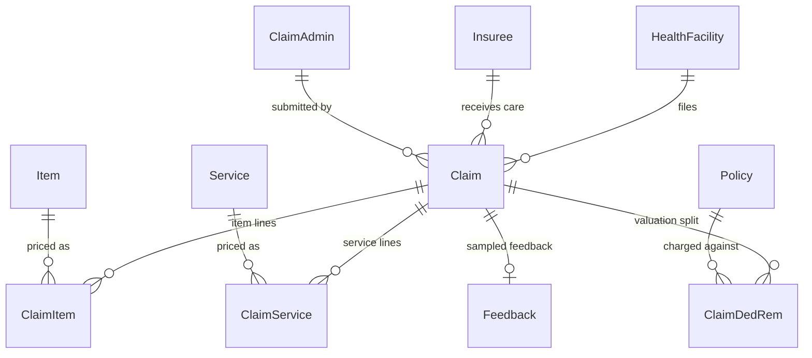
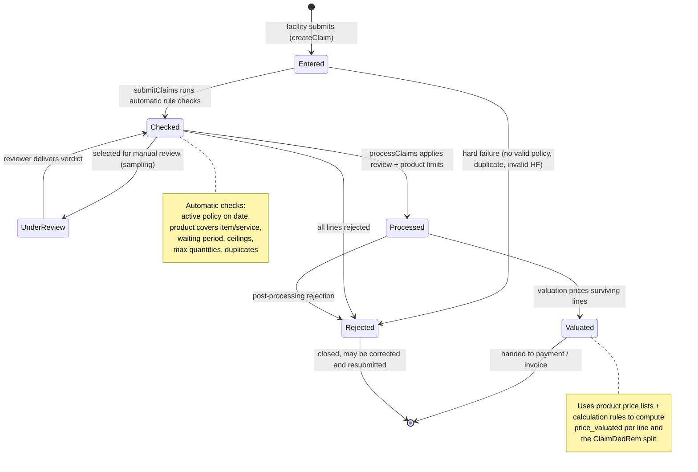
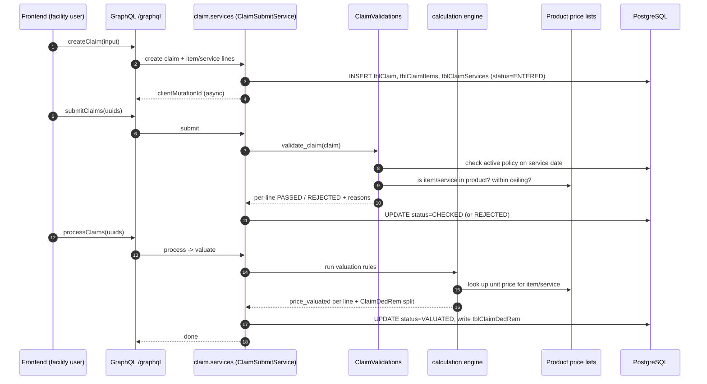
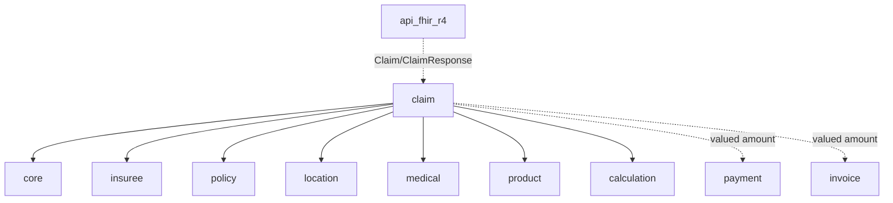

# Claim

The **claim** module is the operational heart of openIMIS. Everything else in the
platform — beneficiaries, policies, products, price lists, contributions — exists
so that this module can answer one question correctly: *when a health facility
delivers care to an insured person, how much should the scheme pay, and to whom?*

A claim is the record of care delivered. Its life is a pipeline: a facility
**submits** it, the system **checks** it against the rules of the patient's
product, a human medical officer **reviews** it, the scheme **adjudicates and
values** it against price lists and calculation rules, and finally the valued
amount flows into **provider payment**. This chapter walks that pipeline end to
end.

!!! abstract "Learning objectives"
    By the end of this chapter you will be able to:

    - Describe the four core entities — `Claim`, `ClaimItem`, `ClaimService`,
      `ClaimAdmin` — and how they relate.
    - Read and reason about the **claim status bitfield**
      (`entered → checked → processed → valuated`, or `rejected`).
    - Explain the difference between **automatic checking**, **manual review**,
      and **valuation**, and where each happens.
    - Trace how valuation consults the **product price lists** and the
      **calculation** engine to turn "quantity provided" into "amount paid".
    - Locate the models, services, GraphQL mutations and signals that implement
      the claim workflow in `openimis-be-claim_py`.

!!! note "Prerequisites"
    - [The Core module](../modules/core.md) — `HistoryModel`, the async
      `OpenIMISMutation` pattern, rights-based permissions, and service signals.
    - [Location & Health Facility](../modules/location.md) — a claim is always
      filed *by* a health facility *for* an insuree in a catchment.
    - [Insuree](../modules/insuree.md) and [Policy](../modules/policy.md) — a
      claim is only payable if the insuree holds an active policy on the service
      date.
    - [Medical & Product](../modules/medical.md) — items, services, price lists
      and the insurance product that defines coverage and ceilings.
    - [GraphQL](../graphql/index.md) — claims are created and adjudicated through
      GraphQL mutations.

---

## Purpose

The claim module records **service delivery** and drives it through
**adjudication** to a payable amount. Concretely it owns:

- The **claim header** (`Claim`): who, where, when, which diagnoses, the totals.
- The **claim lines**: `ClaimItem` (drugs, consumables) and `ClaimService`
  (consultations, procedures, hospital days) — each a billed line with a
  *provided* quantity and *asked* price.
- The **adjudication state machine**: automatic rule checks, manual medical
  review, and valuation.
- **Review and feedback** subsystems that let the scheme sample claims for
  quality control and collect patient feedback.

It does *not* own money movement to providers — that is
[Payment & Invoice](../modules/payment.md) — nor the pricing formulas themselves,
which live in [Calculation](../modules/calculation.md) and the product price
lists. Claim is the orchestrator that pulls those together.

!!! info "Did you know?"
    In the original .NET IMIS, claim adjudication lived largely in **SQL Server
    stored procedures**. The modern Django `claim` module reimplements that logic
    in Python services — which is exactly why you will still see legacy table
    names like `tblClaim`, `tblClaimItems` and `tblClaimServices`, and integer
    status codes rather than Django enums. The scars are load-bearing: they keep
    the schema compatible with historical data.

---

## Key models

All names below are from `openimis-be-claim_py/claim/models.py`. Legacy table
names are preserved for MSSQL-heritage compatibility.

| Model | Table | Purpose | Notable fields |
| --- | --- | --- | --- |
| `Claim` | `tblClaim` | The claim header | `code`, `insuree`, `health_facility`, `date_from`, `date_to`, `date_claimed`, `icd` / `icd_1..4` (diagnoses), `claimed`, `approved`, `valuated`, `reinsured`, `status`, `review_status`, `feedback_status`, `adjuster`, `explanation` |
| `ClaimItem` | `tblClaimItems` | A billed **item** line (drug/consumable) | `claim`, `item`, `qty_provided`, `qty_approved`, `price_asked`, `price_adjusted`, `price_approved`, `price_valuated`, `status`, `rejection_reason`, `limitation_value` |
| `ClaimService` | `tblClaimServices` | A billed **service** line (act/procedure) | `claim`, `service`, `qty_provided`, `qty_approved`, `price_asked`, `price_approved`, `price_valuated`, `status`, `rejection_reason` |
| `ClaimAdmin` | `tblClaimAdmin` | The **claim administrator** (facility staff who submits) | `code`, `last_name`, `other_names`, `health_facility`, `phone`, `has_login` |
| `Feedback` | `tblFeedback` | Patient feedback on a sampled claim | `claim`, `care_rendered`, `payment_asked`, `drug_prescribed`, `drug_received`, `asessment`, `officer` |
| `ClaimDedRem` | `tblClaimDedRem` | Per-claim **deductible/remuneration** breakdown from valuation | `claim`, `policy`, `insuree`, `ded_g`, `ded_op`, `ded_ip`, `rem_g`, `rem_op`, `rem_ip`, `rem_consult`, `rem_drug`, `rem_hospitalization` |
| `ClaimServiceItem` / `ClaimServiceService` | `tblClaimServicesItems` / `tblClaimServicesService` | Sub-lines when a *package* service expands into contained items/services | link + quantities |
| `ClaimAttachment` | `claim_ClaimAttachment` | Scanned supporting documents | `claim`, `type`, `document`, `mime`, `filename` |
| `ClaimMutation` | `claim_ClaimMutation` | Join row linking a claim to a `MutationLog` | `claim`, `mutation` |



!!! info "Did you know?"
    `Claim` extends core's `VersionedModel`, so every edit is **temporal**: a
    change closes the old row (`validity_to` set) and opens a new one
    (`validity_from` set). You never lose the prior state of a claim — critical
    when an auditor asks *"what did this claim look like before the reviewer
    touched it?"*

---

### The status bitfield — read this carefully

Claim status is **not** a simple enum; the values are **powers of two** because
the legacy system treated them as bit flags:

```python
# openimis-be-claim_py/claim/models.py (illustrative excerpt)
class Claim(core_models.VersionedModel):
    STATUS_REJECTED = 1
    STATUS_ENTERED = 2
    STATUS_CHECKED = 4
    STATUS_PROCESSED = 8
    STATUS_VALUATED = 16
```

The *review* and *feedback* subsystems have their own parallel state constants
(also powers of two), because a claim can be, say, "selected for review" and
"feedback delivered" independently of its main adjudication status:

```python
# Review lifecycle
REVIEW_IDLE = 1
REVIEW_NOT_SELECTED = 2
REVIEW_SELECTED = 4
REVIEW_DELIVERED = 8
REVIEW_BYPASSED = 16

# Feedback lifecycle
FEEDBACK_IDLE = 1
FEEDBACK_NOT_SELECTED = 2
FEEDBACK_SELECTED = 4
FEEDBACK_DELIVERED = 8
FEEDBACK_BYPASSED = 16
```

Individual **line** items (`ClaimItem` / `ClaimService`) carry a much simpler
`status`: `STATUS_PASSED = 1` or `STATUS_REJECTED = 2`, plus a
`rejection_reason` integer. Adjudication is really *per line*: the header status
summarises where the whole claim is in the pipeline; the line statuses record
which specific drugs and services survived.

!!! danger "Common mistake"
    Do not assume the header being `STATUS_CHECKED` means every line passed. A
    checked claim can still have rejected lines. Always inspect
    `claimitem_set` / `claimservice_set` statuses and `rejection_reason` before
    reporting an amount to a facility. The header amount (`approved`) is the sum
    of *surviving* lines, not of *submitted* lines.

---

## Business workflow

The whole point of the module is this pipeline. A claim moves left to right; at
any checkpoint it may be knocked out to `rejected`.



Now the same journey as a **sequence** across the moving parts — the module
seam view the guide asks request-flow chapters to include:



### Stage by stage

| Stage | Trigger (mutation / service) | What happens | Status after |
| --- | --- | --- | --- |
| **Enter** | `createClaim` → `ClaimSubmitService` (or `ClaimService.create`) | Facility captures the claim: patient, diagnoses, item and service lines with *provided* quantities and *asked* prices. Nothing is validated yet. | `ENTERED` |
| **Check** | `submitClaims` → `validate_claim` in `claim.validations` | The engine runs automatic checks against the patient's product: is a policy active on the service date? Is each item/service covered? Are waiting periods respected, ceilings and max quantities honoured, no duplicates? Failing lines get a `rejection_reason`. | `CHECKED` or `REJECTED` |
| **Review** (optional) | `selectClaimsForFeedback` / review mutations | A sample of checked claims is flagged for a **medical officer** to inspect. The reviewer can override line verdicts and adjust approved quantities. | `review_status` transitions; header stays `CHECKED` |
| **Process** | `processClaims` | Applies the review outcome and product-level limits, finalises `qty_approved` / `price_approved` per line, and prepares the claim for pricing. | `PROCESSED` |
| **Valuate** | valuation service | Prices each surviving line against the product price list and the calculation rules, writes `price_valuated` and the deductible/remuneration split (`ClaimDedRem`). | `VALUATED` |
| **Pay** | handed to [payment/invoice](../modules/payment.md) | The valued amount becomes the basis for provider remuneration (fee-for-service, capitation, or third-party payment). | — |

!!! tip "Two adjudication styles"
    openIMIS supports both **fee-for-service** (pay per valued line) and
    **capitation** (pay a facility a periodic per-head amount regardless of
    individual claim value). Both flow through the same claim pipeline, but the
    *valuation* step calls a different [calculation rule](../modules/calculation.md).
    The claim module does not hard-code either formula — it asks the engine.

---

## Services

Business logic lives in `openimis-be-claim_py/claim/services.py` (and
`claim/validations.py`), **not** in resolvers. Mutations are thin; they call a
service, which does the work inside a transaction. Representative surface:

| Service / function | Responsibility |
| --- | --- |
| `ClaimSubmitService` / `ClaimSubmit` | Ingest a claim with all its lines in one shot (used by the FHIR and bulk paths). |
| `update_or_create` (in `ClaimService`) | Create or edit a claim header and its `ClaimItem` / `ClaimService` lines. |
| `submit_claim` / `set_claims_status` | Move claims `ENTERED → CHECKED`, invoking validations. |
| `validate_claim(claim, check_max)` (in `claim/validations.py`) | The automatic checker: policy validity, coverage, waiting period, ceilings, max quantities, duplicates. Returns per-line errors. |
| `process_dedrem` / valuation helpers | Compute deductibles, remuneration and `price_valuated`, write `ClaimDedRem`. |
| `set_claim_submitted` / `set_claims_processed` | Batch state transitions used by the `processClaims` mutation. |
| `ClaimReportService` | Assemble data for printed claim / adjudication reports. |

```python
# Illustrative — the shape of a validation, not the exact code.
# See openimis-be-claim_py/claim/validations.py for the real implementation.
def validate_claim(claim, check_max=True):
    errors = []
    for line in claim.services.all():
        policy = active_policy_for(claim.insuree, claim.date_from, line.service.product)
        if policy is None:
            reject(line, reason=REJECTION_REASON_NO_POLICY)
            continue
        if within_waiting_period(policy, line.service):
            reject(line, reason=REJECTION_REASON_WAITING_PERIOD)
        if check_max and exceeds_ceiling(policy, line):
            reject(line, reason=REJECTION_REASON_MAX_LIMIT)
    return errors
```

??? note "Deep dive: where 'rejection reasons' come from"
    Each rejection is an integer code, not free text, so the UI can translate it
    and reports can aggregate it. Codes cover situations like *no active policy*,
    *item/service not in product*, *waiting period not elapsed*, *quantity above
    the product maximum*, *duplicate claim*, and *care type mismatch*
    (out-patient item billed on an in-patient claim). When you extend the
    checker, add a **new integer code** rather than overloading an existing one —
    downstream analytics depend on stable meanings.

---

## GraphQL

Claim is exposed almost entirely over [GraphQL](../graphql/index.md). Queries
live in `claim/gql_queries.py`; mutations in `claim/gql_mutations.py`, all
subclassing core's asynchronous `OpenIMISMutation`.

=== "Query a claim"

    ```graphql
    query {
      claims(first: 20, status: 4, healthFacility_Uuid: "…") {
        totalCount
        edges {
          node {
            uuid
            code
            status
            claimed
            approved
            valuated
            insuree { chfId lastName }
            healthFacility { code name }
            services { edges { node { service { code } qtyProvided status } } }
            items    { edges { node { item { code } qtyProvided status } } }
          }
        }
      }
    }
    ```

=== "Create a claim"

    ```graphql
    mutation {
      createClaim(input: {
        clientMutationId: "c-001"
        code: "CLM-2026-0001"
        insureeUuid: "…"
        healthFacilityUuid: "…"
        dateFrom: "2026-07-01"
        dateClaimed: "2026-07-02"
        icdId: 42
        services: [{ serviceUuid: "…", qtyProvided: 1, priceAsked: "1200.00" }]
        items:    [{ itemUuid: "…",    qtyProvided: 3, priceAsked: "150.00"  }]
      }) { clientMutationId internalId }
    }
    ```

=== "Adjudicate"

    ```graphql
    # Move a batch through the pipeline. Each returns immediately;
    # the client polls the MutationLog for the real outcome.
    mutation { submitClaims(input:{ clientMutationId:"s-1", uuids:["…"] }) { clientMutationId } }
    mutation { processClaims(input:{ clientMutationId:"p-1", uuids:["…"] }) { clientMutationId } }
    ```

!!! warning "GraphQL mutations here are asynchronous"
    Like all openIMIS mutations, `submitClaims`/`processClaims` return a
    `clientMutationId` **immediately** and do the heavy adjudication in the
    background, writing status to a `MutationLog`. The frontend "journalizes"
    (polls) that log. If you call these from a script, you must poll — a `200`
    response does **not** mean the claim was accepted. See the async pattern in
    [Core](../modules/core.md) and [GraphQL](../graphql/index.md).

Permissions are integer **rights** checked in the resolver/mutation via
`user.has_perms([...])`. The claim permission codes are defined in
`claim/apps.py` (family `1110xx`, e.g. query, add, submit, process, feedback,
review). A facility user typically holds *add* and *submit*; a scheme medical
officer holds *review* and *process*.

---

## Dependencies



| Depends on | Why |
| --- | --- |
| [core](../modules/core.md) | `VersionedModel`, `OpenIMISMutation`, rights, service signals. |
| [insuree](../modules/insuree.md) | The patient (`Claim.insuree`) and their family/policy links. |
| [policy](../modules/policy.md) | Coverage check — the claim must map to an **active policy** on the service date. |
| [location](../modules/location.md) | `HealthFacility` that files the claim; catchment/scoping decides who can see it. |
| [medical](../modules/medical.md) | `Item` and `Service` catalogues each line references. |
| [product](../modules/medical.md) | Price lists, ceilings, deductibles, waiting periods that govern checking and valuation. |
| [calculation](../modules/calculation.md) | Pluggable valuation and provider-payment formulas. |

Modules that depend **on** claim: [payment/invoice](../modules/payment.md)
(consume valued claims) and [api_fhir_r4](../integrations/index.md) (exposes
`Claim` and `ClaimResponse`).

---

## Signals

Claim participates in core's **service-signal** seam
(`register_service_signal` / `bind_service_signal`) so other modules can react to
adjudication without importing the claim code. Typical hook points:

- **After a claim is submitted / checked** — a fraud-detection or notification
  module binds *after* `claim.submit` to flag anomalies or SMS the insuree.
- **After valuation** — the [payment/invoice](../modules/payment.md) modules bind
  *after* the valuation service to generate a provider invoice line.
- **After processing** — capitation and third-party-payment
  [calculation](../modules/calculation.md) rules subscribe to aggregate figures.

```python
# Illustrative — subscribing to claim valuation from another module's apps.ready()
from core.service_signals import bind_service_signal

def on_claim_valuated(sender, result=None, **kwargs):
    claim = result
    if claim.status == claim.STATUS_VALUATED:
        create_provider_invoice_line(claim)

bind_service_signal("claim_service.valuate", on_claim_valuated, bind_type=AFTER)
```

Standard Django ORM signals (`post_save` on `Claim`) are also used, e.g. to keep
denormalised header totals in sync with line changes.

!!! info "Did you know?"
    Because provider payment binds to a *signal* rather than being called
    directly from claim code, you can deploy a scheme **without** the payment
    module at all (some deployments reconcile payment out-of-band). The claim
    pipeline still runs to `VALUATED`; nothing downstream fires. That decoupling
    is the plugin architecture paying off.

---

## Database tables

| Table | Model | Notes |
| --- | --- | --- |
| `tblClaim` | `Claim` | Header. Integer `Status`, plus `ReviewStatus`, `FeedbackStatus`. Versioned rows. |
| `tblClaimItems` | `ClaimItem` | One row per billed item line. |
| `tblClaimServices` | `ClaimService` | One row per billed service line. |
| `tblClaimAdmin` | `ClaimAdmin` | Facility staff who submit claims. |
| `tblFeedback` | `Feedback` | Sampled patient feedback. |
| `tblClaimDedRem` | `ClaimDedRem` | Per-claim deductible/remuneration split written at valuation. |
| `tblClaimServicesItems` / `tblClaimServicesService` | package sub-lines | Populated when a package service expands. |
| `claim_ClaimAttachment` | `ClaimAttachment` | Uploaded documents (modern table, no `tbl` prefix). |
| `claim_ClaimMutation` | `ClaimMutation` | Claim ↔ `MutationLog` join for audit. |

!!! danger "Common mistake"
    The legacy tables use **camelCase columns** (`ClaimID`, `HFID`, `InsureeID`)
    and integer primary keys *alongside* UUIDs. When you write a raw query or a
    report, filter on the UUID for API stability but remember the integer key is
    what the historical foreign keys use. Mixing them up silently returns the
    wrong claim.

---

## Configuration

Claim reads its runtime config from `claim/apps.py` (`ClaimConfig.DEFAULT_CFG`),
overlaid at startup by the DB-stored `ModuleConfiguration` (see
[Configuration](../configuration/index.md)). The keys you will actually touch:

| Config key (illustrative) | Controls |
| --- | --- |
| `gql_query_claims_perms`, `gql_mutation_create_claims_perms`, `..._submit_..._perms`, `..._process_..._perms` | Integer rights required for each operation. |
| `claim_max_number_of_items` / `..._services` | Cap on how many lines a single claim may carry. |
| `default_validations_disabled` | Turn off specific automatic checks in deployments that adjudicate manually. |
| review / feedback sampling settings | How claims are selected for manual review and patient feedback. |
| `allowed_domains_attachments`, attachment size/type limits | Guardrails for `ClaimAttachment`. |

```json
// A ModuleConfiguration override for the claim module (illustrative)
{
  "module": "claim",
  "config": {
    "claim_max_number_of_items": 50,
    "gql_mutation_process_claims_perms": ["111005"],
    "default_validations_disabled": false
  }
}
```

Exact key names vary by release — confirm against
`openimis-be-claim_py/claim/apps.py` for your version.

---

## Extension points

The claim module is designed to be extended without forking. The main seams:

1. **Bind to claim service signals** (`bind_service_signal`) to run *before* or
   *after* submit/process/valuate — the clean way to add notifications, fraud
   checks, or downstream integrations.
2. **Register a calculation rule** in [calculation](../modules/calculation.md) to
   change how lines are **valued** (a country-specific fee schedule, capitation,
   or third-party-payment formula) — no change to claim code.
3. **Add rejection reason codes** and validation clauses in the checker for
   scheme-specific business rules.
4. **Extend via `json_ext`** — the core JSON field on the header lets you attach
   custom attributes (e.g. an external claim reference) without a migration.
5. **Expose new fields over GraphQL** by extending the `ClaimGQLType` in your own
   module and stitching it into the schema (see [GraphQL](../graphql/index.md)).

??? note "Deep dive: valuation, price lists and the calculation engine"
    Valuation answers "what is a passed line *worth*?" in two layers. First, the
    **product price list** (from [medical/product](../modules/medical.md)) gives a
    base unit price for the item or service *as sold under this product* — a
    facility's `services_pricelist` / `items_pricelist` can override the catalogue
    price. Second, the [calculation](../modules/calculation.md) engine applies the
    scheme's formula: it may cap against remaining ceilings, subtract deductibles,
    split the amount into remuneration buckets (consultation / drug /
    hospitalisation), and — under capitation — ignore the line value entirely in
    favour of a per-capita amount. The output is `price_valuated` on each line and
    the `ClaimDedRem` breakdown on the header. Because that formula is a
    registered rule, two countries can run identical claim code with completely
    different payment economics.

---

## Common mistakes

!!! danger "Pitfalls when working with claims"
    - **Treating status as an enum.** It is a bitfield of powers of two. Compare
      against the constants; do not assume ordering beyond the pipeline.
    - **Reading `claimed` as the payout.** `claimed` is what the facility *asked*.
      The payable figure is `valuated` (post-adjudication). `approved` sits in
      between (surviving quantities at approved price, pre-valuation).
    - **Skipping the poll.** `submitClaims` returning success is not adjudication
      success — poll the `MutationLog`.
    - **Editing a `VALUATED` claim in place.** Valuation results feed provider
      payment; correcting a paid claim usually means a **reversal + resubmission**,
      not a silent edit.
    - **Ignoring line-level rejections.** A "checked" claim can still contain
      rejected lines. Always inspect line `status` and `rejection_reason`.

---

## Hands-on lab

!!! example "Lab: drive one claim through the pipeline"
    Using a local stack ([setup](../getting-started/setup.md)) and the GraphQL
    playground at `/graphql`:

    1. **Seed** an insuree with an active policy on a product that covers at least
       one item and one service (see [Policy](../modules/policy.md) and
       [Product](../modules/medical.md)).
    2. **Create** a claim with one covered service line and one covered item line
       via `createClaim`. Query it back and confirm `status = 2` (ENTERED).
    3. **Submit** it with `submitClaims`. Poll the `MutationLog`. Re-query and
       confirm `status = 4` (CHECKED) and inspect each line's `status`.
    4. Deliberately add a line for an item **not** in the product, resubmit, and
       observe the `rejection_reason` on that line while others pass.
    5. **Process** it with `processClaims`; confirm the claim reaches
       `status = 16` (VALUATED) and that `price_valuated` is populated. Inspect the
       `ClaimDedRem` row.
    6. Compare `claimed`, `approved` and `valuated` on the header and explain the
       differences to yourself in one sentence each.

---

## Knowledge check

??? question "Q1: Why are claim status values 1, 2, 4, 8, 16 rather than 1, 2, 3, 4, 5? (click for answer)"
    They are **bit flags** inherited from the legacy .NET/MSSQL IMIS, where a
    claim's state (and its parallel review/feedback states) were stored as
    powers of two. Keeping them preserves compatibility with historical data and
    lets independent lifecycles (adjudication vs. review vs. feedback) be tracked
    separately.

??? question "Q2: A claim header shows STATUS_CHECKED. Can it still contain rejected lines? (click for answer)"
    Yes. Adjudication is **per line**. The header status records how far the whole
    claim has advanced in the pipeline; individual `ClaimItem` / `ClaimService`
    rows carry their own `STATUS_PASSED` / `STATUS_REJECTED` and a
    `rejection_reason`. Always inspect the lines before quoting an amount.

??? question "Q3: Where does the actual payable amount get computed, and what is written? (click for answer)"
    In the **valuation** step, which consults the **product price list** for the
    base unit price and the [calculation](../modules/calculation.md) engine for
    the scheme's formula. It writes `price_valuated` on each surviving line and a
    `ClaimDedRem` breakdown (deductibles and remuneration buckets) on the header.

??? question "Q4: How does the payment module get invoked when a claim is valuated, without claim importing payment? (click for answer)"
    Through core's **service-signal** seam. Payment/invoice code binds *after* the
    claim valuation service with `bind_service_signal`. Claim never references
    payment directly, so a deployment can run adjudication with or without the
    payment module installed.

??? question "Q5: You call `submitClaims` over GraphQL from a script and get a 200. Is the claim checked? (click for answer)"
    Not necessarily. openIMIS mutations are **asynchronous** — they return a
    `clientMutationId` and adjudicate in the background, writing the result to a
    `MutationLog`. You must **poll** that log for the real outcome before
    concluding the claim was checked or rejected.

---

## Repository references

| Repository | Directory / File | Why it matters |
| --- | --- | --- |
| `openimis-be-claim_py` | `claim/models.py` | `Claim`, `ClaimItem`, `ClaimService`, `ClaimAdmin`, `Feedback`, `ClaimDedRem`; status constants. |
| `openimis-be-claim_py` | `claim/validations.py` | The automatic checker: coverage, waiting periods, ceilings, duplicates. |
| `openimis-be-claim_py` | `claim/services.py` | Submit / process / valuation orchestration. |
| `openimis-be-claim_py` | `claim/gql_queries.py`, `claim/gql_mutations.py` | GraphQL surface: `claims`, `createClaim`, `submitClaims`, `processClaims`. |
| `openimis-be-claim_py` | `claim/apps.py` | `ClaimConfig.DEFAULT_CFG` and integer permission codes. |
| `openimis-be-product_py` | `product/models.py` | Ceilings, deductibles, waiting periods used during checking/valuation. |
| `openimis-be-calculation_py` | `calculation/services.py` | The valuation/provider-payment rule engine claim delegates to. |

## Further reading

- Source: [openimis-be-claim_py](https://github.com/openimis/openimis-be-claim_py)
- [Medical & Product](../modules/medical.md) — price lists and coverage.
- [Calculation Rules](../modules/calculation.md) — how valuation is computed.
- [Contribution & Payment](../modules/payment.md) — money-out to providers.
- [Integrations](../integrations/index.md) — `Claim` / `ClaimResponse` over FHIR R4.
- Official functional docs: [openIMIS wiki](https://openimis.atlassian.net/wiki/).
