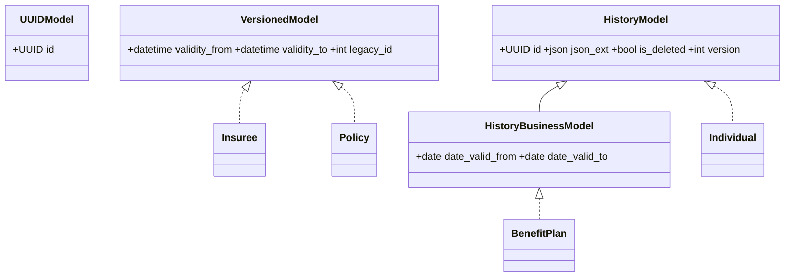
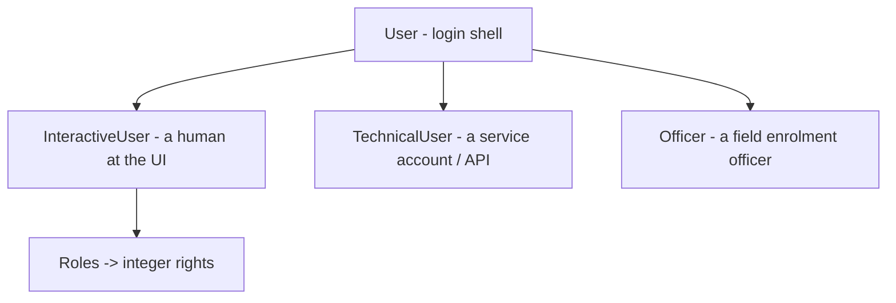
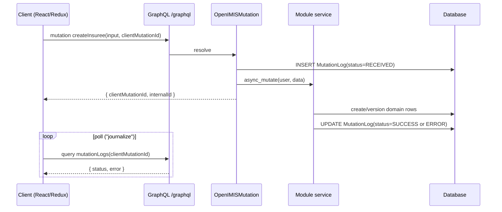
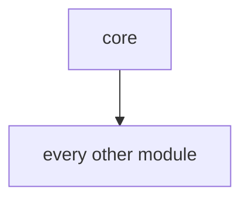
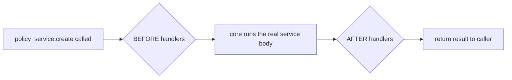
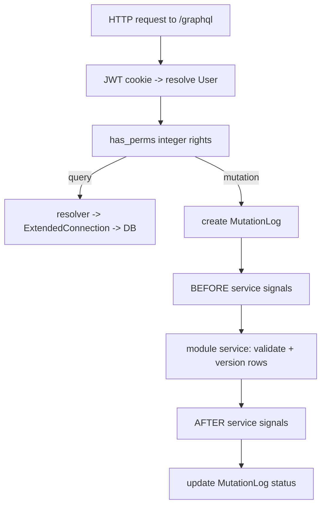

# Core — The Framework Beneath Every Module

`openimis-be-core_py` is **not a business domain**. It ships almost no
health-insurance concepts of its own. Instead it is the *framework* that every
other module builds on: the base model classes, the custom `User`, the GraphQL
plumbing, the asynchronous mutation pattern, the signal-based extension seam, the
calculation hook, the scheduler and the audit machinery.

If you only read one module chapter, read this one. Every table below is
inherited, extended or invoked by [`insuree`](insuree.md), [`policy`](policy.md),
[`individual`](individual.md) and the rest.

## Learning objectives

- Explain the four base model families — `UUIDModel`, `VersionedModel`,
  `HistoryModel`, `HistoryBusinessModel` — and when each is used.
- Read a temporal (`validity_from` / `validity_to`) row and reason about *why*
  openIMIS keeps history this way.
- Describe the custom `User` model and its three "faces": `InteractiveUser`,
  `TechnicalUser`, `Officer`.
- Use the Graphene helpers (`ExtendedConnection`,
  `OrderedDjangoFilterConnectionField`) that every module's schema relies on.
- Trace an `OpenIMISMutation` from client call to `MutationLog` status.
- Wire a **service signal** to extend another module without importing it.

## Prerequisites

- [Plugin / Module System](../architecture/plugin-system.md) — how `core` is
  loaded first and exposes shared code to every other app.
- [GraphQL in openIMIS](../graphql/index.md) — Graphene basics.
- [Database & Legacy Heritage](../database/index.md) — the legacy schema the base
  models straddle.

---

## Purpose

`core` exists to give ~47 independently developed modules a **shared vocabulary
and shared plumbing** so they interoperate and stay upgradeable:

- **Base models** that encode openIMIS's two hard requirements: *nothing is ever
  hard-deleted* (temporal history) and *every record straddles a legacy integer
  key and a new UUID*.
- **A custom authentication/authorization model** unifying human logins, service
  accounts and field officers under integer **rights**.
- **GraphQL helpers** so every module's schema looks and paginates the same way.
- **`OpenIMISMutation`** — one asynchronous, always-audited mutation pattern.
- **Signals** — the seam that lets modules extend each other without imports.
- **Cross-cutting services**: the calculation-rule hook, the APScheduler-based
  scheduler, audit, and a large `utils` toolbox.

---

## Key models

openIMIS models come in a small number of base flavours. Understanding the
inheritance is 80% of understanding any module.

| Model / base class | Key fields | Legacy table |
| --- | --- | --- |
| `UUIDModel` (abstract) | `id` = `UUIDField` primary key | — (used by newer, non-legacy tables) |
| `VersionedModel` (abstract) | `validity_from`, `validity_to` (datetime), `legacy_id` (int, self-FK to prior version), `audit_user_id` | straddles legacy `tbl*` tables |
| `HistoryModel` (abstract) | `id` = UUID, `json_ext` (JSONField), `date_created`, `date_updated`, `user_created`, `user_updated`, `is_deleted`, `version` (int) | new-style tables (no `tbl` prefix) |
| `HistoryBusinessModel` (abstract) | `HistoryModel` + `date_valid_from`, `date_valid_to` | new-style business entities (e.g. `BenefitPlan`) |
| `User` | `username`, `t_user` (FK), `i_user` (FK), `officer` (FK), `uuid` | `tblUsers` |
| `InteractiveUser` | `login_name`, `last_name`, `other_names`, `email`, `password`, `role_ids`, `private_key` | `tblUsers` (interactive) |
| `TechnicalUser` | `username`, `email`, `password` (Django-style service account) | `core_TechnicalUser` |
| `Officer` | `code`, `last_name`, `other_names`, `phone`, `location` (FK) | `tblOfficer` |
| `Role` / `RoleRight` / `UserRole` | `name`, integer `right_id` (permission codes), validity fields | `tblRole`, `tblRoleRight`, `tblUserRole` |
| `MutationLog` | `id` (UUID), `client_mutation_id`, `status`, `error`, `request`, `user` (FK), `autogenerated_code` | `core_Mutation_Log` |
| `ModuleConfiguration` | `module`, `version`, `config` (JSON), `layer`, `is_disabled_until` | `core_ModuleConfiguration` |

!!! info "Did you know? Two keys per row"
    Legacy IMIS used integer primary keys in Microsoft SQL Server. When openIMIS
    added offline mobile clients and cross-database sync, it needed globally
    unique keys — so most legacy tables carry **both** an integer `id` *and* a
    `uuid` column. `VersionedModel` also keeps `legacy_id`, a pointer to the
    previous version of the same logical record.

### Temporal history: `VersionedModel`

The single most surprising thing for a Django engineer new to openIMIS: **updates
do not overwrite rows, and deletes do not remove them.** A `VersionedModel` row
is valid over a time window `[validity_from, validity_to)`. "Deleting" sets
`validity_to = now()`. "Editing" closes the current row and inserts a new one
whose `legacy_id` points back at the old one.

```python
# Illustrative — simplified from core/models.py conventions
class VersionedModel(models.Model):
    validity_from = models.DateTimeField(db_column="ValidityFrom", default=py_datetime.now)
    validity_to = models.DateTimeField(db_column="ValidityTo", blank=True, null=True)
    legacy_id = models.IntegerField(db_column="LegacyID", blank=True, null=True)

    def delete_history(self):
        # "delete" == close the validity window, never DROP the row
        self.validity_to = py_datetime.now()
        self.save()

    class Meta:
        abstract = True
```

The practical consequence: **almost every query in openIMIS filters
`validity_to__isnull=True`** to get "current" rows. Managers and the GraphQL
filter fields do this for you; forget it in raw ORM and you will see ghosts of
deleted records.

!!! danger "Common mistake: querying without the validity filter"
    ```python
    Insuree.objects.filter(chf_id="12345")           # returns every historical version!
    Insuree.objects.filter(chf_id="12345", validity_to__isnull=True)  # correct: current row
    ```
    Prefer the module's provided manager/queryset which applies the filter, or
    the GraphQL layer which applies it automatically.

### `HistoryModel` — the modern approach

Newer modules ([`individual`](individual.md), `social_protection`) use
`HistoryModel` instead. It keeps history in a **separate history table** (via
`simple_history`-style tracking) rather than the legacy in-table window, uses a
**UUID primary key**, an `is_deleted` soft-delete flag, an integer `version`
counter for optimistic locking, and a first-class `json_ext` JSONField for
country-specific extension data.



### The `User` model and its three faces

openIMIS authentication is unusual: the `User` row is a thin join that points at
**one of three** identity types.



- **`InteractiveUser`** (`i_user`): a person logging into the React frontend.
  Carries `role_ids`; roles expand to integer **rights** checked with
  `user.has_perms([121702])`.
- **`TechnicalUser`** (`t_user`): a Django-style service account for API/bot
  access.
- **`Officer`**: a field enrolment officer, referenced by policies and claims.

!!! info "Did you know? Permissions are integers"
    openIMIS permission codes are **integers**, defined per module in `apps.py`
    (e.g. `gql_mutation_create_users_perms = ["121702"]`). Resolvers and
    mutations call `user.has_perms([...])`. There is no Django `Permission`
    string like `app.add_model`. See [Configuration](#configuration) below.

---

## Services

`core` ships framework services, not domain services, plus base classes other
modules subclass.

| Service / helper | Location | Responsibility |
| --- | --- | --- |
| `create_or_update_interactive_user`, `user services` | `core/services.py` | Provision and update users, roles, rights. |
| `BaseService` / CRUD service base | `core/services.py` | Common create/update/delete-with-validation pattern reused by newer modules. |
| `register_service_signal` / `bind_service_signal` | `core/service_signals.py` | The signal-based extension seam (see [Signals](#signals)). |
| `ExtendedConnection`, `OrderedDjangoFilterConnectionField`, `PrefixFilterset` | `core/schema.py` | Graphene helpers reused by every module schema. |
| `OpenIMISMutation` | `core/schema.py` | Base class for all mutations. |
| Scheduler bootstrap | `core/scheduler.py` | Registers APScheduler jobs modules contribute. |
| Calculation-rule registry hook | via signals + `openimis-be-calculation_py` | Lets pricing rules plug into valuation. |

---

## GraphQL

Every module's `schema.py` imports these helpers, so learning them once pays off
everywhere. If you are new to GraphQL, read [GraphQL in openIMIS](../graphql/index.md)
first — here we cover only the openIMIS-specific pieces.

### `ExtendedConnection` and the filtered connection field

Relay "connections" are GraphQL's cursor-paginated lists. openIMIS extends the
standard connection to also report counts, and provides a filter+order field.

```python
# Illustrative — the pattern every module repeats in schema.py
class InsureeGQLType(DjangoObjectType):
    class Meta:
        model = Insuree
        interfaces = (graphene.relay.Node,)
        connection_class = ExtendedConnection      # adds totalCount, edgeCount
        filter_fields = {"chf_id": ["exact", "icontains"], "last_name": ["icontains"]}

class Query(graphene.ObjectType):
    insurees = OrderedDjangoFilterConnectionField(  # filter + orderBy + validity handling
        InsureeGQLType, orderBy=graphene.List(of_type=graphene.String)
    )
```

- `ExtendedConnection` adds `totalCount` and `edgeCount` to results.
- `OrderedDjangoFilterConnectionField` merges Django-filter filtering with an
  `orderBy` argument and applies the `validity_to__isnull=True` "current rows"
  filter for versioned models.

```graphql
query {
  insurees(chfId_Icontains: "123", first: 10, orderBy: ["lastName"]) {
    totalCount
    edges { node { uuid chfId lastName } }
  }
}
```

### `OpenIMISMutation` — the asynchronous, audited mutation pattern

This is the platform's signature pattern and it surprises everyone. A mutation
does **not** synchronously return the created object. Instead it:

1. Creates a `MutationLog` row (status `RECEIVED`).
2. Runs the real work in a **service**, often in the background if
   `async_mutations` is on.
3. Returns a `clientMutationId` immediately.
4. The client **polls** the `MutationLog` by that id until status becomes
   `SUCCESS` (2) or `ERROR` (1).



```python
# Illustrative — the shape of a module mutation
class CreateInsureeMutation(OpenIMISMutation):
    _mutation_module = "insuree"
    _mutation_class = "CreateInsureeMutation"

    class Input(OpenIMISMutation.Input):
        chf_id = graphene.String(required=True)
        last_name = graphene.String(required=True)

    @classmethod
    def async_mutate(cls, user, **data):
        if not user.has_perms(InsureeConfig.gql_mutation_create_insurees_perms):
            raise PermissionDenied("unauthorized")
        # ... call the service; return None on success or a list of error dicts
        return None
```

!!! info "Did you know? Why async?"
    Field officers work **offline** on mobile devices and later sync large
    batches. The async+`MutationLog` pattern gives every write a durable,
    auditable, retriable record — essential when connectivity is intermittent.
    On the frontend, Redux's "journalize" helper does the polling for you.

---

## Dependencies

`core` depends on **no other openIMIS module** — it is the root of the graph. It
depends on Django, `graphene-django`, `django-graphql-jwt`, APScheduler and
`pandas`/`cryptography` utilities. **Everything else depends on `core`.**



---

## Signals

`core` provides **two** signalling mechanisms. Django's ORM signals
(`post_save`, etc.) are used for local reactions. The openIMIS-specific
**service signals** are the real extension seam.

### Service signals — extend a service without importing it

A module *registers* a signal around a service method; other modules *bind*
before/after handlers. The caller never imports the subscriber.

```python
# In the OWNER module (illustrative)
from core.service_signals import register_service_signal

@register_service_signal("policy_service.create")
def create(self, policy_data):
    ...

# In a DIFFERENT module that wants to react
from core.signals import bind_service_signal
from core.service_signals import ServiceSignalBindType

def notify_after_policy_create(sender, **kwargs):
    result = kwargs.get("result")
    # send SMS, push to FHIR, etc.

bind_service_signal(
    "policy_service.create",
    notify_after_policy_create,
    bind_type=ServiceSignalBindType.AFTER,
)
```



!!! info "Did you know?"
    The **calculation-rule framework** and the FHIR/DHIS2 integrations both plug
    in almost entirely through service signals. That is how
    [`calculation`](index.md) can price a claim without `claim` importing any
    specific pricing rule.

---

## Business workflow

`core` has no domain workflow, but it owns the **request/mutation lifecycle** that
every domain workflow runs inside.



---

## Database tables

| Table | Backed by | Notes |
| --- | --- | --- |
| `tblUsers` | `User` / `InteractiveUser` | Legacy login table; interactive users. |
| `core_TechnicalUser` | `TechnicalUser` | New-style service accounts. |
| `tblOfficer` | `Officer` | Field enrolment officers. |
| `tblRole`, `tblRoleRight`, `tblUserRole` | `Role`, `RoleRight`, `UserRole` | Roles carry integer `right_id` permission codes. |
| `core_Mutation_Log` | `MutationLog` | One row per mutation; the audit + polling backbone. |
| `core_ModuleConfiguration` | `ModuleConfiguration` | Per-module JSON config overlay (see below). |

See [Database & Legacy Heritage](../database/index.md) for the `tbl` naming story.

---

## Configuration

Each module declares a `DEFAULT_CFG` dict in its `AppConfig` (`core/apps.py` →
`class CoreConfig`). At startup, core reads a matching row from
`ModuleConfiguration` in the DB and **overlays** it, so operators reconfigure a
deployment without touching code.

Notable `CoreConfig.DEFAULT_CFG` keys *(see `openimis-be-core_py/core/apps.py`)*:

| Key | Default | Meaning |
| --- | --- | --- |
| `currency` | `"$"` | Display currency symbol. |
| `async_mutations` | `True` (prod) | Whether mutations run in the background with polling. |
| `age_of_majority` | `"18"` | Adult threshold used across modules. |
| `username_code_length` | `"12"` | Generated username length. |
| `auto_provisioning_user_group` | `"user"` | Group assigned to auto-provisioned (OIDC) users. |
| `calendar_module` / `datetime_module` | AD calendar | Pluggable calendar (openIMIS supports e.g. Nepali calendar). |
| `gql_query_users_perms` | `["121701"]` | Integer permission codes for the users query. |
| `gql_mutation_create_users_perms` | `["121702"]` | Permission to create users. |
| `password_reset_template` | `"password_reset.txt"` | Email template. |

!!! info "Did you know? Pluggable calendars"
    `calendar_module`/`datetime_module` let a country swap the Gregorian (AD)
    calendar for another — Nepal runs openIMIS on the **Bikram Sambat** calendar.
    That is a `core` feature, configured, not forked.

---

## Extension points

| Seam | How you use it |
| --- | --- |
| **Service signals** | `register_service_signal` / `bind_service_signal` to hook before/after any registered service. |
| **`DEFAULT_CFG` + `ModuleConfiguration`** | Override behaviour per deployment without code changes. |
| **Base model subclassing** | Extend `HistoryModel`/`VersionedModel` in your own module to inherit history, `json_ext`, audit for free. |
| **`json_ext`** | Store country-specific fields without a migration. |
| **Scheduler** | Register APScheduler jobs from any module's `apps.ready()`. |
| **Calculation rules** | Register a `calcrule_*` module to price contributions/claims. |
| **Graphene inheritance** | Add your module's `Query`/`Mutation`; `openimis/schema.py` merges them via multiple inheritance. |

---

## Common mistakes

!!! danger "Forgetting the validity filter"
    Querying a `VersionedModel` without `validity_to__isnull=True` returns
    historical versions. Use the provided managers or the GraphQL layer.

!!! danger "Expecting a mutation to return the created object synchronously"
    `OpenIMISMutation` returns a `clientMutationId`; you must poll `MutationLog`.
    Blocking on an immediate object breaks the offline-sync model.

!!! warning "Using Django string permissions"
    openIMIS rights are **integers** checked with `user.has_perms([code])`. Do
    not reach for `@permission_required("app.add_x")`.

!!! warning "Hard-deleting rows"
    Never `.delete()` a versioned record in a way that drops the row — close its
    validity window (`delete_history`) so history and offline sync stay intact.

---

## Hands-on lab

1. Clone `openimis-be-core_py` and open `core/models.py`. Locate
   `VersionedModel` and `HistoryModel`; list every field each contributes.
2. In `core/schema.py`, find `ExtendedConnection` and confirm the extra fields it
   adds to a Relay connection.
3. In `core/apps.py`, print the `DEFAULT_CFG` dict. Pick three integer permission
   codes and trace where they are enforced in another module's mutations.
4. Grep the codebase for `register_service_signal(` and `bind_service_signal(` to
   see the extension seam in the wild.

## Exercises

- **E1.** Write an illustrative `HistoryModel` subclass `Vehicle` with a
  `json_ext` field, and explain what happens in the history table on update vs.
  delete.
- **E2.** Given a mutation `createFoo`, sketch the sequence of `MutationLog`
  status transitions a client would observe.
- **E3.** You must send an SMS whenever any policy is created, but you may not
  edit the `policy` module. Which core mechanism do you use, and write the
  `bind_service_signal` call.

## Knowledge check

??? question "Q1: What does 'deleting' a VersionedModel row actually do? (click for answer)"
    It sets `validity_to = now()`, closing the validity window. The row remains
    in the table so history and offline sync are preserved.

??? question "Q2: Name the three identity types a `User` can point to. (click for answer)"
    `InteractiveUser` (human UI login), `TechnicalUser` (service account) and
    `Officer` (field enrolment officer).

??? question "Q3: Why does `OpenIMISMutation` return a clientMutationId instead of the object? (click for answer)"
    Because mutations are asynchronous and audited via `MutationLog`, supporting
    intermittent connectivity and offline batch sync; the client polls the log
    for `SUCCESS`/`ERROR`.

??? question "Q4: How can module B react to module A's service call without importing A? (click for answer)"
    A registers the method with `register_service_signal`; B binds a BEFORE/AFTER
    handler with `bind_service_signal`. No direct import is needed.

??? question "Q5: Where do a module's default settings live, and how are they overridden per deployment? (click for answer)"
    In the module `AppConfig`'s `DEFAULT_CFG`, overlaid at startup by a
    `ModuleConfiguration` JSON row in the database.

## Repository references

| Repository | Directory / File | Why it matters |
| --- | --- | --- |
| `openimis-be-core_py` | `core/models.py` | `VersionedModel`, `HistoryModel`, `User`, `MutationLog`, `ModuleConfiguration`. |
| `openimis-be-core_py` | `core/schema.py` | `ExtendedConnection`, `OrderedDjangoFilterConnectionField`, `OpenIMISMutation`. |
| `openimis-be-core_py` | `core/service_signals.py` | `register_service_signal` / `bind_service_signal` seam. |
| `openimis-be-core_py` | `core/apps.py` | `CoreConfig.DEFAULT_CFG` and permission codes. |
| `openimis-be-core_py` | `core/scheduler.py` | APScheduler bootstrap for background jobs. |
| `openimis-be_py` | `openimis/schema.py` | Merges each module's `Query`/`Mutation` into one schema. |

## Further reading

- Core repo: <https://github.com/openimis/openimis-be-core_py>
- Graphene-Django docs: <https://docs.graphene-python.org/projects/django/en/latest/>
- `django-graphql-jwt`: <https://django-graphql-jwt.domake.io/>
- openIMIS wiki — architecture: <https://openimis.atlassian.net/wiki/spaces/OP/overview>
