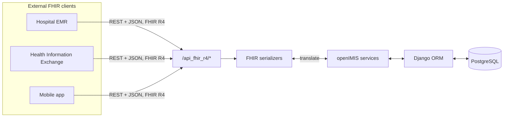
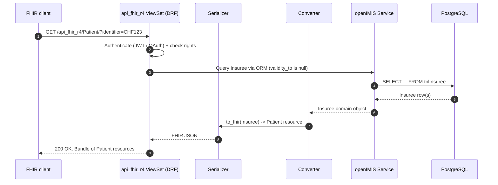

# FHIR R4 API Module

> Module repository: **`openimis-be-api_fhir_r4_py`** · Python package: `api_fhir_r4`

The FHIR module is openIMIS's **standards-based interoperability layer**. While
the rest of the platform speaks [GraphQL](../graphql/index.md) to its own React
frontend, `api_fhir_r4` exposes a parallel **REST API** that speaks
**HL7 FHIR R4** — the global lingua franca for exchanging health data. This is
how openIMIS talks to hospital information systems, national health data
exchanges, mobile apps, and other clinical software that has never heard of an
"Insuree" but knows exactly what a FHIR `Patient` is.

!!! abstract "Learning objectives"
    By the end of this chapter you will be able to:

    - Explain **why** openIMIS ships a FHIR REST API *in addition to* GraphQL.
    - Map the core openIMIS domain models to their FHIR R4 resource equivalents.
    - Trace a FHIR request from HTTP through the module's serializers to the ORM.
    - Authenticate against and call the `/api_fhir_r4/` endpoints.
    - Extend the mapping for a new resource or a country-specific profile.

!!! note "Prerequisites"
    - [Platform Overview](../getting-started/overview.md) and
      [Terminology](../getting-started/terminology.md)
    - [Insuree](insuree.md), [Policy](policy.md), [Claim](claim.md),
      [Location & Health Facility](location.md) modules
    - [Security: Authentication & Authorization](../security/index.md)
    - The broader [Integrations](../integrations/index.md) chapter — this page is
      the **module deep dive**; that page is the **landscape view**.

---

## Purpose

Health systems are ecosystems of software that must exchange data: an EMR at a
hospital, a national beneficiary registry, a claims clearinghouse, a mobile
enrolment app. Forcing every one of them to learn openIMIS's internal GraphQL
schema — with its legacy table names and integer permission codes — would be a
non-starter. Instead, openIMIS implements **[FHIR](../reference/glossary.md) R4**
(Fast Healthcare Interoperability Resources), the HL7 standard that the rest of
the digital-health world already speaks.

!!! info "Did you know?"
    FHIR is *resource-oriented REST*, the opposite design philosophy to
    openIMIS's own GraphQL API. openIMIS deliberately runs **both**: GraphQL for
    its own tightly-coupled frontend (fast iteration, exact field selection) and
    FHIR REST for **loosely-coupled external partners** (stable, standardized,
    self-describing). Choosing the right API style per consumer is an
    architecture lesson in itself — see the [Architecture Critique](../critique/index.md).

The module's job is therefore a **translation layer**: it maps openIMIS domain
objects ↔ FHIR resources in both directions, exposes them over conventional REST
endpoints, and enforces the same permission model as the rest of the platform.



---

## Key resource mappings

FHIR calls its data objects **resources**. The heart of this module is the map
between openIMIS models and FHIR resources. (See the fuller table with endpoints
in the [Integrations chapter](../integrations/index.md#resource-mapping-table).)

| openIMIS model | FHIR R4 resource | Notes |
| --- | --- | --- |
| `Insuree` ([insuree](insuree.md)) | **Patient** | The beneficiary. CHF/insurance ID becomes a Patient `identifier`. |
| `Family` | **Group** / Patient links | Household grouping. |
| `Policy` ([policy](policy.md)) | **Coverage** | Active insurance coverage for a period. |
| `Product` ([medical/product](medical.md)) | **InsurancePlan** | The benefit package behind a Coverage. |
| `Claim` ([claim](claim.md)) | **Claim** / **ClaimResponse** | Submission in, adjudication out. |
| `ClaimItem` / `ClaimService` | Claim `item` entries | Line items reference medical codes. |
| `HealthFacility` ([location](location.md)) | **Location** / **Organization** | Where care is delivered. |
| `Location` hierarchy | **Location** (nested) | Region → District → Ward → Village. |
| `ClaimAdmin` / medical staff | **Practitioner** / **PractitionerRole** | The clinician. |
| `Item` / `Service` ([medical](medical.md)) | **Medication** / **ActivityDefinition** | The catalogue of billable things. |

!!! tip "Read the source for the exact profile"
    FHIR is *profiled* per implementation — openIMIS constrains and extends base
    FHIR to fit its domain. The authoritative definition of each mapping lives in
    `api_fhir_r4/converters/` (one converter class per resource, e.g.
    `PatientConverter`, `ClaimConverter`, `CoverageConverter`) and the
    serializers in `api_fhir_r4/serializers/`. When in doubt, read the converter.

---

## Architecture: how a FHIR request is served

Unlike the GraphQL side, this module is built on **Django REST Framework** (which
you already know). Each resource has a DRF `ViewSet`, a `Serializer`, and a
`Converter` that does the openIMIS ↔ FHIR object translation.



The reverse path (a `POST` of a FHIR `Claim`) runs the converter
`from_fhir(...)` direction, then hands the resulting domain object to the
[claim service](claim.md#services) — reusing the *same* business logic and
validation that the GraphQL mutation uses. **There is one business core; FHIR is
just another door into it.**

!!! danger "Common mistake"
    Treating the FHIR module as a separate application with its own rules. It is
    a **thin translation shell over the existing services**. If you add
    validation or side effects in a FHIR serializer that the GraphQL path
    doesn't have, the two APIs will silently diverge. Put business rules in the
    service layer (see [Best Practices](../best-practices/index.md)); keep
    converters purely about shape.

---

## Endpoints & authentication

All endpoints live under the `/api_fhir_r4/` prefix (registered via the module's
`urls.py`, collected into `openimis-be_py/openimis/urls.py` — see the
[Plugin System](../architecture/plugin-system.md)).

```bash
# Base URL pattern
https://<host>/api_fhir_r4/<Resource>/

# Examples (illustrative)
GET  /api_fhir_r4/Patient/                 # search insurees as Patients
GET  /api_fhir_r4/Patient/<uuid>/          # one insuree
GET  /api_fhir_r4/Coverage/?patient=<uuid> # policies for an insuree
POST /api_fhir_r4/Claim/                    # submit a claim as a FHIR Claim
GET  /api_fhir_r4/CommunicationRequest/     # claim feedback requests
```

Authentication reuses the platform's mechanisms (see
[Security](../security/index.md)): a **JWT** bearer token or an **OAuth2 /
OpenID Connect** access token from a configured external identity provider. The
same **integer rights** that gate the GraphQL resolvers gate the FHIR viewsets —
a client that cannot read claims in GraphQL cannot read them as FHIR either.

!!! info "Did you know?"
    The OAuth2 support matters specifically *because* of FHIR. External systems
    can't log in through the React UI to get a cookie, so machine-to-machine FHIR
    clients obtain a bearer token from an IdP and present it on every REST call.

---

## Configuration

Like every module, `api_fhir_r4` carries a `DEFAULT_CFG` in its `apps.py`
(`ApiFhirConfig`) that is overlaid at startup by the DB-backed
[`ModuleConfiguration`](../configuration/index.md). Typical settings include the
identifier systems/URIs used for FHIR `identifier` slices (e.g. the URL that
namespaces a CHF number), default issuer/base URLs, and which permission codes
guard each resource.

| Config concern | Where | Why it matters |
| --- | --- | --- |
| Identifier system URIs | `DEFAULT_CFG` in `apps.py` | FHIR identifiers must be namespaced by a system URI; countries differ. |
| Per-resource permissions | `DEFAULT_CFG` / `ModuleConfiguration` | Reuse platform rights; no separate ACL. |
| Base / issuer URLs | `ModuleConfiguration` | Deployment-specific, set without code change. |

---

## Extension points

- **New resource / new mapping** — add a `Converter` + `Serializer` +
  `ViewSet` under `api_fhir_r4/` and register its route in the module `urls.py`.
- **Country profile** — extend an existing converter to emit/accept extra FHIR
  extensions or constrained value sets, driven by `ModuleConfiguration` so you
  don't fork.
- **Reuse the service layer** — always route writes through the owning module's
  service (`claim.services`, `insuree.services`, …) so business rules stay in one
  place.

---

## Repository references

| Repository | Directory / File | Why it matters |
| --- | --- | --- |
| `openimis-be-api_fhir_r4_py` | `api_fhir_r4/converters/` | The openIMIS ↔ FHIR translation, one class per resource. |
| `openimis-be-api_fhir_r4_py` | `api_fhir_r4/serializers/` | DRF serializers producing/consuming FHIR JSON. |
| `openimis-be-api_fhir_r4_py` | `api_fhir_r4/views.py` / `urls.py` | The REST viewsets and `/api_fhir_r4/` routes. |
| `openimis-be-api_fhir_r4_py` | `api_fhir_r4/apps.py` (`ApiFhirConfig`) | `DEFAULT_CFG`: identifier systems, permissions. |
| `openimis-be_py` | `openimis/urls.py` | Where the module's routes are mounted into the project. |
| Owning modules | `claim`, `insuree`, `policy`, `location` services | The business logic FHIR delegates to. |

---

## Hands-on lab

!!! example "Lab: Read and post FHIR"
    1. Bring up the stack ([Setup](../getting-started/setup.md)) and obtain a JWT
       or OAuth token for a user with insuree/claim rights.
    2. `GET /api_fhir_r4/Patient/` and confirm you receive a FHIR **Bundle**.
       Find the `identifier` that carries the insurance/CHF number.
    3. `GET /api_fhir_r4/Coverage/?patient=<uuid>` for that patient and correlate
       the result with the [Policy](policy.md) you can see in the UI.
    4. Read `api_fhir_r4/converters/patient_converter.py` (name may vary) and
       match three FHIR `Patient` fields back to `Insuree` model fields.
    5. **Stretch:** POST a minimal FHIR `Claim` and observe that it flows through
       the *same* [claim submission workflow](claim.md#business-workflow) as a
       GraphQL mutation.

## Exercises

1. Explain to a teammate why the same permission denies both the GraphQL and the
   FHIR path to a claim.
2. A partner needs an extra national identifier on every Patient. Describe the
   change (converter + config) without forking core.
3. Compare the FHIR `Claim` → `ClaimResponse` cycle to openIMIS's internal
   [claim status bitfield](claim.md). Where do they line up, where not?

## Knowledge check

??? question "Q1: Why does openIMIS expose FHIR REST when it already has GraphQL? (click for answer)"
    GraphQL serves openIMIS's own tightly-coupled frontend, where exact field
    selection and rapid schema evolution matter. FHIR REST serves **external,
    loosely-coupled** systems that already speak the HL7 standard and should not
    need to learn openIMIS internals. Different consumers, different API styles.

??? question "Q2: Which openIMIS model maps to a FHIR `Coverage`? (click for answer)"
    `Policy` (from the [policy module](policy.md)) — an insuree's active coverage
    for a period. The `Product` behind it maps to `InsurancePlan`.

??? question "Q3: Where should business validation for a FHIR claim POST live? (click for answer)"
    In the **claim service layer**, not the FHIR serializer. FHIR converters
    should only translate shape; business rules belong in the shared service so
    GraphQL and FHIR never diverge.

??? question "Q4: How do external machine clients authenticate to the FHIR API? (click for answer)"
    They obtain an **OAuth2 / OpenID Connect** bearer token (or a JWT) and send
    it on each REST call — they cannot use the browser cookie flow. The same
    integer rights then authorize the request.

---

## Further reading

- [Integrations](../integrations/index.md) — the full external-systems landscape
  (FHIR, DHIS2, payments, SMS/email, webhooks).
- [Security](../security/index.md) — JWT, OAuth2/OIDC, and rights enforcement.
- [HL7 FHIR R4 specification](https://hl7.org/fhir/R4/) — the standard itself.
- `openimis-be-api_fhir_r4_py` on GitHub — the authoritative converters and
  serializers.
