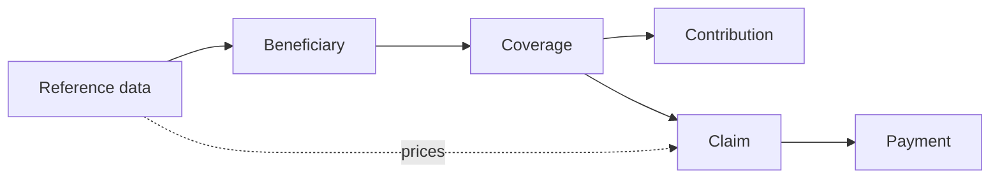
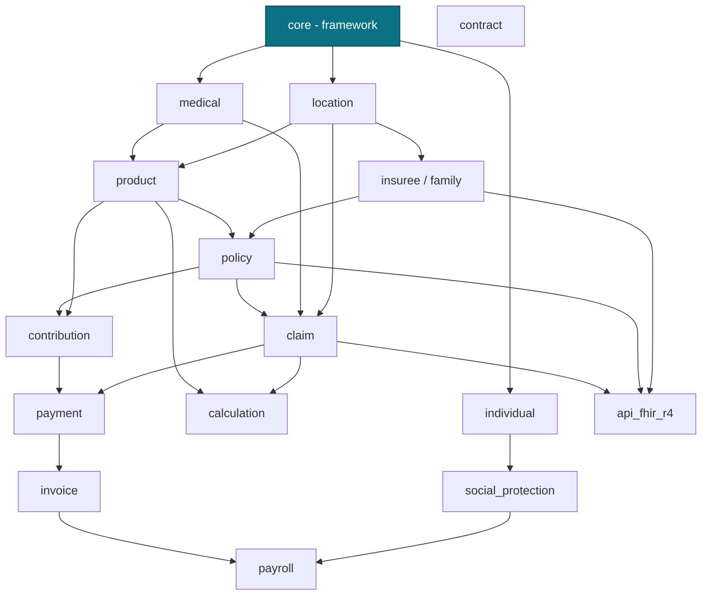

# Business Modules — The Domain Model at a Glance

openIMIS is not one program; it is a **fleet of independently versioned Django
apps** (modules) assembled at deploy time into a single backend. The
[plugin/module system](../architecture/plugin-system.md) explains *how* they are
wired together. This section of the Academy explains *what each module means* —
the business domain of social health protection, expressed as models, services
and GraphQL.

## Learning objectives

By the end of this chapter you will be able to:

- Name the core business modules and state the one responsibility of each.
- Read the **module dependency graph** and predict which module a given concept
  lives in.
- Trace the canonical data-flow of a scheme:
  **reference data → beneficiary → coverage → contribution → claim → payment**.
- Distinguish the **classic health-insurance stack** (`insuree` + `policy`) from
  the **newer generic beneficiary registry** (`individual` + `social_protection`).

## Prerequisites

- [Plugin / Module System](../architecture/plugin-system.md) — how modules are
  discovered, installed and combined.
- [GraphQL in openIMIS](../graphql/index.md) — the query/mutation layer every
  module exposes.
- [Database & Legacy Heritage](../database/index.md) — the `tbl`-prefixed legacy
  schema these modules sit on.

---

## The domain in one sentence

> A **scheme operator** enrols **beneficiaries**, sells them **coverage** under a
> priced **product**, collects **contributions**, receives **claims** from health
> facilities for services rendered, values those claims with pricing rules, and
> **pays** the providers.

Every business module is a noun (or verb) in that sentence. Learn the sentence
and you have learned the map.

| Stage | Question it answers | Primary modules |
| --- | --- | --- |
| **Reference data** | Where, who provides care, what is covered, at what price? | `location`, `medical`, `product` |
| **Beneficiary** | Who is the person / household? | `insuree`, `family` · `individual`, `group` |
| **Coverage** | Is this person insured, for which product, until when? | `policy`, `social_protection` |
| **Contribution** | What premium was paid against that coverage? | `contribution`, `contract` |
| **Claim** | What service was delivered, and what is it worth? | `claim` + `calculation` |
| **Payment** | Who gets paid, how much, and how? | `payment`, `invoice`, `payroll` |

---

## Module dependency graph

`core` is the framework everyone stands on. Reference-data modules sit above it;
beneficiary, coverage, contribution and claim modules layer on top; integrations
(`api_fhir_r4`) sit at the very top exposing everything.

!!! info "Did you know?"
    The arrows are **hard Python import + FK dependencies**, but modules almost
    never call each other's *services* by direct import. They subscribe to
    [service signals](core.md#signals) instead. That is why you can swap the
    beneficiary layer (`insuree` → `individual`) without rewriting `claim`.

---

## The two beneficiary worlds

openIMIS grew up as **health insurance** software. Its original beneficiary model
is the household-centric `insuree` / `family` pair, tightly bound to `policy` and
`contribution`. Later, donors needed openIMIS to run **cash-transfer and social
protection** programmes that are *not* health insurance at all. Rather than bend
the insurance models, the community added a **generic beneficiary registry** —
`individual` / `group` — plus `social_protection` (benefit plans, beneficiaries,
projects, payrolls).

| Concern | Classic health-insurance stack | Generic social-protection stack |
| --- | --- | --- |
| Person | `Insuree` | `Individual` |
| Household | `Family` | `Group` + `GroupIndividual` |
| Enrolment product | `Product` (insurance product) | `BenefitPlan` / programme |
| Coverage record | `Policy` + `InsureePolicy` | `Beneficiary` / `GroupBeneficiary` |
| Legacy DB heritage | `tblInsuree`, `tblFamilies` (MSSQL era) | new PostgreSQL tables, no `tbl` prefix |
| Extensibility | fixed columns + `json_ext` | schema-light, `json_ext`-first |

Read [Insuree](insuree.md) and [Individual & Social Protection](individual.md)
back-to-back — the contrast is the single most important architectural story in
the platform.

---

## Module directory

| Module page | Repository | One-line purpose |
| --- | --- | --- |
| [Core](core.md) | `openimis-be-core_py` | The framework: base models, User, GraphQL helpers, mutations, signals, scheduler, calculation hook. |
| [Insuree](insuree.md) | `openimis-be-insuree_py` | Classic beneficiaries: `Insuree`, `Family`, photos, genders, enrolment. |
| [Individual & Social Protection](individual.md) | `openimis-be-individual_py`, `openimis-be-social_protection_py` | Generic person/group registry and benefit-plan programmes beyond health insurance. |
| [Policy](policy.md) | `openimis-be-policy_py` | Coverage: links a family/insuree to a product for a period; states and renewals. |
| `location` | `openimis-be-location_py` | Regions, districts, municipalities, villages, health facilities. |
| `medical` / `product` | `openimis-be-medical_py`, `openimis-be-product_py` | Medical items & services; insurance products and price lists. |
| `contribution` | `openimis-be-contribution_py` | Premiums (contributions/premiums) recorded against policies. |
| `claim` | `openimis-be-claim_py` | Service delivery by facilities, valued via calculation rules. |
| `calculation` | `openimis-be-calculation_py` | Pluggable pricing/valuation rules (`calcrule_*`). |
| `payment` / `invoice` | `openimis-be-payment_py`, `openimis-be-invoice_py` | Provider payment and billing artefacts. |
| `api_fhir_r4` | `openimis-be-api_fhir_r4_py` | FHIR R4 REST façade over the models above. |

!!! tip "How to read a module page"
    Every module chapter follows the same skeleton — Purpose, Key models,
    Services, GraphQL, Dependencies, Signals, Business workflow, Database tables,
    Configuration, Extension points, Common mistakes, Exercises, Knowledge check.
    Once you have read [Core](core.md), the others will feel familiar because they
    all inherit the same base classes and mutation pattern.

---

## Repository references

| Repository | Directory / File | Why it matters |
| --- | --- | --- |
| `openimis-be_py` | `openimis.json` | The module manifest — the authoritative list of which business modules ship in a deployment. |
| `openimis-be_py` | `openimis/settings.py` | Builds `INSTALLED_APPS` from the manifest, so module load order mirrors the dependency graph. |
| `openimis-be_py` | `openimis/schema.py` | Merges every module's `schema.Query`/`schema.Mutation` into one root schema. |
| `openimis-be-core_py` | `core/models.py` | The base classes (`HistoryModel`, `VersionedModel`, `UUIDModel`) every business model below extends. |

## Further reading

- Official wiki: <https://openimis.atlassian.net/wiki/spaces/OP/overview>
- Module manifest: <https://github.com/openimis/openimis-be_py/blob/develop/openimis.json>
- GitHub org (all module repos): <https://github.com/openimis>

## Knowledge check

??? question "Q1: In the canonical flow, which module sits *between* coverage and payment on the claim side? (click for answer)"
    `claim` — a health facility raises a claim against an active
    [policy](policy.md); the claim is valued by [`calculation`](index.md) rules
    and then settled by `payment`/`invoice`.

??? question "Q2: Why does swapping `insuree` for `individual` not force a rewrite of `claim`? (click for answer)"
    Because modules communicate through [service signals](core.md#signals) and
    configuration rather than hard cross-service imports, so the claim workflow
    depends on an *abstraction*, not on the concrete beneficiary class.

??? question "Q3: Which two modules make up the newer generic beneficiary registry, and what problem did it solve? (click for answer)"
    `individual` and `social_protection`. They let openIMIS run
    non-health-insurance programmes (cash transfers, social protection) without
    distorting the health-insurance-specific `insuree`/`policy` models.
