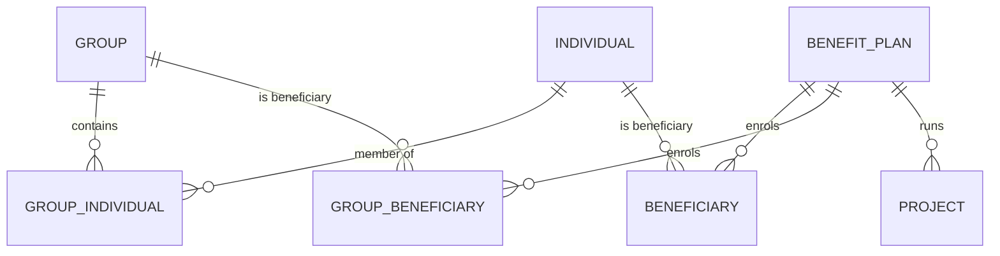
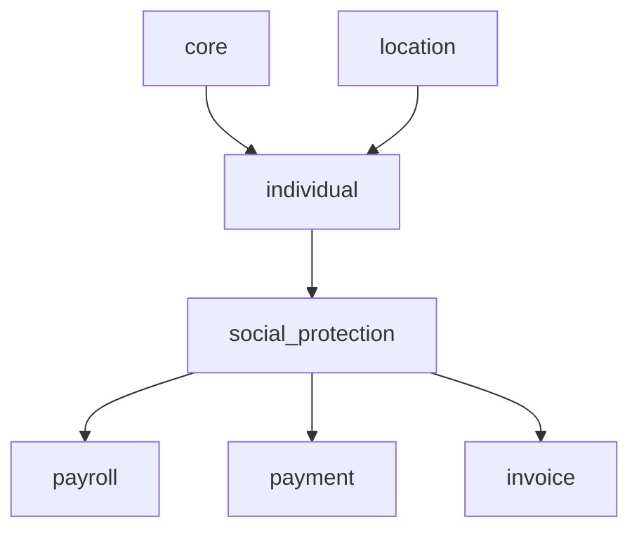
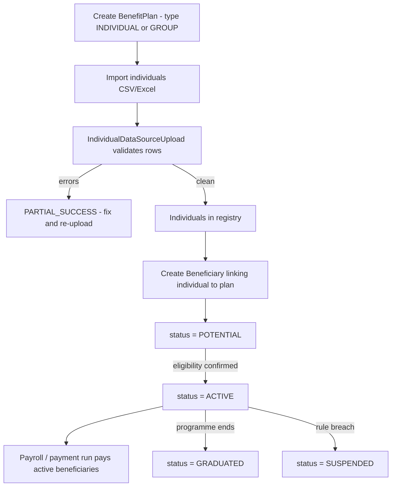
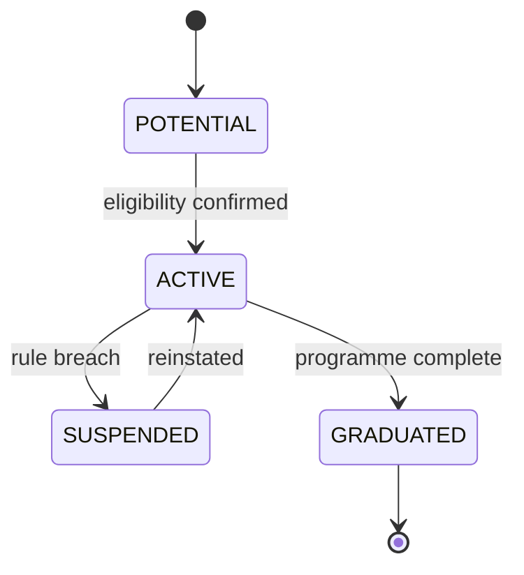

# Individual & Social Protection — The Generic Beneficiary Registry

openIMIS began life as **health insurance** software, and its original
beneficiary model ([`insuree` / `family`](insuree.md)) is welded to that world:
households buy policies, members inherit coverage, everything is `tbl`-prefixed
legacy schema. But donors increasingly asked openIMIS to run programmes that are
**not health insurance at all** — unconditional cash transfers, disability
grants, food assistance, public-works wages. Those programmes have *people* and
*households* too, but no "policy", no "product", no "claim".

Rather than distort the insurance models, the community built a **second,
generic beneficiary registry**: `openimis-be-individual_py` (the registry) and
`openimis-be-social_protection_py` (the programmes on top of it).

## Learning objectives

- Explain **why** a generic registry exists alongside the classic insuree module.
- Model people and households with `Individual`, `Group`, `GroupIndividual`.
- Describe **benefit plans / programmes** and how `Beneficiary` links a person to
  one, with a lifecycle status.
- Map the classic concepts onto the generic ones and know when to reach for each.
- Recognise the modern `HistoryModel` + `json_ext` design and how it differs from
  the legacy `VersionedModel`.

## Prerequisites

- [Core](core.md) — `HistoryModel`, `HistoryBusinessModel`, `json_ext`.
- [Insuree](insuree.md) — the classic model this one generalises.
- [Modules overview](index.md) — the two beneficiary worlds.

---

## Purpose

Two modules, two jobs:

- **`individual`** — a **schema-light, domain-neutral registry** of persons
  (`Individual`) and households (`Group`), plus bulk **data import** machinery. It
  knows nothing about health, insurance, or cash; it just stores people.
- **`social_protection`** — the **programme layer**: `BenefitPlan` (a programme),
  `Beneficiary` / `GroupBeneficiary` (enrolment of an individual/group into a
  plan, with a lifecycle), `Project`, and links out to
  [payment/payroll](index.md).

!!! info "Did you know? Why not just extend insuree?"
    The `insuree` model hard-codes health-insurance assumptions: coverage attaches
    to a `Family`, a policy references a `Product`, members are validated by
    insurance-number rules. A cash-transfer programme has none of those. Forcing
    it into `insuree` would mean nullable insurance columns everywhere and
    confusing semantics. A **separate generic registry** keeps both domains clean
    and lets openIMIS be a *social protection* platform, not just a health
    insurer.

---

## Key models

These are **new-style** tables: UUID primary keys, `json_ext` for extensibility,
`HistoryModel`/`HistoryBusinessModel` base classes, and **no `tbl` prefix** — a
deliberate break from the legacy schema.

### `individual` module

| Model | Key fields | Base class |
| --- | --- | --- |
| `Individual` | `first_name`, `last_name`, `dob`, `location` (FK), `json_ext` | `HistoryModel` |
| `Group` | `code`, `location` (FK), `json_ext` | `HistoryModel` |
| `GroupIndividual` | `group` (FK), `individual` (FK), `role` (HEAD/SPOUSE/…), `recipient_type` (PRIMARY/SECONDARY), `json_ext` | `HistoryModel` |
| `IndividualDataSource` | `individual` (FK), `upload` (FK), `json_ext`, `validations` | `HistoryModel` |
| `IndividualDataSourceUpload` | `status` (PENDING/IN_PROGRESS/SUCCESS/PARTIAL_SUCCESS/FAIL/…), `source_name` | `HistoryModel` |

### `social_protection` module

| Model | Key fields | Base class |
| --- | --- | --- |
| `BenefitPlan` | `code`, `name`, `type` (INDIVIDUAL/GROUP), `max_beneficiaries`, `ceiling_per_beneficiary`, `institution`, `json_ext` | `HistoryBusinessModel` |
| `Beneficiary` | `individual` (FK), `benefit_plan` (FK), `status` (POTENTIAL/ACTIVE/GRADUATED/SUSPENDED), `json_ext` | `HistoryBusinessModel` |
| `GroupBeneficiary` | `group` (FK), `benefit_plan` (FK), `status`, `json_ext` | `HistoryBusinessModel` |
| `Project` | `benefit_plan` (FK), target beneficiaries, working days | `HistoryBusinessModel` |
| `BenefitPlanDataUploadRecords` | tracks import workflow for a plan | `HistoryModel` |



!!! info "Did you know? A benefit plan has a *type*"
    `BenefitPlan.type` is `INDIVIDUAL` or `GROUP`. An `INDIVIDUAL`-type plan
    accepts `Beneficiary` rows (person-level); a `GROUP`-type plan accepts
    `GroupBeneficiary` rows (household-level). The model validates you cannot mix
    them.

---

## The mapping: classic vs. generic

| Concern | Classic ([insuree](insuree.md)/[policy](policy.md)) | Generic (individual/social_protection) |
| --- | --- | --- |
| Person | `Insuree` (`tblInsuree`) | `Individual` (UUID, `json_ext`) |
| Household | `Family` (`tblFamilies`) | `Group` + `GroupIndividual` |
| Membership role | `head` bool + `Relation` | `GroupIndividual.role` |
| Programme/product | `Product` (insurance) | `BenefitPlan` / programme |
| Enrolment record | `Policy` + `InsureePolicy` | `Beneficiary` / `GroupBeneficiary` |
| Enrolment lifecycle | policy states (idle/active/…) | `status` (POTENTIAL/ACTIVE/GRADUATED/SUSPENDED) |
| Base class | `VersionedModel` (in-table validity) | `HistoryModel` (separate history, UUID, `json_ext`) |
| DB heritage | legacy `tbl*`, camelCase | modern tables, snake_case |
| Domain | health insurance only | any social protection programme |

!!! tip "Which do I use?"
    Building health-insurance features (policies, contributions, claims)? Stay in
    [`insuree`](insuree.md)/[`policy`](policy.md). Building cash transfers,
    registries, or programme-based benefits? Use `individual` +
    `social_protection`. Some deployments run **both** and bridge them (e.g.
    `insuree_as_worker`).

---

## Services

Both modules follow the newer **`BaseService` CRUD-with-validation** pattern from
[core](core.md#services) rather than the older free-function services.

| Service | Module | Responsibility |
| --- | --- | --- |
| `IndividualService`, `GroupService`, `GroupIndividualService` | `individual` | Create/update/delete registry records with `json_ext` validation. |
| Import services (`IndividualImportService`) | `individual` | Bulk CSV/Excel upload → `IndividualDataSourceUpload`, with row-level validation and workflow. |
| `BenefitPlanService` | `social_protection` | Manage programmes. |
| `BeneficiaryService` / `GroupBeneficiaryService` | `social_protection` | Enrol beneficiaries; enforce plan-type match; drive status. |
| Payroll/payment integration | `social_protection` | Hand ACTIVE beneficiaries to `payroll`/`payment`. |

---

## GraphQL

Standard [core helpers](core.md#graphql): `ExtendedConnection`,
`OrderedDjangoFilterConnectionField`, `OpenIMISMutation`.

### Queries

| Query | Returns |
| --- | --- |
| `individual`, `group`, `groupIndividual` | Registry connections. |
| `benefitPlan` | Programmes. |
| `beneficiary`, `groupBeneficiary` | Enrolments (filterable by `status`, `benefitPlan`). |
| `individualDataSourceUpload` | Import batch status. |

### Mutations

| Mutation | Effect |
| --- | --- |
| `createIndividual` / `updateIndividual` / `deleteIndividual` | Registry CRUD. |
| `createGroup` / `addIndividualToGroup` | Household composition. |
| `createBenefitPlan` / `updateBenefitPlan` | Programme CRUD. |
| `createBeneficiary` / `updateBeneficiaryStatus` | Enrolment and lifecycle transitions. |

```graphql
query {
  beneficiary(benefitPlan_Id: "…", status: ACTIVE, first: 20) {
    totalCount
    edges { node {
      status
      individual { firstName lastName }
      jsonExt
    } }
  }
}
```

---

## Dependencies



- **`individual` needs:** [`core`](core.md), `location`.
- **`social_protection` needs:** `individual`, [`core`](core.md); integrates with
  `payment`, `invoice`, `payroll`, `tasks_management` and `opensearch_reports`.
- It deliberately does **not** depend on [`insuree`](insuree.md) — the two
  registries are independent.

---

## Signals

- Newer modules lean heavily on [core service signals](core.md#signals): import
  completion, beneficiary status changes and enrolment fire signals that
  `payroll`, `tasks_management` and reporting subscribe to.
- Django `post_save` signals maintain history rows (`HistoryModel`) and update
  `json_ext`-derived aggregates.
- Bulk imports emit progress events consumed by `tasks_management`/`workflow`.

---

## Business workflow — enrol beneficiaries into a programme





---

## Database tables

Unlike [insuree](insuree.md), these tables use **snake_case, no `tbl` prefix**,
UUID PKs and a `json_ext` column — the modern openIMIS convention.

| Table | Model |
| --- | --- |
| `individual_individual` | `Individual` |
| `individual_group` | `Group` |
| `individual_groupindividual` | `GroupIndividual` |
| `individual_individualdatasource` / `_upload` | import machinery |
| `social_protection_benefitplan` | `BenefitPlan` |
| `social_protection_beneficiary` | `Beneficiary` |
| `social_protection_groupbeneficiary` | `GroupBeneficiary` |

(Exact table names come from the app label + model name; confirm in each repo's
migrations.) See [Database & Legacy Heritage](../database/index.md) for how these
modern tables sit next to the legacy `tbl*` ones.

---

## Configuration

`IndividualConfig` and `SocialProtectionConfig` follow the same
`DEFAULT_CFG` + `ModuleConfiguration` pattern as [core](core.md#configuration).
Notable areas *(confirm keys in each module's `apps.py`)*:

| Area | Example keys | Meaning |
| --- | --- | --- |
| Permissions | `gql_query_individual_perms`, `gql_mutation_create_beneficiary_perms` | Integer permission codes. |
| Import | max upload size, allowed columns, validation calculation | Bulk import behaviour. |
| Workflow | which `workflow`/`tasks_management` flow to trigger on import | Ties into task management. |
| Python-based validation | maker-checker toggles | Whether beneficiary changes require approval. |

---

## Extension points

| Seam | Use |
| --- | --- |
| `json_ext` everywhere | Add programme-specific fields with no migration — central to this design. |
| Import validation calculations | Plug a `calcrule_*`-style validator for uploaded rows. |
| Service signals | React to enrolment/status changes (payroll, reporting, tasks). |
| `tasks_management` / `workflow` | Insert maker-checker approvals into beneficiary lifecycle. |
| `BenefitPlan.type` | Choose individual- vs. group-level programmes. |

---

## Common mistakes

!!! danger "Mixing plan type and beneficiary type"
    An `INDIVIDUAL` plan takes `Beneficiary` (person); a `GROUP` plan takes
    `GroupBeneficiary`. The service rejects the mismatch — check
    `BenefitPlan.type` first.

!!! danger "Treating Individual like Insuree"
    `Individual` has no `chf_id`, no policy, no insurance-number validation. Do
    not port insuree assumptions across; the whole point is that they are
    decoupled.

!!! warning "Skipping the import status"
    A bulk upload can land in `PARTIAL_SUCCESS`. Always read
    `IndividualDataSourceUpload.status` before assuming everyone was registered.

---

## Hands-on lab

1. In `openimis-be-social_protection_py/social_protection/models.py`, confirm the
   `BeneficiaryStatus` choices and the plan-type validation.
2. Create an `INDIVIDUAL` `BenefitPlan`, import two individuals, and enrol one as
   a `Beneficiary`; watch the status default to `POTENTIAL`.
3. Compare `individual/models.py` against `insuree/models.py` and list three
   concrete differences (PK type, base class, `tbl` prefix).

## Exercises

- **E1.** Draw the mapping table from memory: for each classic concept, name its
  generic counterpart.
- **E2.** Explain to a stakeholder, in three sentences, why openIMIS did not just
  add nullable columns to `Insuree`.
- **E3.** Sketch the beneficiary state machine and name the event that triggers
  each transition.

## Knowledge check

??? question "Q1: Why does the generic registry exist alongside insuree? (click for answer)"
    To support **social protection programmes beyond health insurance** (cash
    transfers, grants) without polluting the insurance-specific `insuree`/`policy`
    models with irrelevant nullable fields.

??? question "Q2: What links an Individual to a BenefitPlan, and what tracks its lifecycle? (click for answer)"
    A `Beneficiary` row (or `GroupBeneficiary` for households); its `status`
    field (POTENTIAL → ACTIVE → GRADUATED/SUSPENDED) tracks the lifecycle.

??? question "Q3: Name two schema-level differences between Individual and Insuree. (click for answer)"
    `Individual` uses a UUID primary key and `HistoryModel` base with a modern
    non-`tbl` table and `json_ext`; `Insuree` uses `VersionedModel` on the legacy
    `tblInsuree` table with in-table validity windows.

??? question "Q4: What determines whether a plan enrols people or households? (click for answer)"
    `BenefitPlan.type` — `INDIVIDUAL` enrols `Beneficiary` (persons), `GROUP`
    enrols `GroupBeneficiary` (groups).

## Repository references

| Repository | Directory / File | Why it matters |
| --- | --- | --- |
| `openimis-be-individual_py` | `individual/models.py` | `Individual`, `Group`, `GroupIndividual`, import models. |
| `openimis-be-individual_py` | `individual/services.py` | CRUD + bulk import services. |
| `openimis-be-social_protection_py` | `social_protection/models.py` | `BenefitPlan`, `Beneficiary`, `GroupBeneficiary`, `Project`. |
| `openimis-be-social_protection_py` | `social_protection/services.py` | Enrolment and status services. |

## Further reading

- Individual repo: <https://github.com/openimis/openimis-be-individual_py>
- Social protection repo: <https://github.com/openimis/openimis-be-social_protection_py>
- Contrast with the classic stack: [Insuree](insuree.md), [Policy](policy.md)
