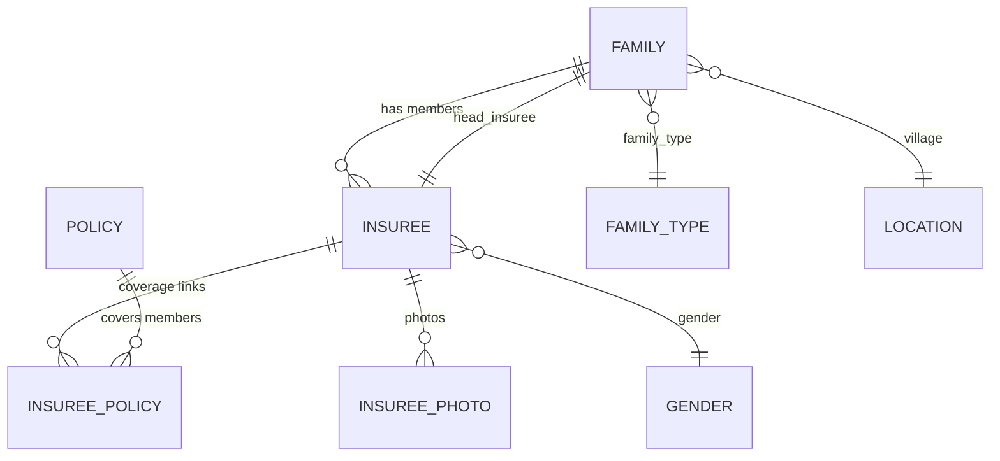
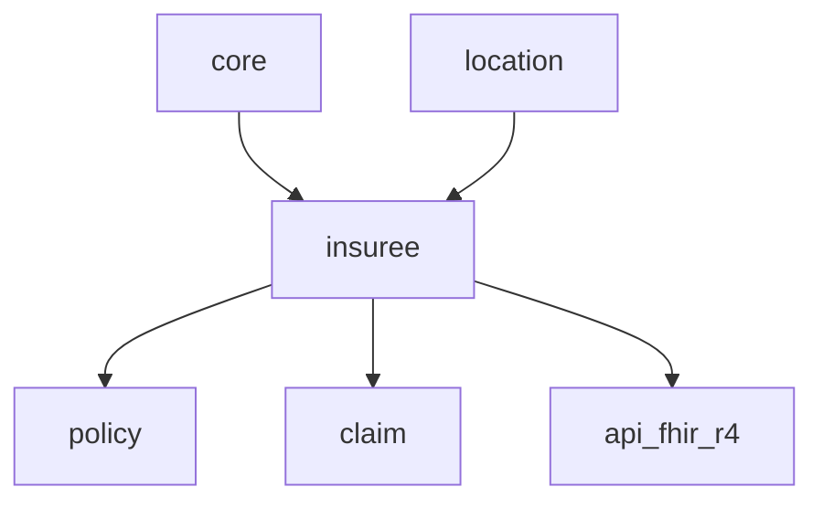
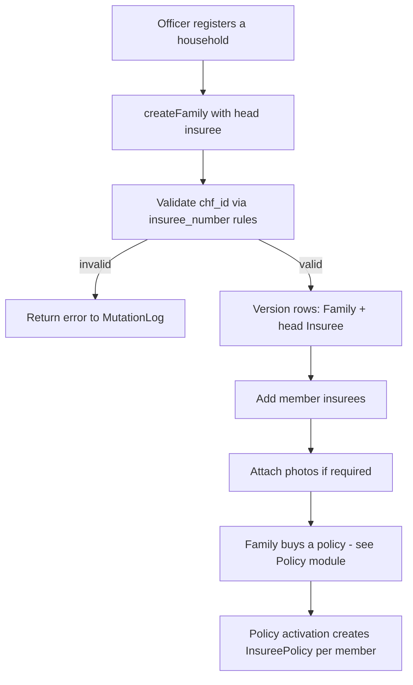

# Insuree — Classic Beneficiaries and Households

`openimis-be-insuree_py` is where the platform's oldest and most central business
concept lives: **the insured person and their household**. It is a direct
descendant of legacy IMIS, and it wears that heritage openly — its tables are
still `tblInsuree` and `tblFamilies`, with camelCase columns from the Microsoft
SQL Server era.

## Learning objectives

- Model a household with `Family`, its `head_insuree`, and member `Insuree` rows.
- Explain the `Insuree` ↔ `Family` ↔ `InsureePolicy` relationships.
- Read the legacy `tblInsuree` / `tblFamilies` schema and know why the columns
  look the way they do.
- Enrol an insuree and understand where coverage ([`policy`](policy.md)) takes
  over.
- Locate the reference tables (`Gender`, `Relation`, `FamilyType`).

## Prerequisites

- [Core](core.md) — `VersionedModel`, temporal history, `OpenIMISMutation`.
- [Modules overview](index.md) — where beneficiaries sit in the domain flow.
- [Database & Legacy Heritage](../database/index.md) — the `tbl` prefix story.

---

## Purpose

The insuree module answers **"who is this person, and which household do they
belong to?"** It owns:

- The **person** (`Insuree`) with identity number (`chf_id`), demographics and
  status.
- The **household** (`Family`), which is the unit that actually holds a
  [policy](policy.md) — coverage attaches to the family, members inherit it.
- **Enrolment** — creating/updating families and members, photos, and the join to
  policies (`InsureePolicy`).
- The small **reference tables** (gender, relation, family type) that the rest of
  the domain reads.

!!! info "Did you know? The household is the unit of coverage"
    In classic openIMIS a **policy is bought by a `Family`, not an individual**.
    Each member then gets an `InsureePolicy` row linking them to that policy for a
    validity window. This household-centric design is exactly what the newer
    [`individual`](individual.md) registry generalises away from.

---

## Key models

| Model | Key fields | Legacy table |
| --- | --- | --- |
| `Insuree` | `uuid`, `chf_id` (insurance number), `last_name`, `other_names`, `dob`, `gender` (FK), `status`, `family` (FK), `head` (bool), `card_issued`, `json_ext` | `tblInsuree` |
| `Family` | `uuid`, `head_insuree` (FK → Insuree), `location` (FK), `family_type` (FK), `address`, `poverty`, `confirmation_no`, `json_ext` | `tblFamilies` |
| `InsureePolicy` | `insuree` (FK), `policy` (FK), `enrollment_date`, `start_date`, `effective_date`, `expiry_date` | `tblInsureePolicy` |
| `InsureePhoto` | `uuid`, `insuree` (FK), `photo`/`filename`/`folder`, `date` | `tblPhotos` |
| `Gender` | `code` (PK, e.g. `M`/`F`), `gender`, `sort_order` | `tblGender` |
| `Relation` | `id`, `relation`, `sort_order` | `tblRelations` |
| `FamilyType` | `code` (PK), `type`, `sort_order` | `tblFamilyTypes` |

All the "real" entities (`Insuree`, `Family`, `InsureePolicy`, `InsureePhoto`)
extend [`VersionedModel`](core.md#key-models) — so they carry
`validity_from` / `validity_to` / `legacy_id` and follow the "never overwrite,
never hard-delete" rule. `Insuree` and `Family` also mix in an `ExtendableModel`
for `json_ext`.



!!! warning "The head insuree is a chicken-and-egg"
    `Family.head_insuree` points at an `Insuree`, but every `Insuree.family`
    points back at a `Family`. Creating a household means creating the family and
    its head together in one service call — do not try to create the head insuree
    before its family exists in isolation.

---

## Services

Domain logic lives in `insuree/services.py`, not in the GraphQL resolvers.

| Service | Responsibility |
| --- | --- |
| `FamilyService` (create/update/delete) | Create a household with its head member; version rows on edit. |
| `InsureeService` (create/update/delete) | Add/edit a member; validate `chf_id`; attach photo. |
| `validate_insuree_number` | Apply the configurable insurance-number rules (length, modulo checksum). |
| `InsureePolicyService` / `create_insuree_policy` | Materialise `InsureePolicy` rows when a family's policy activates. |
| Reset / family transfer helpers | Move an insuree between families, reset head, etc. |

---

## GraphQL

The module's `schema.py` exposes queries and `OpenIMISMutation` subclasses using
the [core helpers](core.md#graphql).

### Queries

| Query | Returns |
| --- | --- |
| `insurees` | Filtered, paginated `Insuree` connection. |
| `families` | Filtered, paginated `Family` connection. |
| `insureePolicies` / `policiesByInsuree` | Coverage links for a person. |
| `insureeGenders`, `insureeRelations`, `familyTypes` | Reference lists. |

### Mutations

| Mutation | Effect |
| --- | --- |
| `createInsuree` / `updateInsuree` / `deleteInsuree` | Manage members. |
| `createFamily` / `updateFamily` / `deleteFamily` | Manage households. |
| `removeInsurees` / `setInsureeFamilyHead` | Membership changes. |

```graphql
query {
  families(location_Uuid: "…", first: 5) {
    totalCount
    edges { node {
      uuid poverty
      headInsuree { chfId lastName otherNames }
      insurees { edges { node { chfId dob } } }
    } }
  }
}
```

Permissions are integer codes from `InsureeConfig` — e.g.
`gql_query_insurees_perms = ["101101"]` — checked with `user.has_perms(...)`.

---

## Dependencies



- **Needs:** [`core`](core.md) (base models, mutations, user), `location`
  (a family lives in a village/district).
- **Needed by:** [`policy`](policy.md) (a policy covers a family),
  `claim` (a claim is for an insuree), `contribution`, and `api_fhir_r4`
  (`Insuree` → FHIR `Patient`).

---

## Signals

- Standard Django `post_save` signals maintain derived data and photo files.
- Service methods are wrapped with [core service signals](core.md#signals) so
  other modules react to enrolment — e.g. `api_fhir_r4` mapping an `Insuree` to a
  FHIR `Patient`, or a validation module checking the insurance number.
- Insuree/family creation feeds the policy activation path that produces
  `InsureePolicy` rows.

---

## Business workflow — enrolment



The insuree module stops at the household. The moment coverage is involved,
control passes to [`policy`](policy.md), which creates the `InsureePolicy` links
that make each member "covered".

---

## Database tables

| Table | Model | Heritage |
| --- | --- | --- |
| `tblInsuree` | `Insuree` | Direct from legacy IMIS; camelCase columns, integer `InsureeID` + `uuid`. |
| `tblFamilies` | `Family` | Legacy household table. |
| `tblInsureePolicy` | `InsureePolicy` | Legacy per-member coverage link. |
| `tblPhotos` | `InsureePhoto` | Photo metadata; files on disk under the configured photos path. |
| `tblGender`, `tblRelations`, `tblFamilyTypes` | reference models | Small lookup tables seeded at install. |

!!! info "Did you know? Reading the legacy schema"
    Columns like `InsureeID`, `CHFID`, `LastName`, `DOB`, `ValidityFrom` are the
    original MSSQL names carried into PostgreSQL via `db_column=`. Django model
    field names are snake_case (`chf_id`, `last_name`), but the physical columns
    keep their 2010-era casing. See [Database heritage](../database/index.md).

---

## Configuration

Notable `InsureeConfig.DEFAULT_CFG` keys *(see
`openimis-be-insuree_py/insuree/apps.py`)*:

| Key | Default | Meaning |
| --- | --- | --- |
| `gql_query_insurees_perms` | `["101101"]` | Permission to list insurees. |
| `insuree_number_validator` | `None` | Optional custom callable for `chf_id` validation. |
| `insuree_number_max_length` / `_min_length` | `None` | Length constraints on the insurance number. |
| `insuree_number_modulo_root` | `None` | Checksum modulo base. |
| `insuree_photos_root_path` | `"./images/insurees"` | Where photo files are stored (env-overridable). |
| `is_insuree_photo_required` | `False` | Whether a photo is mandatory to enrol. |
| `renewal_photo_age_adult` / `_child` | `60` / `12` (months) | When a fresh photo is required at renewal. |
| `excluded_insuree_chfids` | `['999999999']` | Placeholder numbers to ignore. |
| `insuree_as_worker` | `False` | Treat insuree as a worker (for social-protection blends). |

---

## Extension points

| Seam | Use |
| --- | --- |
| `insuree_number_validator` | Plug a country-specific insurance-number rule (length + checksum). |
| `json_ext` on `Insuree`/`Family` | Add country fields without a migration. |
| Service signals | React to enrolment (FHIR export, custom validation, notifications). |
| `ModuleConfiguration` | Reconfigure photo rules, permissions, etc. per deployment. |

---

## Common mistakes

!!! danger "Treating the insuree as the coverage unit"
    Coverage attaches to the **`Family`**; members get `InsureePolicy` links.
    Looking for a policy directly on an `Insuree` misses the model.

!!! danger "Ignoring validity when counting members"
    `family.insurees` includes historical versions unless you filter
    `validity_to__isnull=True`. Prefer the module's managers or GraphQL.

!!! warning "Hardcoding gender codes"
    `Gender` is a reference table (`M`, `F`, plus deployment-specific values). Do
    not assume a fixed set.

---

## Hands-on lab

1. In `openimis-be-insuree_py/insuree/models.py`, list every field on `Insuree`
   and mark which come from `VersionedModel` vs. the model itself.
2. Run the `families` GraphQL query above against a dev instance and inspect
   `totalCount` vs. `edges` length.
3. Set `is_insuree_photo_required = True` in a local `ModuleConfiguration` and
   observe the enrolment mutation rejecting a photo-less insuree.

## Exercises

- **E1.** Draw the ER diagram for a 4-member family and its policy links.
- **E2.** Write a `chf_id` validator (modulo-11 checksum) and describe where to
  register it via `insuree_number_validator`.
- **E3.** Explain what happens to `tblInsuree` rows when an insuree is edited
  twice, in terms of `validity_from`/`validity_to`/`legacy_id`.

## Knowledge check

??? question "Q1: Which entity actually holds a policy — the insuree or the family? (click for answer)"
    The `Family`. Members receive `InsureePolicy` links when the family's policy
    activates.

??? question "Q2: What are the legacy table names for insuree and family? (click for answer)"
    `tblInsuree` and `tblFamilies` — carried over from legacy IMIS on MSSQL.

??? question "Q3: How do you validate a country-specific insurance number without editing the module? (click for answer)"
    Register a callable via the `insuree_number_validator` config key (with
    optional length/modulo settings).

??? question "Q4: Why do the physical columns look like `CHFID` and `ValidityFrom`? (click for answer)"
    They are the original MSSQL/IMIS column names preserved via Django
    `db_column=`; only the Python field names were modernised to snake_case.

## Repository references

| Repository | Directory / File | Why it matters |
| --- | --- | --- |
| `openimis-be-insuree_py` | `insuree/models.py` | `Insuree`, `Family`, `InsureePolicy`, `InsureePhoto`, reference models. |
| `openimis-be-insuree_py` | `insuree/services.py` | Enrolment services and number validation. |
| `openimis-be-insuree_py` | `insuree/schema.py`, `insuree/gql_mutations/` | Queries and `OpenIMISMutation` subclasses. |
| `openimis-be-insuree_py` | `insuree/apps.py` | `InsureeConfig.DEFAULT_CFG` and permission codes. |

## Further reading

- Insuree repo: <https://github.com/openimis/openimis-be-insuree_py>
- Compare with the generic registry: [Individual & Social Protection](individual.md)
- Coverage that consumes families: [Policy](policy.md)
