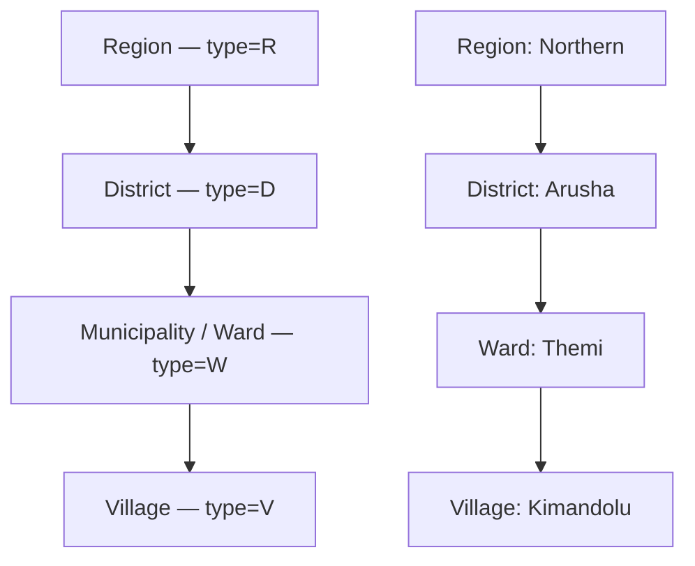
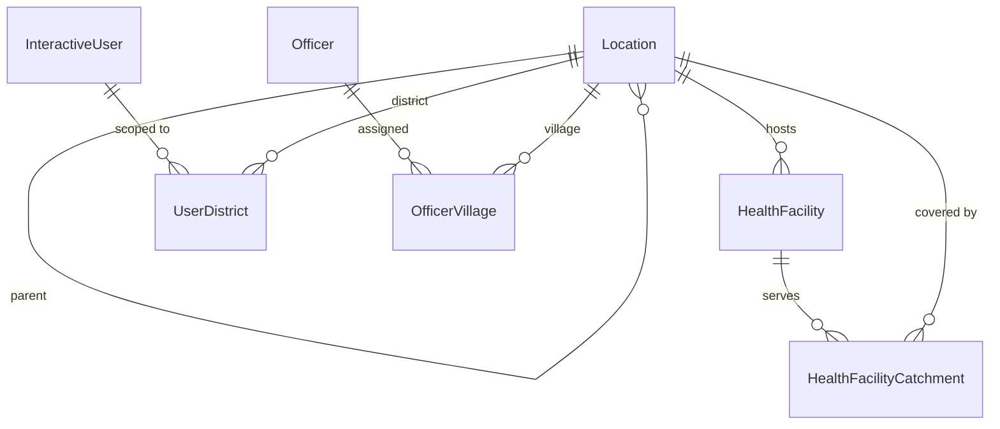
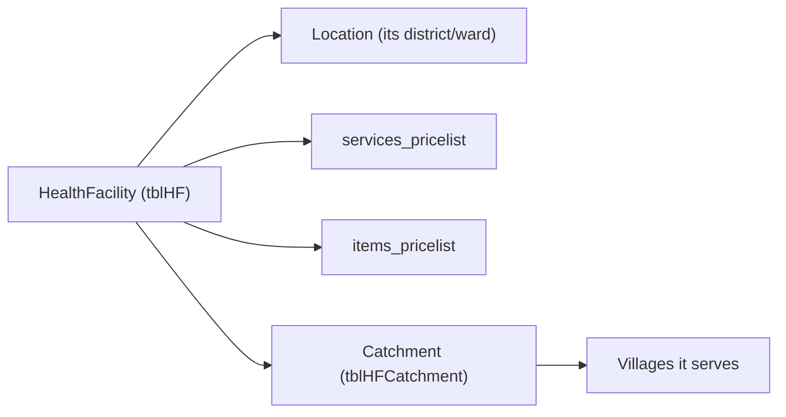
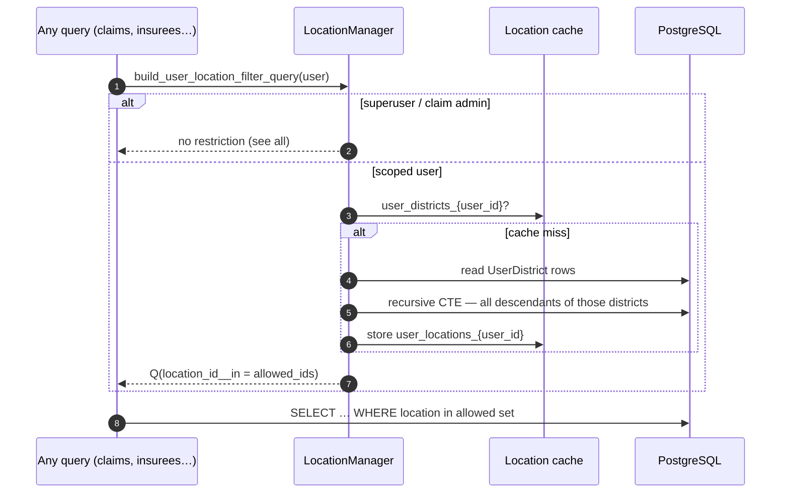
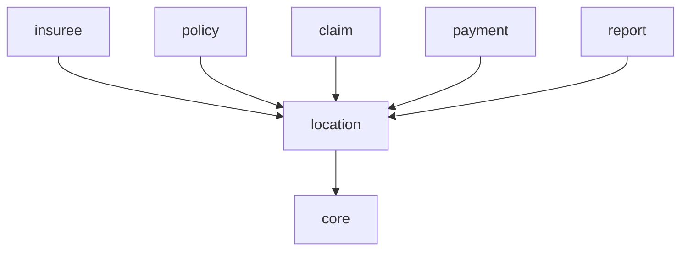

# Location & Health Facility

Almost everything in openIMIS is anchored to a **place**. An insuree lives in a
village; a health facility sits in a district; a scheme officer is allowed to see
only the regions assigned to them. The **location** module
(`openimis-be-location_py`) provides that geographic backbone: a self-referential
**administrative hierarchy**, the **health facilities** attached to it, and the
**user–location access scoping** that decides who can see which data.

!!! abstract "Learning objectives"
    By the end of this chapter you will be able to:

    - Describe the `Location` hierarchy (Region → District → Municipality/Ward →
      Village) and how it is stored as a single self-referential table.
    - Explain what a `HealthFacility` is and how it links to its price lists and
      catchment.
    - Understand **user–location scoping**: how `UserDistrict` and
      `OfficerVillage` restrict which locations a user can act on.
    - Locate the models, managers and query filters that enforce scoping in
      `openimis-be-location_py`.

!!! note "Prerequisites"
    - [The Core module](../modules/core.md) — `VersionedModel`, the custom
      `User` / `InteractiveUser`, and integer rights.
    - [Getting Started terminology](../getting-started/terminology.md) — the
      words *region*, *district*, *catchment*.

---

## Purpose

The location module answers three questions the rest of the platform keeps
asking:

1. **Where is this?** — a normalised administrative tree every entity can point
   at (an insuree's village, a facility's district).
2. **Which facilities serve here?** — `HealthFacility` records, their care type,
   legal form, level, and the price lists they bill under.
3. **Who is allowed to see this?** — data-access scoping so a district officer
   cannot read another district's insurees or claims.

It is **foundational reference data**: loaded early, changed rarely, depended on
by [insuree](../modules/insuree.md), [policy](../modules/policy.md),
[claim](../modules/claim.md) and reporting.

---

## The location hierarchy

A single table, `tblLocations`, holds every administrative unit at every level. A
`type` character says what level a row is, and a `parent` self-foreign-key
threads them into a tree.



| Type code | Level | Typical role |
| --- | --- | --- |
| `R` | Region | Top-level administrative division. |
| `D` | District | The scoping unit most user permissions are granted at. |
| `W` | Municipality / Ward | Sub-district grouping. |
| `V` | Village | Where an insuree/family actually lives. |

!!! info "Did you know?"
    The four levels are a **convention**, not a hard schema constraint — the
    hierarchy is just parent pointers, and deployments relabel the levels to match
    their country's administrative geography. What is fixed is the *shape*
    (a strict tree) and the type codes `R/D/W/V`. Always confirm a deployment's
    labelling against its seed data rather than assuming "level 3 = ward".

### Why one self-referential table?

Storing every level in `tblLocations` (rather than four separate tables) means:

- **Uniform queries.** "Give me everything under this node" is one recursive walk,
  regardless of level.
- **Reparenting is cheap.** Moving a village to a new ward is a single
  `parent` update.
- **Recursive scoping.** The access filter can climb or descend the tree with a
  Common Table Expression (CTE) instead of joining four tables.

The trade-off is that the table mixes levels, so *every* query that means "all
districts" must filter `type='D'`.

---

## Key models

From `openimis-be-location_py/location/models.py`:

| Model | Table | Purpose | Notable fields |
| --- | --- | --- | --- |
| `Location` | `tblLocations` | One administrative unit at any level | `code`, `name`, `type` (`R/D/W/V`), `parent` (self FK), `male_population`, `female_population`, `other_population`, `families`, `uuid` |
| `HealthFacility` | `tblHF` | A clinic/hospital that delivers care and files claims | `code`, `name`, `acc_code`, `legal_form`, `level`, `sub_level`, `location` (FK), `care_type`, `services_pricelist`, `items_pricelist`, `status`, `offline`, `contract_start_date`, `contract_end_date` |
| `UserDistrict` | `tblUsersDistricts` | Grants an `InteractiveUser` access to a district | `user`, `location` (a `type='D'` row), `audit_user_id` |
| `OfficerVillage` | `tblOfficerVillages` | Assigns an enrolment officer to villages | `officer`, `location` (a `type='V'` row), `audit_user_id` |
| `HealthFacilityCatchment` | `tblHFCatchment` | Which locations a facility serves (population catchment %) | `health_facility`, `location`, `catchment` |
| `HealthFacilityLegalForm` | `tblLegalForms` | Reference list (government, private, NGO…) | `code`, `legal_form` |
| `HealthFacilitySubLevel` | `tblHFSublevel` | Reference list of facility sub-levels | `code`, `health_facility_sub_level` |



!!! info "Did you know?"
    A `HealthFacility` carries **its own** `services_pricelist` and
    `items_pricelist`. That is how two hospitals in the same district can be paid
    different unit prices for the identical procedure — the facility's price list
    overrides the catalogue price during claim [valuation](../modules/claim.md).
    See [Medical & Product](../modules/medical.md).

---

## Health facilities & catchment

A `HealthFacility` is where the platform's money-out story begins: it delivers
services, files [claims](../modules/claim.md), and gets paid. Key attributes:

- **`care_type`** — out-patient (`O`), in-patient (`I`), or both (`B`). Claims
  and coverage checks respect this: an out-patient-only facility cannot bill an
  in-patient line.
- **`level` / `sub_level`** — dispensary vs. health-centre vs. hospital, driving
  which products and prices apply.
- **`status`** — `AC` active, `IN` inactive, `DE` delisted, `ID` idle. Only
  active facilities can file claims.
- **Catchment** — `HealthFacilityCatchment` records the percentage of a
  location's population the facility is responsible for. Capitation
  [payment](../modules/payment.md) uses catchment to distribute per-head amounts.



---

## User–location access scoping

This is the module's least obvious but most important job. openIMIS is a
**multi-tenant-by-geography** system: a district health officer must see only
their district's insurees, policies and claims. Scoping is enforced at the
**query** layer, not just the UI.

Two grant tables express access:

- **`UserDistrict`** — links an `InteractiveUser` to one or more districts
  (`type='D'` locations). This is the primary scoping grant for scheme staff.
- **`OfficerVillage`** — links an enrolment `Officer` to villages, used for
  field enrolment workflows.

A user's **effective set of locations** is the districts they are granted **plus
everything beneath them** in the tree (the wards and villages under those
districts). That descent is computed recursively.



Mechanics you will meet in the source (`location/models.py`,
`LocationManager`):

- **`LocationManager.get_allowed_ids(user)`** — resolves the permitted location
  ids from `UserDistrict` (with officer/village fallbacks). **Superusers and
  claim admins bypass** all restriction.
- **`allowed(...)`** — uses a recursive **CTE** to pull child locations, and, in
  non-strict mode, conditionally includes parents.
- **`build_user_location_filter_query(user, strict=…)`** — returns a Django `Q`
  object callers `.filter(...)` their querysets with, so scoping is applied
  consistently everywhere.
- **Caching & invalidation** — results are cached under keys like
  `user_locations_{user_id}` and `user_districts_{user_id}`; `post_save` /
  `post_delete` signals call `free_cache_for_user()` to invalidate when grants or
  the tree change.

```python
# Illustrative — how a downstream module scopes its queryset to the caller.
# See openimis-be-location_py/location/models.py (LocationManager).
def scoped_claims(user):
    loc_filter = Location.objects.build_user_location_filter_query(
        user._u, prefix="health_facility__location"
    )
    return Claim.objects.filter(loc_filter)
```

!!! danger "Common mistake"
    Do **not** enforce location scoping only in the frontend. The React UI hides
    out-of-scope data, but the authoritative filter must be applied on the
    backend queryset via `build_user_location_filter_query`. A GraphQL query hand-
    written by a user with a valid token will otherwise return data outside their
    district. Scoping is a **backend** concern.

!!! warning "Cache staleness after re-assigning a user"
    Because allowed-location sets are cached per user, moving a user to a new
    district or reparenting a location must invalidate the cache. The module wires
    `post_save`/`post_delete` signals to `free_cache_for_user()` for exactly this
    reason — if you bulk-load location changes with `bulk_create` (which **skips**
    signals), clear the cache yourself.

??? note "Deep dive: strict vs. non-strict mode"
    Some operations should see a location **and its ancestors** (e.g. a report
    that rolls a village figure up to its region), while others must be confined
    strictly to descendants (e.g. "insurees I may edit"). The `strict` flag on the
    filter builder switches between "descendants only" and "descendants plus
    parents". Choosing the wrong mode is a subtle security bug: non-strict where
    you meant strict can widen a user's visible set upward. When in doubt for a
    write path, use **strict**.

---

## Services

Location's logic is comparatively light — most of it lives in the manager and
validation helpers rather than a large `services.py`:

| Service / helper | Responsibility |
| --- | --- |
| `LocationManager` (custom manager on `Location`) | Cached hierarchy access; `get_allowed_ids`, `allowed`, `build_user_location_filter_query`. |
| `cache_location_graph()` | Builds and caches the full parent/child graph for fast traversal. |
| `free_cache_for_user()` / cache-invalidation helpers | Drop stale per-user allowed-location sets. |
| `HealthFacility` services / validations | Create/update facilities, validate `code` uniqueness, contract dates and status transitions. |
| `LocationService` (create/update) | CRUD for locations with reparenting and versioning. |

---

## GraphQL

Location exposes its tree and facilities over [GraphQL](../graphql/index.md)
(`location/schema.py`, `location/gql_queries.py`). Queries are commonly used to
populate cascading pickers (region → district → ward → village) in the UI.

=== "Walk the tree"

    ```graphql
    query {
      locations(type: "D", parent_Uuid: "…region-uuid…") {
        edges { node { uuid code name type parent { code } } }
      }
    }
    ```

=== "Facilities in scope"

    ```graphql
    query {
      healthFacilities(first: 20) {
        totalCount
        edges {
          node {
            uuid code name careType status
            location { code name }
            servicesPricelist { name }
            itemsPricelist { name }
          }
        }
      }
    }
    ```

Because the resolvers apply `build_user_location_filter_query`, these queries
**automatically** return only what the authenticated user is scoped to see — the
scoping is not something the client opts into.

Mutations (`createLocation`, `updateLocation`, `moveLocation`,
`createHealthFacility`, …) follow the async `OpenIMISMutation` pattern and are
gated by integer rights from `location/apps.py`.

---

## Dependencies



| Relationship | Why |
| --- | --- |
| location → [core](../modules/core.md) | `VersionedModel`, `User`/`InteractiveUser`, caching utilities. |
| [insuree](../modules/insuree.md) → location | Families/insurees live in a village. |
| [policy](../modules/policy.md) → location | Enrolment happens within a scoped area. |
| [claim](../modules/claim.md) → location | A claim is filed by a `HealthFacility` in a location; scoping decides visibility. |
| [payment](../modules/payment.md) → location | Capitation distributes by catchment. |

---

## Signals

- **`post_save` / `post_delete` on `Location`, `UserDistrict`, `OfficerVillage`**
  → invalidate the per-user allowed-location cache (`free_cache_for_user`) and
  rebuild the location graph cache. This keeps scoping correct after grants or
  the tree change.
- Location participates in core's **service-signal** seam so other modules can
  react to facility creation/updates (e.g. provisioning a price list).

---

## Database tables

| Table | Model | Notes |
| --- | --- | --- |
| `tblLocations` | `Location` | Self-referential tree; filter `type` for a level. Versioned. |
| `tblHF` | `HealthFacility` | Facilities, their price-list FKs, care type, status. |
| `tblUsersDistricts` | `UserDistrict` | Primary user→district scoping grant. |
| `tblOfficerVillages` | `OfficerVillage` | Enrolment officer→village assignment. |
| `tblHFCatchment` | `HealthFacilityCatchment` | Facility population coverage. |
| `tblLegalForms` | `HealthFacilityLegalForm` | Reference list. |
| `tblHFSublevel` | `HealthFacilitySubLevel` | Reference list. |

!!! danger "Common mistake"
    `tblLocations` mixes all four levels. A query for "all districts" that forgets
    `type='D'` will happily return regions, wards and villages too. Every
    level-specific query **must** filter on `type`.

---

## Configuration

Config comes from `location/apps.py` (`LocationConfig.DEFAULT_CFG`), overlaid by
the DB `ModuleConfiguration`:

| Config key (illustrative) | Controls |
| --- | --- |
| `location_types` | The ordered list of level codes (`["R","D","W","V"]`) and their labels. |
| `gql_query_locations_perms`, `gql_mutation_*_locations_perms` | Rights for reading/editing the tree. |
| `gql_query_health_facilities_perms`, `..._mutation_..._perms` | Rights for facility CRUD. |
| catchment / scoping strictness defaults | Default behaviour of the access filter. |

Confirm exact keys and level labelling against your deployment's
`location/apps.py` and seed data — labels are frequently localised.

---

## Extension points

1. **Reuse the scoping filter.** Any module with a location-bearing model should
   call `build_user_location_filter_query` rather than reinventing access control.
2. **Add facility attributes via `json_ext`** without a migration.
3. **Bind to facility service signals** to provision related data (price lists,
   contracts) when a facility is created.
4. **Relabel/extend levels** through configuration for a country's geography.

---

## Hands-on lab

!!! example "Lab: prove scoping works"
    1. Create a small tree: one Region → two Districts → a Ward and Village under
       each.
    2. Create a `HealthFacility` in District A.
    3. Create an `InteractiveUser` and grant them **District A only** via
       `UserDistrict`.
    4. As that user, run the `healthFacilities` and `claims` GraphQL queries.
       Confirm you see District A's facility but **not** District B's.
    5. Add a `UserDistrict` row for District B, re-run the query, and confirm the
       new district appears (proving cache invalidation fired on the grant).

---

## Knowledge check

??? question "Q1: Why are all four administrative levels stored in one table? (click for answer)"
    `tblLocations` is a **self-referential tree**: each row has a `type` (`R/D/W/V`)
    and a `parent` pointer. One table gives uniform recursive queries ("everything
    under this node"), cheap reparenting, and lets access scoping walk the tree
    with a single recursive CTE instead of joining four tables.

??? question "Q2: How does openIMIS stop a district officer from reading another district's claims? (click for answer)"
    Through **user–location scoping**. `UserDistrict` grants the user specific
    districts; `LocationManager.build_user_location_filter_query` turns those
    grants (plus all descendant locations) into a Django `Q` filter that
    downstream querysets apply on the **backend**. Superusers and claim admins
    bypass it.

??? question "Q3: You bulk-load 5,000 new villages with `bulk_create` and users report stale visible areas. Why? (click for answer)"
    `bulk_create` **skips Django signals**, so the `post_save` handler that calls
    `free_cache_for_user()` / rebuilds the location graph never fires. The cached
    allowed-location sets are stale. Invalidate the location caches manually after
    a bulk load.

??? question "Q4: Where can two facilities in the same district be paid different prices for the same service? (click for answer)"
    On the `HealthFacility` itself, via `services_pricelist` / `items_pricelist`.
    During claim valuation the facility's price list overrides the catalogue
    price, so identical services can carry facility-specific unit prices.

---

## Repository references

| Repository | Directory / File | Why it matters |
| --- | --- | --- |
| `openimis-be-location_py` | `location/models.py` | `Location`, `HealthFacility`, `UserDistrict`, `OfficerVillage`, `HealthFacilityCatchment`; the `LocationManager` scoping logic. |
| `openimis-be-location_py` | `location/schema.py`, `location/gql_queries.py` | GraphQL for the tree and facilities. |
| `openimis-be-location_py` | `location/apps.py` | Level configuration and permission codes. |
| `openimis-be-core_py` | `core/models.py` | `VersionedModel`, `User`/`InteractiveUser`, caching used by scoping. |

## Further reading

- Source: [openimis-be-location_py](https://github.com/openimis/openimis-be-location_py)
- [Claim](../modules/claim.md) — facilities file claims; scoping decides visibility.
- [Medical & Product](../modules/medical.md) — facility price lists.
- [Contribution & Payment](../modules/payment.md) — catchment-based capitation.
- Official docs: [openIMIS wiki](https://openimis.atlassian.net/wiki/).
