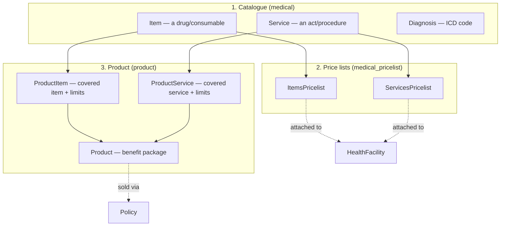
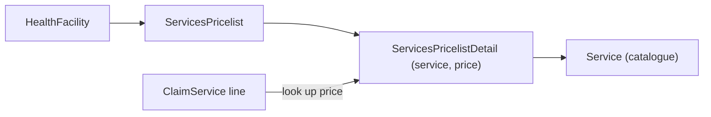
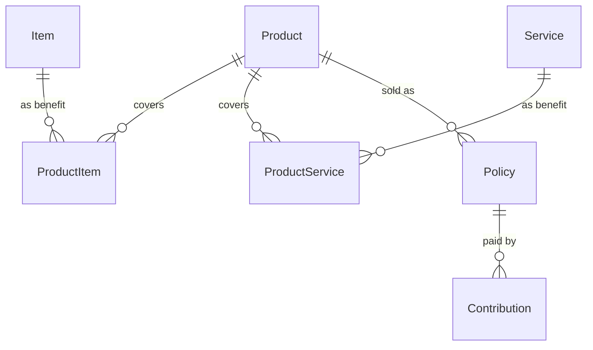
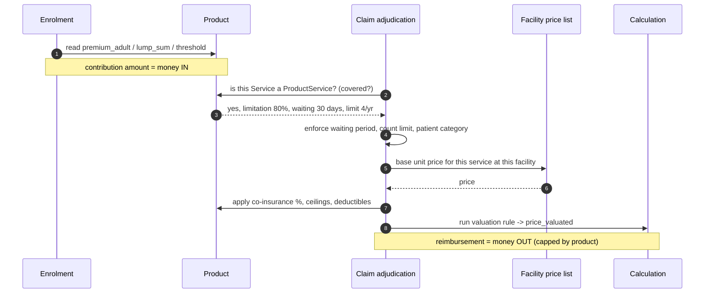
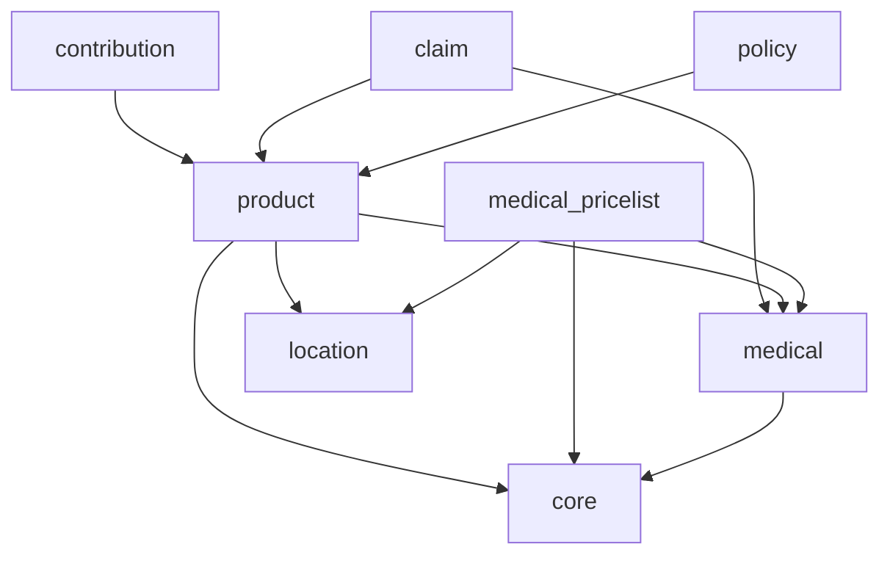

# Medical & Product

This chapter covers the three modules that together answer *"what can be paid for,
at what price, and under what insurance rules?"*:

- **`openimis-be-medical_py`** — the **catalogue**: every drug/consumable
  (`Item`) and every act/procedure (`Service`) the scheme knows about, plus the
  ICD `Diagnosis` list.
- **`openimis-be-medical_pricelist_py`** — **price lists**: named subsets of the
  catalogue with per-line prices, attached to health facilities and products.
- **`openimis-be-product_py`** — the **insurance product**: the benefit package
  that ties covered items/services to money — ceilings, deductibles, waiting
  periods, and contribution rates.

If [claim](../modules/claim.md) is where money flows out and
[contribution](../modules/payment.md) is where money flows in, **product is the
contract that governs both**.

!!! abstract "Learning objectives"
    By the end of this chapter you will be able to:

    - Distinguish the **catalogue** (`Item`/`Service`) from a **price list** from a
      **product**.
    - Explain how a `Product` defines coverage: which items/services, at what
      ceilings and deductibles, after what waiting periods, for what premium.
    - Trace how a facility's price list plus the product's limits feed claim
      [checking](../modules/claim.md) and valuation.
    - Locate the models and tables in `openimis-be-medical_py` and
      `openimis-be-product_py`.

!!! note "Prerequisites"
    - [The Core module](../modules/core.md) — `VersionedModel`, `json_ext`.
    - [Location & Health Facility](../modules/location.md) — facilities carry
      price-list references.
    - [Policy](../modules/policy.md) — a policy links an insuree to a product.

---

## Purpose & the three layers

Keep these three layers straight; conflating them is the classic beginner error.



| Layer | Question it answers | Owns |
| --- | --- | --- |
| **Catalogue** | *What things exist and what do they cost by default?* | `Item`, `Service`, `Diagnosis` with a base `price`. |
| **Price list** | *What does **this facility** charge for a subset of the catalogue?* | `ItemsPricelist`/`ServicesPricelist` and their detail rows. |
| **Product** | *What does **this insurance package** cover, up to what limits, for what premium?* | `Product`, `ProductItem`, `ProductService`. |

!!! info "Did you know?"
    The same physical drug can have **three** prices in play at once: its
    catalogue `price` (the default), a **facility** price-list price (what a given
    hospital charges), and an implicit **product** limit (the most the scheme will
    reimburse). Claim valuation reconciles all three. Understanding which wins is
    most of understanding openIMIS pricing.

---

## Medical: the catalogue

From `openimis-be-medical_py/medical/models.py`:

| Model | Table | Purpose | Notable fields |
| --- | --- | --- | --- |
| `Item` | `tblItems` | A drug or consumable | `code`, `name`, `type`, `package`, `price`, `quantity`, `care_type`, `frequency`, `patient_category`, `maximum_amount` |
| `Service` | `tblServices` | A medical act/procedure | `code`, `name`, `type`, `category`, `packagetype`, `level`, `price`, `care_type`, `frequency`, `patient_category`, `maximum_amount` |
| `Diagnosis` | `tblICDCodes` | An ICD diagnosis code | `code`, `name` |
| `ServiceItem` | `tblProductContainedPackage` | Items contained in a **package** service | link + quantity |
| `ServiceService` | `tblServiceContainedPackage` | Sub-services contained in a package service | link + quantity |

Key attributes worth internalising:

- **`care_type`** — out-patient (`O`), in-patient (`I`) or both (`B`). Must match
  the [health facility](../modules/location.md) and claim care type.
- **`patient_category`** — a bitmask of who may receive it (adult male/female,
  child, etc.), used during claim checking.
- **`frequency`** — how often it may be billed within a period; the checker
  enforces it.
- **`package` / `packagetype`** — a service can be a **package** that expands into
  contained items/services (`ServiceItem` / `ServiceService`), which is why a
  claim can spawn `ClaimServiceItem` sub-lines (see [Claim](../modules/claim.md)).

!!! info "Did you know?"
    ICD diagnoses live in `tblICDCodes` and are referenced by claims
    (`Claim.icd`, `icd_1..4`). openIMIS ships a standard ICD-10 seed, but schemes
    routinely trim it to the diagnoses their reporting cares about.

---

## Price lists

`openimis-be-medical_pricelist_py` defines **named price lists**: an
`ItemsPricelist` and a `ServicesPricelist`, each with **detail rows** giving a
per-line price for a subset of the catalogue.

| Model | Table (illustrative) | Purpose |
| --- | --- | --- |
| `ServicesPricelist` | `tblPLServices` | A named list of services with prices, valid for a location/date. |
| `ItemsPricelist` | `tblPLItems` | A named list of items with prices. |
| `ServicesPricelistDetail` | `tblPLServicesDetail` | One service + its price within a list. |
| `ItemsPricelistDetail` | `tblPLItemsDetail` | One item + its price within a list. |

A [`HealthFacility`](../modules/location.md) references one
`services_pricelist` and one `items_pricelist`. That is the mechanism by which
**the same service costs different amounts at different facilities**: valuation
looks up the price in the facility's list, falling back to the catalogue price.



!!! danger "Common mistake"
    Confusing a **price list** with a **product**. A price list says *how much a
    service costs at a facility*. A product says *whether the scheme covers it and
    up to what ceiling*. A service can be on a facility's price list yet **not**
    covered by a patient's product — the claim line is rejected as "not in
    product" even though it has a price.

---

## Product: where everything ties to money

The `Product` (`openimis-be-product_py/product/models.py`, table `tblProduct`) is
the **insurance benefit package**. A [policy](../modules/policy.md) sells a
product to an insuree/family; every coverage decision and every payout limit on a
claim ultimately reads from the product.

### The product model, grouped by what it controls

| Group | Representative fields | Meaning |
| --- | --- | --- |
| **Identity & validity** | `code`, `name`, `location`, `date_from`, `date_to`, `max_members` | Which scheme/area, valid window, family size cap. |
| **Contributions (money in)** | `premium_adult`, `premium_child`, `lump_sum`, `share_contribution`, `registration_fee`, `general_assembly_fee`, `threshold` | What members pay to enrol; `lump_sum` covers up to `threshold` members, extras add `premium_*`. |
| **Grace & waiting** | `grace_period_enrolment`, `grace_period_payment`, `grace_period_renewal` | How late payment/renewal may be; per-benefit waiting periods live on `ProductItem`/`ProductService`. |
| **Ceilings (money out, caps)** | `max_ceiling_policy`, `max_ceiling_policy_ip`, `max_ceiling_policy_op`, `max_insuree`, `max_op_insuree`, `max_ip_insuree`, `max_treatment`, `ceiling_type`, `ceiling_interpretation` | The most the scheme will pay — per policy, per insuree, per treatment, split by in/out-patient. |
| **Deductibles** | `ded_insuree`, `ded_op_insuree`, `ded_ip_insuree`, `ded_treatment`, `ded_policy` | Amounts the patient bears before the scheme pays. |
| **Utilisation limits** | `max_no_consultation`, `max_no_surgery`, `max_no_delivery`, `max_no_hospitalization`, `max_no_visits`, `max_amount_consultation`, `max_amount_surgery`, `max_amount_delivery`, `max_amount_hospitalization`, `max_amount_antenatal` | Count/amount caps per category. |
| **Discounts & installments** | `renewal_discount_perc`, `renewal_discount_period`, `enrolment_discount_perc`, `max_installments`, `recurrence` | Renewal incentives and payment scheduling. |

### Covered items/services

| Model | Table | Purpose | Notable fields |
| --- | --- | --- | --- |
| `ProductItem` | `tblProductItems` | Declares an `Item` covered by the product + its per-benefit limits | `product`, `item`, `limitation_type`, `limit_no_adult`, `limit_no_child`, `waiting_period_adult`, `waiting_period_child`, `ceiling_exclusion_*` |
| `ProductService` | `tblProductServices` | Same, for a `Service` | `product`, `service`, `limitation_type`, `limit_no_adult`, `limit_no_child`, `waiting_period_adult`, `waiting_period_child` |

The `limitation_type` (co-insurance percentage vs. fixed amount), the per-line
`limit_no_*`, and the `waiting_period_*` are exactly the values the
[claim checker](../modules/claim.md) enforces line by line.



!!! info "Did you know?"
    Product is the single richest model in openIMIS — dozens of ceiling and
    limit columns — because it encodes an entire insurance actuarial policy as
    data. That richness is deliberate: a country can define a completely new
    benefit package by inserting rows, **no code change**. It is the data-driven
    counterpart to the pluggable [calculation engine](../modules/calculation.md).

---

## How Product ties everything to money

Follow a single covered service through the system and every layer shows up:



- **Money in** — enrolment reads `premium_adult`, `premium_child`, `lump_sum`,
  `threshold`, fees to compute the [contribution](../modules/payment.md) that
  activates the policy.
- **Coverage gate** — `ProductItem`/`ProductService` decide whether a claim line
  is reimbursable at all.
- **Money out, capped** — `limitation_type`, `limit_no_*`, ceilings and
  deductibles bound the payout; the [calculation engine](../modules/calculation.md)
  computes the final `price_valuated`.

---

## Services

| Service (module) | Responsibility |
| --- | --- |
| `ItemService` / `ServiceService` (medical) | CRUD for catalogue entries with validity/versioning. |
| Pricelist services (medical_pricelist) | Build/clone price lists, add detail rows, attach to facilities. |
| `ProductService` / product services | Create/update products and their `ProductItem`/`ProductService` coverage rows; validate ceilings and premiums. |
| Product **duplication** helper | Clone an existing product (a new plan year) preserving coverage rows. |

!!! tip "Products are cloned, not hand-built, each year"
    A scheme rarely authors a product from scratch. It **duplicates** last year's
    product, tweaks premiums and ceilings, and sets new validity dates. The
    duplication service copies all `ProductItem`/`ProductService` rows so coverage
    carries forward.

---

## GraphQL

The catalogue, price lists and products are all exposed over
[GraphQL](../graphql/index.md) for the admin UI (`schema.py`/`gql_queries.py` in
each module).

=== "Catalogue"

    ```graphql
    query {
      medicalItems(first: 10, name_Icontains: "amox") {
        edges { node { uuid code name type price careType } }
      }
      medicalServices(first: 10, category: "S") {
        edges { node { uuid code name price careType } }
      }
    }
    ```

=== "Product & coverage"

    ```graphql
    query {
      products(first: 5, location_Uuid: "…") {
        edges {
          node {
            uuid code name premiumAdult lumpSum threshold
            maxCeilingPolicy gracePeriodEnrolment
            services { edges { node { service { code } limitationType limitNoAdult waitingPeriodAdult } } }
            items    { edges { node { item { code }    limitationType limitNoAdult } } }
          }
        }
      }
    }
    ```

Mutations (`createProduct`, `updateProduct`, `createItem`, …) use the async
`OpenIMISMutation` pattern and integer rights from each module's `apps.py`.

---

## Dependencies



| Relationship | Why |
| --- | --- |
| medical → [core](../modules/core.md) | Base models, versioning. |
| medical_pricelist → medical, [location](../modules/location.md) | Prices catalogue entries; lists attach to facilities. |
| product → medical, location | Coverage rows reference catalogue; product scoped to a location. |
| [policy](../modules/policy.md) → product | A policy sells a product. |
| [claim](../modules/claim.md) → product, medical | Coverage + limits + catalogue for adjudication. |
| [contribution](../modules/payment.md) → product | Premium amounts to activate a policy. |

---

## Signals

- Product and catalogue changes emit core **service signals** other modules bind
  to (e.g. re-caching coverage, invalidating derived data).
- `post_save` on `Product` / `ProductItem` / `ProductService` can trigger
  recomputation of denormalised coverage used by the claim checker.
- Price-list changes can invalidate cached facility pricing.

---

## Database tables

| Table | Model | Notes |
| --- | --- | --- |
| `tblItems` | `Item` | Catalogue drugs/consumables. |
| `tblServices` | `Service` | Catalogue acts/procedures. |
| `tblICDCodes` | `Diagnosis` | ICD diagnosis list. |
| `tblProductContainedPackage` / `tblServiceContainedPackage` | `ServiceItem` / `ServiceService` | Package expansion. |
| `tblPLServices` / `tblPLItems` (+ `…Detail`) | price lists | Named lists + per-line prices (verify names in `medical_pricelist`). |
| `tblProduct` | `Product` | The benefit package. |
| `tblProductItems` | `ProductItem` | Covered items + limits/waiting periods. |
| `tblProductServices` | `ProductService` | Covered services + limits/waiting periods. |

!!! danger "Common mistake"
    Deleting a catalogue `Item`/`Service` that is referenced by historical claims
    or products breaks referential integrity — and openIMIS's temporal model
    expects you to **close validity** (`validity_to`) rather than hard-delete.
    "Retire" catalogue entries; never `DELETE` them.

---

## Configuration

From each module's `apps.py` (`MedicalConfig`, `ProductConfig`, pricelist config),
overlaid by the DB `ModuleConfiguration`:

| Config key (illustrative) | Controls |
| --- | --- |
| `gql_query_medical_items_perms` / `..._services_perms` | Rights to read the catalogue. |
| `gql_query_products_perms`, `gql_mutation_*_products_perms` | Rights to read/edit products. |
| default `care_type` / `patient_category` handling | Validation defaults. |
| product duplication defaults | Behaviour when cloning a product year. |

---

## Extension points

1. **Add benefit dimensions via `json_ext`** on `Product` for scheme-specific
   rules without a migration.
2. **Register a [calculation rule](../modules/calculation.md)** to change how
   product limits translate into a payout (co-insurance, capitation).
3. **Extend the catalogue** with new item/service types and expose them over
   GraphQL from your own module.
4. **Custom price-list sources** — bind to price-list signals to sync prices from
   an external ERP.

---

## Hands-on lab

!!! example "Lab: build a minimal covered benefit"
    1. Create one `Item` (a drug) and one `Service` (a consultation) in the
       catalogue with base prices.
    2. Create a `ServicesPricelist` and `ItemsPricelist`, add detail rows for your
       new entries, and attach both to a [health facility](../modules/location.md).
    3. Create a `Product` with a modest `premium_adult`, a `max_ceiling_policy`,
       and a `ProductService`/`ProductItem` covering your two entries — set an 80%
       `limitation_type` and a 30-day `waiting_period_adult` on the service.
    4. Sell the product via a [policy](../modules/policy.md) and pay a
       [contribution](../modules/payment.md) to activate it.
    5. File a [claim](../modules/claim.md) for the service **before** 30 days and
       confirm it is rejected for waiting period; then after 30 days and confirm it
       values at 80% of the facility price, capped by the ceiling.

---

## Knowledge check

??? question "Q1: What is the difference between a price list and a product? (click for answer)"
    A **price list** says how much an item/service **costs** at a facility. A
    **product** says whether the scheme **covers** it and up to what
    ceiling/limit/waiting period. A line can be priced yet uncovered (rejected as
    "not in product"), or covered but priced differently at different facilities.

??? question "Q2: How can the same service cost different amounts at two hospitals? (click for answer)"
    Each `HealthFacility` references its own `services_pricelist`. Valuation reads
    the price from the facility's list (falling back to the catalogue `price`), so
    facility-specific prices apply to the identical `Service`.

??? question "Q3: Which product fields drive claim rejection during checking? (click for answer)"
    Coverage existence (`ProductService`/`ProductItem` present at all), plus
    `limitation_type`, `limit_no_adult`/`limit_no_child`, `waiting_period_*`, and
    the product ceilings/deductibles. The claim checker enforces these per line
    and sets a `rejection_reason`.

??? question "Q4: Why does a scheme duplicate a product each plan year instead of editing it? (click for answer)"
    Products are **versioned** and referenced by historical policies and claims.
    Editing in place would rewrite the terms of already-sold coverage. Duplicating
    clones all coverage rows, lets the scheme adjust premiums/ceilings, and sets a
    new validity window while the old product stays intact for existing policies.

---

## Repository references

| Repository | Directory / File | Why it matters |
| --- | --- | --- |
| `openimis-be-medical_py` | `medical/models.py` | `Item`, `Service`, `Diagnosis`, package models. |
| `openimis-be-medical_pricelist_py` | `pricelist/models.py` | `ServicesPricelist`/`ItemsPricelist` + detail rows. |
| `openimis-be-product_py` | `product/models.py` | `Product`, `ProductItem`, `ProductService` — ceilings, deductibles, waiting periods, premiums. |
| `openimis-be-product_py` | `product/apps.py` | Product permissions and defaults. |

## Further reading

- Source: [openimis-be-medical_py](https://github.com/openimis/openimis-be-medical_py),
  [openimis-be-product_py](https://github.com/openimis/openimis-be-product_py)
- [Claim](../modules/claim.md) — coverage and valuation in action.
- [Policy](../modules/policy.md) — selling a product.
- [Contribution & Payment](../modules/payment.md) — premiums that activate policies.
- [Calculation Rules](../modules/calculation.md) — turning limits into payouts.
- Official docs: [openIMIS wiki](https://openimis.atlassian.net/wiki/).
