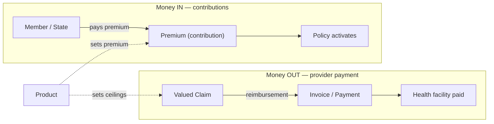
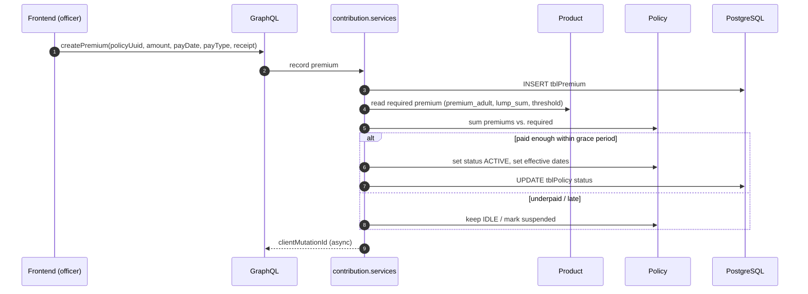
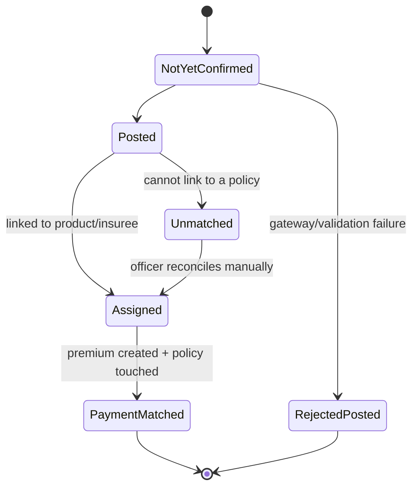
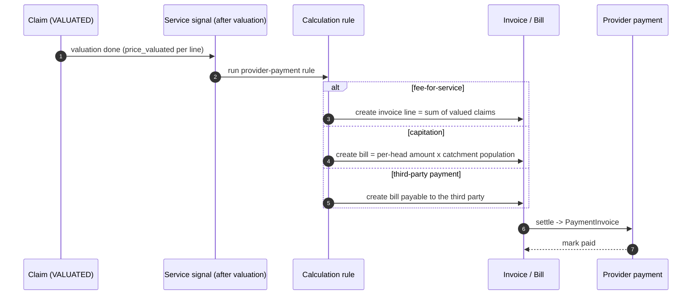
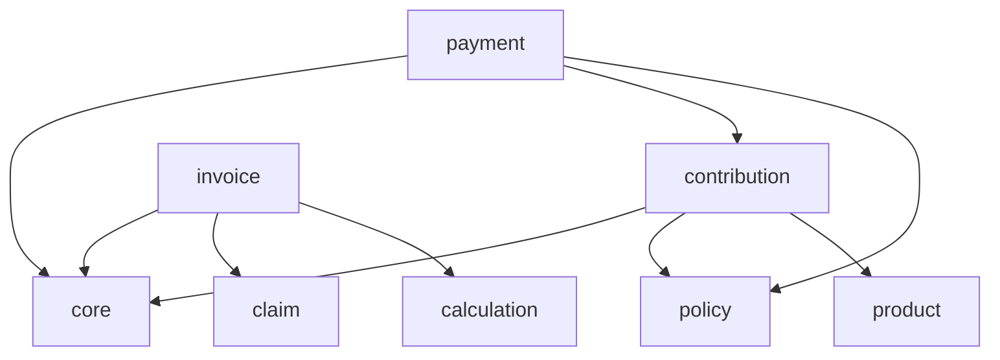

# Contribution & Payment

Money moves in two directions through a health-financing scheme, and openIMIS
keeps the two rigorously separate:

- **Money in** — members (or the state on their behalf) pay **contributions**
  (premiums) to enrol; recorded by **`openimis-be-contribution_py`** as
  `Premium` rows against a policy.
- **Money out** — the scheme reimburses providers for valued
  [claims](../modules/claim.md); tracked by **`openimis-be-payment_py`** and the
  **invoice** module.

This chapter covers both flows, the models that record them, and the crucial
distinction between them.

!!! abstract "Learning objectives"
    By the end of this chapter you will be able to:

    - Explain the difference between a **contribution/premium** (money in) and a
      **payment** (which openIMIS uses primarily for money movement records).
    - Trace **contribution → policy activation**: how paying a premium turns a
      policy active.
    - Trace **valued claim → provider payment/invoice**: how money-out is recorded.
    - Locate `Premium`, `Payment`, `PaymentDetail` and the invoice models.

!!! note "Prerequisites"
    - [The Core module](../modules/core.md) — `VersionedModel`, async mutations,
      service signals.
    - [Policy](../modules/policy.md) — a contribution is paid **against a policy**.
    - [Medical & Product](../modules/medical.md) — the product defines the premium.
    - [Claim](../modules/claim.md) — valued claims are what gets paid out.

---

## Purpose & the two flows



!!! danger "Common mistake"
    The word "payment" is overloaded, and mixing up the two flows is the single
    most common conceptual error here. A member paying their **premium** is a
    **contribution** (`openimis-be-contribution_py`, `Premium` / `tblPremium`).
    The scheme paying a **provider** is the money-out flow
    (`openimis-be-payment_py` + invoice). Keep "money in" and "money out" in
    separate mental columns.

---

## Contribution — money in

### Purpose

The contribution module records **premiums paid against policies**. A premium is
the act of a member (or a subsidising party) putting money into the scheme to buy
or renew coverage. Recording a valid premium is what **activates** a
[policy](../modules/policy.md).

### Key model

From `openimis-be-contribution_py/contribution/models.py`:

| Model | Table | Purpose | Notable fields |
| --- | --- | --- | --- |
| `Premium` | `tblPremium` | One contribution payment against a policy | `policy` (FK), `amount`, `pay_date`, `pay_type`, `receipt`, `is_photo_fee` |
| `PremiumMutation` | `contribution_PremiumMutation` | Links a premium to its `MutationLog` | `premium`, `mutation` |

Payment types (`Premium.PayTypeChoices`) are single characters:

| Constant | Value | Meaning |
| --- | --- | --- |
| `BANK_TRANSFER` | `B` | Bank transfer |
| `CASH` | `C` | Cash at a counter |
| `MOBILE` | `M` | Mobile money |
| `FUNDING` | `F` | Subsidised / third-party funding |

`Premium` extends core's `VersionedModel`, so premiums are temporal and audited
like everything else.

!!! info "Did you know?"
    `is_photo_fee` is a legacy but still-used flag: some schemes charge a small
    fee to capture the insuree's **photo** for their membership card, recorded as
    a premium-like line. It is a good example of domain-specific fields the .NET
    heritage left behind.

### Contribution → policy activation

Paying enough premium is not just bookkeeping — it changes the policy's state.



The activation logic reads the **required** contribution from the
[product](../modules/medical.md) (`premium_adult`, `premium_child`, `lump_sum`,
`threshold`, fees) and compares it against the sum of premiums recorded, honouring
the product's `grace_period_payment`. This coupling is why a premium is always
tied to a policy, never floating on its own.

!!! tip "Contribution valuation is a calculation rule"
    *How much* premium a policy requires can itself be a pluggable
    [calculation rule](../modules/calculation.md) (e.g. income-percentage
    contributions rather than flat premiums). The contribution module records the
    money; the calculation engine can decide the amount.

---

## Payment — money movement records

`openimis-be-payment_py` models **payment records and their reconciliation** —
originally built around collecting contributions through payment channels (e.g. a
mobile-money gateway sending a payment notification that must be matched to a
policy), and reused for reconciliation of money movements.

### Key models

From `openimis-be-payment_py/payment/models.py`:

| Model | Table | Purpose | Notable fields |
| --- | --- | --- | --- |
| `Payment` | `tblPayment` | A payment record to reconcile | `expected_amount`, `received_amount`, `officer_code`, `phone_number`, `request_date`, `received_date`, `status`, `transaction_no`, `receipt_no`, `payment_date`, `type_of_payment`, `transfer_fee`, `reconciliation_date` |
| `PaymentDetail` | `tblPaymentDetails` | A line linking a payment to a policy/premium | `payment` (FK), `product_code`, `insurance_number`, `policy_stage`, `amount`, `premium` (FK), `expected_amount` |
| `PaymentMutation` | `payment_PaymentMutation` | Links a payment to its `MutationLog` | `payment`, `mutation` |

Payment **status** is an integer with negatives for rejections:

| Constant | Value |
| --- | --- |
| `STATUS_REJECTEDPOSTED_3 / _2 / _1` | -3 / -2 / -1 |
| `STATUS_NOTYETCONFIRMED` | 1 |
| `STATUS_POSTED` | 2 |
| `STATUS_ASSIGNED` | 3 |
| `STATUS_UNMATCHED` | 4 |
| `STATUS_PAYMENTMATCHED` | 5 |



The `PaymentDetail.premium` foreign key is the seam where **payment** meets
**contribution**: once a gateway payment is matched, it creates the `Premium`
row that activates the policy.

!!! info "Did you know?"
    The `phone_number`, `transaction_no` and `date_last_sms` fields on `Payment`
    exist because openIMIS was an early adopter of **mobile-money enrolment**: a
    member pays by phone, the gateway posts a `Payment`, and openIMIS reconciles
    it to a policy — closing the loop by SMS. See
    [Integrations](../integrations/index.md).

---

## Invoice — modern money-out

The **invoice** module (`openimis-be-invoice_py`, package `invoice`) is the newer,
general-purpose billing/receipting layer. Where legacy `payment` grew out of
**collecting** contributions, invoice generalises **both** directions with a
consistent `Invoice` / `InvoiceLineItem` / `PaymentInvoice` / `Bill` model, and is
what modern provider-payment flows (fee-for-service, capitation, third-party
payment) write to.

| Model (invoice) | Purpose |
| --- | --- |
| `Invoice` / `InvoiceLineItem` | A bill and its lines (e.g. a facility's reimbursable claims for a period). |
| `Bill` / `BillItem` | The counterpart for amounts the scheme **owes** or **is owed**. |
| `PaymentInvoice` / `DetailPaymentInvoice` | Records a payment settling an invoice/bill. |

### Valued claim → provider payment



The claim module never calls invoice directly — it emits a **service signal**
after valuation, and the invoice/calculation modules bind to it (see
[Claim → Signals](../modules/claim.md) and
[Calculation](../modules/calculation.md)). That decoupling lets a deployment
choose its provider-payment mechanism, or reconcile out-of-band entirely.

---

## Services

| Service (module) | Responsibility |
| --- | --- |
| `contribution.services` — create/update `Premium` | Record a premium and trigger policy activation logic. |
| Policy activation helper (policy + contribution) | Compare paid vs. required premium against product + grace period; set policy status. |
| `payment.services` — payment matching | Reconcile an incoming `Payment` to a policy/product; create `PaymentDetail` and the resulting `Premium`. |
| `invoice.services` — invoice/bill generation & settlement | Build invoices/bills from valued claims or capitation runs; record `PaymentInvoice`. |

---

## GraphQL

All three modules expose async `OpenIMISMutation`-based mutations and connection
queries (see [GraphQL](../graphql/index.md)).

=== "Record a premium"

    ```graphql
    mutation {
      createPremium(input: {
        clientMutationId: "prm-1"
        policyUuid: "…"
        amount: "12000.00"
        payDate: "2026-07-22"
        payType: "M"          # mobile money
        receipt: "RCPT-0001"
      }) { clientMutationId internalId }
    }
    ```

=== "Query payments to reconcile"

    ```graphql
    query {
      payments(status: 4) {   # UNMATCHED
        edges { node { uuid receivedAmount phoneNumber transactionNo status } }
      }
    }
    ```

=== "Invoices"

    ```graphql
    query {
      invoice(first: 10) {
        edges { node { id code status amountTotal dateInvoice } }
      }
    }
    ```

---

## Dependencies



| Relationship | Why |
| --- | --- |
| contribution → [policy](../modules/policy.md), [product](../modules/medical.md) | A premium is paid against a policy; the product sets the required amount. |
| payment → contribution | A matched payment creates a `Premium`. |
| invoice → [claim](../modules/claim.md), [calculation](../modules/calculation.md) | Provider payment is generated from valued claims via a rule. |

---

## Signals

- **Premium `post_save`** → recompute policy status (activate/renew) — the
  contribution→activation trigger.
- **Payment matched** → emits a signal that creates the `Premium` and touches the
  policy.
- **Claim valuation (service signal)** → invoice/calculation modules bind *after*
  it to generate provider-payment invoices/bills. This is the money-out seam and
  is why claim does not import invoice.

---

## Database tables

| Table | Model | Notes |
| --- | --- | --- |
| `tblPremium` | `Premium` | Contribution against a policy. Money in. |
| `contribution_PremiumMutation` | `PremiumMutation` | Audit join. |
| `tblPayment` | `Payment` | Payment record / reconciliation. Integer status incl. negatives. |
| `tblPaymentDetails` | `PaymentDetail` | Links payment to policy/premium. |
| `payment_PaymentMutation` | `PaymentMutation` | Audit join. |
| invoice tables (`invoice_*`) | `Invoice`, `Bill`, `PaymentInvoice`, … | Modern billing/receipting. Money out (and general). |

---

## Configuration

From each module's `apps.py`, overlaid by DB `ModuleConfiguration`:

| Config key (illustrative) | Controls |
| --- | --- |
| `gql_mutation_create_premiums_perms` | Rights to record contributions. |
| `receipt_length` / receipt format | Premium/payment receipt formatting. |
| payment gateway settings | Matching thresholds, SMS templates, gateway keys. |
| invoice numbering & tax config | Invoice/bill code sequences and any tax handling. |

---

## Extension points

1. **Contribution valuation rule** — plug an income-based premium formula via
   [calculation](../modules/calculation.md) instead of flat premiums.
2. **Payment gateway adapter** — bind to payment signals to accept notifications
   from a new mobile-money or bank provider (see
   [Integrations](../integrations/index.md)).
3. **Provider-payment rule** — register a capitation or third-party-payment rule
   that binds to claim valuation and writes invoices/bills.
4. **`json_ext`** on premiums/invoices for scheme-specific attributes.

---

## Hands-on lab

!!! example "Lab: money in, then money out"
    1. With a [policy](../modules/policy.md) on a product whose `premium_adult` is,
       say, 12000, record a `createPremium` of the full amount with `payType: "C"`.
    2. Confirm the policy transitions to **active** with correct effective dates.
    3. Record a **partial** premium on a second policy and confirm it does **not**
       activate (underpaid).
    4. File and valuate a [claim](../modules/claim.md) at that facility.
    5. Inspect whether an invoice/bill line was generated for the provider, and
       explain in one sentence why claim did not need to import the invoice module.

---

## Knowledge check

??? question "Q1: A member pays their yearly premium by mobile money. Which module and model records it? (click for answer)"
    The **contribution** module: a `Premium` row (`tblPremium`) against their
    policy, with `pay_type = "M"`. If the money arrived via a gateway, a
    `Payment`/`PaymentDetail` may be reconciled first and then create the
    `Premium`.

??? question "Q2: What actually activates a policy? (click for answer)"
    Recording **sufficient premium** against it within the product's
    `grace_period_payment`. The contribution/policy activation logic compares the
    sum of premiums to the required amount (from the product) and flips the policy
    to active with effective dates.

??? question "Q3: Why does 'payment' have negative status codes? (click for answer)"
    `Payment` models reconciliation of incoming money, so it needs to represent
    **rejections** (`STATUS_REJECTEDPOSTED_1/_2/_3` = -1/-2/-3) distinctly from the
    positive progression `NotYetConfirmed(1) → Posted(2) → Assigned(3) →
    Unmatched(4) → PaymentMatched(5)`.

??? question "Q4: How does a valued claim become a provider payment without claim importing the invoice module? (click for answer)"
    Claim emits a **service signal** after valuation. The calculation/invoice
    modules bind to it and generate the appropriate invoice or bill
    (fee-for-service, capitation, or third-party payment). The coupling is via the
    signal seam, not a direct import.

---

## Repository references

| Repository | Directory / File | Why it matters |
| --- | --- | --- |
| `openimis-be-contribution_py` | `contribution/models.py` | `Premium`; pay-type choices. |
| `openimis-be-payment_py` | `payment/models.py` | `Payment`, `PaymentDetail`; status constants. |
| `openimis-be-invoice_py` | `invoice/models.py` | `Invoice`, `Bill`, `PaymentInvoice` — modern billing. |
| `openimis-be-product_py` | `product/models.py` | Premium amounts and grace periods that govern activation. |

## Further reading

- Source: [openimis-be-contribution_py](https://github.com/openimis/openimis-be-contribution_py),
  [openimis-be-payment_py](https://github.com/openimis/openimis-be-payment_py)
- [Policy](../modules/policy.md) — what a contribution activates.
- [Claim](../modules/claim.md) — the money-out source.
- [Calculation Rules](../modules/calculation.md) — contribution and provider-payment formulas.
- [Integrations](../integrations/index.md) — mobile-money gateways and SMS.
- Official docs: [openIMIS wiki](https://openimis.atlassian.net/wiki/).
