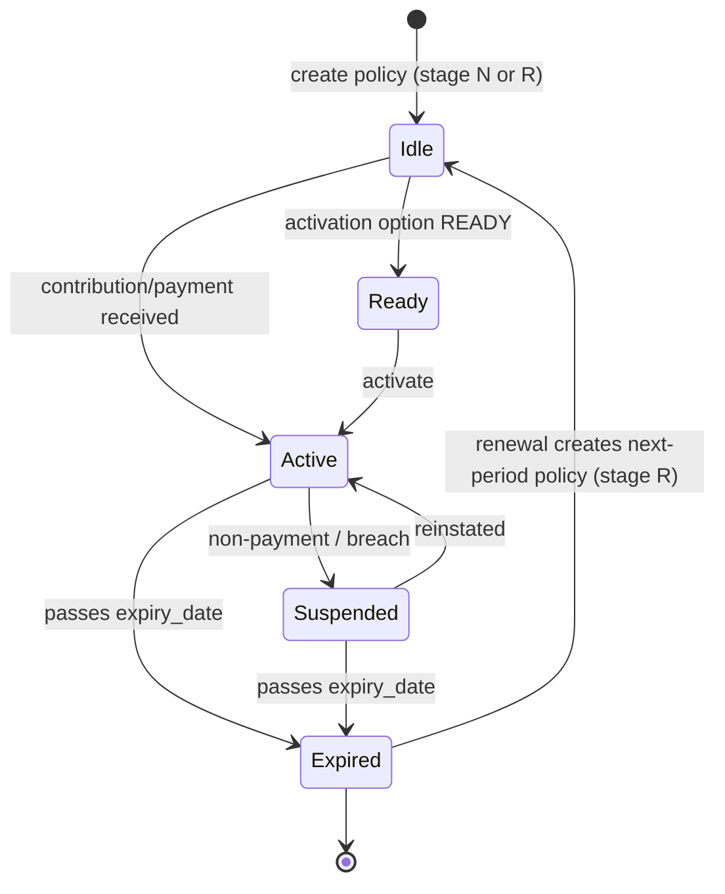
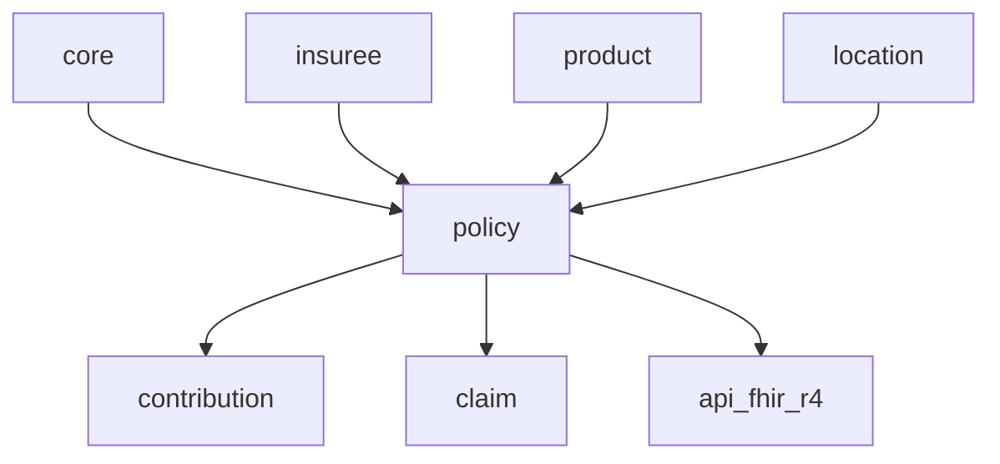
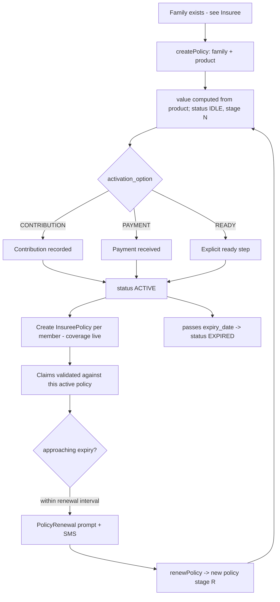

# Policy — Coverage That Links People to Products

`openimis-be-policy_py` owns the concept of **coverage**: the contract that says
"*this family, under this product, is covered for this period*". A `Policy` is the
hinge between the [beneficiary](insuree.md) world and the
[product/contribution/claim](index.md) world. Understanding its **states** and
**stages** is essential — almost every downstream rule (can this claim be paid? is
this contribution valid?) asks "what state is the policy in on the service date?"

## Learning objectives

- Explain what a `Policy` connects: `Family` → `Product`, over a coverage period.
- Read the numeric **status** flags (idle / active / suspended / expired / ready)
  and the **stage** codes (new / renewal).
- Trace the **activation** path and how `InsureePolicy` rows make members covered.
- Follow the **renewal** workflow driven by `PolicyRenewal`.
- Relate policy to [contribution](index.md) and `product`.

## Prerequisites

- [Core](core.md) — `VersionedModel`, temporal history, `OpenIMISMutation`.
- [Insuree](insuree.md) — `Family` and `InsureePolicy`.
- [Modules overview](index.md) — where coverage sits in the flow.

---

## Purpose

The policy module answers **"is this household covered, for what, and until
when?"** It owns:

- The **`Policy`** record: a `Family` enrolled in a `Product` for
  `[start_date, expiry_date]` at a computed `value`.
- The **coverage lifecycle**: idle → active → suspended/expired, across the
  new-vs-renewal stage.
- **`InsureePolicy`** materialisation — creating the per-member coverage links
  (owned physically by [insuree](insuree.md), driven by policy activation).
- The **renewal** workflow (`PolicyRenewal`): prompting, notifying and creating
  the next period's policy.
- **Eligibility** queries — is a given service/item covered for this insuree right
  now?

!!! info "Did you know? Coverage is per household, valued per product"
    A `Policy.family` FK plus a `Policy.product` FK is the whole idea. The product
    ([`product` module](index.md)) defines the price, benefit ceilings and
    covered services; the policy binds a specific family to it for a period and
    stores the computed `value`.

---

## Key models

| Model | Key fields | Legacy table |
| --- | --- | --- |
| `Policy` | `uuid`, `family` (FK), `product` (FK), `officer` (FK), `stage`, `status`, `value`, `enroll_date`, `start_date`, `effective_date`, `expiry_date`, `contribution_plan` (FK) | `tblPolicy` |
| `PolicyRenewal` | `uuid`, `policy` (FK), `insuree` (FK), `new_officer`, `new_product`, `renewal_prompt_date`, `renewal_date`, `phone_number`, `sms_status`, `response_status` | `tblPolicyRenewals` |
| `InsureePolicy` *(in [insuree](insuree.md))* | `insuree` (FK), `policy` (FK), `enrollment_date`, `start_date`, `effective_date`, `expiry_date` | `tblInsureePolicy` |

`Policy` and `PolicyRenewal` extend [`VersionedModel`](core.md#key-models): they
carry `validity_from`/`validity_to`/`legacy_id` and follow the "never
hard-delete" rule.

### Status flags (bit values)

`Policy.status` is a small integer using **bit values** *(see
`openimis-be-policy_py/policy/models.py`)*:

| Constant | Value | Meaning |
| --- | --- | --- |
| `STATUS_IDLE` | `1` | Created but not yet started (awaiting activation). |
| `STATUS_ACTIVE` | `2` | In force — members are covered. |
| `STATUS_SUSPENDED` | `4` | Temporarily not in force (e.g. non-payment). |
| `STATUS_EXPIRED` | `8` | Past `expiry_date`. |
| `STATUS_READY` | `16` | Ready to be activated (used by the "ready" activation option). |

### Stage codes

| Constant | Value | Meaning |
| --- | --- | --- |
| `STAGE_NEW` | `"N"` | First-time enrolment for this family/product. |
| `STAGE_RENEWED` | `"R"` | A renewal of a previous policy. |

---

## Policy state machine



!!! info "Did you know? Activation is configurable"
    *When* a policy becomes `ACTIVE` depends on `PolicyConfig.activation_option`:
    `1 = CONTRIBUTION` (active once a contribution is recorded), `2 = PAYMENT`
    (active once payment is received), `3 = READY` (active on an explicit ready
    step). Different countries run different rules.

---

## Services

Logic lives in `policy/services.py`.

| Service | Responsibility |
| --- | --- |
| `PolicyService` (create/update) | Create/version a policy; compute `value` from the product; set stage/status. |
| Activation logic | Transition `IDLE`/`READY` → `ACTIVE` per `activation_option`; create `InsureePolicy` rows. |
| `PolicyRenewalService` / renewal batch | Detect policies nearing expiry, create `PolicyRenewal` prompts, send SMS, create the renewed policy. |
| `ByInsureeService` / eligibility | Answer "is X covered for service Y today?" — reads product benefit ceilings and `InsureePolicy` windows. |
| `EligibilityService` | Compute remaining benefit ceilings for claims. |

---

## GraphQL

Standard [core helpers](core.md#graphql).

### Queries

| Query | Returns |
| --- | --- |
| `policies` | Filtered, paginated `Policy` connection. |
| `policiesByInsuree` / `policiesByFamily` | Coverage for a person / household. |
| `policyEligibility` / `policyEligibilityByInsuree` | Eligibility + remaining ceilings. |
| `policyOfficers` | Enrolment officers. |

### Mutations

| Mutation | Effect | Permission (default) |
| --- | --- | --- |
| `createPolicy` | New coverage | `["101202"]` |
| `updatePolicy` | Edit (versions the row) | `["101203"]` |
| `renewPolicy` | Create renewal | `["101205"]` |
| `suspendPolicy` | Suspend | `["101203"]` |
| `deletePolicy` | Close validity | `["101204"]` |

```graphql
query {
  policiesByFamily(familyUuid: "…") {
    totalCount
    items { policyUuid productCode status stage expiryDate balance }
  }
}
```

---

## Dependencies



- **Needs:** [`core`](core.md), [`insuree`](insuree.md) (`Family`,
  `InsureePolicy`), `product` (the priced product), `location` (officer/family
  location).
- **Needed by:** `contribution` (premiums recorded against a policy), `claim`
  (claims are validated against active coverage), `api_fhir_r4`
  (`Policy` → FHIR `Coverage`).

---

## Signals

- `post_save` and [core service signals](core.md#signals) fire on policy
  create/activate — this is how `contribution` links premiums, how `InsureePolicy`
  rows get created for each member, and how `api_fhir_r4` exports a
  FHIR `Coverage`.
- The renewal batch job (registered with the [scheduler](core.md#services))
  scans for policies within `policy_renewal_interval` days of expiry and emits
  renewal prompts / SMS.

---

## Business workflow — enrolment, activation, renewal



---

## Database tables

| Table | Model | Notes |
| --- | --- | --- |
| `tblPolicy` | `Policy` | Legacy coverage table; integer `PolicyID` + `uuid`; `PolicyStatus`, `PolicyStage` columns. |
| `tblPolicyRenewals` | `PolicyRenewal` | Renewal prompts and outcomes. |
| `tblInsureePolicy` | `InsureePolicy` | Per-member coverage links (physically in the [insuree](insuree.md) module). |

See [Database & Legacy Heritage](../database/index.md) for the `tbl` convention.

---

## Configuration

Notable `PolicyConfig.DEFAULT_CFG` keys *(see
`openimis-be-policy_py/policy/apps.py`)*:

| Key | Default | Meaning |
| --- | --- | --- |
| `gql_query_policies_perms` | `["101201"]` | List policies. |
| `gql_mutation_create_policies_perms` | `["101202"]` | Create policy. |
| `gql_mutation_renew_policies_perms` | `["101205"]` | Renew policy. |
| `gql_mutation_edit_policies_perms` | `["101203"]` | Edit/suspend policy. |
| `policy_renewal_interval` | `14` | Days before expiry to prompt renewal. |
| `policy_location_via` | `"family"` | Where a policy's location comes from (`family` or `product`). |
| `activation_option` | `1` | `1=CONTRIBUTION`, `2=PAYMENT`, `3=READY`. |
| `default_eligibility_disabled` | `False` | Turn off the default eligibility service. |
| `contribution_receipt_length` | `5` | Receipt number length. |

---

## Extension points

| Seam | Use |
| --- | --- |
| `activation_option` | Choose the country's activation rule without code. |
| `policy_location_via` | Derive policy location from family or product. |
| Service signals | React to policy create/activate (FHIR, notifications, contribution linking). |
| Scheduler job | Customise renewal detection/notification. |
| `json_ext` (via product/contribution plan) | Attach deployment-specific coverage data. |

---

## Common mistakes

!!! danger "Comparing status with == on a single value"
    `status` uses **bit values** (1/2/4/8/16). Depending on the query you may
    need bitwise checks; do not assume it is a simple 1..5 enum.

!!! danger "Forgetting InsureePolicy"
    A policy being `ACTIVE` is not enough — members are only covered when their
    `InsureePolicy` rows exist and are within validity. Activation creates them;
    if you bypass the service, coverage silently fails.

!!! warning "Ignoring the stage on renewal"
    A renewed policy is `STAGE_RENEWED` ("R"), not a fresh "N". Reporting and
    renewal logic branch on stage.

!!! warning "Querying policies without the validity filter"
    Like all [`VersionedModel`](core.md#key-models) rows, filter
    `validity_to__isnull=True` (or use the module managers/GraphQL) to get current
    policies.

---

## Hands-on lab

1. In `policy/models.py`, list the `STATUS_*` and `STAGE_*` constants and their
   integer/char values.
2. Create a policy for a test family, set `activation_option`, record a
   contribution, and verify the status moves to `ACTIVE` and `InsureePolicy` rows
   appear.
3. Set `policy_renewal_interval` low and run the renewal job; inspect the
   `tblPolicyRenewals` rows it creates.

## Exercises

- **E1.** Draw the policy state machine and annotate each transition with the
  event that triggers it.
- **E2.** Given `activation_option = 2`, describe precisely when a new policy
  becomes `ACTIVE`.
- **E3.** Explain how a claim's eligibility check uses `InsureePolicy` windows and
  product ceilings.

## Knowledge check

??? question "Q1: What two things does a Policy connect? (click for answer)"
    A `Family` (the covered household) and a `Product` (the priced insurance
    product), over a coverage period.

??? question "Q2: What are the numeric status flags? (click for answer)"
    `IDLE=1`, `ACTIVE=2`, `SUSPENDED=4`, `EXPIRED=8`, `READY=16` — bit values.

??? question "Q3: What makes individual members actually covered? (click for answer)"
    `InsureePolicy` rows (per member), created when the policy activates; the
    policy being `ACTIVE` alone is not sufficient.

??? question "Q4: What is the difference between stage N and stage R? (click for answer)"
    `N` (STAGE_NEW) is first-time enrolment; `R` (STAGE_RENEWED) is a renewal of a
    previous policy period.

??? question "Q5: How is the moment of activation decided? (click for answer)"
    By `PolicyConfig.activation_option`: on contribution (1), on payment (2), or
    on an explicit ready step (3).

## Repository references

| Repository | Directory / File | Why it matters |
| --- | --- | --- |
| `openimis-be-policy_py` | `policy/models.py` | `Policy`, `PolicyRenewal`, `STATUS_*`/`STAGE_*` constants. |
| `openimis-be-policy_py` | `policy/services.py` | Activation, eligibility, renewal logic. |
| `openimis-be-policy_py` | `policy/apps.py` | `PolicyConfig.DEFAULT_CFG`, `activation_option`, permissions. |
| `openimis-be-insuree_py` | `insuree/models.py` | `InsureePolicy` per-member coverage link. |

## Further reading

- Policy repo: <https://github.com/openimis/openimis-be-policy_py>
- Upstream household: [Insuree](insuree.md)
- Downstream valuation: [Modules overview → claim & calculation](index.md)
