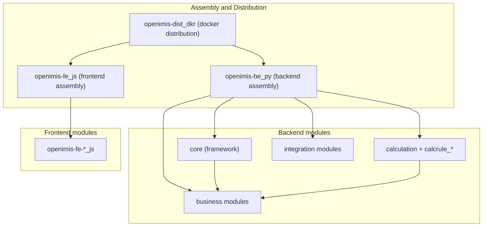

# Repository Appendix

This is the **exhaustive reference** to openIMIS's repositories: what each one is,
what package it installs, what it is responsible for, what it depends on, and how
mature it is. Where the [Repository Map](../architecture/repository-map.md) tells
the *story* of how the repos fit together, this page is the *lookup table* you
return to when you need a fact fast.

!!! info "Two views of the same territory"
    Read the [Repository Map](../architecture/repository-map.md) first for the
    narrative — how modules depend on each other, how the assembly stitches them.
    Come **here** for the flat, categorized master list. This page is intentionally
    dense and skimmable.

!!! warning "Versions drift"
    openIMIS is fast-moving and modular: the exact set of modules (~47 on the
    backend), their names, and their maturity change between releases. Treat the
    tables below as an accurate map of the *categories and conventions*; confirm the
    current, exact set against each deployment's `openimis.json` manifest and
    [github.com/openimis](https://github.com/openimis). "Maturity" is a rough guide,
    not an official rating.

---

## How the repositories are organized

**Naming conventions** (memorize these; they are consistent):

| Kind | Repository pattern | Installed name |
| --- | --- | --- |
| Backend module | `openimis-be-<name>_py` | Python package `<name>` |
| Calculation rule | `openimis-be-calcrule_<name>_py` | Python package `calcrule_<name>` |
| Frontend module | `openimis-fe-<name>_js` | JS module `<name>` |
| Backend assembly | `openimis-be_py` | the Django project |
| Frontend assembly | `openimis-fe_js` | the React app |
| Distribution | `openimis-dist_dkr` | docker-compose stack |

---

## Assembly & distribution repositories

| Repository | Package / Artifact | Responsibility | Key dependencies | Maturity |
| --- | --- | --- | --- | --- |
| `openimis-be_py` | Django project | Backend **assembly**: reads `openimis.json`, builds `INSTALLED_APPS`, assembles the GraphQL schema and URLs, runs migrations/config loads at start | All backend modules; Django, Graphene, graphql_jwt | Mature / core infra |
| `openimis-fe_js` | React SPA | Frontend **assembly**: reads FE `openimis.json`, generates `src/modules.js` via `openimis-config-vite.js`, hosts Redux store + routing | All FE modules; React, Redux, MUI, Vite | Mature / core infra |
| `openimis-dist_dkr` | docker-compose | **Distribution**: db + backend + frontend + gateway (+ optional OpenSearch); `.env` config; startup ordering | The two assemblies, PostgreSQL, Nginx | Mature |

!!! info "Neither assembly holds business logic"
    `openimis-be_py` and `openimis-fe_js` are *manifests plus wiring*. Almost all
    behavior lives in the module repos below. Understanding these two glue repos
    first is the highest-leverage early investment. See
    [Architecture Overview](../architecture/overview.md).

---

## Backend — framework

| Repository | Package | Responsibility | Key dependencies | Maturity |
| --- | --- | --- | --- | --- |
| `openimis-be-core_py` | `core` | The shared framework: base models (`HistoryModel`, `VersionedModel`, `UUIDModel`, `json_ext`), custom `User`/`InteractiveUser`/`TechnicalUser`, Graphene helpers (`ExtendedConnection`, `OrderedDjangoFilterConnectionField`, `PrefixFilterset`), `OpenIMISMutation`, service signals, `ModuleConfiguration`, scheduler, audit | Django, Graphene, graphql_jwt, APScheduler | Mature / foundational |

Everything else depends on `core`. See [The Core Module](../modules/core.md).

---

## Backend — business & reference-data modules

| Repository | Package | Responsibility | Key dependencies | Maturity |
| --- | --- | --- | --- | --- |
| `openimis-be-location_py` | `location` | Location hierarchy (regions/districts/…) and health facilities — foundational reference data | core | Mature |
| `openimis-be-medical_py` | `medical` | Medical items and services catalog — building blocks of claims and price lists | core | Mature |
| `openimis-be-product_py` | `product` | Insurance products, benefit packages, price lists | core, medical, location | Mature |
| `openimis-be-insuree_py` | `insuree` | Insurees, families, officers — the (legacy) beneficiary registry | core, location | Mature |
| `openimis-be-individual_py` | `individual` | Generic person/individual entity (clean schema) for beneficiary registries | core | Growing |
| `openimis-be-social_protection_py` | `social_protection` | Social protection benefit programs on top of `individual` | core, individual | Growing |
| `openimis-be-policy_py` | `policy` | Policies linking insurees/families to products (coverage) | core, insuree, product | Mature |
| `openimis-be-contribution_py` | `contribution` | Premiums recorded against policies (money in) | core, policy | Mature |
| `openimis-be-claim_py` | `claim` | Claims: service delivery by facilities against policies, adjudication | core, insuree, policy, medical, location | Mature |
| `openimis-be-payment_py` | `payment` | Payments (money out) and payment processing | core, contribution, policy | Mature |
| `openimis-be-invoice_py` | `invoice` | Invoicing / bill generation | core, payment | Growing |
| `openimis-be-contract_py` | `contract` | Contracts (e.g. group/formal-sector agreements) | core, policy, insuree | Growing |
| `openimis-be-payroll_py` | `payroll` | Payroll for benefit disbursement | core, payment, individual | Newer |
| `openimis-be-tools_py` | `tools` | Data import/export and administrative utilities | core, various domain modules | Mature |

See the [Modules](../modules/index.md) section for chapter-level treatment of each.

---

## Backend — calculation framework & rules

| Repository | Package | Responsibility | Key dependencies | Maturity |
| --- | --- | --- | --- | --- |
| `openimis-be-calculation_py` | `calculation` | The calculation-rule **framework**: registers/dispatches pluggable pricing/valuation rules via signals | core | Mature |
| `openimis-be-calcrule_*_py` | `calcrule_*` | Individual pluggable rules (e.g. contribution valuation, capitation, third-party payment) registered with the framework | core, calculation, relevant domain module | Varies by rule |

!!! info "How calcrule modules plug in"
    A `calcrule_*` module registers itself with the `calculation` framework via
    signals; the framework picks the applicable rule at runtime for contributions,
    capitation, claim valuation, and similar. This is the pricing analogue of the
    service-signal seam. See [Calculation Rules](../modules/calculation.md).

---

## Backend — integration & reporting modules

| Repository | Package | Responsibility | Key dependencies | Maturity |
| --- | --- | --- | --- | --- |
| `openimis-be-api_fhir_r4_py` | `api_fhir_r4` | REST **FHIR R4** endpoints under `/api_fhir_r4/`, mapping domain models to FHIR resources (Insuree→Patient, Policy→Coverage, Claim→Claim, HealthFacility→Location/Organization) | core, insuree, policy, claim, location, medical | Mature |
| `openimis-be-dhis2_etl_py` | `dhis2_etl` | Pushes aggregate data to **DHIS2** | core, claim, policy, location | Growing |
| `openimis-be-report_py` | `report` | Reporting engine / report definitions | core, domain modules | Mature |
| `openimis-be-opensearch_reports_py` | `opensearch_reports` | Analytics/reporting offloaded to **OpenSearch** | core, OpenSearch | Growing |
| `openimis-be-tasks_management_py` | `tasks_management` | Human task queues (e.g. review/approval tasks) | core | Growing |
| `openimis-be-workflow_py` | `workflow` | Configurable multi-step business processes | core, tasks_management | Growing |

See [Integrations](../integrations/index.md) and [FHIR R4 API](../modules/fhir.md).

---

## Frontend modules

Frontend modules mirror the backend domain and follow `openimis-fe-<name>_js`.
Each exports a **config object** with keys such as `translations`, `reducers`,
`refs`/`reference`, `queries`, `mutations`, `menus`, `routes`, and
**`contributions`** (named extension points). The `ModulesManager` in FE core is
the cross-module registry. See [Frontend Architecture](../architecture/frontend.md).

| Repository | JS module | Responsibility | Maturity |
| --- | --- | --- | --- |
| `openimis-fe-core_js` | `core` | FE framework: Redux store, `ModulesManager`, the custom `graphql`/`graphqlWithVariables` layer + journalize polling, MUI theme, i18n, route guards | Mature / foundational |
| `openimis-fe-location_js` | `location` | Location & health-facility UI and pickers | Mature |
| `openimis-fe-medical_js` | `medical` | Medical items/services UI | Mature |
| `openimis-fe-product_js` | `product` | Products & price-list UI | Mature |
| `openimis-fe-insuree_js` | `insuree` | Insuree/family registry UI, `InsureePicker` | Mature |
| `openimis-fe-individual_js` | `individual` | Individual registry UI | Growing |
| `openimis-fe-social_protection_js` | `social_protection` | Social protection UI | Growing |
| `openimis-fe-policy_js` | `policy` | Policy/coverage UI | Mature |
| `openimis-fe-contribution_js` | `contribution` | Contribution UI | Mature |
| `openimis-fe-claim_js` | `claim` | Claim capture and review UI | Mature |
| `openimis-fe-payment_js` | `payment` | Payment UI | Mature |
| `openimis-fe-invoice_js` | `invoice` | Invoice UI | Growing |
| `openimis-fe-contract_js` | `contract` | Contract UI | Growing |
| `openimis-fe-tasks_management_js` | `tasks_management` | Task-queue UI | Growing |

!!! info "Backend/frontend module pairing"
    Most backend modules have a frontend counterpart of the same `<name>`
    (`openimis-be-claim_py` ↔ `openimis-fe-claim_js`). The two are versioned and
    released independently but share a domain vocabulary. Not every backend module
    has a UI (e.g. pure integration modules), and not every FE concern maps 1:1.

---

## Where do I find X?

The fast lookup for "which file/repo owns this concept?"

| I'm looking for... | It lives in... |
| --- | --- |
| The GraphQL schema assembly | `openimis-be_py` → `openimis/schema.py` |
| The backend module manifest | `openimis-be_py` → `openimis.json` |
| Dynamic `INSTALLED_APPS` | `openimis-be_py` → `openimis/settings.py` |
| URL wiring + `/graphql` endpoint | `openimis-be_py` → `openimis/urls.py` |
| Module config loading | `openimis-be_py` → `openimisconf/load_openimis_conf.py` |
| Container start scripts (migrate, load config) | `openimis-be_py` → `script/` |
| Base models (`HistoryModel`, `VersionedModel`, `json_ext`) | `openimis-be-core_py` → `core/models.py` |
| `OpenIMISMutation` (async mutation pattern) | `openimis-be-core_py` → `core/schema.py` |
| `DEFAULT_CFG`, integer permissions, `_configure_permissions()` | `<module>/apps.py` (e.g. `core/apps.py`) |
| A module's business logic | `<module>/services.py` |
| A module's GraphQL queries/mutations | `<module>/schema.py`, `gql_queries.py`, `gql_mutations/` |
| Service-signal registration/binding | `openimis-be-core_py` → `core/signals.py` (+ per module) |
| `ModuleConfiguration` model | `openimis-be-core_py` → `core/models.py` |
| The calculation-rule framework | `openimis-be-calculation_py` |
| A specific pricing rule | the relevant `openimis-be-calcrule_*_py` |
| FHIR resource mappings | `openimis-be-api_fhir_r4_py` → `api_fhir_r4/` |
| The frontend module manifest | `openimis-fe_js` → `openimis.json` |
| The generated FE module import file | `openimis-fe_js` → `src/modules.js` (from `openimis-config-vite.js`) |
| The FE `ModulesManager` + GraphQL layer | `openimis-fe-core_js` (FE `core`) |
| The docker-compose stack + `.env` | `openimis-dist_dkr` |

!!! tip "The two files you'll open most"
    `openimis/schema.py` (to find where a GraphQL field comes from) and a module's
    `apps.py` (to find its config keys and integer permission codes) are the two
    most-consulted files during real debugging. Bookmark them. See
    [Troubleshooting](troubleshooting.md).

---

## Cross-references

- [Repository Map](../architecture/repository-map.md) — the narrative version of
  this appendix: how the repos depend on and assemble each other.
- [Architecture Overview](../architecture/overview.md) — the assembly model.
- [Plugin / Module System](../architecture/plugin-system.md) — how the manifest
  becomes a running application.
- [Modules](../modules/index.md) — chapter-level coverage of each business module.
- [Glossary](glossary.md) — one-line definitions for any term here.
- Source of truth: [github.com/openimis](https://github.com/openimis) and each
  deployment's `openimis.json`.
