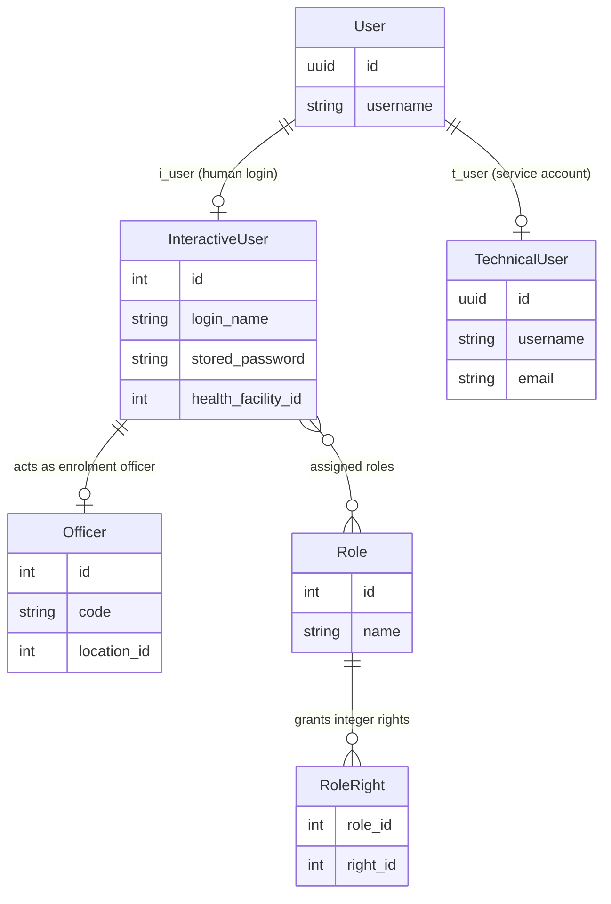
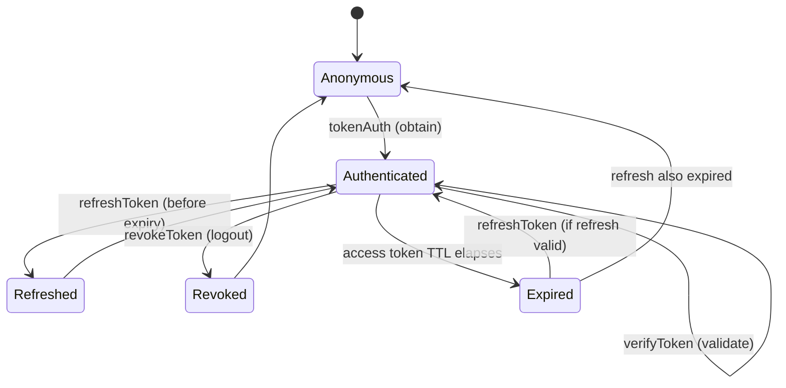
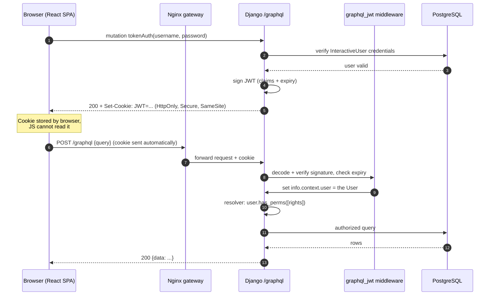

# Authentication & Authorization

> **Part 9 of the openIMIS Developer Academy.** This chapter explains **who a
> user is** in openIMIS, **how they prove it** (JWT, sessions, OpenID Connect),
> and **what they are allowed to do** (integer rights, roles, and `has_perms`
> checks in resolvers). openIMIS handles sensitive health and financial data for
> vulnerable populations, so authentication and authorization are not an
> afterthought — they are woven through the `core` module and every mutation.

## Learning objectives

By the end of this chapter you will be able to:

- Explain the openIMIS **`User`** model and how it links `InteractiveUser`,
  `TechnicalUser`, and `Officer` / `i_user`.
- Describe **roles** and the **integer rights** permission system, and map
  permission ranges to modules.
- Explain how **JWT authentication** works with `django-graphql-jwt`, including
  the HttpOnly-cookie storage and the obtain/refresh/verify/revoke lifecycle.
- Contrast **session vs token** authentication and know which openIMIS uses where.
- Describe the **OpenID Connect / OAuth2** option for external identity providers.
- Enforce authorization correctly with `has_perms` in resolvers/mutations and
  understand how the frontend mirrors it with **route guards**.
- Reason about the platform's **security hardening** posture.

## Prerequisites

- [Architecture Overview](../architecture/overview.md) — the modular backend.
- [Request Lifecycle](../architecture/request-lifecycle.md) — where auth
  middleware sits in the request path.
- [GraphQL from First Principles](../graphql/index.md) — resolvers, mutations,
  and where `info.context.user` comes from. Authorization is enforced *inside*
  resolvers, so read that chapter first.
- [Core module](../modules/core.md) — the `User` model and permission config
  live here.

---

## 1. The openIMIS User model

Most Django apps have one `User` model. openIMIS has more moving parts because
it inherited a data model from the legacy .NET/MSSQL **IMIS** system and must
serve several distinct kinds of "user" at once. The `core` **`User`** is a thin
Django-auth-compatible model that **links** to one of several profile types.



| Type | Who it represents | Typical use |
| --- | --- | --- |
| **`User`** (core) | The Django-side login identity | The object `request.user` / `info.context.user` points at; glue for Django auth. |
| **`InteractiveUser`** | A **human** logging into the UI | Enrolment officers, claim administrators, scheme managers. Carries roles → rights. |
| **`TechnicalUser`** | A **service account** | Machine-to-machine access (integrations, scripts, FHIR clients). |
| **`Officer`** | An **enrolment/claim officer** profile | Links a human to a location and business role in insuree/policy/claim workflows. |

The core `User` holds a nullable link to an `InteractiveUser` (`i_user`) and to a
`TechnicalUser` (`t_user`); exactly one is populated depending on whether a human
or a machine is authenticating. When you read `info.context.user` in a resolver,
you get the core `User`, and you reach the human profile via its `i_user`.

!!! info "Did you know?"
    The split exists partly for **legacy-database** reasons: `InteractiveUser`
    and `Officer` map onto original IMIS tables (note the `tbl` prefixes and
    camelCase columns you'll see in the DB), while the core `User` is the modern
    Django-native layer added during the 2018–2019 re-architecture. openIMIS
    keeps both so it can talk to legacy data *and* modern Django auth.

??? note "Deep dive: why not just use Django's `auth.User`?"
    Django's default `User` assumes one flavour of account and stores password
    hashes in its own format. openIMIS must (a) authenticate humans whose
    credentials may live in the legacy IMIS schema, (b) authenticate service
    accounts, and (c) later federate against **external identity providers** via
    OIDC. A thin custom `User` that *links* to specialized profile models — rather
    than one fat table — lets each concern evolve independently. This is a common
    enterprise pattern: the authentication identity and the domain-specific
    profile are separate objects.

---

## 2. Roles and integer rights

Authorization in openIMIS is **not** string permission codenames like Django's
default `"app.add_model"`. It is **integer rights**, inherited from the IMIS
data model.

- A **`Right`** is an integer, e.g. `101101`. Each represents one capability
  ("search insurees", "create claim", "approve policy").
- A **`Role`** is a named bundle of rights (e.g. *Enrolment Officer*, *Claim
  Administrator*, *Scheme Administrator*).
- An `InteractiveUser` is assigned one or more roles; their effective rights are
  the **union** of all their roles' rights.
- Each backend **module declares its own permission codes** as integers in its
  `apps.py` `AppConfig`, exposed through `DEFAULT_CFG` so operators can retune
  them per deployment (see the [Plugin / Module System](../architecture/plugin-system.md)).

```python
# illustrative — permission codes declared in a module's apps.py
# (see openimis-be-insuree_py/insuree/apps.py, claim/apps.py, etc.)
class InsureeConfig(AppConfig):
    gql_query_insurees_perms = [101101]
    gql_mutation_create_insurees_perms = [101102]
    gql_mutation_update_insurees_perms = [101103]
    gql_mutation_delete_insurees_perms = [101104]
```

### Permission ranges by module

The integer codes are **loosely grouped by module** using number ranges, which
makes them readable once you know the convention. The exact numbers are defined
in each module's `apps.py` and can be retuned per deployment — treat the table as
an orienting map, not a spec, and confirm against the source.

| Example range | Module | Kind of capability |
| --- | --- | --- |
| `101xxx` | `insuree` / `individual` | Search, create, update, delete beneficiaries and families |
| `102xxx` | `policy` | View, create, renew, approve policies (coverage) |
| `103xxx` | `contribution` | Record and manage premium contributions |
| `111xxx` | `claim` | Submit, review, feedback, approve, value claims |
| `121xxx` | `location` | Manage regions, districts, health facilities |
| `131xxx` | `medical` / `product` | Manage medical items/services, insurance products, price lists |
| `151xxx` | `payment` / `invoice` | Payments, invoices, provider payment |
| `152xxx` | `core` / admin | Users, roles, rights, module configuration |

!!! info "Did you know?"
    Because rights are just integers checked with `user.has_perms([codes])`, and
    because each module owns its codes in `apps.py`, a country deployment can
    enable a module and its permissions become assignable to roles **without any
    change to core**. Authorization scales with the plugin system.

---

## 3. How JWT authentication works

openIMIS authenticates GraphQL clients with **JSON Web Tokens (JWT)** via the
**`django-graphql-jwt`** library. If you have only done session auth, here is the
model.

A **JWT** is a signed, self-contained token with three dot-separated parts —
`header.payload.signature`. The payload carries claims (who the user is, when the
token expires); the signature (HMAC with the server secret, or RSA) lets the
server verify the token **without a database lookup**. It is *stateless* auth:
the token itself is the credential.

### Storage: the HttpOnly cookie

openIMIS stores the JWT in an **HttpOnly cookie**, not in `localStorage`. This is
a deliberate security choice:

- **HttpOnly** means JavaScript **cannot read** the cookie — this is the single
  most important defence against token theft via XSS.
- The browser attaches the cookie automatically to every `/graphql` request, so
  the frontend never has to manually manage the token.
- Combined with `Secure` (HTTPS-only) and `SameSite` attributes, the cookie is
  hardened against interception and CSRF.

!!! danger "Common mistake: putting the JWT in localStorage"
    A very common (insecure) tutorial pattern is to store the token in
    `localStorage` and attach it as an `Authorization: Bearer` header from JS.
    That exposes the token to **any** XSS on the page. openIMIS uses an
    **HttpOnly cookie** precisely so JavaScript cannot touch the token. Do not
    "simplify" this by moving the token into JS-readable storage.

### The token lifecycle

`django-graphql-jwt` exposes the lifecycle as **GraphQL mutations**, not REST
endpoints. There are four operations:



| Operation | Mutation | Purpose |
| --- | --- | --- |
| **Obtain** | `tokenAuth(username, password)` | Verify credentials, issue an access token (short-lived) and set the cookie. This is *login*. |
| **Verify** | `verifyToken(token)` | Confirm a token is still valid and un-tampered; returns its claims. |
| **Refresh** | `refreshToken` | Exchange a still-valid (or long-lived refresh) token for a fresh access token, so the user isn't logged out mid-session. |
| **Revoke** | `revokeToken` | Invalidate a refresh token — *logout*. Clears the cookie server-side. |

Access tokens are intentionally **short-lived** (minutes) to limit the blast
radius of a leaked token; the longer-lived **refresh** token lets the client
silently renew. The frontend refreshes proactively before expiry.

### Login → authenticated call, end to end



The crucial handoff: the `graphql_jwt` middleware decodes the cookie's token on
every request and populates `info.context.user`. From the resolver's point of
view, `info.context.user` is just an authenticated Django user — the same object
you'd get from session auth. Authentication (proving identity) and authorization
(checking rights) are cleanly separated: the middleware does the former, your
resolver does the latter.

---

## 4. OpenID Connect / OAuth2 for external identity providers

Not every deployment wants openIMIS to be the password authority. A ministry of
health may already run a central **identity provider** (Keycloak, Azure AD, an
OIDC-compliant IdP). openIMIS supports **OpenID Connect (OIDC) / OAuth2** so that
authentication can be delegated.

- **OAuth2** is an *authorization* framework: it issues access tokens without
  sharing the user's password with openIMIS.
- **OpenID Connect** is a thin *authentication* layer on top of OAuth2: it adds
  an **ID token** (a JWT) that tells openIMIS *who* the user is.

In this mode the user authenticates against the external IdP, which returns
signed tokens; openIMIS validates them and maps the external identity onto an
openIMIS `User` (and its roles/rights). This gives central deployments **single
sign-on** and centralized account lifecycle (disable a user in the IdP, they lose
openIMIS access) while keeping openIMIS's *authorization* model — the integer
rights — fully in charge of what the user can do.

!!! info "Did you know?"
    OIDC changes only **authentication** (who you are). **Authorization** — the
    integer rights checked by `has_perms` — stays entirely inside openIMIS.
    Federating login does not federate permissions; a user logged in via Keycloak
    still needs openIMIS roles to do anything.

---

## 5. Session vs token authentication

You'll meet both in openIMIS; know when each applies.

| Aspect | Session auth | Token (JWT) auth |
| --- | --- | --- |
| **State** | Server stores the session; cookie holds an opaque id | **Stateless** — the token itself carries the claims |
| **Lookup per request** | DB/cache hit to load the session | Verify signature; no DB hit |
| **Used in openIMIS for** | Django **admin** and some server-rendered/legacy flows | The **primary** SPA ↔ `/graphql` API |
| **Storage** | Session cookie | JWT in an **HttpOnly cookie** |
| **Scales horizontally** | Needs shared session store | Naturally (no shared state) |
| **Revocation** | Delete the session | Revoke the refresh token / short TTL |

The React SPA and API integrations use **JWT**; Django's built-in admin uses
**sessions**. Both ultimately resolve to the same core `User` and the same rights
checks.

---

## 6. Enforcing authorization

Authentication tells you *who*; authorization decides *what*. In openIMIS the
enforcement point is the **resolver / mutation**, using integer rights.

### Backend: `has_perms` in resolvers and mutations

```python
# illustrative — the canonical guard (see any module's schema.py / gql_mutations/)
from django.core.exceptions import PermissionDenied
from django.utils.translation import gettext as _

def resolve_insurees(self, info, **kwargs):
    user = info.context.user
    if user.is_anonymous or not user.has_perms(InsureeConfig.gql_query_insurees_perms):
        raise PermissionDenied(_("unauthorized"))
    return Insuree.objects.filter(validity_to__isnull=True)


class CreateInsureeMutation(OpenIMISMutation):
    @classmethod
    def async_mutate(cls, user, **data):
        if not user.has_perms(InsureeConfig.gql_mutation_create_insurees_perms):
            raise PermissionDenied(_("unauthorized"))
        InsureeService(user).create_or_update(data)
```

!!! danger "Common mistake: trusting the frontend to hide a button"
    Hiding a UI button when the user lacks a right is **UX, not security**. A
    determined client can send any GraphQL query to the single `/graphql`
    endpoint. **Every** resolver returning protected data and **every** mutation
    must call `has_perms` server-side. The frontend guard and the backend check
    are two independent layers — you need *both*, and the backend one is the real
    fence. Never remove a backend check because "the UI already prevents it".

### Frontend: route guards using rights

The React frontend mirrors the backend rights to **guard routes and menu items**
so users don't see actions they can't perform. `openimis-fe-core_js` exposes the
logged-in user's rights, and modules register routes with a required right.

```jsx
// illustrative — faithful to openimis-fe route/menu registration
// (see each openimis-fe-<name>_js module config and core's ModulesManager)
const RIGHT_INSUREE_SEARCH = 101101;

export function rightGuard(rights) {
  return rights.includes(RIGHT_INSUREE_SEARCH);
}

// A menu entry only renders if the user holds the right:
menus: [
  { text: "Insurees", icon: <PeopleIcon />, route: "/insuree",
    filter: (rights) => rights.includes(RIGHT_INSUREE_SEARCH) },
]
```

The frontend guard is for **experience** (don't show dead-end screens); the
backend `has_perms` is for **security**. They use the *same* integer rights,
which is what keeps them consistent.

---

## 7. Security architecture and hardening

Because openIMIS handles health and financial PII for vulnerable populations,
the deployment posture matters as much as the code. Key points from the
[Docker & Deployment](../docker/index.md) topology:

- **TLS everywhere.** The Nginx gateway terminates HTTPS; the JWT cookie is set
  `Secure`, so it is never sent over plaintext.
- **HttpOnly + SameSite cookies.** Mitigates XSS token theft and CSRF (see §3).
- **Secrets outside the image.** DB passwords, JWT signing keys, and IdP secrets
  come from `.env` / environment, not baked into containers.
- **Short access-token TTL + refresh.** Limits the window a stolen token is
  useful; revocation invalidates refresh tokens on logout.
- **Least privilege via rights.** Roles should grant the *minimum* rights a job
  needs; the integer-rights model makes this auditable.
- **Every mutation is audited.** The `OpenIMISMutation` / `MutationLog` pattern
  (see [GraphQL](../graphql/index.md#8-mutations-the-openimismutation-pattern))
  records who did what and whether it succeeded — an authorization *and*
  compliance asset.
- **Temporal, non-destructive data.** Versioned models (`validity_from` /
  `validity_to`) mean records are *closed*, not hard-deleted, preserving an audit
  history that is valuable for security investigations.

!!! danger "Common mistake: leaking data through unfiltered nested resolvers"
    You can guard the top-level `resolve_claims` and still leak data if a
    **nested** field (say, `claim.insuree`) returns objects the user shouldn't
    see. Authorization must consider the *whole graph* a query can traverse, not
    just the entry field. When exposing sensitive relations, ensure the nested
    resolver (or the queryset it builds on) also respects the user's rights and
    data scope (e.g. their health facility / location).

??? note "Deep dive: signing keys, key rotation, and token theft"
    A JWT's security rests on its **signing key**. If the HMAC secret (or RSA
    private key) leaks, an attacker can mint valid tokens for any user, and no
    per-request DB lookup will catch them — that is the trade-off for stateless
    auth. Mitigations openIMIS deployments should apply: keep the key in
    environment/secret storage (never in the repo or image), rotate it
    periodically (invalidating outstanding tokens), keep access-token TTL short so
    a stolen token expires quickly, and use `revokeToken` on logout to kill the
    refresh token. For high-assurance deployments, front openIMIS with an OIDC
    provider so token issuance and revocation are centralized.

---

## Repository references

| Repository | Directory / File | Why it matters |
| --- | --- | --- |
| `openimis-be-core_py` | `core/models.py` | Defines `User`, `InteractiveUser`, `TechnicalUser`, `Officer`, `Role`, and rights. |
| `openimis-be-core_py` | `core/apps.py` | `CoreConfig` with `DEFAULT_CFG`, `_configure_permissions()`, and core rights codes. |
| `openimis-be-core_py` | `core/schema.py` | Where `info.context.user` is used; `OpenIMISMutation` audit via `MutationLog`. |
| `openimis-be_py` | `openimis/settings.py` | `django-graphql-jwt` config, cookie flags, OIDC/OAuth2 settings, `AUTHENTICATION_BACKENDS`. |
| `openimis-be_py` | `openimis/urls.py` | The `/graphql` endpoint that JWT middleware protects. |
| `<any module>` | `apps.py` | Per-module integer permission codes (e.g. `gql_mutation_create_*_perms`). |
| `openimis-fe-core_js` | user/rights state + `ModulesManager` | Exposes the logged-in user's rights for route/menu guards. |
| `openimis-dist_dkr` | `docker-compose.yml`, `.env`, gateway config | TLS termination, secrets, cookie/`Secure` posture. |

---

## Hands-on lab

!!! example "Lab: authenticate, inspect, and probe authorization"
    Use a running dev stack and GraphiQL at `/graphql`.

    1. **Obtain a token.** Run the `tokenAuth` mutation with a seeded user's
       credentials. Inspect the response headers / browser cookies and confirm a
       JWT cookie was set with **HttpOnly** and (in a TLS deployment) **Secure**.
    2. **Decode the payload.** Paste the token into a JWT decoder (or use
       `verifyToken`) and read the claims and expiry. Note there is no password in
       it — only identity claims and metadata.
    3. **Make an authorized call.** Query `insurees`. It works because the cookie
       is sent automatically and you hold the right.
    4. **Probe authorization.** Log in as a user *without* the insuree-search
       right (or temporarily remove it from their role) and re-run the query.
       Confirm you get an authorization error — proving the check is server-side,
       not just UI.
    5. **Refresh and revoke.** Run `refreshToken` and observe a new token; then
       `revokeToken` and confirm subsequent calls are rejected (logout).

## Exercises

1. Draw the object graph linking a logged-in human to their effective rights,
   starting at the core `User` and ending at `RoleRight`.
2. A colleague proposes storing the JWT in `localStorage` "so the mobile web view
   can read it." Give two security reasons to refuse and state what openIMIS does
   instead.
3. Given a new module with a `resolve_reports` resolver, write the exact
   `has_perms` guard, and explain why hiding the menu item in the frontend is not
   a substitute.

## Knowledge check

??? question "Q1: What is the difference between the core `User`, `InteractiveUser`, and `TechnicalUser`? (click for answer)"
    The core **`User`** is the Django-side login identity (`info.context.user`).
    It links to an **`InteractiveUser`** for a **human** UI login (carrying roles
    → rights) or a **`TechnicalUser`** for a **service account** (machine-to-
    machine). Exactly one profile is populated per user.

??? question "Q2: How are permissions represented in openIMIS, and where are the codes defined? (click for answer)"
    As **integer rights**. Roles bundle rights; a user's effective rights are the
    union of their roles'. Each module declares its own integer codes in its
    `apps.py` `AppConfig` (e.g. `gql_mutation_create_insurees_perms = [101102]`),
    and they are checked with `user.has_perms([codes])`.

??? question "Q3: Why does openIMIS store the JWT in an HttpOnly cookie instead of localStorage? (click for answer)"
    Because **HttpOnly** cookies cannot be read by JavaScript, which defeats token
    theft via XSS. The browser also attaches the cookie automatically, and with
    `Secure` + `SameSite` it resists interception and CSRF. `localStorage` is
    readable by any script on the page and is unsafe for credentials.

??? question "Q4: What are the four JWT lifecycle operations and what does each do? (click for answer)"
    **Obtain** (`tokenAuth`) — verify credentials, issue a token (login).
    **Verify** (`verifyToken`) — confirm a token is still valid/un-tampered.
    **Refresh** (`refreshToken`) — exchange a valid token for a fresh one before
    expiry. **Revoke** (`revokeToken`) — invalidate the refresh token (logout).

??? question "Q5: If OIDC handles login, what still governs what a user can do, and why? (click for answer)"
    openIMIS's **integer rights** still govern authorization. OIDC/OAuth2 changes
    only **authentication** (who you are); it does not grant capabilities. A user
    federated via an external IdP still needs openIMIS roles/rights, enforced by
    `has_perms` in resolvers and mutations.

## Further reading

- [GraphQL from First Principles](../graphql/index.md) — resolvers, the
  `OpenIMISMutation` audit trail, and where `info.context.user` is checked.
- [Request Lifecycle](../architecture/request-lifecycle.md) — where auth
  middleware runs in the Django request path.
- [Core module](../modules/core.md) — the `User`, `Role`, and rights models.
- [Docker & Deployment](../docker/index.md) — TLS, gateway, and secret handling.
- **django-graphql-jwt** documentation: <https://django-graphql-jwt.domake.io/>.
- **JWT** primer and debugger: <https://jwt.io/>.
- **OpenID Connect** specification: <https://openid.net/developers/how-connect-works/>.
- **OWASP** cheat sheets on JWT and session management: <https://cheatsheetseries.owasp.org/>.
- **openIMIS** GitHub organization: <https://github.com/openimis>.
