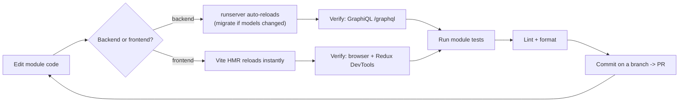
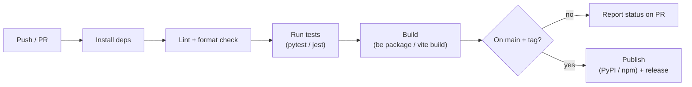
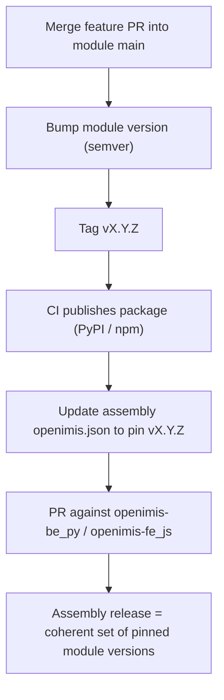

# Developer Workflow

> **Part 16 — The Daily Loop: Setup, Debug, Test, Release**

Building openIMIS features is not just writing code — it is operating a **multi-repository, modular system** with a disciplined edit → run → debug → test → release loop. This chapter is the practical playbook: how to wire up the assemblies with editable module installs, run the stack in Docker or natively, debug across the frontend/backend seam, test each module, keep the code clean, and cut a release that pins module versions. It is the connective tissue between [Set Up a Dev Environment](../getting-started/setup.md) and [Best Practices](../best-practices/index.md).

## Learning objectives

By the end of this chapter you will be able to:

- Clone and link the three assembly repos (`openimis-be_py`, `openimis-fe_js`, `openimis-dist_dkr`) with **editable module installs**.
- Run the inner development loop natively and via Docker.
- Debug across layers: backend logs, the Django shell, GraphiQL at `/graphql`, and Redux DevTools.
- Run and write tests (pytest/Django on the backend, Jest on the frontend) and apply the linters/formatters (black, flake8, isort; eslint, prettier).
- Understand CI/CD (GitHub Actions), semantic **per-module versioning**, the assembly's manifest as a version lockfile, and the PR/contribution workflow in the openIMIS org.

## Prerequisites

- [Set Up a Dev Environment](../getting-started/setup.md) — you have the stack running once.
- [Plugin / Module System](../architecture/plugin-system.md) and [Frontend Architecture](../architecture/frontend.md) — you know what a module is on each side.
- [Extension Guide](../extending/index.md) — helpful if you are authoring a module while you read this.
- [Best Practices](../best-practices/index.md) — the conventions your PRs will be held to.

---

## 1. Repository setup: three assemblies + editable modules

openIMIS is not one repo. You work across three **assemblies** and however many **module** repos your task touches.

| Repo | Role |
| --- | --- |
| `openimis-be_py` | Backend Django project. Assembles modules via `openimis.json`. |
| `openimis-fe_js` | Frontend React SPA. Assembles modules via `openimis.json` + `openimis-config-vite.js`. |
| `openimis-dist_dkr` | Docker distribution. `docker-compose` topology, `.env`. |
| `openimis-be-<name>_py` | Backend modules (core, claim, insuree, …). |
| `openimis-fe-<name>_js` | Frontend modules. |

The trick that makes day-to-day work bearable is **editable installs / links**: instead of the manifest's pinned package, you point the assembly at a local checkout so your edits are live without reinstalling.

=== "Backend (editable pip install)"

    ```bash
    # sibling checkouts
    git clone https://github.com/openimis/openimis-be_py.git
    git clone https://github.com/openimis/openimis-be-core_py.git
    git clone https://github.com/openimis/openimis-be-claim_py.git

    cd openimis-be_py
    python -m venv venv && source venv/bin/activate
    pip install -r requirements.txt

    # override manifest-pinned packages with local, editable checkouts
    pip install -e ../openimis-be-core_py/
    pip install -e ../openimis-be-claim_py/

    python manage.py migrate
    python manage.py runserver
    ```

=== "Frontend (npm link)"

    ```bash
    git clone https://github.com/openimis/openimis-fe_js.git
    git clone https://github.com/openimis/openimis-fe-claim_js.git

    cd openimis-fe-claim_js && npm install && npm link
    cd ../openimis-fe_js && npm install
    npm link @openimis/fe-claim   # override the published package

    npm start   # Vite dev server; regenerates src/modules.js from openimis.json
    ```

!!! danger "Common mistake"
    Forgetting that the manifest still lists the **published** version. `pip install -e` / `npm link` override it for *your* machine, but the source of truth for a build remains `openimis.json`. If you add a brand-new module, you must add it to `openimis.json` too — the editable install alone will not put it into a Docker build or a teammate's checkout.

---

## 2. The inner development loop



- Change **backend models** → `makemigrations <module>` + `migrate` before the change takes effect.
- Change **backend logic** → `runserver` auto-reloads.
- Change **frontend** → Vite hot-reloads; watch Redux DevTools to confirm the action/state you expect.

---

## 3. Running via Docker

For an integration-faithful environment (matching production topology), use `openimis-dist_dkr`.

```bash
cd openimis-dist_dkr
cp .env.example .env    # fill in secrets/config
docker compose up
```

Startup order is meaningful: **`db` (PostgreSQL) → `backend` (runs migrations + loads module configurations) → `frontend`/`gateway`**. A reverse-proxy/gateway (Nginx) ties the frontend, `/api`, and `/graphql` together on one origin. See [Docker & Deployment](../docker/index.md) for the full topology (including optional OpenSearch for `opensearch_reports`).

!!! info "Did you know?"
    The Docker images build **from the manifests**: the backend image `pip install`s from the backend `openimis.json`; the frontend image npm-installs and runs the Vite build from the frontend `openimis.json`. So a reproducible deployment is fully described by the two manifests plus `.env`.

!!! tip "Native for speed, Docker for fidelity"
    Iterate on a single module natively (fast reload, easy debugger). Switch to Docker to validate cross-service behavior, the gateway routing, and the startup/migration/config-load sequence before you open a PR.

---

## 4. Debugging across the stack

| Symptom | Where to look | How |
| --- | --- | --- |
| Mutation "succeeded" but nothing changed | Backend `MutationLog` | Query `mutationLogs(clientMutationId: ...)` in GraphiQL; check status + error. |
| Query returns wrong/empty data | GraphiQL at `/graphql` | Run the query directly; toggle fields to isolate. |
| Business logic bug | Django shell | `python manage.py shell`; call the service directly with a test user. |
| 403 / permission denied | `apps.py` perms vs. user rights | Compare the integer codes in `has_perms` to the user's rights. |
| Frontend not updating | Redux DevTools | Inspect dispatched actions and the module's state slice. |
| Wrong/undefined config value | Backend `ModuleConfiguration` / FE `getConf` | Confirm the DB config overlay and the FE build-time config. |

### Backend

- **Logs**: Django + Gunicorn logs (stdout in Docker: `docker compose logs -f backend`).
- **Django shell**: `python manage.py shell` — instantiate a service with a user and call it; the fastest way to reproduce a bug without the UI.
- **GraphiQL / GraphQL playground**: served at **`/graphql`** — an interactive schema explorer and query runner. Your best friend for reproducing exactly what the frontend sends.

### Frontend

- **Browser devtools** for the network `POST /graphql` payloads and responses.
- **Redux DevTools** to watch `_REQ` / `_RESP` / completion actions and to time-travel through state — because openIMIS uses Redux (not Apollo), *all* server data is visible as plain Redux state.

!!! danger "Common mistake"
    Debugging a "failed" mutation only in the browser. The immediate response is just a ticket (`clientMutationId`); the real error is on the `MutationLog`. Always confirm the mutation's status via GraphiQL when a submission behaves oddly. (See the [End-to-End Walkthrough](../extending/code-walkthrough.md).)

---

## 5. Testing

=== "Backend"

    Each backend module ships tests under `<name>/tests/`. Run with Django's test runner or pytest.

    ```bash
    # all tests for one module
    python manage.py test claim
    # or with pytest (if configured)
    pytest claim/tests/ -v
    ```

    Test the **services** directly (they hold the logic), plus schema-level tests that exercise resolvers/mutations with a permissioned user. Because modules subclass core base models, use the core test helpers/fixtures for users and validity windows.

=== "Frontend"

    Frontend modules use **Jest** (with React Testing Library) for component and reducer tests.

    ```bash
    npm test            # watch mode
    npm test -- --ci    # single run for CI
    ```

    Test reducers as pure functions (dispatch an action shape, assert the new slice) and components in isolation, mocking `modulesManager.getRef`/`getContribs`.

---

## 6. Linting and formatting

=== "Backend"

    | Tool | Purpose |
    | --- | --- |
    | **black** | Opinionated code formatting. |
    | **isort** | Import ordering. |
    | **flake8** | Lint / style errors. |

    ```bash
    black . && isort . && flake8
    ```

=== "Frontend"

    | Tool | Purpose |
    | --- | --- |
    | **eslint** | Lint (rules incl. React hooks). |
    | **prettier** | Formatting. |

    ```bash
    npm run lint && npm run format
    ```

!!! tip "Automate it"
    Wire these into a pre-commit hook (backend) and lint-staged (frontend) so CI never fails on formatting. Reviewers should be reading logic, not whitespace.

---

## 7. CI/CD

Each module repo and each assembly has **GitHub Actions** workflows (under `.github/workflows/`) that run on push/PR. The typical pipeline:



- **Backend** workflows spin up PostgreSQL (a service container), run migrations, and execute the module's tests.
- **Frontend** workflows run eslint + Jest and a production Vite build.
- **Publish** stages (on a tagged release) push the package to PyPI/npm so an assembly can pin the new version.

---

## 8. Release and versioning

openIMIS versions **per module** with semantic versioning (`MAJOR.MINOR.PATCH`). There is no single global version bump; instead each module evolves independently and the **assembly manifest pins the set**.



- **Backend**: `openimis-be_py/openimis.json` pins each module (git tag or PyPI version). Changing a pin is a reviewable PR against the assembly.
- **Frontend**: `openimis-fe_js/openimis.json` pins each npm module version.

!!! info "Did you know?"
    The two `openimis.json` manifests are effectively **lockfiles**. An openIMIS release is not a single tarball — it is a *coherent set of module versions* declared in the assemblies, plus `.env`. That is what lets a country deployment upgrade one module without touching the rest.

!!! danger "Common mistake"
    Merging a breaking change into a module without bumping the **MAJOR** version. Downstream assemblies pin ranges; a silent breaking change inside a "compatible" range breaks every deployment that resolves it. Respect semver: breaking → MAJOR, feature → MINOR, fix → PATCH.

---

## 9. Contribution workflow

openIMIS is governed by the **openIMIS Initiative** and developed as an org on GitHub ([github.com/openimis](https://github.com/openimis)) with a Technical Advisory Group. Contribution is per-repository and per-module.

1. **Find the right repo.** A change to claims lives in `openimis-be-claim_py` and/or `openimis-fe-claim_js` — not in the assembly, unless you are pinning a version.
2. **Branch, don't push to main.** Feature branch → PR.
3. **Follow the module's ownership.** Modules have maintainers; large changes should be discussed (issue/TAG) before a big PR.
4. **CI must be green.** Lint, tests, build.
5. **Semantic version + changelog** on merge, then pin in the assembly if the deployment needs it.
6. **Cross-repo changes** (a backend schema change consumed by a frontend module) require coordinated PRs and version bumps in both.

!!! tip "Small, module-scoped PRs win"
    Because the platform is modular, the best PRs are too: scoped to one module, with tests, a version bump, and — if it changes a public seam (a service signal, a published component, a permission code) — a note in the module README. Reviewers can reason about one slice at a time.

## Repository references

| Repository | Directory / File | Why it matters |
| --- | --- | --- |
| `openimis-be_py` | `openimis.json`, `requirements.txt` | Backend module manifest (version lockfile); editable-install target. |
| `openimis-be_py` | `manage.py`, `openimis/settings.py` | Run migrations, tests, the dev server; dynamic `INSTALLED_APPS`. |
| `openimis-fe_js` | `openimis.json`, `openimis-config-vite.js`, `vite.config.js` | Frontend manifest, generator, Vite build/dev server. |
| `openimis-dist_dkr` | `docker-compose.yml`, `.env` | The Docker topology and secrets for a faithful local/prod run. |
| `openimis-be-<name>_py` | `<name>/tests/`, `.github/workflows/` | Per-module tests and CI. |
| `openimis-fe-<name>_js` | `package.json`, `.github/workflows/` | Jest/eslint scripts and CI; npm publish. |
| Any module | `setup.py` / `package.json` | Semantic version bumped on release; pinned by the assembly. |

## Hands-on lab

!!! example "Lab 16.1 — Wire an editable loop and change a module"
    1. Clone `openimis-be_py` + `openimis-be-claim_py`; `pip install -e` the claim module.
    2. Add a harmless log line in a claim **service**, hit the code path via GraphiQL, and confirm your edit runs without reinstalling.
    3. Run `python manage.py test claim`. Make it green.
    4. `black . && isort . && flake8`. Commit on a branch.

!!! example "Lab 16.2 — Reproduce a bug three ways"
    1. Pick a mutation. Reproduce it in **GraphiQL** (`/graphql`).
    2. Reproduce the same logic in the **Django shell** by calling the service directly.
    3. Reproduce it from the **UI** while watching **Redux DevTools**. Note which layer gives you the clearest signal — that instinct is the skill.

## Exercises

1. Your teammate cannot see a module you added, even after `pip install -e`. What did you forget?
2. Explain why openIMIS has no single global version number.
3. A submission behaves oddly in the UI. List the exact order of debugging tools you would reach for.
4. What must accompany a breaking change to a module before it is safe for downstream assemblies?

## Knowledge check

??? question "Q1: What is the difference between an editable install and the manifest pin, and why do both exist? (click for answer)"
    The **manifest** (`openimis.json`) pins the published module version and is the source of truth for builds and teammates. An **editable install** (`pip install -e` / `npm link`) overrides that pin locally so your edits are live without reinstalling. Both exist because you develop against local checkouts but ship reproducible builds from the pinned manifest.

??? question "Q2: Where is the authoritative status of a mutation, and which tool shows it? (click for answer)"
    On the backend **`MutationLog`** row. Query it in **GraphiQL** at `/graphql` via `mutationLogs(clientMutationId: ...)`. The immediate HTTP response is only a ticket.

??? question "Q3: How does openIMIS version and release, given ~47 modules? (click for answer)"
    **Per-module semantic versioning.** Each module is tagged and published independently; the assembly's `openimis.json` pins the coherent set of versions (a lockfile). An assembly release is that set plus `.env` — not one global version.

??? question "Q4: Which linters/formatters run on each side? (click for answer)"
    Backend: **black** (format), **isort** (imports), **flake8** (lint). Frontend: **eslint** (lint) and **prettier** (format). CI enforces them.

??? question "Q5: You changed a backend GraphQL field that a frontend module consumes. What does the workflow require? (click for answer)"
    Coordinated PRs in **both** repos, appropriate semantic version bumps (breaking → MAJOR), CI green on each, and updated pins in the assemblies so the two versions are deployed together.

## Further reading

- [Set Up a Dev Environment](../getting-started/setup.md) — the first-time setup this chapter builds on.
- [Best Practices](../best-practices/index.md) — the conventions reviewers enforce.
- [Extension Guide](../extending/index.md) and [End-to-End Code Walkthrough](../extending/code-walkthrough.md) — apply the loop to real code.
- [Docker & Deployment](../docker/index.md) — the compose topology behind `docker compose up`.
- [github.com/openimis](https://github.com/openimis) — the org, the repos, per-repo GitHub Actions, and issues.
